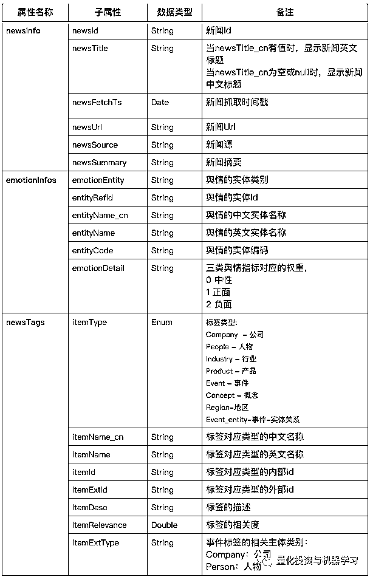
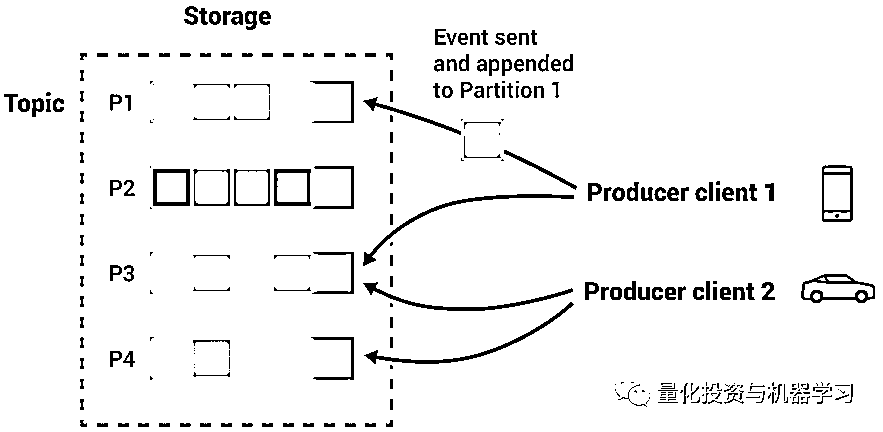
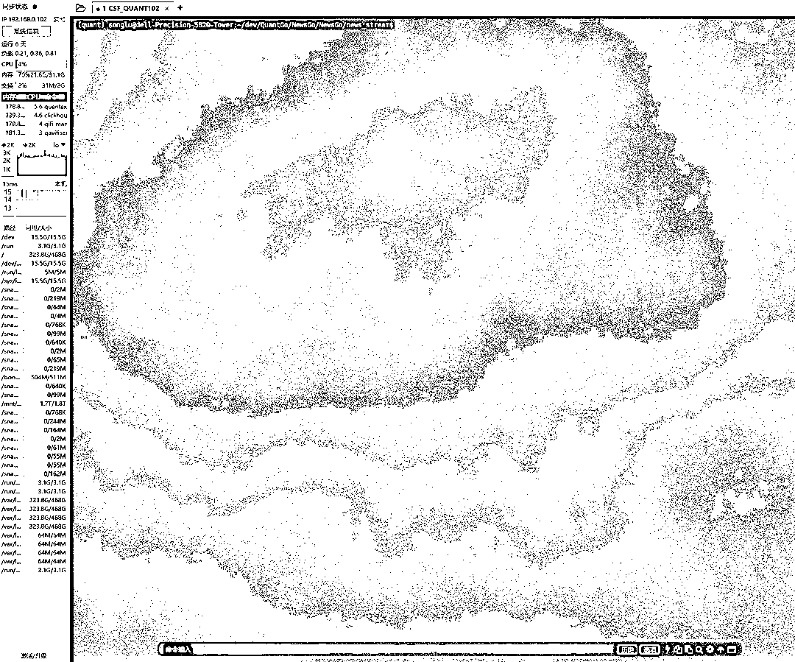

# 量化 A 股舆情：基于 Kafka+Faust 的实时新闻流解析

> 原文：[`mp.weixin.qq.com/s?__biz=MzAxNTc0Mjg0Mg==&mid=2653317970&idx=1&sn=9068b00c10b66672f21b280229627c68&chksm=802da947b75a2051f9b09b9d22f714a2838763a4a7352d874fcd2230f23c7322ace527ce9311&scene=27#wechat_redirect`](http://mp.weixin.qq.com/s?__biz=MzAxNTc0Mjg0Mg==&mid=2653317970&idx=1&sn=9068b00c10b66672f21b280229627c68&chksm=802da947b75a2051f9b09b9d22f714a2838763a4a7352d874fcd2230f23c7322ace527ce9311&scene=27#wechat_redirect)

# 


**量化投资与机器学习微信公众号，是业内垂直于**量化投资、对冲基金、Fintech、人工智能、大数据**等领域的主流自媒体。公众号拥有来自**公募、私募、券商、期货、银行、保险、高校**等行业**20W+**关注者，连续 2 年被腾讯云+社区评选为“年度最佳作者”。**

****实时新闻流数据****

**新闻消息瞬息万变，新闻舆情也对股票市场产生了明显的影响，实时新闻流数据能够为量化交易带来更多的应用场景，比如盘中的**风险监控、实时的情绪及热度统计、事件驱动交易等。****

**ChinaScope 近期上线了基于 Kafka 的实时新闻流数据——**SmarTag Strea**m，公众号第一时间申请到了试用权限，接下来，大家跟着编辑部一起，**一路从 kafka 的消息流，到基于流处理框架 Faust 实现的股票实时监控，来探索一下新闻流数据在量化场景的潜在应用。****

**首先简单介绍一下新闻数据的结构，SmarTag 对每天新闻进行结构化处理，首先会提取新闻中的标签，其次会对新闻及新闻中的公司人物的进行情绪分析，最终会以 Json 格式的推送处理完的新闻结构化数据，该数据中有三个属性：**

*   **newsInfo：新闻基础信息**

*   **emotionInfos：情绪信息**

*   **newsTags：标签信息**

**各属性内的比较重要（并非全部）的字段如下：**

****

****Kafka 消息流的几个核心概念****

****

*   **Producer：消息的生产者**

*   **Broker：Broker 是 Kafka 的实例，每个服务器有一个或多个实例。**

*   **Consumer：消息的消费者，Kafka 把新闻流从服务端推送到客户端，从而使我们消费（或处理）这个消息**

*   **Topic 题：消息的主题，可以理解为消息的分类，客户端通过订阅 Topic，接收对应 Topic 的消息。**

*   **Partition：Topic 的分区，主要作用是负载均衡，作为消息的消费者，无需过多的关注 Partition，这只是一个物理上的概念，对最终接收的消息没有任何影响。**

*   **Group：用于对于消费者进行分组。**

**作为技术小白，我们只需要理解，kafka 是用来从服务端到客户端推送消息的。消息的生产者 Producer 产生消息后，放入对应 Topic 的消息队列，Broker 会对这些消息进行分发推送，客户端的消费者 Consumer（需订阅该 Topic）接收到消息后进行处理及应用。**

****用 Python 接收新闻流数据****

**对于技术小白们来说，Kafka 的运行机制并不需要详细的了解，只需要关心，怎么才能接收到数据？以及接收到数据之后，该怎么处理？**

**我们首先来解答第一个问题，怎么接受数据？我们以小白标配语言 Python 为例，Python 里有好几个 kafka 的工具包，包括 python-kafka, aiokafka 等，我们这里以 python-kafka 为例。安装很简单：**

```py
`pip install python-kafka`
```

**安装完成之后，我们导入 KafkaConsumer，并进行相关配置，主要配置项包括 Topic、Group、Broker 及登录用户名密码：**

```py
`# encoding utf-8
from kafka import KafkaConsumer # 注意这里是 kafka，不是 python-kafka
import json

def get_news_stream(start_from_newest=True):
    """
    :param start_from_newest: False, 从上次结束消费的地方接收信息，True, 从最新的消息开始接收
    :return:
    """
    consumer = KafkaConsumer('TOPIC_NAME',
                             group_id='GROUP_ID',
                             enable_auto_commit=True,
                             auto_commit_interval_ms=1000,
                             auto_offset_reset='latest',
                             security_protocol='SASL_PLAINTEXT',
                             sasl_mechanism="SCRAM-SHA-512",
                             sasl_plain_username="USERNAME",
                             sasl_plain_password="PASSWORD",
                             bootstrap_servers=['broker1.xxxxxx.com:19092',
 'broker2.xxxxxx.com:19092']
                             )
    if start_from_newest:
        consumer.poll(10)
        consumer.seek_to_end()
    for msg in consumer:
        print(json.loads(msg.value)) # 可以加入对于新闻处理的逻辑，这里只是简单 Print

if __name__ == '__main__':
    get_news_stream()`
```

**关于以上示例代码有几点需要说明，首先是几个参数的意义：**

*   **enable_auto_commit = True, 开启自动确认，向服务端确认以收到消息，Consumer 在接收到消息后，会跟服务端确认收到消息，如果此时断开，下一次会从断开的地方重新接收消息。**
*   **auto_commit_interval_ms=1000, 自动提交的间隔，每 1 秒确认一次**
*   **auto_offset_reset='lastest', 是从上次断开的地方接收消息，如果是'earliest', 则从最早的消息开始接收。**
*   **bootstrap_servers: 填入的是 broker 服务器的地址**
*   **其他参数为登录验证的设置**

**还有几个细节需要说明：**

*   **因为新闻流在不断的推送，如果中途断开再重新接入后，面临两种选择：**

*   **从断的地方开始消费，这种情况多见于数据落地，需要中间不丢包，保证数据完成**

*   **从最新的消息开始消费，这种情况多见于需要使用最新数据计算交易信号等场景，在上面的例子中，我们把 start_from_newest 设置为 True 后，每次断开，都从最新的新闻流开始消费。比如，上次断开是 14:20，重新连上后是 14:30，那么最新接到的消息就是 14:30 之后的消息。**

*   **KafkaConsumer 有这样一个函数支持直接跳到最后，就是 seek_to_end，但直接使用会 报错，在之前还需要 poll 一次数据。**

*   **代码中的 for 循环用于不断的接收消息，然后处理，由于消息以二进制的形式接收过来，所以需要进行序列化，比如这里原消息是 Json 格式的，这里就使用 json.loads 把字符串转为 dict。接下来，就是将数据存到数据库，或者进行相应的计算。比如计算实时的股票情绪或市场情绪等。**

**大家也注意到，这里收到消息进行处理完之后，才能消费下一条消息，就容易造成队列的阻塞。如果是简单的处理逻辑，倒不至于阻塞。但如果处理逻辑过于复杂，那下一条消息就必须等待上一条消息处理完成后才能被消费。这种情况下，我们需要一个异步处理的流程，也就是消息的接收和处理分为不同的进程，相互独立。**

****关于流处理****

**流是一种数据传送技术，它把客户端数据变成一个稳定的流。正是由于数据传送呈现连续不停的形态，所以流引擎需要连续不断处理数据。比如实时高频的股票行情数据就可以看成是一个数据流，基于实时高频数据产生交易信号的过程就可以看做是一个流处理的过程。**

**与流处理对应的数据处理方式是批处理，传统的数据融合通常基于批模式。在批的模式下，我们会通过一些周期性运行的 ETL JOB，将数据从关系型数据库、文件存储向下游的目标数据库进行同步，中间可能有各种类型的转换。**

**批处理一般是解决离线计算数据量大，计算时间慢的问题，**流处理相反是为了解决实时计算或是近实时计算问题，当然有了实时的要求就会使处理的数据量变少，但是计算速度要求更快，两者相同点都要求数据计算的准确性有保障。****

**常见的流处理框架包括 Kafka Streams、Apache Storm、Spark Stream、Samza 及大名鼎鼎的 Apache Flink，成熟的流处理框架在容错性、状态管理及性能上都有很大的保障。小编也看到很多量化私募开始招聘掌握 Flink 的技术大咖。当然，这些成熟的大框架不是小编今天的目标，只会用 Python 的小编当然搞不懂这些。**

**所以问题就来了，了解了流处理之后，Python 中有没有好用的流处理框架，而且是支持 Kafka 的？当然有，这就是 Faust~**

****基于 Faust 的新闻流处理****

****Faust 是一个轻量的流处理框架，非常适合小型量化团队对于流处理的需求。F**aust 是一个将 Kafka Streams 的概念移植到 Python 的第三方库，安装 Faust 时需要注意**安装的是 faust-streaming，而不是 faust**，使用以下代码安装：**

```py
`pip install faust-streaming # 注意不是 pip install faust`
```

**接着我们通过一段简单的示例代码来了解如何通过 Faust 接入实时新闻流：**

```py
`# news_stream.py
import faust

# 定义 App
app = faust.App('GROUP_ID',
                value_serializer='json',
                topic_allow_declare=False,
                topic_disable_leader=True,
                broker=['kafka://broker1.xxxxxx.com:19092',
                        'kafka://broker2.xxxxxx.com:19092'],
                broker_credentials=faust.SASLCredentials(
                    username='USERNAME',
                    password='PASSWORD',
                    mechanism='SCRAM-SHA-512')
               )

# 订阅 Topic
news_kafka_topic = app.topic('TOPIC_NAME')

# 针对 Topic 的处理函数
@app.agent(news_kafka_topic)
async def process(stream) -> None:
    async for event in news_items.events():
        print('News:{}'.format(event.message.timestamp))
        print(event.value)

if __name__ == '__main__':
    app.main()`
```

**首先实例化一个 Faust 流处理的应用程序，faust.App()，其中相关参数解释如下：** 

*   **位置参数'GROUP_ID'**
*   **value_serializer: 序列化工具，在 python-kafka 中，我们需要自己用 json 进行序列化，在这里只需要在参数中设定好，框架会自动将消息中的 vlaue 进行序列化处理。**
*   **topic_allow_declare：如果只是单纯的消费消息，没有创建 topic 的权限的话，必须设置为 False**
*   **topic_disable_leader：Faust 默认会在订阅其他 Topic 时创建一个 leader topic, 如果只是单纯的消费消息，没有创建 topic 的权限的话，必须设置为 True**
*   **boker: 必须带上“kafka://”的前缀 **
*   **broker_credentials：登录信息设置**

**然后实例化 Topic，news_kafka_topic = app.topic('TOPIC_NAME')。其中 TOPIC_NAME 为订阅的 topic，必须与 kafka 消息流的 Topic 名称保持一致。**

**Faust 代理是一个流处理器，它订阅一个主题并处理每条消息。在 Faust 中，代理(Agent)用于装饰异步函数，可以并行处理无限数据流。该代理用作您的处理函数的装饰器，异步函数必须使用异步 for 循环遍历数据流。对于同一个 Topic，可以同时有多个 Agent 对其进行消息处理。**

**然后通过命令行，切换到当前 py 文件的目录，启动 app，就可以实时接收并异步处理新闻数据了：**

```py
`faust -A news_stream woker -l info #news_stream`
```

****

****‍自选股负面舆情监控**** 

**对于关注的股票列表进行舆情监控，如果出现显著负面的新闻，则发送邮件。具体的示例说明如下：**

*   **关注列表：宁德时代、比亚迪、中国联通、科大讯飞**
*   **提醒条件：新闻相关度大于 0.5，且负面情绪值大于 0.7**
*   **时间范围：全天实时监控**
*   **提醒方式：邮件发送**

```py
`# encoding=utf-8
from abc import ABC
import faust
import smtplib
from email.mime.text import MIMEText

class NewsItem(faust.Record, ABC, serializer='json'):
    newsInfo: dict
    newsTags: list
    emotionInfos: list

def send_mail(content):
    # 邮件构建
    subject = "负面新闻预警"  # 邮件标题
    sender = "*********@163.com"  # 发送方
    recver = "*******@163.com"  # 接收方
    password = "*****"
    message = MIMEText(content, "plain", "utf-8")
    # content 发送内容 "plain"文本格式 utf-8 编码格式
    message['Subject'] = subject # 邮件标题
    message['To'] = recver # 收件人
    message['From'] = sender # 发件人
    smtp = smtplib.SMTP_SSL("smtp.163.com", 994) # 实例化 smtp 服务器
    smtp.login(sender, password) # 发件人登录
    smtp.sendmail(sender, [recver], message.as_string()) # as_string 对 message 的消息进行了封装
    smtp.close()

def news_alert(news_time, news_value):
    sec_codes = ['300750_SZ_EQ', '002594_SZ_EQ', '600050_SH_EQ', '002230_SZ_EQ']
    news_info = news_value.newsInfo
    tag_info = news_value.newsTags
    emotion_info = news_value.emotionInfos
    for tag in tag_info:
        if tag['entityCode'] in sec_codes and tag['itemRelevance']>=0.5:
            for emotion in emotion_info:
                if emotion['entityCode'] == tag['entityCode'] and emotion['emotionIndicator']==2 and emotion['emotionWeight']>=0.8:
                    content = "{}【负面预警】:{}-{} \n 【新闻摘要】{}".format(news_time, tag['entityCode'], emotion['emotionWeight'], news_info['newsSummary'])
    send_mail(content)

app = faust.App('GROUP_NAME',
                value_serializer='json',
                topic_allow_declare=False,
                topic_disable_leader=True,
                broker=['kafka://xxxx.com:19092',
                        'kafka://yyyy.com:19092'],
                broker_credentials=faust.SASLCredentials(
                    username='USERNAME',
                    password='PASSWORD',
                    mechanism='SCRAM-SHA-512')
                )
news_kafka_topic = app.topic('TOPIC_NAME', value_type=NewsItem)

@app.agent(news_kafka_topic)
async def process(news) -> None:
    async for news_item in news.events():
        news_alert(news_item.message.timestamp, news_item.value)

if __name__ == '__main__':
    app.main()`
```

**运行以上代码，会实时监控关注股票的负面新闻，并发送邮件通知，相关代码说明如下：**

*   **类 NewsItem 是对消息流中的新闻数据构建了一个数据结构模型，这样能够更方便的访问数据内的字段，然后要在 topic 内声明 value_type=NewsItem。**

*   **news_alert 函数完成了数据的分析，首先检查了新闻关联的股票，如果有关注的股票，则再检查其情绪是否是负面且大于 0.7**

*   **如果发现负面新闻，则通过 send_mail 函数发送邮件。**

****总结****

**Faust 流处理框架极大的方便了新闻流数据处理的效率，不用在担心各种细节。**

**Faust 还有各种丰富的功能，包括数据中间表 Tables、数据持续化、过滤器 Filters 等。基于这些功能，我们可以很快速的实现，如**全市场股票情绪的监控，实时个股情绪因子及市场情绪指数的计算**。**

**最后，公众号认为，**无论是大机构还是小机构，积极拥抱不同的 IT 技术，以工程式的思维对待量化策略研究与开发一定是一条可持续的道路。加油！****

**有需要试用新闻流的小伙伴，请点击 **阅读原文**！**