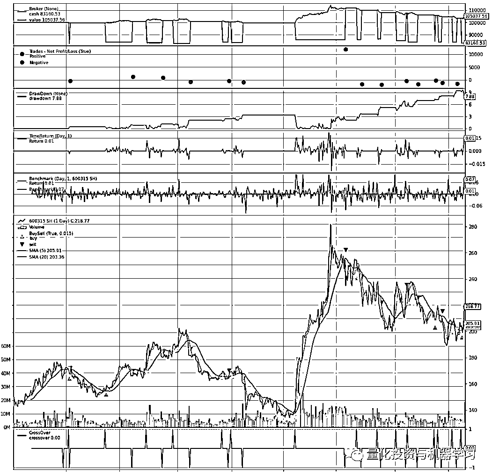
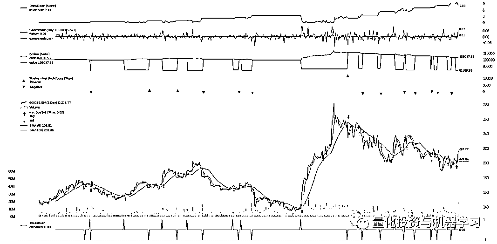
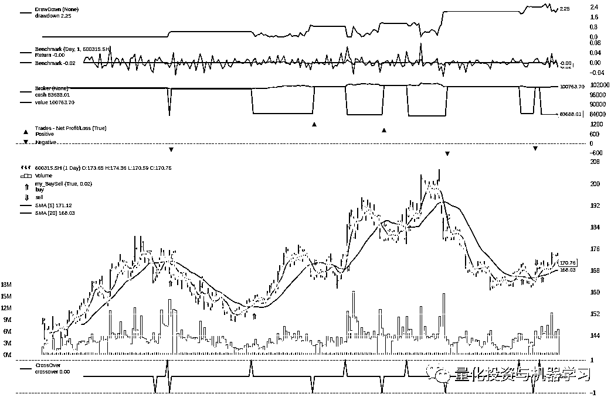
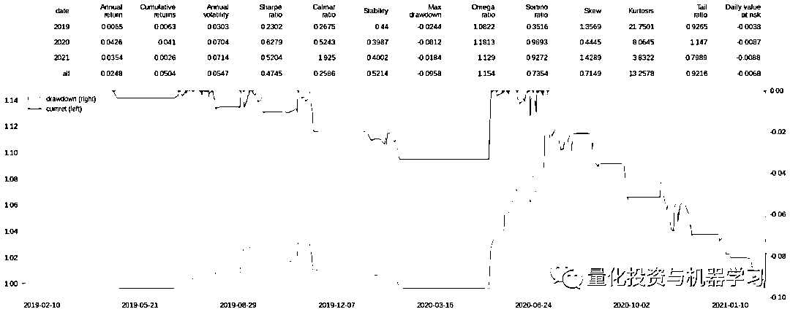
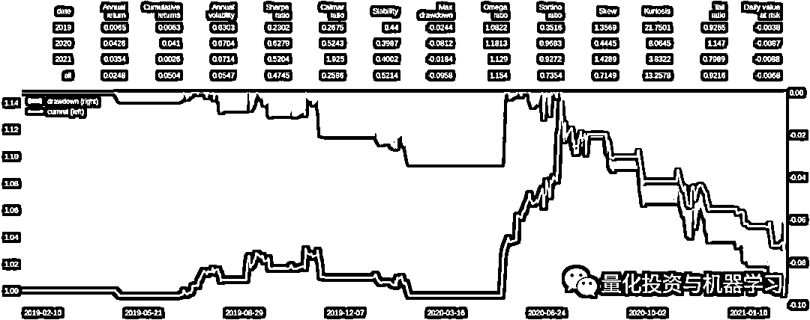
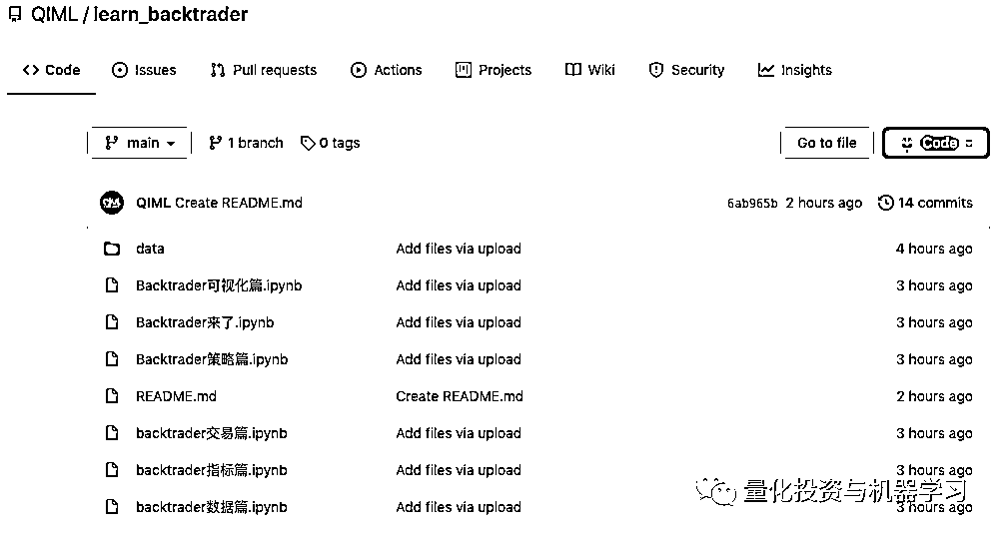

# Backtrader 来啦：可视化篇（重构）

> 原文：[`mp.weixin.qq.com/s?__biz=MzAxNTc0Mjg0Mg==&mid=2653317947&idx=1&sn=8422b62036c4a0693114f6b779fb9cde&chksm=802da92eb75a20380ed04560bf2ed947d7879d5f0f806b094dccc30cc8de83e269c73c375931&scene=27#wechat_redirect`](http://mp.weixin.qq.com/s?__biz=MzAxNTc0Mjg0Mg==&mid=2653317947&idx=1&sn=8422b62036c4a0693114f6b779fb9cde&chksm=802da92eb75a20380ed04560bf2ed947d7879d5f0f806b094dccc30cc8de83e269c73c375931&scene=27#wechat_redirect)

# 


**量化投资与机器学习公众号 **独家撰写****

**公众号为全网读者带来 Backtrader 系列自推出第一期以来，受到了众多读者的喜爱与点赞，QIML 也会继续把这个系列做好。**

****让那些割韭菜的课程都随风而去吧！！！****

**公众号将为大家**多维度、多策略、多场景**来讲述 Backtrader 在量化投资领域的实践应用。同时，我们**对每段代码都做了解读说明**，愿你在 Quant 的道路上学有所获！**

# 

****预定系列****

*   **[Backtrader 来了](http://mp.weixin.qq.com/s?__biz=MzAxNTc0Mjg0Mg==&mid=2653315531&idx=1&sn=f003da3d862e1a13349a10e006c5e748&chksm=802da3deb75a2ac85f3c3a6164f96303b70c12d14293f59fddf9a38c39a89bf4927b90b9e9c6&scene=21#wechat_redirect)**

*   **[Backtrader 数据篇](http://mp.weixin.qq.com/s?__biz=MzAxNTc0Mjg0Mg==&mid=2653315933&idx=1&sn=0b3e71d4bf59da67d837907e05aef8cb&chksm=802da148b75a285e3aa180a23132873646bf356191befc88831639146c68027ae4ab740a5e18&scene=21#wechat_redirect)**

*   **[Backtrader 指标篇](http://mp.weixin.qq.com/s?__biz=MzAxNTc0Mjg0Mg==&mid=2653316290&idx=1&sn=ae9c9d548ccbbc7855bfc69d93182b8a&chksm=802da6d7b75a2fc1bc8614797e2c6f59b8196cfa78368175032575cbfdca825fc1031c74a61c&scene=21#wechat_redirect)**

*   **[Backtrader 交易篇（上）](http://mp.weixin.qq.com/s?__biz=MzAxNTc0Mjg0Mg==&mid=2653316528&idx=1&sn=24f2c06b8f7da8dee6fe40f7c65b83a6&chksm=802da7a5b75a2eb36a921917ece8f010c1f81032edaeced6a50525ca1fff0cdfa42c0f9310e8&scene=21#wechat_redirect)**

*   **[Backtrader 交易篇（下）](http://mp.weixin.qq.com/s?__biz=MzAxNTc0Mjg0Mg==&mid=2653316888&idx=1&sn=1e8343ced80444f2c125fb0dc6b587a1&chksm=802da50db75a2c1bc1e94490245292570aa82261e2d9d97705194ac41544af68d7d822e7e25b&scene=21#wechat_redirect)**

*   **[Backtrader 策略篇](http://mp.weixin.qq.com/s?__biz=MzAxNTc0Mjg0Mg==&mid=2653317634&idx=1&sn=e92fec0b0b5fd5f62805e7c2be5830f8&chksm=802da817b75a2101c5812a6fc9daf0b2c08ce21d882bdd3059d2e9f391432b3ac9e950d5e151&scene=21#wechat_redirect)**

*   ****Backtrader 可视化篇（重构）****

*   **Backtrader 常见问题汇总**

*   **Backtrader 常见案例汇总**

*   **······**

**此系列将由浅入深，每期 1~2 周，大家敬请期待！**

****QIML Github 已上线！**** 

*****https://github.com/QIML*****

**希望大家给我们的项目打 ★**

**公众号今天正式对宣布，我们的官方 Github 已在今天正式上线！后面我们会把相关推文的数据、代码一并进行同步。**

**同时，我们会在今后的日子里，在全网发布一系列好用、实用、你绝对爱不释手的量化开源工具包！** 

**公众号希望给国内量化投资圈贡献一份自己的力量。希望影响更多人了解量化、学习量化、找到属于一条属于自己的路！**

****前言****

**今天的《可视化篇》先会介绍与可视化相关的观测器模块 observers ，然后介绍 Backtrader 自带的绘图函数 plot() ，在介绍的过程中会指出如何修改图形的样式；**最后直接基于回测返回的收益序列 TimeReturn，结合****pyfolio 和 matplotlib****工具，自定义了一个可视化图形。**** 

 ****获取完整代码+数据，见文末链接**** 

****observers 观测器****

**observers 是 Backtrader 的“观测器模块”，主要用于统计回测信息，并在 plot() 的帮助下实现信息的可视化展示，如下图所示：**

****

****最常用的观测器****

**下面是对最常用的观测器的介绍，其他观测器可以参考 Backtrader 官方文档 ~ Observers - Reference：**

*   **backtrader.observers.Broker：记录了经纪商 broker 中各时间点的可用资金和总资产；可视化时，会同时展示 cash 和 values 曲线；如果想各自单独展示 cash 和 values，可以分别调用 backtrader.observers.Cash 和 backtrader.observers.Value；**

*   **backtrader.observers.BuySell：记录了回测过程中的买入和卖出信号；可视化时，会在价格曲线上标注买卖点；**

*   **backtrader.observers.Trades：记录了回测过程中每次交易的盈亏（从买入建仓到卖出清仓算一次交易）；可视化时，会绘制盈亏点；**

*   **backtrader.observers.TimeReturn：记录了回测过程中的收益序列；可视化时，会绘制 TimeReturn 收益曲线；**

*   **backtrader.observers.DrawDown：记录了回测过程的回撤序列；可视化时，绘制回撤曲线；**

*   **backtrader.observers.Benchmark：记录了业绩基准的收益序列，业绩基准的数据必须事先通过 adddata、resampledata、replaydata 等数据添加函数添加进大脑中 cerebro；可视化时，会同时绘制策略本身的收益序列（即：backtrader.observers.TimeReturn 绘制的收益曲线）和业绩基准的收益曲线。**

****如何添加 observers****

**observers 观测器是通过 addobserver() 添加给大脑 cerebro 的：addobserver(obscls, *args, **kwargs)，其中，参数 obscls 对应 observers 类下的观测器、*args, **kwargs 对应观测器支持设置的参数，具体如下所示：**

```py
`import backtrader as bt
...
cerebro = bt.Cerebro(stdstats=False) 
cerebro.addobserver(bt.observers.Broker)
cerebro.addobserver(bt.observers.Trades)
cerebro.addobserver(bt.observers.BuySell)
cerebro.addobserver(bt.observers.DrawDown)
cerebro.addobserver(bt.observers.TimeReturn)
# 添加业绩基准时，需要事先将业绩基准的数据添加给 cerebro
banchdata = bt.feeds.PandasData(dataname=data, fromdate=st_date, todate=ed_date)
cerebro.adddata(banchdata, name='xxxx')
cerebro.addobserver(bt.observers.Benchmark, data=banchdata)`
```

**对于 Broker、Trades、BuySell 3 个观测器，默认是自动添加给 cerebro 的，可以在实例化大脑时，通过 stdstats 来控制：bt.Cerebro(stdstats=False) 表示可视化时，不展示 Broker、Trades、BuySell 观测器；反之，自动展示；默认情况下是自动展示。** 

****如何读取 observers 中的数据****

**observers  中记录了各种回测数据，可以将其看作是一个支持可视化展示的数据存储器，所以 observers 属于 lines 对象。如果想在 Strategy 中读取 observers 中的数据，就会用到 line 的相关操作，具体可以参考《Backtrader 数据篇》的内容，observers 的数据通过 self.stats 对象 来连接：**

```py
`class MyStrategy(bt.Strategy):
    def next(self):
        # 当前时点的前一天的可用现金
        self.stats.broker.cash[0]
        # 当前时点的前一天的总资产
        self.stats.broker.value[0]
        # 获取当前时刻前一天的收益
        self.stats.timereturn.line[0]
        # observers 取得[0]值，对应的 next 中 self.data.datetime[-1] 这一天的值`
```

**observers 是在所有指标被计算完之后、在执行 Strategy 的 next 方法之后才运行并统计数据的，所以读取的最新数据 [0] 相对与 next 的当前时刻是晚一天的。比如 2019-04-08 的总资产为 99653.196672，2019-04-09 的总资产为 99599.008652，2019-04-09 这一天的收益为 -0.0005437，如果在 next 通过 self.stats.timereturn.line[0] 提取，取值为 -0.0005437 时，对应的 next 的当前时间是  2019-04-10。** 

**如果想要将 observers  中的数据保存到本地，可以通过 writer  写入本地文件，如下面的读写到本地 CSV 文件：**

```py
`import csv

class TestStrategy(bt.Strategy):
    ... 
    def start(self):
        self.mystats = csv.writer(open("mystats.csv", "w"))
        self.mystats.writerow(['datetime',
                               'drawdown', 'maxdrawdown', 
                               'timereturn',
                               'value', 'cash'])
    def next(self): 
        self.mystats.writerow([self.data.datetime.date(-1).strftime('%Y-%m-%d'),
                               '%.4f' % self.stats.drawdown.drawdown[0],
                               '%.4f' % self.stats.drawdown.maxdrawdown[0],
                               '%.4f' % self.stats.timereturn.line[0],
                               '%.4f' % self.stats.broker.value[0],
                               '%.4f' % self.stats.broker.cash[0]]) 
    def stop(self):  
        self.mystats.writerow([self.data.datetime.date(0).strftime('%Y-%m-%d'),
                               '%.4f' % self.stats.drawdown.drawdown[0],
                               '%.4f' % self.stats.drawdown.maxdrawdown[0],
                               '%.4f' % self.stats.broker.value[0],
                               '%.4f' % self.stats.broker.cash[0]])

    # 当运行到最后一根 bar 后， next 中记录的是上一根 bar 的收益
    # stop 是在 next 运行完后才运行的，此时 observers 已经计算完 最后一根 bar 的收益了
    # 所以可以在 stop 中获取最后一根 bar 的收益`
```

****自定义 observers ****

**和之前各种自定义一致，自定义 observers 同样是在继承父类  bt.observer.Observer 的基础上，自定义新的的 observers。下面是 Backtrader 官网提供的例子，用于统计已成功创建的订单的价格和到期订单的价格：**

```py
`class OrderObserver(bt.observer.Observer):
    lines = ('created', 'expired',)

    plotinfo = dict(plot=True, subplot=True, plotlinelabels=True)

    plotlines = dict(
        created=dict(marker='*', markersize=8.0, color='lime', fillstyle='full'),
        expired=dict(marker='s', markersize=8.0, color='red', fillstyle='full')
    )

    def next(self):
        for order in self._owner._orderspending:
            if order.data is not self.data:
                continue

            if not order.isbuy():
                continue

            # Only interested in "buy" orders, because the sell orders
            # in the strategy are Market orders and will be immediately
            # executed

            if order.status in [bt.Order.Accepted, bt.Order.Submitted]:
                self.lines.created[0] = order.created.price

            elif order.status in [bt.Order.Expired]:
                self.lines.expired[0] = order.created.price`
```

*   **observers 本身是 Lines 对象，所以构建逻辑与自定义 Indicator 类似，将要统计的数据指定为相应的 line，然后随着回测的进行依次存入数据；**

*   **作为 Lines 对象的 Observers 和 Indicator ，类内部都有 plotinfo = dict(...)、plotlines = dict(...) 属性，用于回测结束后通过 cerebro.plot() 方法进行可视化展示；**

*   **有时候如果想修改 Backtrader 已有观测器的相关属性，可以直接继承该观测器，然后设置属性取值进行修改。如下面在原始 bt.observers.BuySell 的基础上，修改买卖点的样式。**

```py
`class my_BuySell(bt.observers.BuySell):
    params = (('barplot', True), ('bardist', 0.02))
    plotlines = dict(
    buy=dict(marker=r'$\Uparrow$', markersize=10.0, color='#d62728' ),
    sell=dict(marker=r'$\Downarrow$', markersize=10.0, color='#2ca02c'))
    # 将 三角形改为箭头

# 突然感受到了继承的强大！`
```

****plot() 图形绘制**** 

**cerebro.plot() 写在 cerebro.run() 后面，用于回测的可视化。总的来说，cerebro.plot() 支持回测如下 3 大内容：**

*   **Data Feeds：即在回测开始前，通过 adddata、replaydata、resampledata 等方法导入大脑的原始数据；**

*   **Indicators ：即回测时构建的各类指标，比如在 strategy 中构建的指标、通过 addindicator 添加的；**

*   **Observers ：即上文介绍的观测器对象；**

*   **在绘制图形时，默认是将 Data Feeds 绘制在主图上；Indicators 有的与 Data Feeds 一起绘制在主图上，比如均线，有的以子图形式绘制；Observers 通常绘制在子图上。**

****plot() 中的参数****

**plot() 中的参数主要用于系统性的配置图形，具体参数如下所示：**

```py
`plot(plotter=None, # 包含各种绘图属性的对象或类，如果为 None，默认取 PlotScheme 类，如下所示
     numfigs=1, # 是否将图形拆分成多幅图展示，如果时间区间比较长，建议分多幅展示
     iplot=True, # 在 Jupyter Notebook 上绘图时是否自动 plot inline
     **kwargs) # 对应 PlotScheme 中的各个参数

# PlotScheme 中的参数如下所示
class PlotScheme(object):
    def __init__(self):
        # to have a tight packing on the chart wether only the x axis or also
        # the y axis have (see matplotlib)
        self.ytight = False

        # y-margin (top/bottom) for the subcharts. This will not overrule the
        # option plotinfo.plotymargin
        self.yadjust = 0.0
        # Each new line is in z-order below the previous one. change it False
        # to have lines paint above the previous line
        self.zdown = True
        # Rotation of the date labes on the x axis
        self.tickrotation = 15

        # How many "subparts" takes a major chart (datas) in the overall chart
        # This is proportional to the total number of subcharts
        self.rowsmajor = 5

        # How many "subparts" takes a minor chart (indicators/observers) in the
        # overall chart. This is proportional to the total number of subcharts
        # Together with rowsmajor, this defines a proportion ratio betwen data
        # charts and indicators/observers charts
        self.rowsminor = 1

        # Distance in between subcharts
        self.plotdist = 0.0

        # Have a grid in the background of all charts
        self.grid = True

        # Default plotstyle for the OHLC bars which (line -> line on close)
        # Other options: 'bar' and 'candle'
        self.style = 'line'

        # Default color for the 'line on close' plot
        self.loc = 'black'
        # Default color for a bullish bar/candle (0.75 -> intensity of gray)
        self.barup = '0.75'
        # Default color for a bearish bar/candle
        self.bardown = 'red'
        # Level of transparency to apply to bars/cancles (NOT USED)
        self.bartrans = 1.0

        # Wether the candlesticks have to be filled or be transparent
        self.barupfill = True
        self.bardownfill = True

        # Wether the candlesticks have to be filled or be transparent
        self.fillalpha = 0.20

        # Wether to plot volume or not. Note: if the data in question has no
        # volume values, volume plotting will be skipped even if this is True
        self.volume = True

        # Wether to overlay the volume on the data or use a separate subchart
        self.voloverlay = True
        # Scaling of the volume to the data when plotting as overlay
        self.volscaling = 0.33
        # Pushing overlay volume up for better visibiliy. Experimentation
        # needed if the volume and data overlap too much
        self.volpushup = 0.00

        # Default colour for the volume of a bullish day
        self.volup = '#aaaaaa'  # 0.66 of gray
        # Default colour for the volume of a bearish day
        self.voldown = '#cc6073'  # (204, 96, 115)
        # Transparency to apply to the volume when overlaying
        self.voltrans = 0.50

        # Transparency for text labels (NOT USED CURRENTLY)
        self.subtxttrans = 0.66
        # Default font text size for labels on the chart
        self.subtxtsize = 9

        # Transparency for the legend (NOT USED CURRENTLY)
        self.legendtrans = 0.25
        # Wether indicators have a leged displaey in their charts
        self.legendind = True
        # Location of the legend for indicators (see matplotlib)
        self.legendindloc = 'upper left'

        # Plot the last value of a line after the Object name
        self.linevalues = True

        # Plot a tag at the end of each line with the last value
        self.valuetags = True

        # Default color for horizontal lines (see plotinfo.plothlines)
        self.hlinescolor = '0.66'  # shade of gray
        # Default style for horizontal lines
        self.hlinesstyle = '--'
        # Default width for horizontal lines
        self.hlineswidth = 1.0

        # Default color scheme: Tableau 10
        self.lcolors = tableau10

        # strftime Format string for the display of ticks on the x axis
        self.fmt_x_ticks = None

        # strftime Format string for the display of data points values
        self.fmt_x_data = None`
```

**如果想要系统性修改图形样式，可以重新定义 PlotScheme 类，然后修改里面用到的参数；也可以直接在 plot() 中修改：** 

```py
`# 通过参数形式来设置
cerebro.plot(iplot=False, 
             style='candel', # 设置主图行情数据的样式为蜡烛图
             lcolors=colors , # 重新设置主题颜色
             plotdist=0.1, # 设置图形之间的间距
             barup = '#ff9896', bardown='#98df8a', # 设置蜡烛图上涨和下跌的颜色
             volup='#ff9896', voldown='#98df8a', # 设置成交量在行情上涨和下跌情况下的颜色
             ....)`
```

**关于主题颜色，Backtrader 提供了 Tableau 10 、Tableau 10 Light、Tableau 20 3 种主题色，默认是以 Tableau 10 为主题色。但是看源代码，不知道如何修改 lcolors，源码 scheme.py 文件中的 tableau10 只一个变量，直接赋值给 self.lcolors = tableau10，如果在我们在自己的的 notebook 上运行 lcolors=tableau10 会报错，提示 tableau10 变量不存在。所以，如果想修改主题色，需要重新定义 tableau10 变量：**

```py
`# 定义主题色变量：直接从源码 scheme.py 中复制的
tableau20 = [
    'steelblue', # 0
    'lightsteelblue', # 1
    'darkorange', # 2
    'peachpuff', # 3
    'green', # 4
    'lightgreen', # 5
    'crimson', # 6
    'lightcoral', # 7
    'mediumpurple', # 8
    'thistle', # 9
    'saddlebrown', # 10
    'rosybrown', # 11
    'orchid', # 12
    'lightpink', # 13
    'gray', # 14
    'lightgray', # 15
    'olive', # 16
    'palegoldenrod', # 17
    'mediumturquoise', # 18
    'paleturquoise', # 19
]

tableau10 = [
    'blue', # 'steelblue', # 0
    'darkorange', # 1
    'green', # 2
    'crimson', # 3
    'mediumpurple', # 4
    'saddlebrown', # 5
    'orchid', # 6
    'gray', # 7
    'olive', # 8
    'mediumturquoise', # 9
]

tableau10_light = [
    'lightsteelblue', # 0
    'peachpuff', # 1
    'lightgreen', # 2
    'lightcoral', # 3
    'thistle', # 4
    'rosybrown', # 5
    'lightpink', # 6
    'lightgray', # 7
    'palegoldenrod', # 8
    'paleturquoise', # 9
]

# 选一个主题色做修改
cerebro.plot(lcolors=tableau10)

# 当然也可以选自己喜欢的主题色
mycolors = ['#729ece', '#ff9e4a', '#67bf5c', 
          '#ed665d', '#ad8bc9', '#a8786e', 
          '#ed97ca', '#a2a2a2', '#cdcc5d', '#6dccda']

cerebro.plot(lcolors=mycolors)`
```

**大家可以发现，从源码中复制的主题色，后面都注释了索引号，而 Backtrader 在绘制图形时，选择颜色的顺序依次是这样的：**

*   **tab10_index = [3, 0, 2, 1, 2, 4, 5, 6, 7, 8, 9]；**

*   **tab10_index 中的序号对应的是 主题色 的索引号；**

*   **每一幅图，依次取 tab10_index 中的序号对应的颜色来绘制，比如 MACD 有 3 条 line，line0 的颜色为 tab10_index[0] = 3，也就是 lcolors=tableau10 中的索引号为 3 对应的颜色 'crimson'；line1 的颜色为 tab10_index[1] = 0，也就是 lcolors=tableau10 中的索引号为 0 对应的颜色 'blue'；**

*   **所以在设置颜色时，需要与 tab10_index  中的序号结合起来看。**

****局部绘图参数设置****

**对于 Indicators  和 Observers 的可视化设置，通过类内部的 plotinfo = dict(...)、plotlines = dict(...) 属性来控制，其中 plotinfo 主要对图形整体布局进行设置，plotlines 主要对具体 line 的样式进行设置：**

```py
`plotinfo = dict(plot=True, # 是否绘制
                subplot=True, # 是否绘制成子图
                plotname='', # 图形名称
                plotabove=False, # 子图是否绘制在主图的上方
                plotlinelabels=False, # 主图上曲线的名称
                plotlinevalues=True, # 是否展示曲线最后一个时间点上的取值
                plotvaluetags=True, # 是否以卡片的形式在曲线末尾展示最后一个时间点上的取值
                plotymargin=0.0, # 用于设置子图 y 轴的边界
                plothlines=[a,b,...], # 用于绘制取值为 a,b,... 的水平线
                plotyticks=[], # 用于绘制取值为 a,b,... y 轴刻度
                plotyhlines=[a,b,...], # 优先级高于 plothlines、plotyticks，是这两者的结合
                plotforce=False, # 是否强制绘图
                plotmaster=None, # 用于指定主图绘制的主数据
                plotylimited=True, 
                # 用于设置主图的 y 轴边界，
                # 如果 True，边界只由主数据 data feeds 决定，无法完整显示超出界限的辅助指标；
                # 如果 False, 边界由主数据 data feeds 和指标共同决定，能确保所有数据都能完整展示
           )

# 修改交易观测器的样式
class my_Trades(bt.observers.Trades):
    plotlines = dict(
    pnlplus=dict(_name='Positive',
                 marker='^', color='#ed665d',
                 markersize=8.0, fillstyle='full'),
    pnlminus=dict(_name='Negative',
                  marker='v', color='#729ece',
                  markersize=8.0, fillstyle='full'))

# 修改买卖点样式
class my_BuySell(bt.observers.BuySell):
    params = (('barplot', True), ('bardist', 0.02)) # bardist 控制买卖点与行情线之间的距离
    plotlines = dict(
    buy=dict(marker=r'$\Uparrow$', markersize=10.0, color='#d62728' ),
    sell=dict(marker=r'$\Downarrow$', markersize=10.0, color='#2ca02c'))`
```

****部分修改效果**** 

**一般主图的样式通过 plot() 中的参数来设置；Indicators  和 Observers 的样式通过继承原始类，然后通过修改 plotinfo 和 plotlines 属性来设置；部分修改效果如下所示：**

**蜡烛图样式：**

```py
`plt.style.use('seaborn') # 使用 seaborn 主题
plt.rcParams['figure.figsize'] = 20, 10  # 全局修改图大小

# 修改 Trades 观测器的样式
class my_Trades(bt.observers.Trades):
    plotlines = dict(
    pnlplus=dict(_name='Positive',
                 marker='^', color='#ed665d',
                 markersize=8.0, fillstyle='full'),
    pnlminus=dict(_name='Negative',
                  marker='v', color='#729ece',
                  markersize=8.0, fillstyle='full'))

# 修改 BuySell 的样式
class my_BuySell(bt.observers.BuySell):

    params = (('barplot', True), ('bardist', 0.02))

    plotlines = dict(
    buy=dict(marker=r'$\Uparrow$', markersize=10.0, color='#d62728' ),
    sell=dict(marker=r'$\Downarrow$', markersize=10.0, color='#2ca02c'))

# 简单均线策略
class TestStrategy(bt.Strategy):
    ......

# 绘制图形
cerebro1 = bt.Cerebro(stdstats=False)
......
# 添加观测器
cerebro1.addobserver(bt.observers.DrawDown)
cerebro1.addobserver(bt.observers.Benchmark, data=datafeed1)
cerebro1.addobserver(bt.observers.Broker)
cerebro1.addobserver(my_Trades)
cerebro1.addobserver(my_BuySell)
#先运行策略
rasult = cerebro1.run()
#策略运行完后，绘制图形
colors = ['#729ece', '#ff9e4a', '#67bf5c', '#ed665d', '#ad8bc9', '#a8786e', '#ed97ca', '#a2a2a2', '#cdcc5d', '#6dccda']
tab10_index = [3, 0, 2, 1, 2, 4, 5, 6, 7, 8, 9]
cerebro1.plot(iplot=False, 
              style='line', # 绘制线型价格走势，可改为 'candel' 样式
              lcolors=colors,
              plotdist=0.1, 
              bartrans=0.2, 
              volup='#ff9896', 
              voldown='#98df8a', 
              loc='#5f5a41',
              grid=False) # 删除水平网格`
```

****

**蜡烛图样式：**

**绘制蜡烛图时，蜡烛之间会比较拥挤，可以通过设置 numfigs=2，分 2 部分绘制。下图只展示了后半部分的内容。**

****

****基于收益序列进行可视化****

**Backtrader 自带的绘图工具方便好用，不过平时在汇报策略回测结果时，可能更关注的是策略的累计收益曲线和业绩评价指标等结果，而这些回测统计信息只需基于回测返回的 TimeReturn 收益序列做简单计算即可得到。下面是基于 Backtrader 回测返回的分析器 TimeReturn、pyfolio、matplotlib 得到的可视化图形：**

```py
`.....
# 回测时需要添加 TimeReturn 分析器
cerebro1.addanalyzer(bt.analyzers.TimeReturn, _name='_TimeReturn')
result = cerebro1.run()

# 提取收益序列
pnl = pd.Series(result[0].analyzers._TimeReturn.get_analysis())
# 计算累计收益
cumulative = (pnl + 1).cumprod()
# 计算回撤序列
max_return = cumulative.cummax()
drawdown = (cumulative - max_return) / max_return
# 计算收益评价指标
import pyfolio as pf
# 按年统计收益指标
perf_stats_year = (pnl).groupby(pnl.index.to_period('y')).apply(lambda data: pf.timeseries.perf_stats(data)).unstack()
# 统计所有时间段的收益指标
perf_stats_all = pf.timeseries.perf_stats((pnl)).to_frame(name='all')
perf_stats = pd.concat([perf_stats_year, perf_stats_all.T], axis=0)
perf_stats_ = round(perf_stats,4).reset_index()

# 绘制图形
import matplotlib.pyplot as plt
plt.rcParams['axes.unicode_minus'] = False  # 用来正常显示负号
import matplotlib.ticker as ticker # 导入设置坐标轴的模块
plt.style.use('seaborn') # plt.style.use('dark_background')

fig, (ax0, ax1) = plt.subplots(2,1, gridspec_kw = {'height_ratios':[1.5, 4]}, figsize=(20,8))
cols_names = ['date', 'Annual\nreturn', 'Cumulative\nreturns', 'Annual\nvolatility',
       'Sharpe\nratio', 'Calmar\nratio', 'Stability', 'Max\ndrawdown',
       'Omega\nratio', 'Sortino\nratio', 'Skew', 'Kurtosis', 'Tail\nratio',
       'Daily value\nat risk']

# 绘制表格
ax0.set_axis_off() # 除去坐标轴
table = ax0.table(cellText = perf_stats_.values, 
                bbox=(0,0,1,1), # 设置表格位置， (x0, y0, width, height)
                rowLoc = 'right', # 行标题居中
                cellLoc='right' ,
                colLabels = cols_names, # 设置列标题
                colLoc = 'right', # 列标题居中
                edges = 'open' # 不显示表格边框
                )
table.set_fontsize(13)

# 绘制累计收益曲线
ax2 = ax1.twinx()
ax1.yaxis.set_ticks_position('right') # 将回撤曲线的 y 轴移至右侧
ax2.yaxis.set_ticks_position('left') # 将累计收益曲线的 y 轴移至左侧
# 绘制回撤曲线
drawdown.plot.area(ax=ax1, label='drawdown (right)', rot=0, alpha=0.3, fontsize=13, grid=False)
# 绘制累计收益曲线
(cumulative).plot(ax=ax2, color='#F1C40F' , lw=3.0, label='cumret (left)', rot=0, fontsize=13, grid=False)
# 不然 x 轴留有空白
ax2.set_xbound(lower=cumulative.index.min(), upper=cumulative.index.max())
# 主轴定位器：每 5 个月显示一个日期：根据具体天数来做排版
ax2.xaxis.set_major_locator(ticker.MultipleLocator(100)) 
# 同时绘制双轴的图例
h1,l1 = ax1.get_legend_handles_labels()
h2,l2 = ax2.get_legend_handles_labels()
plt.legend(h1+h2,l1+l2, fontsize=12, loc='upper left', ncol=1)

fig.tight_layout() # 规整排版
plt.show()`
```

**'seaborn' 主题下的绘制效果：**

****

**'dark_background' 主题下的绘制效果：**

****

****总结****

**关于回测结果的可视化，不同的需求对应不同的可视化内容。Backtrader 回测框架本身就对原始数据集 Data Feeds、回测指标 Indicators 、回测结果观测器 Observers 提供了对用户非常友好的绘图接口。对于一些额外的数据，也可以结合 Backtrader 分析器 Analyzers 返回的指标，选用自己熟悉的 Python 绘图工具 Matplotlib、Seaborn、Plotly 等来进行可视化展示。**

****代码+数据获取****

****复制下方链接**至浏览器或点击**阅读原文**，进行下载：**

*****https://github.com/QIML/learn_backtrader*****

# **希望大家给我们的项目打 ★**

****

**量化投资与机器学习微信公众号，是业内垂直于**量化投资、对冲基金、Fintech、人工智能、大数据**等领域的主流自媒体。公众号拥有来自**公募、私募、券商、期货、银行、保险、高校**等行业**20W+**关注者，连续 2 年被腾讯云+社区评选为“年度最佳作者”。**