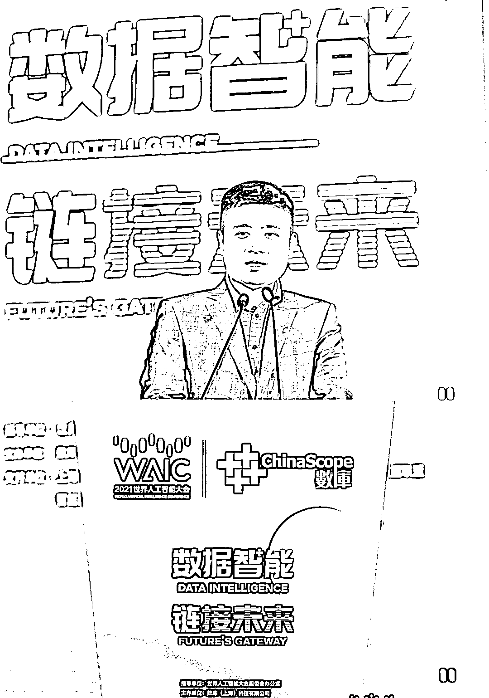
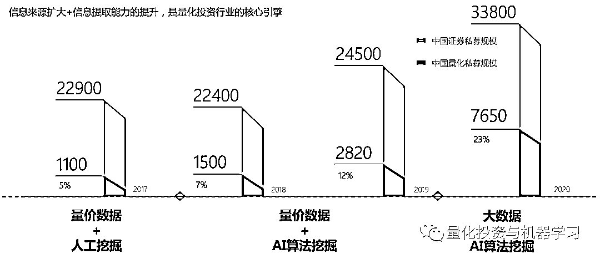
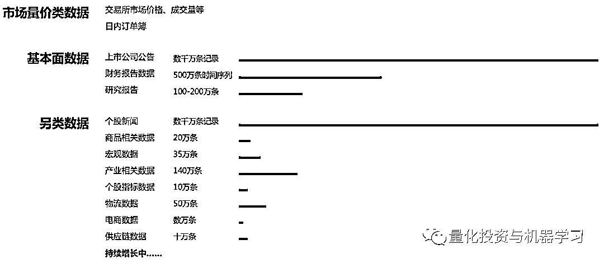
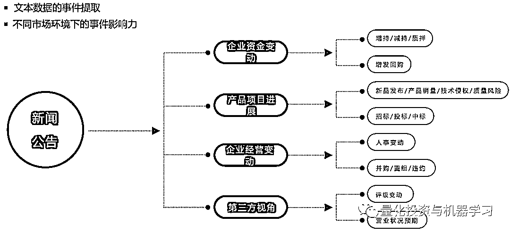
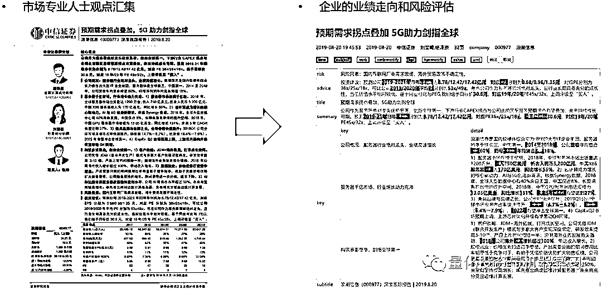

# 九坤王琛：量化+AI，未来可期！

> 原文：[`mp.weixin.qq.com/s?__biz=MzAxNTc0Mjg0Mg==&mid=2653317918&idx=1&sn=ab0ff4e36afe55ffcf4714cdd9698321&chksm=802da90bb75a201deec9a35804c40199df3c322baa3f857c72af3ea0784dd7072a8da86b2b49&scene=27#wechat_redirect`](http://mp.weixin.qq.com/s?__biz=MzAxNTc0Mjg0Mg==&mid=2653317918&idx=1&sn=ab0ff4e36afe55ffcf4714cdd9698321&chksm=802da90bb75a201deec9a35804c40199df3c322baa3f857c72af3ea0784dd7072a8da86b2b49&scene=27#wechat_redirect)

# 

量化投资与机器学习公众号编辑部报道

**未经允许，禁止转载**

2021 世界人工智能大会于 2021 年 7 月 8 日至 10 日在上海世博中心和上海世博展览馆同时举行。世界人工智能大会自 2018 年以来，已成功举办三届。2021 世界人工智能大会由国家发展和改革委员会、工业和信息化部、科学技术部、国家互联网信息办公室、中国科学院、中国工程院、中国科学技术协会，以及上海市人民政府共同主办。

作为本届世界人工智能大会承办单位之一，数库科技于 7 月 9 日下午举办以 “数据智能，链接未来” 主题分论坛，会中九坤投资创始人王琛发表了**《****数智时代量化投资的演进与挑战》**的主题演讲，从量化投资的数智演进、九坤在数据与智能方面的实践、未来量化投资数智发展中面对的挑战和瓶颈三方面阐述量化行业发展。

在王琛看来，量化投资盈利的因素，一是金融市场的弱有效性，导致市场有投资空间、投资机会，这是金融市场投资赚钱的基础保证；二是统计方法的有效性，这是量化基础的投资信仰。量化的核心发展方向，包括信息、算法、执行三个方面。

图片来自：数库科技

王琛表示，在人工智能兴起之前，量化领域已经做到了一定高度。但进入数字化时代之后，这三个方向都被 AI 和大数据冲击。以九坤运用 AI 处理信息的实践为例，目前正尝试在时间序列上把各种多模态的另类数据来源进行交织，最后形成对价值的预测能力，使得预测能力不止来源于量价。

王琛还提到未来量化投资数智时代的挑战，具体包括多模态挑战、数据质量挑战、处理速度挑战。还有两个重大挑战，包括模型有效性、市场反身性与金融市场高噪音的叠加的挑战，以及中国市场环境下，不同时间市场风格和结构的变化带来的挑战。

量化投资与机器学习公众号作为本次论坛媒体支持单位，参与论坛量化内容的报道工作。下面，是公众号对王琛先生在本次论坛演讲内容的整理：

**量化投资为什么能盈利？**

***“History doesn't repeat itself, butit does  rhyme. ”***

***— Mark Twain***

**很多人问量化为什么能赚钱？马克吐温的这句话已经道出了金融市场甚至人类历史背后的规律。他说历史不会重复自己，但会压自己的韵脚。历史是人创造的，不管历史如何发展，人性在其中起到的作用会重复出现。金融市场是由人交易出来的市场，背后反映的统计规律是量化存在的依据。**

**量化投资为什么能够盈利？**

两个因素：**一是金融市场的弱有效性。**导致市场有投资空间和投资机会，这是所有在金融市场投资赚钱的一个基础保证；**二是统计方法的有效性。**我们既然发现历史是能压自己韵脚，历史简单的重复和押韵脚最大的区别在于找到它背后的规律性，我们叫因子或算法也好，这些需要经过重复的验证，我们才能相信它在量化的应用，这也是量化基础的投资信仰。

**AI 如何预测股票？**

**数据！关键是找到那些影响股价的信息对应的数据。**

首先是数据。什么叫量化所希望的数据，或者什么叫好的数据？数据最重要的是对股价要有一定的影响才能称之为好的数据。有这么一个故事，在每年的“315 晚会”上，那些被点名的企业（上市企业/非上市企业）。当这些上市企业尤其在美股上市的企业在晚会上有被提到有负面消息后，由于其正在盘中交易，该公司的股价则会发生大的跳水。这是一个很明显的例子，只要把数据用得更好，这样一个简单的数据就会变成大家比速度的一个游戏，速度越快，就能更早的发现这些信息并运用到股票交易中去。

第二个例子，当我们把非常简单的数据应用之后，怎么去提升数据对于股价的影响，我们需要再隔一层。很多做基本面的人都知道，基本面投资的核心是预测上市公司的盈利能力。上市公司的盈利能力在不同的行业会有不同的盈利指标。比如特斯拉，它有一个非常重要的盈利指标，那就是量产能力。2018 年，特斯拉在加州的某个工厂，有一个公司收集到其工厂员工的手机信号。这些信号显示了在当季度加班的情况。他们认为，加班情况会直接预测到整个特斯拉的产能。因为通过预测后发现：在 2018 年第三季度员工加班的比例相比之前有 30%以上的增幅，当时便对特斯拉给出了非常强的买入信号。当特斯拉 Q3 季报出来之后，我们看到特斯拉当天上涨了 9%。类似于这样的数据能够直接影响到股价，那么，我们认为这就是好的数据！

**大数据+AI 算法时代的来临**

**人工智能已从简单的算法+数据库发展演化到了机器学习+深度理解的状态。**

图片来自：九坤投资

大概 2018 年之前，国内量化还是以量价数据+人工挖掘的方式为主。在 2018 年之后，整个市场开始逐渐进入 AI 算法的时代，不管从因子挖掘、组合管理，还是风险优化等方面，进一步提升了整个量化投资的收益。到 2019 年之后，整个量化行业的规模快速增长，这是推动整个行业发展非常重要的动力。到 2020 年，我们认为量化行业已经到了大数据+AI 算法的阶段。整体来看，在量化行业突破 7000 亿的体量之后，**大数据+AI 算法在未来的发展趋势势不可挡，我们认为未来量化行业的主要增长来源也是来自于此。**

**量化数据分类和规模**

图片来自：九坤投资

九坤举了两个其在数据+AI 算法方面的案例：

**案例一：新闻/公告**

上图看到新闻和公告是有超过数百万条的记录，当我们拿到这样的数据后，第一件事是得先知道这些数据长什么样。首先，我们需要先把这些数据进行相关的分类，在这其中会使用一些 NLP 算法，实现对不同类型的新闻或者公告数据的分类，比如业绩预增或者预减，股价上涨和下跌等。前面提到 315 的例子，大家想是不是可以从中找出一两个或者几个马上影响股价的新闻案例，变成简单的算法就可以套利了？这件事其实是挺难的，经过我们验证后发现：**当我们把市场价格放到模型中后，多数新闻对股价的影响是与大家的预期有所不同。**

图片来自：九坤投资

举个例子，很多人会觉得如果看到一些上市公司的重大负面消息，股价会有比较大的跌幅。如果我们看到上市公司有重大的重组或者重大合同的签署消息，可能对上市公司是一个非常利好的消息。实际情况恰恰相反，当出现一些重大合同签署的时候，股价在接下来的几天都是下跌的。仔细回看市场的走势，可以看到在出现这些重大利好之前的几天，股价已经经过了一波快速的上涨。对于中国市场来说，现在很多新闻数据，在最终的结果中有的时候是一个反指，这是我们在研究中发现的问题。

包括在美股市场，我能明显感觉到，至少在十年之前，你认为它是利好就很有可能是利好，但后面利好会逐渐衰减。这也是金融市场交易反身性的一个结果，也就是所谓的“靴子落地就会产生利空促进，或者利好兑现”的结果。

**案例二：量化基本面**

大家都在想如何用量化去做基本面，这是所有的量化公司都在考虑的问题。在 A 股做量化基本面要做的事情跟海外不太一样，因为国内基本面的研究信息和数据对于量化来说并不是那么充分。我们可以想到一个基本的研究来自于行业研究报告，如何对这些行业研究报告进行分析？很直接的办法找到所有券商的行业研究员，让他定期给我们行业研究的数据。当我们拿到几百万篇历史研究报告的时候，能不能把这些报告变成对研究员预测能力的判断分析，这也是非常重要的。我们试图从几百万篇的研究报告中通过 NLP 的方法来获取相关信息。

图片来自：九坤投资

当一个研究报告描述行业的时候，我们看里面有哪些关键的指标跟行业相关的。对量化来说最缺的是对一个行业的知识图谱的构建，要建立这个知识图谱的就要通过这样的体系，通过 NLP 对研报进行分析，然后把所有的信息抽取出来，得到在时间序列上研究报告在历史上所出现的二维结构。基于这样的二维结构我们可以对其中很多指标进行验证，看它是不是对上市公司盈利的结果或者股价的结果有影响，是长期的影响还是短期的影响。

第一步，我们如果把左边的研究报告变成右边的样式，这就是非常典型的自然语言处理手段，左图很多是 PDF 格式的文件，我们要对它进行结构分段处理。在这个过程中，我们会得到一个与所有行业相关的研究指标或者研究框架体系。

我们现在努力尝试的，就是希望在各个方向上，**在时间序列上把各种多模态的另类数据来源进行交织，最后形成对价值的预测能力！**

**量化投资大数据智能化面临的挑战**

**1、多模态化挑战**

*   模态化的数据需要多模态的算法来解决

*   信噪比低，覆盖股票数量要求高

**2、数据质量的挑战**

*   数据源本身的错误或噪音

*   数据提取、更新的异常

*   数据在时间序列要求

**3、处理速度挑战**

*   低时延+海量数据+7X24

*   AI 算力支持

**更大的挑战**

**1、模型有效性、市场反身性与金融市场高噪音的叠加**

**2、不同时间市场风格和结构的变化**

最后，王总为大家分享了当年他入职量化时的一句话：

***“If you torture the data long enough, it will confess.”***

***— Ronald Coase***

  希望与大家共勉！

量化投资与机器学习微信公众号，是业内垂直于**量化投资、对冲基金、Fintech、人工智能、大数据**等领域的主流自媒体。公众号拥有来自**公募、私募、券商、期货、银行、保险、高校**等行业**20W+**关注者，连续 2 年被腾讯云+社区评选为“年度最佳作者”。