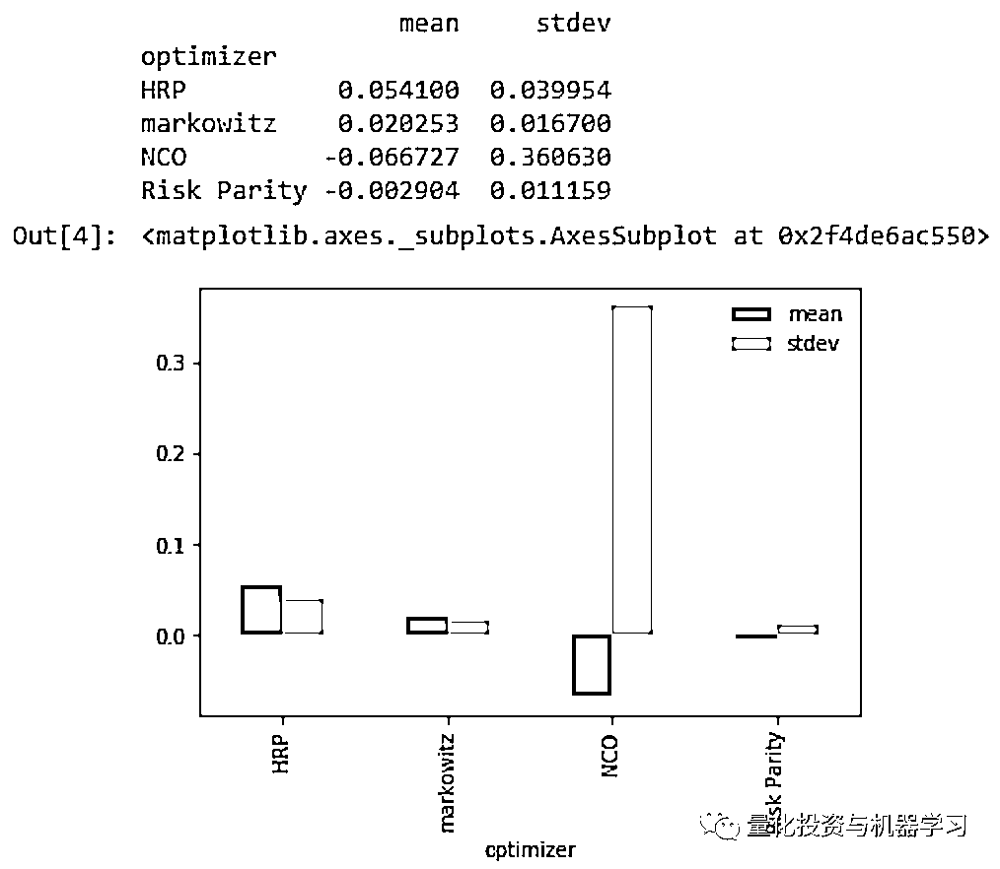

# 如何更稳健的计算组合最优权重（附代码）

> 原文：[`mp.weixin.qq.com/s?__biz=MzAxNTc0Mjg0Mg==&mid=2653317895&idx=1&sn=fd0c72987a57c7963dab778aaee67b3d&chksm=802da912b75a20049f33650057330966b36da9c055ed314cac67e1bb581ca981feaa1ecab5d2&scene=27#wechat_redirect`](http://mp.weixin.qq.com/s?__biz=MzAxNTc0Mjg0Mg==&mid=2653317895&idx=1&sn=fd0c72987a57c7963dab778aaee67b3d&chksm=802da912b75a20049f33650057330966b36da9c055ed314cac67e1bb581ca981feaa1ecab5d2&scene=27#wechat_redirect)


量化投资与机器学习公众号独家解读

量化投资与机器学公众号 *** ***QIML Insight——深度研读系列 ******是公众号今年全力打造的一档**深度、前沿、高水准**栏目。


公众号**遴选**了各大期刊最新论文，按照理解和提炼的方式为读者呈现每篇论文最精华的部分。QIML 希望大家能够读到可以成长的量化文章，愿与你共同进步！

[第一期 ](http://mp.weixin.qq.com/s?__biz=MzAxNTc0Mjg0Mg==&mid=2653315304&idx=1&sn=8f36bc03096995655abea040e2ee3f94&chksm=802da2fdb75a2beb5d210c8235ab64fba0ba510b16683599189419f2ce0af483ea9c020707f6&scene=21#wechat_redirect) | [第二期](http://mp.weixin.qq.com/s?__biz=MzAxNTc0Mjg0Mg==&mid=2653315407&idx=1&sn=e9f5e375aedcb0b8f82d6c42b7ea3e80&chksm=802da35ab75a2a4c1aa8aa458bb5878ccbe0499b3c4e01bfff51508610c4e45f07d5b16fd6ab&scene=21#wechat_redirect) | [第三期](http://mp.weixin.qq.com/s?__biz=MzAxNTc0Mjg0Mg==&mid=2653315880&idx=1&sn=0d7bd33e5f1697973c1f365b729369b5&chksm=802da13db75a282b762267494b493c81b5595f35ca41da6a34625a13c02c6e1765d641ed7f0c&scene=21#wechat_redirect) | [第四期](http://mp.weixin.qq.com/s?__biz=MzAxNTc0Mjg0Mg==&mid=2653316512&idx=1&sn=d88a7b3d5c46f307370fe7e8939b4bbd&chksm=802da7b5b75a2ea3f74d3f7f1dff4c57c811a51f60f77104f0a8de86301f98f3b28814daa834&scene=21#wechat_redirect) | [第五期](http://mp.weixin.qq.com/s?__biz=MzAxNTc0Mjg0Mg==&mid=2653316725&idx=1&sn=4ef212b4f7ffca70da72a9b72917676e&chksm=802da460b75a2d762a41f36c89140ce6f364cf2ab1994ffccec7306b8186641f4598372495ed&scene=21#wechat_redirect) | [第六期](http://mp.weixin.qq.com/s?__biz=MzAxNTc0Mjg0Mg==&mid=2653316934&idx=1&sn=0bae7eba4fc5a8b462ee21ded87e3718&chksm=802da553b75a2c45232d3928fee7677c7fce7e2ccea7c77377e3748db3c7b884450f41ce323a&scene=21#wechat_redirect) 

[第七期](http://mp.weixin.qq.com/s?__biz=MzAxNTc0Mjg0Mg==&mid=2653317372&idx=1&sn=ca755712e4a0b8d84b9beca7e513a8ce&chksm=802daae9b75a23ffe0d91ef55c22827772e7d28b727b91b13519aa095deede6b2736d808529a&scene=21#wechat_redirect) | [第八期 |](http://mp.weixin.qq.com/s?__biz=MzAxNTc0Mjg0Mg==&mid=2653317559&idx=1&sn=2c967a2b372c293e71b4dcbb2dab8442&chksm=802daba2b75a22b4bc256e7b904af21e2f6ee86dbfb1b9dc70a3e56d84eb1cc754511af3ee38&scene=21#wechat_redirect) [第九期](http://mp.weixin.qq.com/s?__biz=MzAxNTc0Mjg0Mg==&mid=2653317718&idx=1&sn=f2529edafe0f348952d589fe1f487727&chksm=802da843b75a21550c0c0a101e1483bf131bf3d5c62ac1c5a6d7f978b171c1ea064e073d8f7b&scene=21#wechat_redirect)

> **本期遴选论文** **来源：**SSRN
> **标题：**A ROBUST ESTIMATOR OF THE EFFICIENT FRONTIER October 15, 2019
> **作者：**Marcos López de Prado

今天分享的论文是 Marcos López de Prado 2019 年的论文《A ROBUST ESTIMATOR OF THE EFFICIENT FRONTIER》本文主要有两个创新点。

**首先，提出了一种新的解决方法 ，称为嵌套聚类优化（NCO），该方法解决凸优化问题中噪声及复杂的信号结构引起的不稳定性。其次，作者还采用了蒙特卡罗模拟方法（Monte Carlo Optimization Selection, 以下简称为 MCOS）对多种最优化算法产生的误差进行了评估（包括 NCO），这样就可以根据评估的结果选择最稳健的优化模型。**

不是一般性，假设有个系统有 N 个随机变量，他们的期望用向量 表示，协方差矩阵用 表示。目标是找到一个权重向量 使得系统的方差最小，即：

在金融领域，这就是一个典型的组合优化问题，当 a 为向量 1 是最优组合就是 minimum variance portfolio。而当 a 为向量 u 时，最优组合就是夏普最大的组合。其解析解为：

这类问题称为凸优化（CVO）,为了简单起见，后面的所有讨论都基于这个最基本的凸优化问题。但这并不是说明，本文提出的方法仅适用这个最简单的问题。**不稳定性的来源**上述问题的最优解中， 和 都是未知的，一般会用估计值 和 。正是这些估计值会导致结果的不稳定性，他们细微的变化会极大的导致结果变化。这种不稳定性可以充以下两个方面说明。**噪音：**假设一个 TxN 的矩阵 X，由 N 的独立同分布的随机变量组成，它们的期望为 0，方差为 。矩阵 有特征值 ，根据 Marcenko–Pastur 理论（该定理解释了独立同分布随机变量协方差矩阵的特征值分布情况，这些特征值反映的是各种噪音的波动性），当 ， 且 时， 的概率密度函数为：<embed style="vertical-align: -2.918ex;width: 40.805ex;height: auto;max-width: 300% !important;" src="https://mmbiz.qlogo.cn/mmbiz_svg/a18XcQ1EBBggIibBXCZoqdtuX58TrL8D1J7xicYHMY3QO7AI3QFug3cMZNolJp9AluJVV8J4t720ibUNVwIDO1Cxeh6m6I8Khfg/0?wx_fmt=svg" data-type="svg+xml">其中， 的最大取值 ，最小值 。当 时， 为 的相关系数矩阵。

但是，实际情况中 ，这时 趋近 0，这就导致 的行列式接近 0， 的逆矩阵就不能很稳健的计算，那么由此得到的解就不稳定。

**信号：**当相关矩阵为单位矩阵时，特征值函数为一条水平线。 除了这种理想情况下，至少有一个变量子集显示出比其他变量子集更大的相关性，从而在相关矩阵中形成一个簇。当 k 个变量形成一个集群时，它们更容易暴露于一个共同的特征向量，这意味着相关的特征值解释了更大的数量的方差。但是由于相关性矩阵的迹恰好是 N，这意味着一个特征值只能以牺牲该簇中其他 K - 1 个特征值为代价而增加，从而导致条件数大于 1。对于相关性矩阵聚类的特性带来的不稳定性，作者提出了嵌套聚类优化（NCO）**蒙特卡罗模拟法 MCOS**

MCOS 求解 w 的过程一共包含了五个步骤：

**1、估计均值和方差：**以 为参数生成矩阵 ,计算矩阵 的均值和方差

参考如下代码：

```py
import numpy as np,pandas as pd
from sklearn.covariance import LedoitWolf

def simCovMu(mu0,cov0,nObs,shrink=False):
      x=np.random.multivariate_normal(mu0.flatten(),cov0,size=nObs)
      mu1=x.mean(axis=0).reshape(-1,1)
      if shrink:cov1=LedoitWolf().fit(x).covariance_
     else:cov1=np.cov(x,rowvar=0)
     return mu1,cov1 
```

**2、去噪音：**这一步为了解决上文提到的由于噪音带来的不稳定性。首先用 KDE 算法，将特征值进行 Marcenko-Pastur 分布拟合。这样就能够将噪音相关的特征值从信号相关的特征值分离出来。

参考以下代码：

```py
from sklearn.neighbors.kde import KernelDensity
from scipy.optimize import minimize

def fitKDE(obs, bWidth=.25, kernel='gaussian', x=None):
      # Fit kernel to a series of obs, and derive the prob of obs
      # x is the array of values on which the fit KDE will be evaluated
      if len(obs.shape)==1: obs=obs.reshape(-1,1)
      kde=KernelDensity(kernel=kernel, bandwidth=bWidth).fit(obs)
      if x is None: x=np.unique(obs).reshape(-1,1)
      if len(x.shape)==1:  x=x.reshape(-1,1)
      logProb=kde.score_samples(x) # log(density)
      pdf=pd.Series(np.exp(logProb), index=x.flatten())
      return pdf
#------------------------------------------------------------------------------
def mpPDF(var,q,pts):
      # Marcenko-Pastur pdf
      # q=T/N
      eMin,eMax=var*(1-(1./q)**.5)**2,var*(1+(1./q)**.5)**2
      eVal=np.linspace(eMin,eMax,pts)
      pdf=q/(2*np.pi*var*eVal)*((eMax-eVal)*(eVal-eMin))**.5
      pdf=pd.Series(pdf,index=eVal)
      return pdf
#------------------------------------------------------------------------------
def errPDFs(var,eVal,q,bWidth,pts=1000):
      # Fit error
      pdf0=mpPDF(var,q,pts) # theoretical pdf
      pdf1=fitKDE(eVal,bWidth,x=pdf0.index.values) # empirical pdf
      sse=np.sum((pdf1-pdf0)**2)
      return sse
#------------------------------------------------------------------------------
def findMaxEval(eVal,q,bWidth):
      # Find max random eVal by fitting Marcenko's dist to the empirical one
      out=minimize(lambda *x:errPDFs(*x),.5,args=(eVal,q,bWidth),
      bounds=((1E-5,1-1E-5),))
      if out['success']: var=out['x'][0]
      else: var=1
      eMax=var*(1+(1./q)**.5)**2
      return eMax,var

#------------------------------------------------------------------------------
def corr2cov(corr,std):
      cov=corr*np.outer(std,std)
      return cov
#------------------------------------------------------------------------------
def cov2corr(cov):
      # Derive the correlation matrix from a covariance matrix
      std=np.sqrt(np.diag(cov))
      corr=cov/np.outer(std,std)
      corr[corr<-1],corr[corr>1]=-1,1 # numerical error
      return corr
#------------------------------------------------------------------------------
def getPCA(matrix):
      # Get eVal,eVec from a Hermitian matrix
      eVal,eVec=np.linalg.eigh(matrix)
      indices=eVal.argsort()[::-1] # arguments for sorting eVal desc
      eVal,eVec=eVal[indices],eVec[:,indices]
      eVal=np.diagflat(eVal)
      return eVal,eVec
#------------------------------------------------------------------------------
def denoisedCorr(eVal,eVec,nFacts):
      # Remove noise from corr by fixing random eigenvalues
      eVal_=np.diag(eVal).copy()
      eVal_[nFacts:]=eVal_[nFacts:].sum()/float(eVal_.shape[0]-nFacts)
      eVal_=np.diag(eVal_)
      corr1=np.dot(eVec,eVal_).dot(eVec.T)
      corr1=cov2corr(corr1)
      return corr1
#------------------------------------------------------------------------------
def deNoiseCov(cov0,q,bWidth):
      corr0=cov2corr(cov0)
      eVal0,eVec0=getPCA(corr0)
      eMax0,var0=findMaxEval(np.diag(eVal0),q,bWidth)
      nFacts0=eVal0.shape[0]-np.diag(eVal0)[::-1].searchsorted(eMax0)
      corr1=denoisedCorr(eVal0,eVec0,nFacts0)
      cov1=corr2cov(corr1,np.diag(cov0)**.5)
      return cov1 
```

**3、最优化：**根据各种方法计算最优权重，比如 CVO 或者上文提到的 NCO，NCO 的代码如下。NCO 的方法能够控制信号带来的不稳定性，具体步骤如下：

*   利用相关性矩阵对变量进行聚类；
*   对每个子簇进行最优权重计算，这样可以把每个子簇看成一个变量，各子簇之间的协方差矩阵称为简化版协方差矩阵（Reduced Covariance Matrix）；
*   计算各子簇之间的最优权重；
*   结合上述两个步骤就可以得出每个变量最终的最优权重。

详细代码如下：

```py
from sklearn.cluster import KMeans
from sklearn.metrics import silhouette_samples
#------------------------------------------------------------------------------
def clusterKMeansBase(corr0,maxNumClusters=None,n_init=10):
    dist, silh=((1-corr0.fillna(0))/2.)**.5,pd.Series() # distance matrix
    if maxNumClusters is None:
        maxNumClusters=corr0.shape[0]/2
    for init in range(n_init):
        for i in xrange(2,maxNumClusters+1): # find optimal num clusters
            kmeans_=KMeans(n_clusters=i,n_jobs=1,n_init=1)
            kmeans_=kmeans_.fit(dist)
            silh_=silhouette_samples(dist,kmeans_.labels_)
            stat=(silh_.mean()/silh_.std(),silh.mean()/silh.std())
            if np.isnan(stat[1]) or stat[0]>stat[1]:
                silh,kmeans=silh_,kmeans_
    newIdx=np.argsort(kmeans.labels_)
    corr1=corr0.iloc[newIdx] # reorder rows
    corr1=corr1.iloc[:,newIdx] # reorder columns
    clstrs={i:corr0.columns[np.where(kmeans.labels_==i)[0]].tolist() for \
            i in np.unique(kmeans.labels_)} # cluster members
    silh=pd.Series(silh,index=dist.index)
    return corr1,clstrs,silh
#------------------------------------------------------------------------------
def optPort(cov,mu=None):
    inv=np.linalg.inv(cov)
    ones=np.ones(shape=(inv.shape[0],1))
    if mu is None:mu=ones
    w=np.dot(inv,mu)
    w/=np.dot(ones.T,w)
    return w
#------------------------------------------------------------------------------
def optPort_nco(cov,mu=None,maxNumClusters=None):
    cov=pd.DataFrame(cov)
    if mu is not None:mu=pd.Series(mu[:,0])
    corr1=cov2corr(cov)
    corr1,clstrs,_=clusterKMeansBase(corr1,maxNumClusters,n_init=10)
    wIntra=pd.DataFrame(0,index=cov.index,columns=clstrs.keys())
    for i in clstrs:
        cov_=cov.loc[clstrs[i],clstrs[i]].values
        mu_=(None if mu is None else mu.loc[clstrs[i]].values.reshape(-1,1))
        wIntra.loc[clstrs[i],i]=optPort(cov_,mu_).flatten()
    cov_=wIntra.T.dot(np.dot(cov,wIntra)) # reduce covariance matrix
    mu_=(None if mu is None else wIntra.T.dot(mu))
    wInter=pd.Series(optPort(cov_,mu_).flatten(),index=cov_.index)
    nco=wIntra.mul(wInter,axis=1).sum(axis=1).values.reshape(-1,1)
    return nco 
```

**4、蒙特卡罗模拟：**结合以上所有步骤，进行多次模拟计算，步骤 1 每次模拟的 ，都计算出对应的最优解

```py
def monteCarlo(mu0,cov0,nObs,nSims,bWidth,minVarPortf,shrink):
      w1=pd.DataFrame(columns=xrange(cov0.shape[0]),
      index=xrange(nSims),dtype=float)
      w1_d=w1.copy(deep=True)
      for i in range(nSims):
            mu1,cov1=simCovMu(mu0,cov0,nObs,shrink)
      if minVarPortf: mu1=None
      if bWidth>0: cov1=deNoiseCov(cov1,nObs*1./cov1.shape[1],bWidth)
      w1.loc[i]=optPort(cov1,mu1).flatten()
      w1_d.loc[i]=optPort_nco(cov1,mu1,int(cov1.shape[0]/2)).flatten()
      return 
```

**5、误差评估：**把步骤 4 计算的 与使用原始均值方差 计算出的最优权重 进行比较，计算误差，误差的定义可以是以下定义之一，或其他任何合理的定义：

a. 均值误差：

b. 方差误差：

c. 夏普误差：<embed style="vertical-align: -1.767ex;width: 15.378ex;height: auto;" src="https://mmbiz.qlogo.cn/mmbiz_svg/a18XcQ1EBBggIibBXCZoqdtuX58TrL8D1mCb2rxPVwlVtclz5RMAsIwnHcoCzrDWPicCMiaMKl2YQZKlULjug41UibxvicZyaicVcR/0?wx_fmt=svg" data-type="svg+xml">

**现成的工具包**

上文给出的代码多以说明性为目的，在真实研究中应用还有所欠缺，Github 上有一个开源的完善的针对本片论文的工具包：

> https://github.com/enjine-com/mcos

内部实现了多种最优化算法，包括 Markowitz Optimization、 Nested Cluster Optimization、Risk Parity 及 Hierarchical Risk Parity。请看下面示例说明，针对近 20 只美股，对不同的权重优化算法进行比较，作者首先使用的 ExpectedOutcomeErrorEstimator 就是我们上文步骤 5 提到均值误差评估器。

```py
import numpy as np
import pandas as pd
from mcos import optimizer
from mcos import observation_simulator
from mcos import mcos
from mcos.error_estimator import ExpectedOutcomeErrorEstimator, SharpeRatioErrorEstimator, \
    VarianceErrorEstimator
from mcos.covariance_transformer import DeNoiserCovarianceTransformer, AbstractCovarianceTransformer
from mcos.observation_simulator import AbstractObservationSimulator, MuCovLedoitWolfObservationSimulator, \
MuCovObservationSimulator
from pypfopt.expected_returns import mean_historical_return
from pypfopt.risk_models import sample_cov
import warnings
warnings.filterwarnings('ignore')
# Create dataframe of price history to use for expected returns and covariance
def prices_df() -> pd.DataFrame:
    tickers = ['goog','baba', 'amzn', 'wmt', 'glpi', 'bac', 'uaa', 'shld', 'jpm', 'sbux', 'amd', 'aapl','bby',
              'ge', 'rrc', 'ma','fb']
    total_df = pd.DataFrame()
    for id in tickers:
        temp = pd.read_csv( id + '.us.txt', parse_dates=True, index_col='Date')
        temp = pd.DataFrame(temp['Close']).rename(columns={"Close":id})
        if total_df.empty:
            total_df = temp
        else:
            total_df = total_df.join(temp)
    return total_df
# Choose the number of simulations to run
num_sims = 50
# Select the optimizers that you would like to compare
op = [optimizer.HRPOptimizer(), optimizer.MarkowitzOptimizer(),optimizer.NCOOptimizer(), optimizer.RiskParityOptimizer()]
# select the metric to use for comparison
ee = ExpectedOutcomeErrorEstimator()
# select your optional covariance transformer
cov_trans = DeNoiserCovarianceTransformer()
# convert price history to expected returns and covariance matrix
mu = mean_historical_return(prices_df()).values
cov = sample_cov(prices_df()).values
# select your observational simulator
obs_sim = MuCovObservationSimulator(mu, cov, num_sims)
# Run the simulation
results = mcos.simulate_optimizations(obs_sim, num_sims, op, ee, [cov_trans])
print(results)
results.plot.bar() 
```



上图为利用均值误差评估器，对各权重优化模型评估的结果，我们可以发现 Risk Parity 模型表现得最稳健。

该工具包还支持自定义优化器，并对其进行评估，有兴趣的 Quant 可以尝试~

量化投资与机器学习微信公众号，是业内垂直于**量化投资、对冲基金、Fintech、人工智能、大数据**等领域的主流自媒体。公众号拥有来自**公募、私募、券商、期货、银行、保险、高校**等行业**20W+**关注者，连续 2 年被腾讯云+社区评选为“年度最佳作者”。