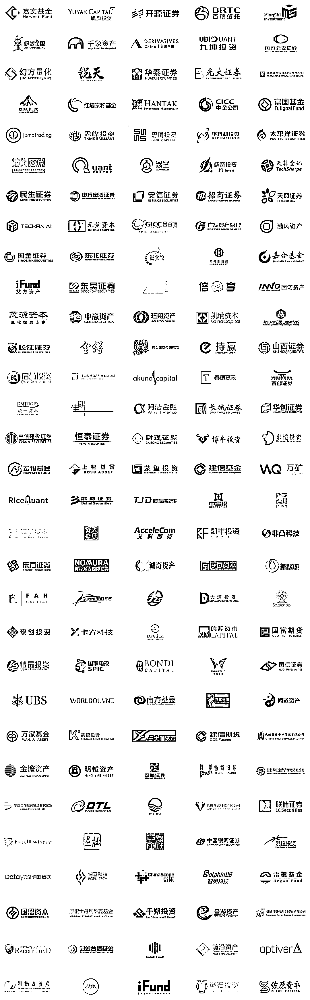

# 百亿私募 | 佳期投资量化多岗位招聘（全职+实习）

> 原文：[`mp.weixin.qq.com/s?__biz=MzAxNTc0Mjg0Mg==&mid=2653317864&idx=1&sn=4711e591a7511e68a7b8761983aa1c52&chksm=802da8fdb75a21eb88f366836cf8b53dd3e8551a31ce3c53d8efc2c4b3635a91260665539ae4&scene=27#wechat_redirect`](http://mp.weixin.qq.com/s?__biz=MzAxNTc0Mjg0Mg==&mid=2653317864&idx=1&sn=4711e591a7511e68a7b8761983aa1c52&chksm=802da8fdb75a21eb88f366836cf8b53dd3e8551a31ce3c53d8efc2c4b3635a91260665539ae4&scene=27#wechat_redirect)

量化投资与机器学习微信公众号，是业内垂直于**量化投资、对冲基金、****Fintech、人工智能、大数据**等领域的主流自媒体。公众号拥有来自**公募、私募、券商、期货、银行、保险、高校**等行业 20W+**关注者，****我们为所有量化金融机构提供岗位招聘与推广服务。**

****

****公司介绍****

**佳期投资成立于 2014 年，总部位于上海，是一家行业领先的量化对冲基金。多年来，佳期凭借先进的技术、突出的研究能力，以及严谨系统化的投资策略创造了优异的业绩。团队由国内外具有资深量化投资经验及多学科背景的专家组成，成员毕业于哈佛、普林斯顿等美国常青藤高校，以及清北复交、中科大等国内顶尖学府。**

**佳期团队对人才的培养与成长高度重视，并坚持致力于创造平等、多元、开放、上进的工作氛围。无论你是数理达人还是编程极客，只要你对攻克难题充满激情、对理解市场运行的规律心存好奇，我们都欢迎你来与我们沟通！**

****公司福利****

**1、薪资架构：业内顶级的底薪与年终奖金；**

**2、上海落户：公司可以配合有落户需求的同事进行落户申请；**

**3、高端商业医疗保险，行业顶配的带薪假期等；**

**4、专属厨师提供每个工作日的爱心午餐，健康美味；**

**5、万圣节 party、攀岩、真人 CS、篮球、密室逃脱、烧烤等团队活动。**

****工作地点****

**上海**

****量化策略研究员（全职/实习）****

**量化策略研究员通过对数据和统计方法的深入探索与研究推动佳期量化策略的方方面面。他们灵活地使用最新的编程和分析工具提取市场微观结构、交易、基本面、事件等多元数据里的规律，并把这些规律通过严谨的线性、非线性和机器学习在内的多种量化建模方法运用到现有或创新的策略中。他们负责策略的研发、构建、测试、优化以及风险管理，策略表现的跟踪、分析和评估。理想的候选人有硬核的理工科背景、严谨细致的工作态度、澎湃的好奇心和创造力、强烈的自我驱动和学习能力。能够既擅长于开放式的研究探索，又可以处理时间敏感的具体项目。**

****技能要求****

**1、毕业于国内外知名高校的相关专业，如数学、统计学、物理学、计算机科学等；**

**2、具备深入并丰富的数据处理、统计建模、机器学习等方面的知识储备；**

**3、熟练使用 Python/R 语言进行数据分析；熟悉机器学习常用工具（如 TensorFlow、PyTorch 等）；**

**4、有 Kaggle 等数据挖掘、数学建模、机器学习类竞赛经验更佳；**

**5、具备科学化思维方式、具有强烈的求知欲和自我学习能力。** 

**---**

****深度学习研究员（全职/实习）****

**深度学习团队是佳期的核心驱动力之一。我们持续在快节奏且充满变化和挑战的金融市场中拓展前沿理论和应用，并至今有了多年的积累与实践。这些技术的积累、进化与创新都成为了公司成长和投资回报的核心来源。深度学习研究员充分利用强大的计算资源对海量多源数据进行挖掘、模型结构搭建、训练和推断，在特征提取、价格预测、组合优化等不同的量化场景进行实践。理想的候选人具有一个或多个第一作者论文，或参与完成重大深度学习应用项目。**

****技能要求****

**1、有国内外知名高校计算机科学或相关专业的博士学位；**

**2、拥有丰富的深度学习学术研究和实践经验；**

**3、具备科学化思维方式、具有强烈的求知欲和自学能力。**

**---**

****算法开发工程师（全职/实习）****

**作为算法开发工程师，你将与业界顶尖的策略研究员及核心开发人员紧密合作，在日常工作中负责策略框架的设计、交易算法的实现、交易策略的编写、维护、调试和优化。算法开发工程师不仅仅立足当下，更面向未来。你需要对交易策略的现状和将来的发展方向有透彻的理解，从而设计高效并有延展性的策略架构，用最高质量的软件开发降低程序的计算延迟提高策略的交易效率。理想的候选人是非常有逻辑性，纪律性和创造力的，可以考虑到各个边界情况和极端情况下的处理，并有硬核的编程能力。**

****技能要求****

**1、毕业于国内外知名高校的计算机科学相关专业；**

**2、有 C/C++开发工作经验并熟练使用 Python 语言，具备扎实的编程能力和算法知识；**

**3、有策略研究、策略实现工作经验更佳；**

**4、有出色的分析能力，认真严谨、追求极致。**

**---**

****高性能计算工程师（全职）****

**高性能计算集群为团队提供了必要的技术优势，使我们的研究人员能够不断透过新的视角、研发出更多创新的投资策略。于我们而言，它们绝非一堆冰冷的机器。我们像对待最好的朋友一样去给他们照料、关怀、稳定的电压以及定制化的冷却解决方案。如果你想加入一个高产出、高效率、并以 TFLOPS 作为成就衡量标准的团队，那么这个岗位就是为你而设计。**

****技能要求****

**1、国内外知名院校的计算机科学、电气工程或相关专业本科及以上学历；**

**2、在高性能集群性能优化、稳定性与可用性提升方面有丰富经验；**

**3、对探索最新技术有浓厚兴趣，擅长对技术的转化和充分应用；**

**4、充分了解不同高性能计算基准测试套件，并有自己的见解和喜好；**

**5、熟悉高性能分布式存储更佳。**

**---**

****芯片验证工程师（全职）****

**作为芯片验证工程师，你将是我们 FPGA 团队不可或缺的一员，你所在的团队奋斗在低延迟交易工作的最前沿，对交易执行进行最终极的优化和提升。这最后的毫厘之优往往对策略的影响至关重要，可谓细微之处见真章。你也将深度参与低延迟交易技术的核心项目，与其他技术团队成员一起为公司高性能交易系统的开发和优化保驾护航。**

****技能要求****

**1、毕业于国内外知名院校的电子类相关专业，微电子和通信专业优先；**

**2、2 年及以上数字芯片或 FPGA 验证经验，熟悉芯片验证流程；**

**3、熟悉 UVM/OVM/VMM 验证方法学；**

**4、了解 Xilinx、Intel FPGA 芯片架构；**

**5、具备良好的沟通、团队合作能力，富有激情；**

**6、掌握 Ethernet、PCIE、DDR 等常用高速 serdes 接口，熟悉网卡工作原理更佳。**

**---**

****核心系统工程师（全职/实习）****

**核心开发人员负责佳期高性能交易系统和相关底层系统的设计、搭建、优化和维护。在以纳秒衡量的竞争环境里，这些架构决定着佳期的技术优势和竞争力，需要技术团队持续探索性能瓶颈、突破技术难点、实现改进方案。理想的候选人不但需要具备卓越的技术，还需要对市场机制有兴趣，对高性能计算有热情。**

****技能要求****

**1、毕业于国内外知名高校的计算机科学、电子工程等相关专业；**

**2、有丰富的 C/C++开发经验，具备扎实的编程能力；**

**3、有 ACM/ICPC 或其他编程类竞赛经验更佳；**

**4、对新科技充满热情、对编程精益求精、有良好的沟通能力。**

****具体投递方式****

**投递邮箱**

*****jq@quantseeking.cn*****

****简历命名****

****岗位-全职/实习-姓名-QIML 公众号****

****企业如有招聘需求**** 

****请发邮件至：*****lhtzjqxx@163.com*****

*******或添加微信：********l******htz******jqxx*****

****部分合作机构****

****