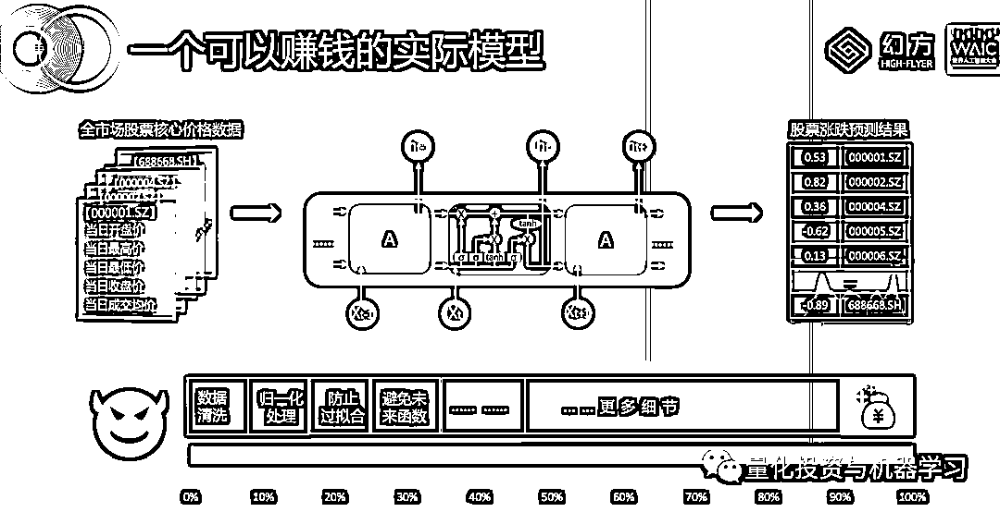
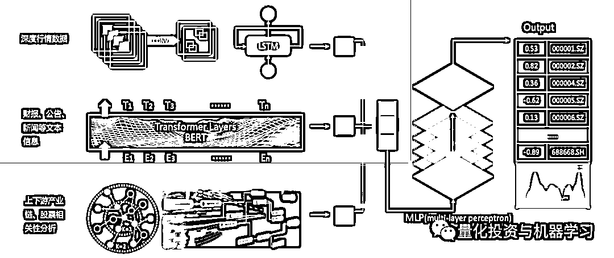
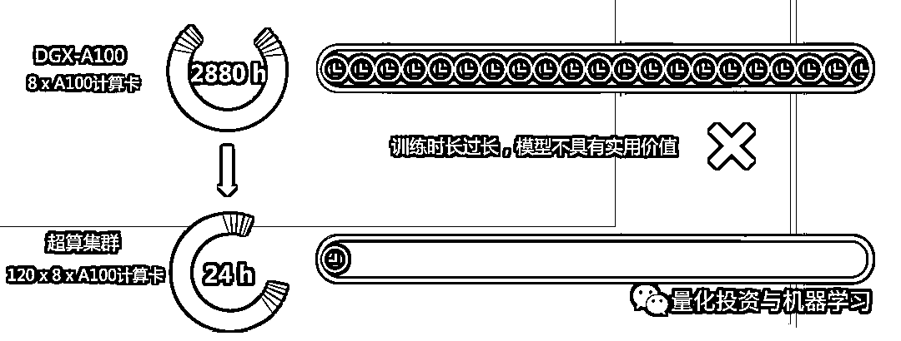
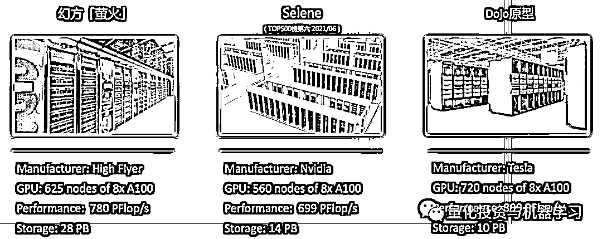
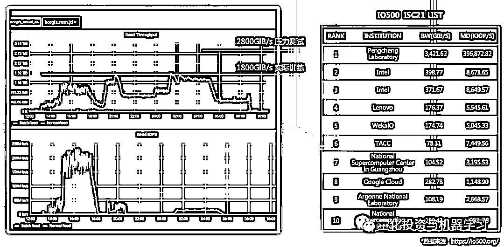
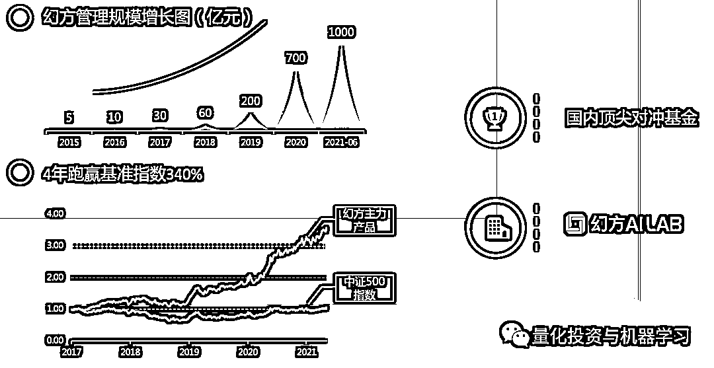

# 幻方徐进：如何用 Deep Learning 为股票定价

> 原文：[`mp.weixin.qq.com/s?__biz=MzAxNTc0Mjg0Mg==&mid=2653317789&idx=1&sn=8d71ad1afed97dd164a6908a80f11bfc&chksm=802da888b75a219ea95cadf0316b7561101214b1ab644668f9c02ec4512d98b137c57bbf7fa8&scene=27#wechat_redirect`](http://mp.weixin.qq.com/s?__biz=MzAxNTc0Mjg0Mg==&mid=2653317789&idx=1&sn=8d71ad1afed97dd164a6908a80f11bfc&chksm=802da888b75a219ea95cadf0316b7561101214b1ab644668f9c02ec4512d98b137c57bbf7fa8&scene=27#wechat_redirect)

量化投资与机器学习公众号编辑部报道

**未进允许，禁止转载**

**演讲概述**

2021 世界人工智能大会于 2021 年 7 月 8 日至 10 日在上海世博中心和上海世博展览馆同时举行。世界人工智能大会自 2018 年以来，已成功举办三届。2021 世界人工智能大会由国家发展和改革委员会、工业和信息化部、科学技术部、国家互联网信息办公室、中国科学院、中国工程院、中国科学技术协会，以及上海市人民政府共同主办。

作为本届世界人工智能大会承办单位之一，数库科技于 7 月 9 日下午举办以 **“数据智能，链接未来”** 主题分论坛，会中幻方量化合伙人徐进探讨了如何使用量化模型和深度学习在股市中赚钱的路径。

*图片来自数库科技

徐进提到，**与传统股票定价不同，量化通过输入获取的信息，包括行情数据、上市公司财务数据，还有另类数据，比如新闻舆情、产业链等，进行模型训练，利用深度学习对股票进行定价。**

在徐进看来，在这个过程中，需要处理很多关键细节，**细节是魔鬼！**以时间序列预测模型为例，包括数据清洗、规划处理、防止过拟合、 避免未来函数等，大量的细节决定了量化能否赚钱，并不是简简单单就能成功的。“只要你对市场、数据充分了解之后，才能得出比较好的赚很多钱的结果。”徐进说道。

徐进提到，量化通过训练模型、提升算力、提高集群使用效率等，来提升其深度学习能力，一定程度上在“薅”市场羊毛。但从另一个角度来看，量化对市场的正面影响很大。一是为市场提供流动性，平抑市场波动，二是提升市场的有效性，让公司定价更为合理。三是和全球顶尖的对冲基金进行竞争，提高本国的金融交易竞争力。

量化投资与机器学习公众号作为本次论坛的支持媒体单位，全程参与论坛的报道工作。下面，是公众号对徐进先生在本次论坛演讲内容的整理：

**如何用 Deep Learning 为股票定价**

这个模型所需的数据都是公开的，需要的算力也不是很大，一两块游戏卡就能搞定。当然它不会支撑特别大的资金量。

*图片来自幻方

首先这个模型的输入是全市场股票的数据价格，**这个模型只用到了价格（当日的开高低收+均价）。**

中间的图片是一个最简单的时间序列的预测模型——LSTM。如果你真的用心拿这个模型去做，最后你也是能赚钱的。但是，赚钱也还是前提的：**细节是魔鬼！**就是说上面这些你都做了，但是你还是要处理很关键的细节，而这些**细节其实才是最终你能赚多少钱的一个核心问题。**

拿数据清洗来说，为什么要对数据进行清洗？上面的数据看上去也不是很复杂，也就是高开低收以及当日成交均价，但是这里面会隐藏很多问题，比如有些股票是刚上市的新股等。再者是涨停、跌停的股票怎么处理。有些股票波动异常，甚至被证监会点名有操纵的嫌疑，这些该怎么处理？对于金融时序数据来说，噪音非常大，信噪比非常低。我们如果预先对一些数据进行处理，这对你的模型训练会有很大的帮助。如果你什么都不管，把数据直接丢给 LSTM 模型，基本上得不到好的结果，因为 LSTM 也不是神！

类似于这样的细节后面还有很多，只要你对市场、数据充分了解之后，才能得出较好的、赚更多钱的结果。

**我们实际工作的模型**

这是一个可以赚钱的实际的模型，我们也在用，但是这个模型并不能解决所有的问题，接下来介绍一下我们实际工作的模型。

*图片来自幻方

第一行是行情数据，但是我们做了很多的处理。接下来有来自财报的数据、公告、新闻文本的信息，再有就是上下游产业链，股票相关性的分析。把这些都输入到多层感知器模型（MLP）我们才会得到一个支持大规模资金管理、交易的复杂模型。因为时间序列模型非常耗资源，数据量非常大，所有耗时会非常久！

我们用去年 7 月份发布的 DGX-A100 服务器跑完这个模型大约需要 120 天的时间，基本毫无意义~

*图片来自幻方

那怎么解决这个问题呢？

**堆机器、堆算力**

当然，不是简单的堆，简单的买！那么，幻方是如何怎么做的呢？

**幻方萤火超算**

[`mp.weixin.qq.com/mp/readtemplate?t=pages/video_player_tmpl&action=mpvideo&auto=0&vid=wxv_1954686830499463169`](https://mp.weixin.qq.com/mp/readtemplate?t=pages/video_player_tmpl&action=mpvideo&auto=0&vid=wxv_1954686830499463169)

*视频来自幻方 萤火搭建过程

一个超算和普通的数据机房是不太一样的，因为它的单位面积算力能耗特别大，要处理的复杂问题比较多，并不是去租几个 IDC 机房把机器放进去就能解决的。

目前萤火超算的硬件设施为：

*   **625 计算节点，5000 张 A100**
*   **200000GB 显存  414208GB 内存**
*   **780 PFlop/s 机器学习算力**
*   **28PB SSD 存储服务器**
*   **深度优化的 BeeGFS 文件系统**
*   **2.0TIB/s 读取性能**

**采用了现在全世界能买到的最贵的、速度最快的 800 口的交换机（水冷交换机），每节点 IB 互联，200 Gbps 传输带宽。**

**算力对比**

*图片来自幻方，所有性能统计均基于 TensorFloat-32 格式理论算力值，Nvidia、Tesla 超算性能数据均来自公开材料

图片的右边是特斯拉的 Dojo 原型机，左边是萤火，中间是 Nvidia 的 Selene 超算，在今年最新一次的排名为全球第 6。

因为目前萤火已经投入了使用，所以**萤火在整个事件上比特斯拉超至少超前了半年的时间**。因为 A100 的计算卡是去年 7 月份才发布，**幻方是亚太地区第一批拿到此卡的人**，因为当时 A100 还是挺难买的。

**读取速率和 IO500 的对比**

今年上半年继续建造萤火的时候也遇到很多的问题，挖矿的人太多了， 买不到足够的 CPU 和硬盘等等。

分布式存储十分难做，关键是其读取的速率。下图（右边）是现在全球 IO500 的存储读取速度榜单，第一名是中国鹏城实验室，读取速率最快。左图是幻方的结果，可以看到图上有个尖峰，是因为幻方每天早上 6 点钟会做压力测试，其读取速率达到了 2800GIB/s，实际训练时已达到 1800GIB/s。幻方现在的速率仅次于鹏城实验室，下半年幻方宣布会去参与这个榜单的评比。

*图片来自幻方

此外，包括集群如何调度，如何提高集群的使用效率，幻方做了很多事情。例如更新了很多针对计算卡做的库，未来有可能都会对外发布。

**成果**

基于此，**幻方的 AUM 从 2015 年 5 亿增长到现如今的近 1000 亿。**同时，幻方还成立了自己的 AI  Lab，不仅仅用于自己做交易，还希望利用所有的算力集群和资源，未来能够做一些基础的科学研究，与高校、实验室进行合作等等。

*图片来自幻方

**对于金融市场，量化投资的意义**

*   **为市场提供了流动性，平抑了市场的波动**

*   **提升市场的有效性，让公司定价更为合理**

*   **与全球顶级对冲基金竞争**

量化投资与机器学习微信公众号，是业内垂直于**量化投资、对冲基金、Fintech、人工智能、大数据**等领域的主流自媒体。公众号拥有来自**公募、私募、券商、期货、银行、保险、高校**等行业**20W+**关注者，连续 2 年被腾讯云+社区评选为“年度最佳作者”。