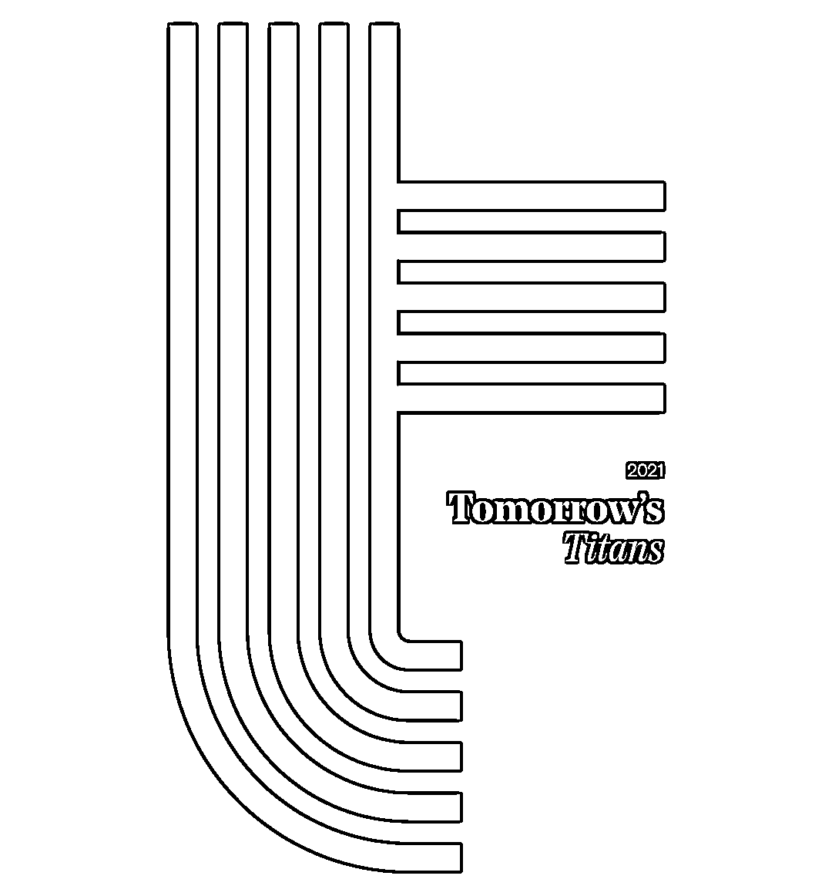

# What？100%基于深度强化学习的对冲基金

> 原文：[`mp.weixin.qq.com/s?__biz=MzAxNTc0Mjg0Mg==&mid=2653317745&idx=1&sn=b3a0f7f5625cd7fc5dcb74fb8fa8619e&chksm=802da864b75a21727bb019f47dbb370e8660fff11d081569308d4b398be3a522732b7846fe49&scene=27#wechat_redirect`](http://mp.weixin.qq.com/s?__biz=MzAxNTc0Mjg0Mg==&mid=2653317745&idx=1&sn=b3a0f7f5625cd7fc5dcb74fb8fa8619e&chksm=802da864b75a21727bb019f47dbb370e8660fff11d081569308d4b398be3a522732b7846fe49&scene=27#wechat_redirect)

《The Hedge Fund Journal》于近日公布了 2021 年版（第六版）明日对冲基金巨人 50 榜单，该榜单强调了投资经理策略的独特性，及具有良好的业绩和增长资产的潜力。提名来自《The Hedge Fund Journal》的读者网络，包括养老基金、家族理财室、捐赠基金和基金会、FOF、私人银行和财富管理公司等。

这份榜单显示，在量化投资领域，统计学习和机器学习是人们越来越感兴趣的领域。**至少有六家公司——ActusRayPartners、Blueshift、Leibniz、Rosetta、Manteio 和 Bayforest——在某种程度上使用机器学习，但都以不同的方式应用，其中只有一家声称使用了 100%深度强化学习。**这家公司就是 2016 年创立的 Rosetta Analytics，**核心创始人还是一位女性：朱莉娅·博纳菲德（Julia Bonafede）。**

Julia Bonafede

朱莉娅·博纳菲德（Julia Bonafede）与安吉洛·卡维洛（Angelo Calvello）共同创立了由女性领导的公司 Rosetta，以颠覆传统的主动资产管理。自 2015 年以来，Rosetta 推出了四种基于将先进人工智能和深度强化学习（DRL）应用于流动性市场的实盘投资策略。朱莉娅·博纳菲德说：“对于对冲基金来说，DRL 是如此早期的技术，投资者才刚刚开始看到它的好处。但在机器人和医疗保健等其他行业，它已经得到了广泛应用。

在 Wilshire Consulting 担任投资顾问和外包 CIO 的 24 年间，Bonafede 认为这是量化投资加速发展的颠覆，在她领导期间，该公司提供了超过 1 万亿美元资产管理的相关咨询。“我从两个角度看待量化分析的发展：我评估了许多资产管理公司，并使用多因子风险模型来监控经理的风格。最早的量化投资方法是指数投资，随后是风格投资，类似于 Fama-French 因子，如规模、价值和增长，后来演变为货币、国家、行业和基本面等 100 多个因子的迭代。然后出现了 Smart Beta，采用了更基于规则的方法，以及更积极的系统性押注。**现在，人工智能让模型直接从数据中得出关系，而不是从学术研究中确定的筛选行为中得出关系。”**

罗塞塔认为，它的技术比传统的定量分析技术具有更准确的预测能力，但也承认这更难解释。“许多投资者的舒适区是一个有 50 年历史的线性回归方程。Rosetta 这个名字是解释这种方法的一个开始，因为 Rosetta stone 可以把图片或图像翻译成语言，而神经网络可以把各种数据转换成可操作的信号。”Bonafede 说。

然而，Calvello 表示，DRL 可能会引起困惑，因为很多资产管理公司都在谈论机器学习，尽管他们可能没有将其全面应用于投资策略。Calvello 曾是 Blue Diamond asset Management AG 和 Impact investment Partners AG 的联合创始人。“创建 DRL 模型需要某种类型的人才，而大多数在资产管理公司工作的人都不会聘用那些有合适背景的人。这很难做到，而且许多资产管理公司不会承担这个风险。既然他们已经有了很好的收益，为什么还要投入时间和金钱呢?”Bonafede 也听到了第一手的怀疑：“许多基金经理告诉我们，他们没有使用深度学习和 DRL，这甚至包括一些在学术上发表过相关文章的基金经理。”

基金经理可能正在将机器学习用于一项或多项操作流程、交易执行、投资组合构建和信号生成，但这可能只是过程的一部分，他们可能正在通过规范性地定义使用人工智能的框架来淡化这一过程。

**让数据说话**

在构建让数据说话的自动算法方面，Rosetta 是 100%的人工智能，但这种方法并非完全“无监督”。“我们在端到端学习模型中输入精心组装的数据集，并使用强大的深度强化学习来创建投资信号，并在资产之间进行分配。这些信号是稳健的，并在不断变化的市场周期中持续存在。通过使用深度强化学习，我们的模型成功地分配风险，以实现最优的市场暴露，以最大的回报。亏损的风险是一阶考虑因素，而不是二阶约束因素。例如，Rosetta 经过判断来根据不同的模型选择不同的数据，如各种技术/价格/成交量数据;基本面经济数据（如债券收益率或股票和行业数据）以及另类数据。“我们定义输入模型的数据，并将输出定义为风险资本的最优配置。我们没有定义数据和信号之间的关系，”Bonafede 说。这些关系可能没有任何直观的经济意义，也不符合其他已建立的框架，如行为金融学，或映射到一个由人类决定的因子动物园。“如果你需要建立先验关系，模型将只会找到那些。神经网络可以根据数百万个参数确定最优系统，识别哪些关系重要，并进行适应和学习，它可以发现全新的关系。它的设计目的是捕捉非线性关系，使误差最小化，并扩大到更稳健地捕捉回报，”Bonafede 说。

**适应性模型更适合波动的市场**

“它还能更快地适应不断变化的环境”卡韦洛说。例如，Rosetta 的模型在 2020 年 3 月和 4 月表现非常好。2 月 23 日股市见顶后，该模型又花了两周时间来了解市场，然后才做出更积极的交易决定。我们在 2020 年 3 月上涨了 22%，在 2020 年 4 月上涨了 12%，几乎每天都有活跃的交易。”Bonafede 说。

Covid 危机表明，罗塞塔的模型在波动率指数较高的时候表现良好。“这种行为不是故意的，而是系统性风险管理特性的一部分。它们的大小随着对信号的确信度的增强或减弱而变化。DRL 模型最大化奖励来做出决策，而错误决定的惩罚比奖励更重要。”这借鉴了自动驾驶技术，罗塞塔的一些科学家之前一直在研究自动驾驶技术，在自动驾驶技术中，错误会受到巨大的惩罚。

**相比之下，其他一些被称为“机器学习”的策略在 2020 年 3 月的表现是有史以来最差的，这说明了相似的标签的技术可能是非常不同的方法：“我们的感觉是，其他一些基金经理正在使用一种弱有效版本的机器学习，或者正在使用它来增强其他更传统的量化投资技术。**部分问题在于，除了被动投资之外传统的量化技术也可以归入机器学习的范畴。

**不相关性和差异化**

即使与其他少数的声称使用机器学习的对冲基金相比，罗塞塔正在做的策略也与他们有很大的不同。Rosetta 的回报率通常与其他对冲基金策略或传统资产类别没有很强的相关性。相关性随时间而波动，并随市场状态而变化。例如， Rosetta’s RL One S&P 500 多空策略的平均相关性接近于零，但相关性整体跨度在+100%到-89%之间。与一些量化策略相比，罗塞塔策略的期限更长。虽然人工智能有时与高频交易和瞬间交易执行有关，但罗塞塔的策略具有较低的换手。

**模型研发与演化**

罗塞塔花了四年多的时间开发其最新的模型。2017 年，Rosetta 的第一代实盘策略是两个基于第一代深度学习模型的方向性策略。Rosetta 将深度学习定义为使用深度神经网络的机器学习算法。种子投资者是一家美国捐赠基金，它们希望以二元交易方式进行交易，其中 1 号模型不是 100%做多就是 100%做空标普 500；2 号模型可以 100%做多标普 500 或以持有现金。

2020 年 5 月，Rosetta 推出了下一代实盘策略，增加了强化学习，创建了完全不同的模型，也允许可变的仓位规模**。“深度学习擅长于发现关系或聚类，但不擅长分配或优化。与自动驾驶进行类比，你可以使用深度学习来识别你面前的物体，但需要强化学习来减速、加速或右转。”**Bonafede 指出。Rosetta 将 DRL 定义为一种算法，即通过尝试和错误去最大化奖励，并将情境映射到行动中。这些系统还可以处理更大容量、更复杂的数据，包括非传统数据。

Rosetta 的 RL One 策略将 DRL 应用于标准普尔 500 指数的交易中，在 2020 年 5 月至 2021 年 4 月期间实现了 18.27%的收益，标准差为 12%。他们的 DRL 策略交易 ICE 的 EUA 期货合约和相关工具在同一时期的收益为 28.26%，波动率为 19%。

**回测和训练**

Bonafede 说：“到目前为止，实盘表现已经超过了回测，但我们意识到阿尔法衰减的可能性。”术语“回测”本质上是在描述一个静态模型，而不是适应性模型。Rosetta 使用了几十年的所“训练数据”，将样本外模型应用于看不见的数据，以及各种用于普适化模型的技术，并确定样本外学习的水平。“在数据历史较短的地方，对于新市场，可以使**用迁移学习等技术来弥补数据的短缺**。我们确实有足够的欧盟碳限额数据，它们受到监管的严重影响，与我们的标准普尔 500 模型相比，它们的流动性和数据非常不同，”Bonafede 说。

**机构级的基础设施**

除了打磨和完善其模型，Rosetta 还投资建立了一个可扩展的、制度性的、高质量的运营和交易基础设施和团队。这包括总计 43000 人小时或 48 年计算时间的计算机能力。我们的优势来自算法而不是数据量。Calvello 说。“我们只有 6 个人，但拥有 100 人团队规模的基础设施。我们从一张白纸开始：我们需要雇佣特殊人才（并与谷歌、FB、NASA、NYU 等实体竞争这些人才）；从头开始构建专有 IP；建立工业质量的基础设施，支持快速实验和高效循环;建立一个机构质量的运营结构（因为我们是受托人）；建立交易业务；注册成为 CTA；审查和雇佣供应商(基金管理，fcm 等)，”Bonafede 说。

该团队包括四名经验丰富、才华横溢的机器学习科学家和工程师，他们都曾在投资和金融行业之外工作，解决了不同规模的机器学习问题。从一开始，罗塞塔就拥有一个经验丰富的顾问委员会，由 6 名配置者、资产管理公司和学者组成，他们偶尔会被用作征求意见的顾问。其中包括瑞典公共养老基金 AP3 前首席信息官埃里克·瓦尔托宁（Erik Valtonen）。

**公司成长策略**

Calvello 说：“我们是一家与众不同的初创公司，我们从头开始，从资产所有者那里筹集资金，而不是从风险投资家那里。”该公司从 Verger 资本管理公司（由前维克森林大学捐赠管理团队组成的 OCIO）获得了初始运营资金。Bonafede 表示：“我们正在与其他潜在的战略合作伙伴进行谈判。”

截至 2021 年 5 月，Rosetta 管理着 1900 万美元的资金，“我们已经制定了更为灵活的战略，可以在最深入的市场进行扩展。我认为我们专注于我们所拥有的。”其策略的实盘表现也多次出现在 BARCLAYHEDGE 的榜单中。

罗塞塔咨询委员会成员 Elisabetta Basilico 博士认为发展一种颠覆性的、高度创新的策略所面临的挑战：**“在可解释性和准确性之间存在一个平衡。投资者和顾问面临的最大问题是，是否应该投资于基于人工智能的策略，因为它们可能是最准确但最难以解释的。”**

**所以，赚钱重要还是解释性重要？各位小伙伴怎么看？**

量化投资与机器学习微信公众号，是业内垂直于**量化投资、对冲基金、Fintech、人工智能、大数据**等领域的主流自媒体。公众号拥有来自**公募、私募、券商、期货、银行、保险、高校**等行业**20W+**关注者，连续 2 年被腾讯云+社区评选为“年度最佳作者”。