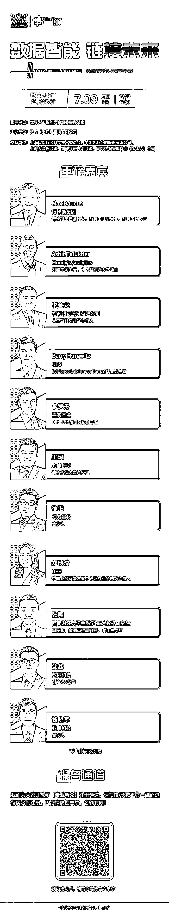

# 终极预告！九坤、幻方、UBS、嘉实基金等大佬云集

> 原文：[`mp.weixin.qq.com/s?__biz=MzAxNTc0Mjg0Mg==&mid=2653317725&idx=1&sn=9b8e735bc7ee800f3e506b535bb1ce6b&chksm=802da848b75a215ef6926eebb1a9972daadefc4029c6d4d7b650cc24691d0f7164d1cbe1d9d8&scene=27#wechat_redirect`](http://mp.weixin.qq.com/s?__biz=MzAxNTc0Mjg0Mg==&mid=2653317725&idx=1&sn=9b8e735bc7ee800f3e506b535bb1ce6b&chksm=802da848b75a215ef6926eebb1a9972daadefc4029c6d4d7b650cc24691d0f7164d1cbe1d9d8&scene=27#wechat_redirect)

量化投资与机器学习公众号作为本届世界人工智能大会“数据智能，链接未来” 主题分论坛核心支持媒体之一，将携手数库科技将于【**7****月 9 日 13:30-17:30】，**在**【上海世博展览馆 2 号会议室】**隆重举行，届时线上线下同步呈现。

论坛由世界人工智能大会组委会办公室指导，数库（上海）科技有限公司主办，上海市闵行区科学技术委员会、中国国际金融股份有限公司、上海大数据联盟、智能投研技术联盟、国际数据管理协会（DAMA）中国支持。

**听说很多大佬都是第一次公开介绍相关内容，太期待了！！！**

**鸣谢媒体支持**

《上海证券报》《证券时报》、《经济观察报》《国际金融报》、《 21 世纪经济报道》、《每日经济新闻》《新闻晨报》、新浪、网易、凤凰、财联社、界面、金融界、和讯、亿欧 EqualOcean、中金在线、钛媒体、极客公园、i 黑马、智能投研技术联盟、上海大数据联盟、DAMA 数据管理、量化投资与机器学习、积募、交易门、新全球资产配置、王的机器、华工量化投资、Chihiro Quantitative Research

量化投资与机器学习微信公众号，是业内垂直于**量化投资、对冲基金、Fintech、人工智能、大数据**等领域的主流自媒体。公众号拥有来自**公募、私募、券商、期货、银行、保险、高校**等行业**20W+**关注者，连续 2 年被腾讯云+社区评选为“年度最佳作者”。