# 价值因子的改进：结合动量的思想

> 原文：[`mp.weixin.qq.com/s?__biz=MzAxNTc0Mjg0Mg==&mid=2653317718&idx=1&sn=f2529edafe0f348952d589fe1f487727&chksm=802da843b75a21550c0c0a101e1483bf131bf3d5c62ac1c5a6d7f978b171c1ea064e073d8f7b&scene=27#wechat_redirect`](http://mp.weixin.qq.com/s?__biz=MzAxNTc0Mjg0Mg==&mid=2653317718&idx=1&sn=f2529edafe0f348952d589fe1f487727&chksm=802da843b75a21550c0c0a101e1483bf131bf3d5c62ac1c5a6d7f978b171c1ea064e073d8f7b&scene=27#wechat_redirect)

量化投资与机器学习公众号独家解读

量化投资与机器学公众号 *** ***QIML Insight——深度研读系列 ******是公众号今年全力打造的一档**深度、前沿、高水准**栏目。

公众号**遴选**了各大期刊最新论文，按照理解和提炼的方式为读者呈现每篇论文最精华的部分。QIML 希望大家能够读到可以成长的量化文章，愿与你共同进步！

[第一期 ](http://mp.weixin.qq.com/s?__biz=MzAxNTc0Mjg0Mg==&mid=2653315304&idx=1&sn=8f36bc03096995655abea040e2ee3f94&chksm=802da2fdb75a2beb5d210c8235ab64fba0ba510b16683599189419f2ce0af483ea9c020707f6&scene=21#wechat_redirect) | [第二期](http://mp.weixin.qq.com/s?__biz=MzAxNTc0Mjg0Mg==&mid=2653315407&idx=1&sn=e9f5e375aedcb0b8f82d6c42b7ea3e80&chksm=802da35ab75a2a4c1aa8aa458bb5878ccbe0499b3c4e01bfff51508610c4e45f07d5b16fd6ab&scene=21#wechat_redirect) | [第三期](http://mp.weixin.qq.com/s?__biz=MzAxNTc0Mjg0Mg==&mid=2653315880&idx=1&sn=0d7bd33e5f1697973c1f365b729369b5&chksm=802da13db75a282b762267494b493c81b5595f35ca41da6a34625a13c02c6e1765d641ed7f0c&scene=21#wechat_redirect) | [第四期](http://mp.weixin.qq.com/s?__biz=MzAxNTc0Mjg0Mg==&mid=2653316512&idx=1&sn=d88a7b3d5c46f307370fe7e8939b4bbd&chksm=802da7b5b75a2ea3f74d3f7f1dff4c57c811a51f60f77104f0a8de86301f98f3b28814daa834&scene=21#wechat_redirect) | [第五期](http://mp.weixin.qq.com/s?__biz=MzAxNTc0Mjg0Mg==&mid=2653316725&idx=1&sn=4ef212b4f7ffca70da72a9b72917676e&chksm=802da460b75a2d762a41f36c89140ce6f364cf2ab1994ffccec7306b8186641f4598372495ed&scene=21#wechat_redirect) | [第六期](http://mp.weixin.qq.com/s?__biz=MzAxNTc0Mjg0Mg==&mid=2653316934&idx=1&sn=0bae7eba4fc5a8b462ee21ded87e3718&chksm=802da553b75a2c45232d3928fee7677c7fce7e2ccea7c77377e3748db3c7b884450f41ce323a&scene=21#wechat_redirect) 

[第七期](http://mp.weixin.qq.com/s?__biz=MzAxNTc0Mjg0Mg==&mid=2653317372&idx=1&sn=ca755712e4a0b8d84b9beca7e513a8ce&chksm=802daae9b75a23ffe0d91ef55c22827772e7d28b727b91b13519aa095deede6b2736d808529a&scene=21#wechat_redirect) | [第八期](http://mp.weixin.qq.com/s?__biz=MzAxNTc0Mjg0Mg==&mid=2653317559&idx=1&sn=2c967a2b372c293e71b4dcbb2dab8442&chksm=802daba2b75a22b4bc256e7b904af21e2f6ee86dbfb1b9dc70a3e56d84eb1cc754511af3ee38&scene=21#wechat_redirect)

> **本期遴选论文** **来源：**The Journal of Portfolio Management，**2022 年 QES 特刊** **标题：**Finding Value Using Momentum
> **作者：**Bijon Pani, Frank J. Fabozzi

**核心观点：**

*   多价值指标组合的价值因子能够显著提高价值策略的表现，克服了单一因子带来的模型不稳定的缺点。

*   基于指标变动比率（指标的动量）也比使用指标当期值更能筛选出有价值的股票。

*   价值因子结合动量因子后模型的表现也有进一步的提升。

**价值因子**

价值投资一直是投资策略的重要基石之一。现代投资之父，Benjamin Graham，也是价值投资的重要倡导者。在量化投资领域，Fama-French 三因子模型中的 HML 因子，也是学术界及业界用来度量价值股票表现的公认基准。他们的研究表明，价值股票表明要持续优于成长股这种我们称为“价值异象”的现象持续了很长时间。在他们的研究中，用 book-to-market（B/M）比率作为衡量公司价值的指标，B/M 高的公司被认为是有价值的公司。

但价值因子也遭遇了所谓的“失去的十年”，2008-2018 年 HML 因子的累积收益率为-20%。是价值因子确实失效了？还是仅仅用 B/M 指标表示价值存在什么缺陷？是不是有更好的方法或者指标来度量价值？

B/M 指标一直是度量价值股票的主流指标，但学术上也有学者尝试过其他指标,Basu(1977, 1983)用 P/E 来度量价值，表示低**P/E**的股票的表现要优于高 P/E。Haugen，Baker(1996)研究表明高**Profit Margin**的股票表现更优。其他用来度量价值的指标还包括**Cash flow to price、Sales-to-price 和 EBITDA to market value。**

在本篇论文提出的改进的价值因子的方法中，为了避免数据挖掘带来的不可解释性，作者基于以上 6 个有经济学含义及逻辑、且有学术文献支撑的指标，通过采用指标的动量（即指标的变动，而不是指标的当期值）及结合收益动量的思想来改进价值因子的表现，具体内容我们继续看下文。

**价值因子的改进：多指标动量的结合**

本论文中价值因子与其他价值因子最大的不同是作者选取了以下 6 个指标结合来度量价值，而不是依赖于单一的指标：

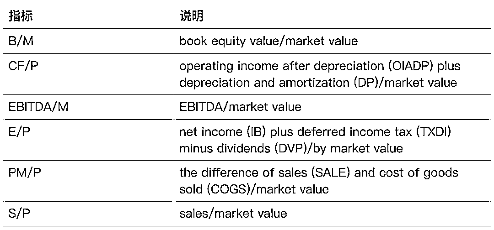

在本篇论文中，以上指标均采用的时候上一年报的数据。且作者并没有直接采用指标本身的值，而是**根据下面的公式，计算了各指标的变动率：**<embed style="vertical-align: -2.202ex;width: 22.127ex;height: auto;max-width: 300% !important;" src="https://mmbiz.qlogo.cn/mmbiz_svg/a18XcQ1EBBggIibBXCZoqdlYlnqphbj8YeECID5PHFtktHGqMkjXAuO4C8KUuNsN8zG1xmIVY3oWUSPibOrO2G9dCVE2e8RVUV/0?wx_fmt=svg" data-type="svg+xml">**以 B/M 为例，每个月，先用上一年报的 book value 除以当月的市值，得到当月的 B/M。**再以当月的 B/M 除以两年前的 B/M 得到 B/M 的变动率。作者称这个变动率为 B/M 指标的趋势（Trend）或者 B/M 的动量。作者阐述到，之所以采用指标的变动率，是因为要筛选出变得更便宜（或者说更有价值）的股票，着重在个股价值相对于过去的变化。

针对这六个因子，作者在下文做了详细的测试，当然，作者测试的是所有美国上市的股票，时间跨度从 1965 年 1 月到 2019 年 12 月。

注：在后文中，B/M Trend 表示按以上公式计算的 B/M 的变化率，其他指标也类似。

**实证分析**

**单因子测试**

首先来看一下每个指标单独的表现，下表 1 和 2 给出了按每个因子，前 20%最有价值（最便宜）的股票等权重组合的收益表现。

我们来梳理一下因子排序的逻辑，以 B/M Trend 为例，B/M 越高就代表股票越有价值，那么同样的 B/M Trend 越高，就说明当前 B/M 与 t-2 期的 B/M 相比，上升的越高，也就是说股票变得更便宜的程度越大。

其中表 1 是月度收益率的统计，表 2 是月度收益率相对 Fama-French 因子及 MOM 动量因子的回归测试。主要有以下几点发现：

*   E/P 因子的表现在 6 个因子中是最差的，在研究过程中，作者也发现，E/P Trend 可能并不是最好的价值因子，很长一段时间高 P/E 的股票表现优于低 P/E 的股票。但是在同其他价值因子一起使用时，当其他因子无效时，它却能够有替代作用。

*   从表 2 可以看出，B/M Trend 因子风险调整后的收益要优于 HML 因子。B/M Trend 因子相对 HML 的回归系数只有 0.16。虽然 B/M Trend 因子和 HML 因子都基于 book-to-market，但前者是变动率，后者是当期值。回归系数 0.16，说明 B/M Trend 因子与 HML 的相关性不高，但其他因子与 HML 的相关性更低，这也符合逻辑，因子其他因子都不基于 book-to-market。

*   这 6 个因子对于 Size 因子（SMB）都有很大的 beta，这会造成等权组合更倾向于小规模股票。

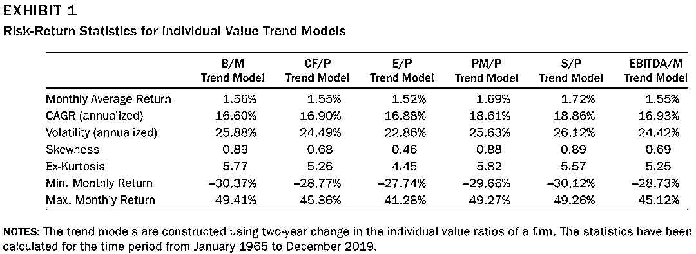

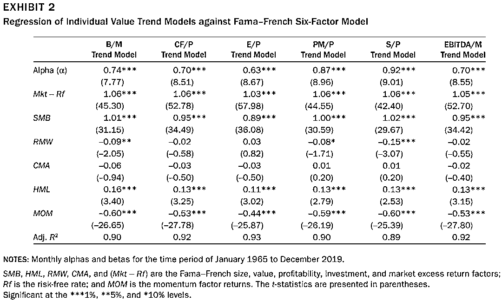

**因子组合测试**

这一部分，作者对因子的组合进行了测试，作者基于两种不同的方式进行组合测试：

方法 1：**Equal-weighted allocation method**，先根据每个单因子选出 20%的股票构成一个组合，在等权配置到这 6 个组合。

方法 2：**Aggregate firm-score allocation method**，截面上计算每个因子的 z-score，再计算每个股票在 6 个因子的总得分后排序选择前 20%的股票。

下表 3 给出了两个方法的月度收益统计，可以看出没有明显的差异。下图 4 及 6 分别展示了方法 1 和方法 2 下 Top 组和 Bottom 组的累计收益曲线。表 5 和表 7 则是对两个方法的月度收益，进行基于 Fama-French 和 q-factor 回归测试的结果。可以发现，两种因子组合的模型与 MOM 动量因子的回归系数显著为负，且其中 long-only 的测试对于 size 有很大的暴露。

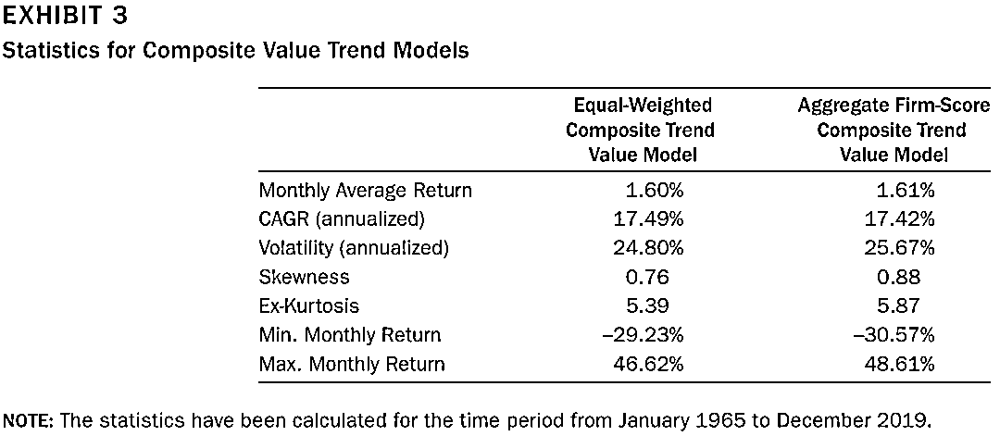

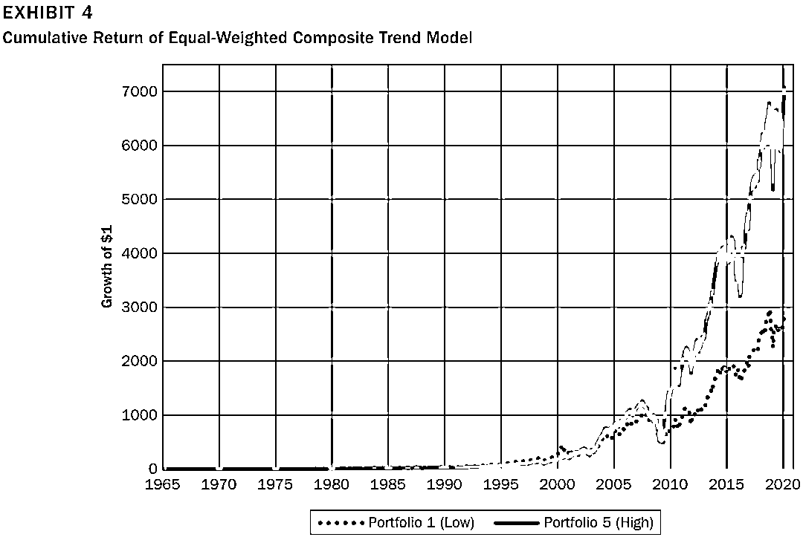

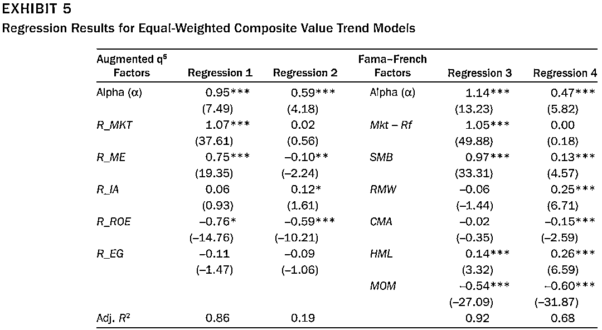

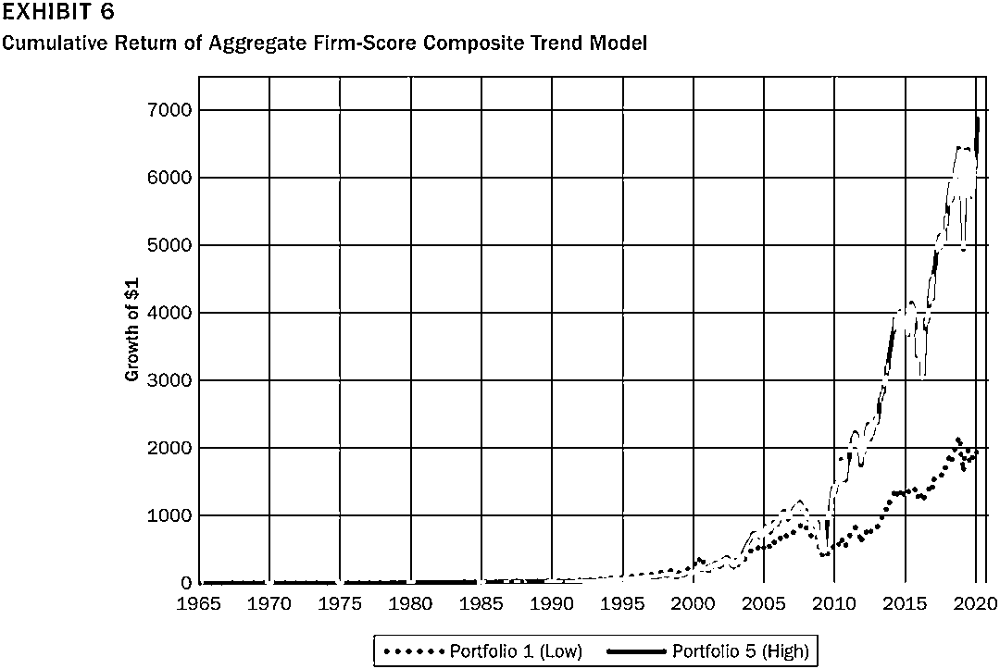

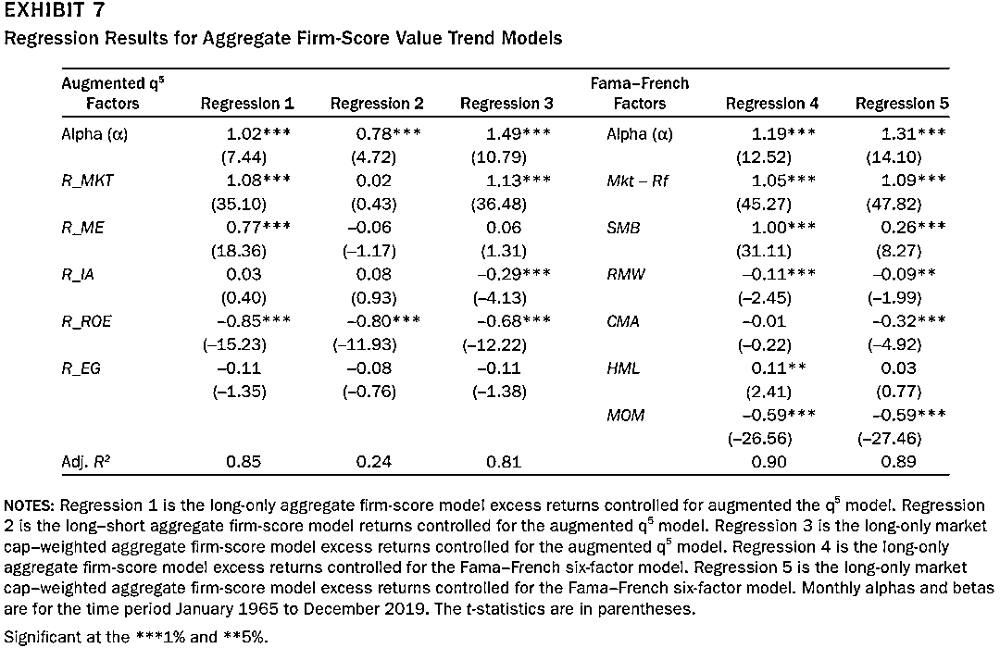

**结合动量因子**

过去有很多研究表明，当价值因子与动量因子结合后，会提高组合的收益，一个主要的原因是价值因子与动量因子的负相关性（在前面的研究中，也证实了这一现象）。大部分研究是在股票层面将两类因子进行结合。Moskowitz, Ooi, and Pedersen (2012)中提到，时序动量和截面动量的不同，且时序动量的收益要大于截面动量。所以，在本篇论文中，结合时序动量，作者提出了三种结合动量的方式：

*   个股层面的动量与价值因子等权组合：E**qual-Weighted Momentum and Composite Trend Value Score Model**，动量因子为过去 12 个月的收益率，进行 z-score 标准化后与价值因子组合（由上文 6 个因子等权组合，称为 Composite Trend Value Model）等权重相加。

*   **基于 Composite Trend Value Model 时序动量的择时模型：Relative Momentum on Composite Trend Value Models**，首先计算**Composite Trend Value Model**过去 1、3 及 6 个月的收益，并计算这三个时间段收益的均值。如果这个均值大于无风险收益，那么下个月正常建仓；如果这个均值小于无风险收益，那么下个月空仓。

*   因子动量模型：**Factor Momentum Model**，基于上文的 6 个单因子的模型，下月等权配置这个月收益为正的单因子模型。

下图 9 给出了三个模型的累计收益，表 10 给出了收益统计，图 11 是各模型相对 Fama-French 等因子模型回归测试的结果。

*   **Equal-Weighted Momentum and Composite Trend Value Score Model**的月度收益为 1.53%，年化收益为 17.37%。收益同不加动量因子的模型差不多，但波动及峰度更小。回归测试显示，有 0.23%的月度 alpha，对于因子 market，size 及 price momentum 有显著暴露。

*   **Relative Momentum on Composite Trend Value Models 与不择时的 Composite Trend Value Models 相比，收益有了明显的提升。**月度有 1.08%的 alpha，且对于 market 和 size 的暴露更小，对于 Momentum 的暴露为负。

*   **Factor Momentum Model 是所有三个模型中，收益最高，波动最低的。**且对于 Market 和 size 的暴露更低。

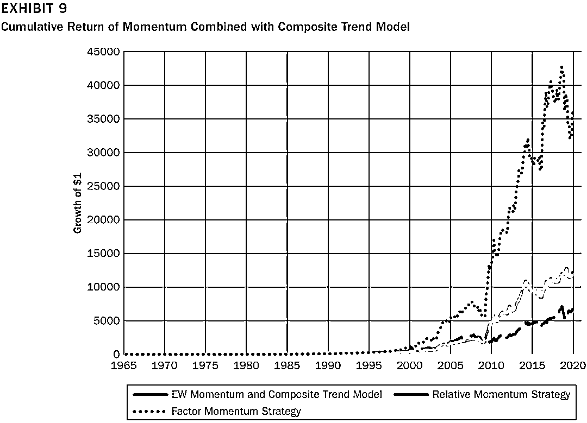

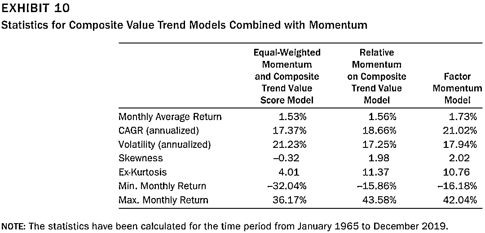

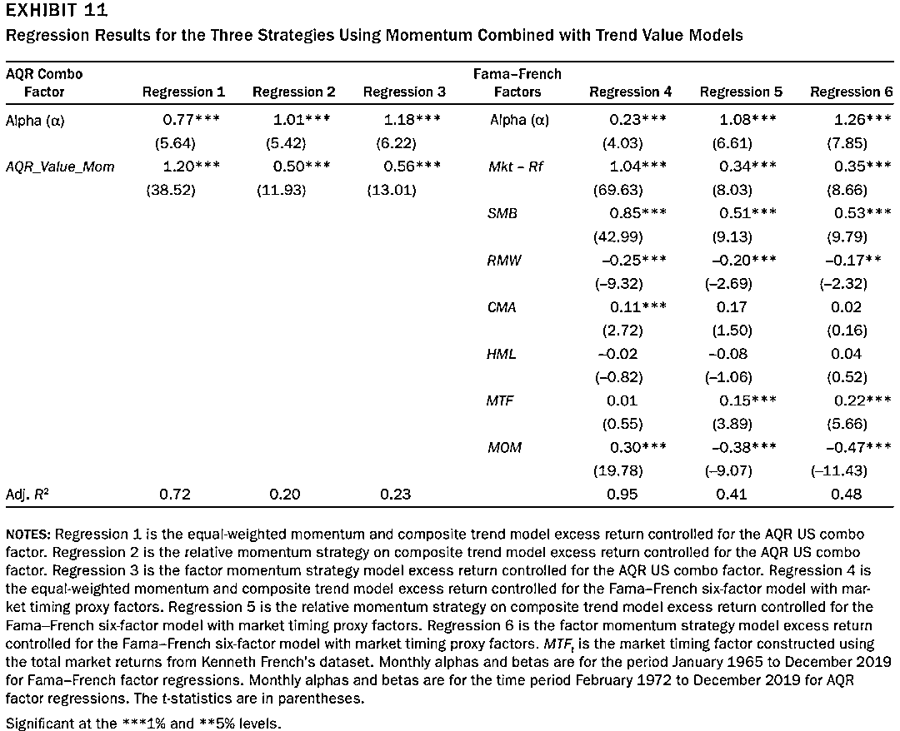

**总结**

多价值指标组合的价值因子能够显著提高价值策略的表现，克服了单一因子带来的模型不稳定的缺点。基于指标变动比率也比使用指标当期值更能筛选出有价值的股票，且价值因子结合动量后的表现也有进一步的提升。

量化投资与机器学习微信公众号，是业内垂直于**量化投资、对冲基金、Fintech、人工智能、大数据**等领域的主流自媒体。公众号拥有来自**公募、私募、券商、期货、银行、保险、高校**等行业**20W+**关注者，连续 2 年被腾讯云+社区评选为“年度最佳作者”。