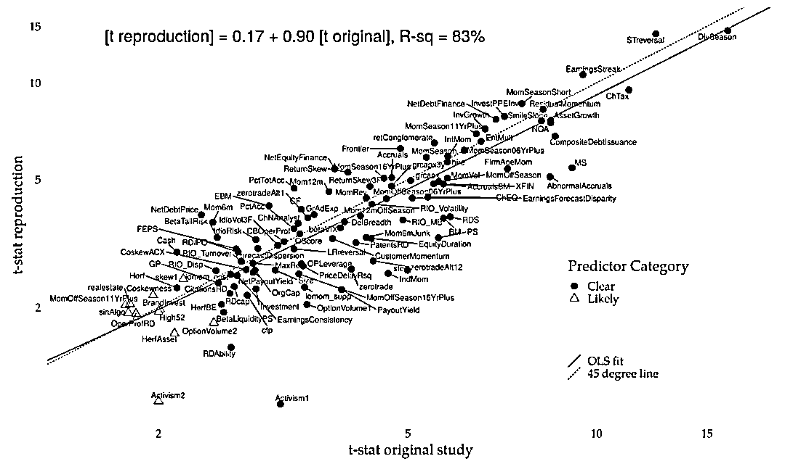
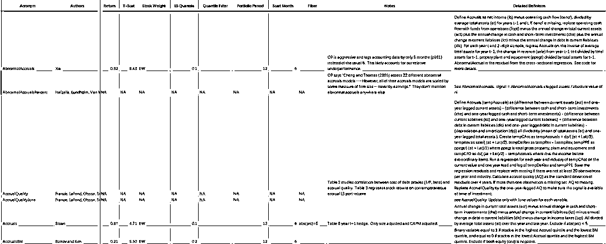

# 美联储也研究因子模型？

> 原文：[`mp.weixin.qq.com/s?__biz=MzAxNTc0Mjg0Mg==&mid=2653317670&idx=1&sn=cf997901de691c05b93238780f7bda67&chksm=802da833b75a2125d0141bab51f51330991a20e51a7e982bf5925ff9fad5842fdf0e6a43d6bb&scene=27#wechat_redirect`](http://mp.weixin.qq.com/s?__biz=MzAxNTc0Mjg0Mg==&mid=2653317670&idx=1&sn=cf997901de691c05b93238780f7bda67&chksm=802da833b75a2125d0141bab51f51330991a20e51a7e982bf5925ff9fad5842fdf0e6a43d6bb&scene=27#wechat_redirect)

# 

****相关论文&因子详细定义与公式，****文末下载****

近年来，由于大多数研究结果无法复现，或者研究结果本身就是大量因子多次测试后择优的结果，实证金融领域的论文正面临着一些挑战和质疑，我们称之为因此存在着复现危机。例如，Paul Calluzzo，Fabio Moneta 和 Selim Topaloglu，在 2015 年的论文 *《When Anomalies Are Publicized Broadly, Do Institutions Trade Accordingly? 》*，其中就讨论到，他们发现由于机构投资者(尤其是对冲基金)利用论文中的这些 Anomalies 进行交易，公布后的 Anomalies 的效果平均下降了三分之一左右。

如果从这个发现来说，由于因子被大部分机构应用到实际交易中，而对因子的效果产生了影响，并不如论文中效果来的明显，这样的结果并不能归结到复现危机，这说明因子本身是有效的，只是因为更多人使用后，市场更有效而导致了因子的失效。这些说明，在学术界和业界的更同作用下，资产定价朝着更有效的方向发展，这也表明市场正如预期的那样高效运转。

Theis Jensen，Bryan Kelly 和 Lasse Pedersen 在 2021 年 3 月发表的一篇论文*《 Is There a Replication Crisis in Finance? 》*，他们使用贝叶斯方法研究了论文中的因子是否能复现的问题，并得出结论:

*   大多数因子确实是可以复现，而且在样本之外，在全球市场都表现出了一致性。

*   虽然有一小部分因子未能复现，但整体表现并没有大家认为的那么糟糕。

*   使用他们的贝叶斯方法，复现的成功率(超额收益在统计上显著)是 85% ，而且这个结果在美国和全球数据都是一致的。

近期，美联储高级经济学家 Andrew Chen 及科隆大学教授 Tom Zimmermann 一篇工作论文*《Open Source Cross-Sectional Asset Pricing》*中，详细整理总结了过去关于资产定价的学术文献中提及的 319 个因子，并进行复现及测试。测试的数据及代码也在 Github 中开源，主要代码由 Stata、R 及 SAS 完成，他们根据原始出处的因子有效性的测试结果，作者将因子分为了以下四大类：

*   Clear Predictor：long-short 收益在统计上非常显著，总计 161 个

*   Likely Predictor：long-short 收益在统计上比较显著，总计 44 个

*   Not-Predictor：long-short 收益在统计上不显著，总计 14 个

*   Indirect Signal：需与其他结合、或要做一些修改后才有预测性，总计 100 个

通过他们自己的测试，他们发现只有三个因子的测试结果与原论文不一致。对于原论文中的 Clear  Predictor 和 Likely Predictor（共 205 个），作者对原文测试结果的 t-value 与复现后的 t-value 进行了回归，结果如下图，可以看出复现的结果和原论文非常接近。，t 统计数据的斜率为 0.90，r 平方为 83% ：

Chen 和 Zimmerman 还解释说，一些论文发现失败率更高的原因是他们对因子的分类错误。Kewei Hou, Chen Xue, and Lu Zhang (HXZ) 在*《Replicating Anomalies》*中研究了 452 个因子，实际上一共只有 240 各因子，其中 212 个是这 240 个不同持仓期。而且在这 240 个因子中，只有 118 在统计学上显著。但实际上，Chen 和 Zimmerman 发现在 HXZ 认为无效的因子中，在原论文中就没有本身就没有进行多空收益统计显著性的测试。但对于研究公布后效果衰减的问题，他们的结论与 McLean and Pontiff (MP)的高度一致，特别是对于样本内效果非常优秀的因子来说，发表后效果下降的更为明显。

需要注意的是，Chen 和 Zimmerman 的复现并没有解决因子可投资性的问题，正如论文*《A Taxonomy of Anomalies and Their Trading Costs 》*和*《Zeroing in on the Expected Returns of Anomalies》*发现的那样，考虑了交易成本，如买卖价差之后大部分有效的因子也变得无效了，并不能带来真正的收益。所以因子的可投资性，也是因子研究中非常值得关注的问题。

**总结**

尽管存在成千上万个因子，但在因子研究中最好还是从以下几个方向出发，beta、规模、价值、盈利能力/质量和动量等，否则就会陷入过度挖掘的窘境。

文中提到了美联储的工作论文*《Open Source Cross-Sectional Asset Pricing》*，中计算因子的代码已在 Github 开源：

***https://github.com/OpenSourceAP/CrossSection***

**论文、因子介绍下载**

相关论文及因子详细的定义及公式也提供给小伙伴们下载参考：

部分截图

**后台回复**

***OSCAP***

量化投资与机器学习微信公众号，是业内垂直于**量化投资、对冲基金、Fintech、人工智能、大数据**等领域的主流自媒体。公众号拥有来自**公募、私募、券商、期货、银行、保险、高校**等行业**20W+**关注者，连续 2 年被腾讯云+社区评选为“年度最佳作者”。