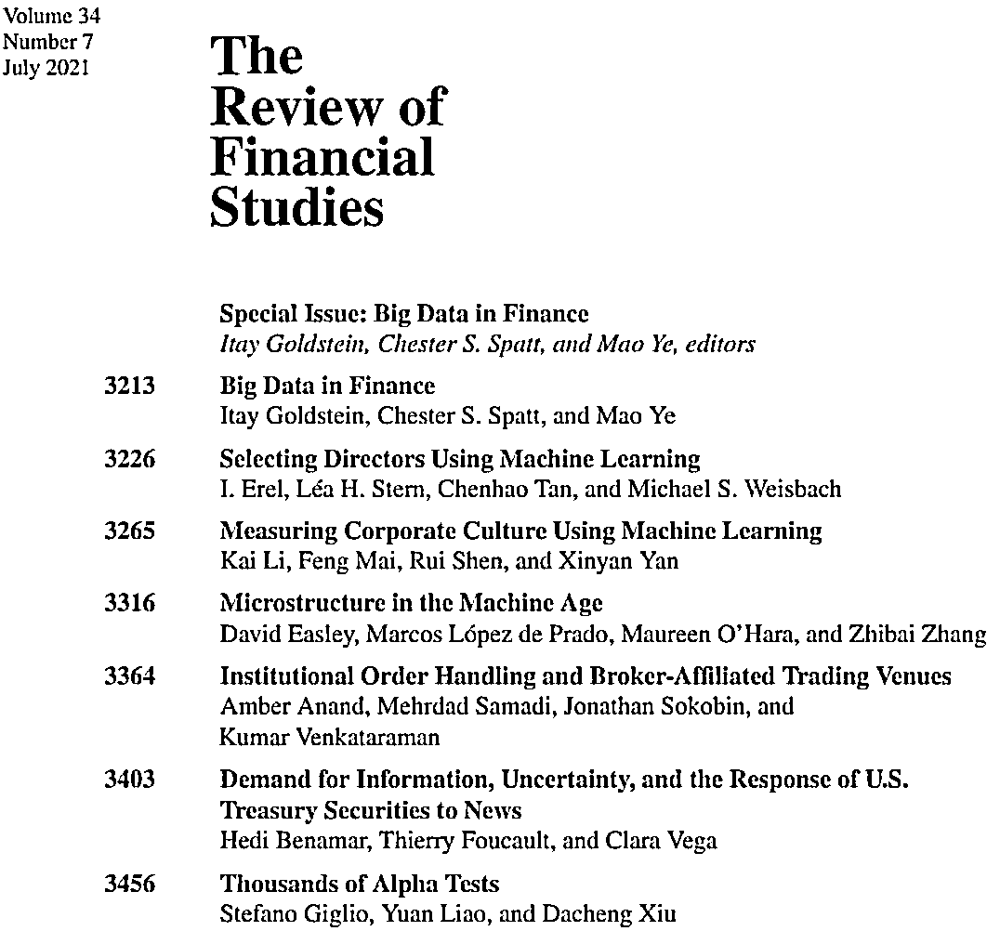

# RFS7 月特刊：Big Data in Finance（附下载）

> 原文：[`mp.weixin.qq.com/s?__biz=MzAxNTc0Mjg0Mg==&mid=2653317648&idx=1&sn=8ab2b8bc546ec8e13661f3685726ddf7&chksm=802da805b75a2113764aadb2a9ae73cd48ee7f14f742f87700a273fe8432a6e4ad0f515d53be&scene=27#wechat_redirect`](http://mp.weixin.qq.com/s?__biz=MzAxNTc0Mjg0Mg==&mid=2653317648&idx=1&sn=8ab2b8bc546ec8e13661f3685726ddf7&chksm=802da805b75a2113764aadb2a9ae73cd48ee7f14f742f87700a273fe8432a6e4ad0f515d53be&scene=27#wechat_redirect)

# 

**近期，The Review of Financial Studies 发布了 7 月刊，本期期刊是针对金融大数据（Big Data in Finance）的特刊，精选了多篇金融行业应用大数据及机器学习的专业论文，涉及多方面的应用，从机器学习在董事选举中的应用到市场微观结构的研究。其中与量化投资相关的文章超过了半数以上，详细的论文列表如下：**

****

**与量化投资紧密相关的文章有：**

****研究市场微观结构，高频预测****

*****Microstructure in the Machine Age：***Easley et al.(2021)在本篇论文中主要探讨了机器学习的应用对市场微观结构的影响。**作者发现，相比自动化交易盛行之前，在高频交易及机器化交易占据了大部分交易量的现在，以下六个指标仍然能够用来预测股票未来的价格和流动性：**the Roll measure, the Roll impact, volatility (VIX), Kyle's λ, the Amihud measure, 及 the volume-synchronized probability of informed trading(VPIN)。**具体的预测模型要根据具体的应用场景来决定，比如预测同一股票的价格，简单的逻辑回归的效果与复杂的机器学习模型相差不多。对多资产的预测，机器学习模型的效果要优于简单的逻辑回归。**主要原因归结于复杂的机器学习模型在多资产预测的应用场景中，更能有效的捕获资产间的相互关系，从而利用更多的信息，产生更有效的结果。**

****研究市新闻数据，关注新闻点击量阅读量****

*****Demand for Information, Uncertainty, and the Response of U.S. Treasury Securities to News：***Benamar, Foucault, and Vega (2021)发现信息需求是不确定性的很好的代理变量，因为当不确定性上升的时候，人们对于信息的需求会越来越多。所以作者基于 Bitly 提供的网页点击数据来定量的研究信息需求。他们发现在宏观经济指标和政策发布之前，对于未来利率的信息需求越大，美国国债利率的不确定性就越高，其对于宏观指标的敏感性就越大。更具体的，非农工资发布前的两小时，Bitly 提供的关于非农工资新闻的点击量每增加一个标准差，美国债对于非农的敏感性就增加 3.5-7 个基点。这也表明，高频的新闻点击数据对于利率的预测有明显的效果。**

****多因子与机器学习的结合，侧重如何更稳健的测试因子****

*****Thousands of Alpha Tests：***最后一篇文章是关于资产定价的，作者提出了一个基于机器学习模型的资产定价模型测试框架，主要用于解决 data-snooping 的问题。当我们对于成千各因子进行测试的时候，最终选出来的有效因子，很大程度上是由于运气，且导致了很高的错误发现率。Giglio, Liao, and Xiu (2021)主要基于 matrix completion, wild bootstrap, screening, 和 false discovery control 等结合的方法解决了 data snooping 和 false positives 的问题。Matrix completion 主要基于机器学习的方法对缺失值进行插值填充。Bootstrap 和 screening 提高了对于有限且带偏样本测试的稳健性。**

**以上文章，公众号均已打包整理，下载方式见如下：**

****后台回复****

****RFS****

**量化投资与机器学习微信公众号，是业内垂直于**量化投资、对冲基金、Fintech、人工智能、大数据**等领域的主流自媒体。公众号拥有来自**公募、私募、券商、期货、银行、保险、高校**等行业**20W+**关注者，连续 2 年被腾讯云+社区评选为“年度最佳作者”。**