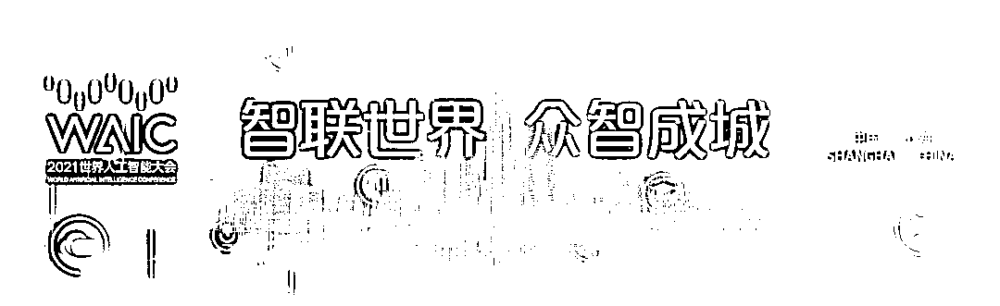
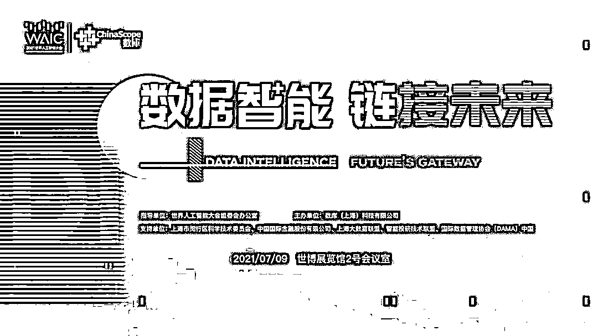
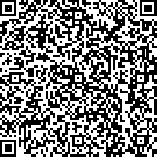
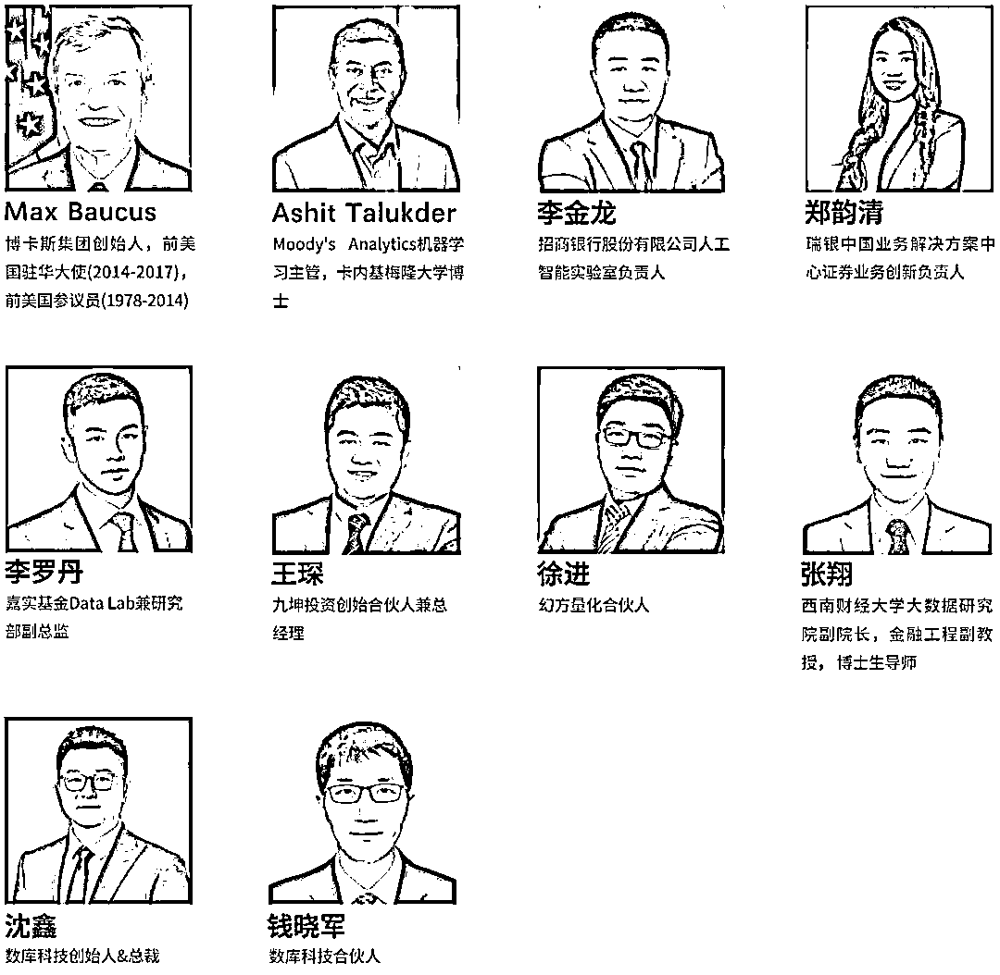
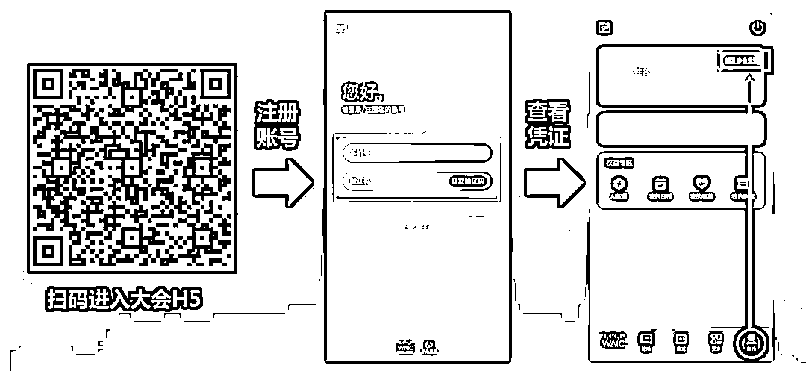

# 数智时代终究来临：你好！2021 世界人工智能大会

> 原文：[`mp.weixin.qq.com/s?__biz=MzAxNTc0Mjg0Mg==&mid=2653317620&idx=1&sn=8ed0fb4ff5a7ebb7e16071e1d5f265e0&chksm=802dabe1b75a22f74c27f686222148a5a6edadc17c5456df79fb27875791f55d36cbef980435&scene=27#wechat_redirect`](http://mp.weixin.qq.com/s?__biz=MzAxNTc0Mjg0Mg==&mid=2653317620&idx=1&sn=8ed0fb4ff5a7ebb7e16071e1d5f265e0&chksm=802dabe1b75a22f74c27f686222148a5a6edadc17c5456df79fb27875791f55d36cbef980435&scene=27#wechat_redirect)

## 作为**人工智能行业的国际顶级盛会**，2021 世界人工智能大会将于 2021 年 7 月 8 日至 10 日在上海世博中心和上海世博展览馆同时举行。世界人工智能大会自 2018 年以来，已成功举办了三届。2021 世界人工智能大会由国家发展和改革委员会、工业和信息化部、科学技术部、国家互联网信息办公室、中国科学院、中国工程院、中国科学技术协会，以及上海市人民政府共同主办。本届大会将以“智联世界，众智成城”为主题，以 AI 赋能城市数字化转型为切入点，探讨人工智能技术发展、产业赋能以及治理相关话题。

## 

作为本届世界人工智能大会承办单位之一，数库科技将于**【7 月 9 日 13:30-17:30】在上海世博展览馆 2 号会议室**举办以 “数据智能，链接未来” 主题分论坛，届时线上线下同步呈现。

论坛由世界人工智能大会组委会办公室指导，数库（上海）科技有限公司主办，上海市闵行区科学技术委员会、中国国际金融股份有限公司、上海大数据联盟、智能投研技术联盟、国际数据管理协会（DMAM）中国支持。

专业听众报名入口

本论坛为**免费参****与。**我们为大家开放了**【专业听众】**注册通道***（请注册时务必上传标准证件照）***。

由于疫情防控要求，**名额有限！**

预约成功后，请耐心等待官方审核

****由于大会级别较高，出于会场安全需求，请您确保填写信息真实、完整、有效，否则将无法通过审核。***

关于论坛

在大数据与人工智能技术蓬勃发展的背景下，数据智能正与各行业产生着深度的融合。当前，**“数据”已成为最具时代特征的新生产要素。**发挥和释放数据的红利价值，有助于在数据流的引领下形成产业链上下游和跨行业融合的数字化生态体系。同时，将产业链、创新链、资本链、数据链、供应链从串联创新转向并联创新。

**“****数据智能，链接未来”论坛**作为 2021 世界人工智能大会创新技术新动能的平行论坛，以“数字、数智”为核心，**聚焦数字经济新热点、把握数据智能新风向。**多领域、多角度为大家阐述数据智能在相关领域的创新变革与实践应用。

重磅嘉宾

本次论坛将与来自诸多国内外人工智能专家、金融科技企业领袖等嘉宾，共话数据智能新风向。以“数字、数智”为核心，**聚焦数字经济新热点、洞察行业技术新趋势！**

*以上排名不分先后

快来加入这场数据与科技的盛筵，共同见证数据智能时代的梦想与辉煌！

论坛时间

**2021 年 7 月 9 日（周五）**

** 13:30—17:30**

论坛地址

**世博展览馆 2 号厅会议室**

报名方式

**第一步：扫码注册，成为专业听众**

本论坛为**免费参与****，**我们为大家开放了**【专业听众】**注册通道***（请注册时务必上传标准证件照）***。

由于疫情防控要求，**名额有限！**

预约成功后，请耐心等待官方审核

****由于大会级别较高，出于会场安全需求，请您确保填写信息真实、完整、有效，否则将无法通过审核。***

**第二步：扫码进入大会 H5 查看证件**

**2021 世界人工智能大会****期待您的到来**量化投资与机器学习微信公众号，是业内垂直于**量化投资、对冲基金、Fintech、人工智能、大数据**等领域的主流自媒体。公众号拥有来自**公募、私募、券商、期货、银行、保险、高校**等行业**20W+**关注者，连续 2 年被腾讯云+社区评选为“年度最佳作者”。