# 基于 CFTC 持仓报告的机器学习模型

> 原文：[`mp.weixin.qq.com/s?__biz=MzAxNTc0Mjg0Mg==&mid=2653317559&idx=1&sn=2c967a2b372c293e71b4dcbb2dab8442&chksm=802daba2b75a22b4bc256e7b904af21e2f6ee86dbfb1b9dc70a3e56d84eb1cc754511af3ee38&scene=27#wechat_redirect`](http://mp.weixin.qq.com/s?__biz=MzAxNTc0Mjg0Mg==&mid=2653317559&idx=1&sn=2c967a2b372c293e71b4dcbb2dab8442&chksm=802daba2b75a22b4bc256e7b904af21e2f6ee86dbfb1b9dc70a3e56d84eb1cc754511af3ee38&scene=27#wechat_redirect)


量化投资与机器学习公众号独家解读

量化投资与机器学公众号 *** ***QIML Insight——深度研读系列 ******是公众号今年全力打造的一档**深度、前沿、高水准**栏目。


公众号**遴选**了各大期刊最新论文，按照理解和提炼的方式为读者呈现每篇论文最精华的部分。QIML 希望大家能够读到可以成长的量化文章，愿与你共同进步！

[第一期 ](http://mp.weixin.qq.com/s?__biz=MzAxNTc0Mjg0Mg==&mid=2653315304&idx=1&sn=8f36bc03096995655abea040e2ee3f94&chksm=802da2fdb75a2beb5d210c8235ab64fba0ba510b16683599189419f2ce0af483ea9c020707f6&scene=21#wechat_redirect) | [第二期](http://mp.weixin.qq.com/s?__biz=MzAxNTc0Mjg0Mg==&mid=2653315407&idx=1&sn=e9f5e375aedcb0b8f82d6c42b7ea3e80&chksm=802da35ab75a2a4c1aa8aa458bb5878ccbe0499b3c4e01bfff51508610c4e45f07d5b16fd6ab&scene=21#wechat_redirect) | [第三期](http://mp.weixin.qq.com/s?__biz=MzAxNTc0Mjg0Mg==&mid=2653315880&idx=1&sn=0d7bd33e5f1697973c1f365b729369b5&chksm=802da13db75a282b762267494b493c81b5595f35ca41da6a34625a13c02c6e1765d641ed7f0c&scene=21#wechat_redirect) | [第四期](http://mp.weixin.qq.com/s?__biz=MzAxNTc0Mjg0Mg==&mid=2653316512&idx=1&sn=d88a7b3d5c46f307370fe7e8939b4bbd&chksm=802da7b5b75a2ea3f74d3f7f1dff4c57c811a51f60f77104f0a8de86301f98f3b28814daa834&scene=21#wechat_redirect) | [第五期](http://mp.weixin.qq.com/s?__biz=MzAxNTc0Mjg0Mg==&mid=2653316725&idx=1&sn=4ef212b4f7ffca70da72a9b72917676e&chksm=802da460b75a2d762a41f36c89140ce6f364cf2ab1994ffccec7306b8186641f4598372495ed&scene=21#wechat_redirect) | [第六期](http://mp.weixin.qq.com/s?__biz=MzAxNTc0Mjg0Mg==&mid=2653316934&idx=1&sn=0bae7eba4fc5a8b462ee21ded87e3718&chksm=802da553b75a2c45232d3928fee7677c7fce7e2ccea7c77377e3748db3c7b884450f41ce323a&scene=21#wechat_redirect) 

[第七期](http://mp.weixin.qq.com/s?__biz=MzAxNTc0Mjg0Mg==&mid=2653317372&idx=1&sn=ca755712e4a0b8d84b9beca7e513a8ce&chksm=802daae9b75a23ffe0d91ef55c22827772e7d28b727b91b13519aa095deede6b2736d808529a&scene=21#wechat_redirect)

> **本期遴选论文** **来源：**The Journal of Financial Data Science Summer 2021
> **作者：**Oleksandr Proskurin
> **标题：**Does the CFTC Report Have Predictive Power: Machine Learning Approach

**核心观点**

*   基于 CFTC 的 COT 持仓报告构建特征，应用随机森林模型预测未来一周的趋势。
*   如果按照周五的披露，该数据并没有可以预测未来趋势的有用特征。
*   如果假设周二就可以获得数据，则该数据有可以明显预测未来趋势的有用特征。
*   其中基于资金管理人 MMs 的 Trade Group Performance 特征表现较优。

对于国内投资的参考意义：

**国内交易所每日收盘后也会提供各品种的持仓数据，相比 CFTC 来的更及时，可以参考数据标注及特征构建的方法，测试该方法在国内市场的效果。**

**COT 持仓报告**

在美国市场，根据商品期货交易委员会（Commodity Futures Trading Commission）于 1962 年设立的要求，各大期货交易者必须定时（在美国时间每周五下午 3:30）向商品期货交易委员报告当周周二的持仓数据（Commitments of Traders，COT），若遇上当周美国有公假，CFTC 持仓报告发布时间通常会推迟一个工作日发布，数据来自芝加哥、纽约、堪萨斯城和明尼安纳波利斯的期货或期权交易所。CFTC 报告是全球投资者非常关注的报告，虽然数据本身与中国市场的期货公司每日持仓排名相比，存在一些时间滞后，但根据 CFTC 公布出来的当周的持仓报告数据，投资者可以根据报告中的持仓数量、增减变化、各类持仓所占比例变化、交易商数量变化等，作为投资判断一些持续时间较长的趋势性行情的重要参考标准。

对于量化交易而言，其中最重要的是分类报告（Disaggregated Report），披露的详细格式及数据如下图所示，其中会按不同的交易者类型披露其当周的持仓数据。**注意是周五披露截至到当周周二的数据。其中交易者按一下分类：**

*   **生产商/贸易商/加工商/用户(Producer/Merchant/Processor/User (PMPU) )：**“生产商/贸易商/加工商/用户”是主要从事实物商品的生产、加工、包装或处理并使用期货市场来管理或对冲与这些活动相关的风险的实体。

*   **掉期交易商（Swap dealers）：**“掉期交易商”是主要处理商品掉期交易的实体，并使用期货市场来管理或对冲与这些掉期交易相关的风险。掉期交易商的交易对手可能是投机交易者，如对冲基金或管理其实物商品交易所产生风险的传统商业客户。

*   **资金管理者（Money managers (MMs)）**“资金管理者”是注册商品交易顾问（CTAs）、实物基金（CPOs）或由 CFTC 确定的未注册基金。这些交易商代表客户从事管理和进行有组织的期货交易。

*   **其他可报告类别(Other reportables)**未列入其他三个类别之一的所有其他可报告交易者将被置于“其他可报告”类别中。

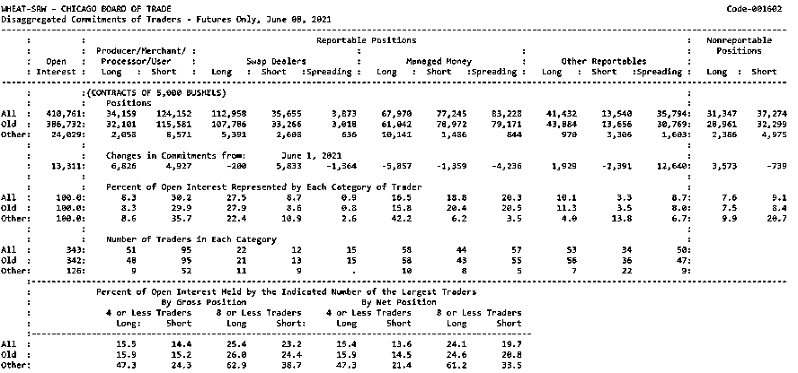

这些持仓报告的数据中，特别是 MMs 组的数据，是否存在可以预测未来趋势的信息，由于报告是在周五才披露周二的数据，这个延迟披露是否会影响数据的有效性。在本篇报告中，作者就以上问题做了探讨。

**基于 COT 分类持仓报告的特征构建**

**第一类特征：常规指标**

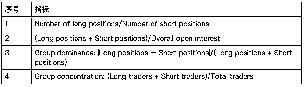

**第二类特征：TRADING GROUP PERFORMANCE（TGR）**

*   记录每组每周初与周末的净持仓（如下图 1，Section 1 所示）

*   如果周初与周末的净持仓方向一致，则假设一整周的净持仓都未发生变化

*   如果周初与周末的净持仓方向不一致，那么本周的数据就不会用在后面的实证分析中。但需要记录每个商品期货中，发生这种情况的数据占所有数据的比例（以周为单位）

*   记录每周该商品期货的收益率

*   对于各组，如果净持仓方向与期货的收益率一致，则该组的 TGR 指标加上这周的收益率，如果净持仓方向与期货的收益率相反，则该组的 TGR 指标减去这周的收益率。以 Money managers(MMs)组为例，如果本周 MMs 组的净持仓为 Long，且期货上涨了 1%，则在本周 MMS 的 TGR 指标等于上周 MMs 的 TGR 指标加上 1%；相反，如果本周 MMs 组的净持仓为 Short，且期货上涨了 1%，则在本周 MMS 的 TGR 指标等于上周 MMs 的 TGR 指标减去 1%。

*   除了每组每周的 TGR 指标，作者还计算了 TGR 与该期货 Long-Only 策略的收益差，及 TGR 的变化及滚动总和，如图 2 为 MMs 组 TGR 的 5 日滚动之和。

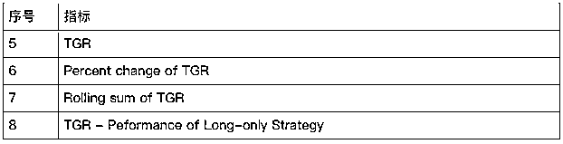

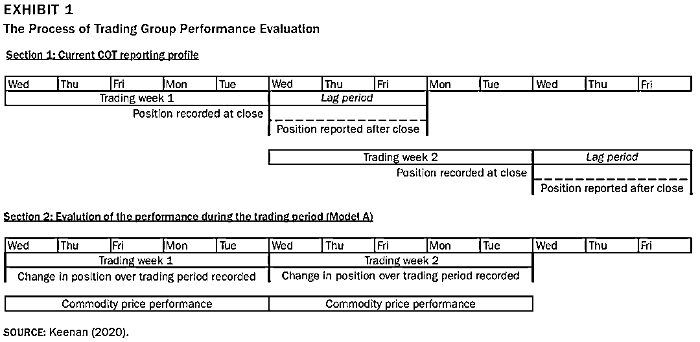

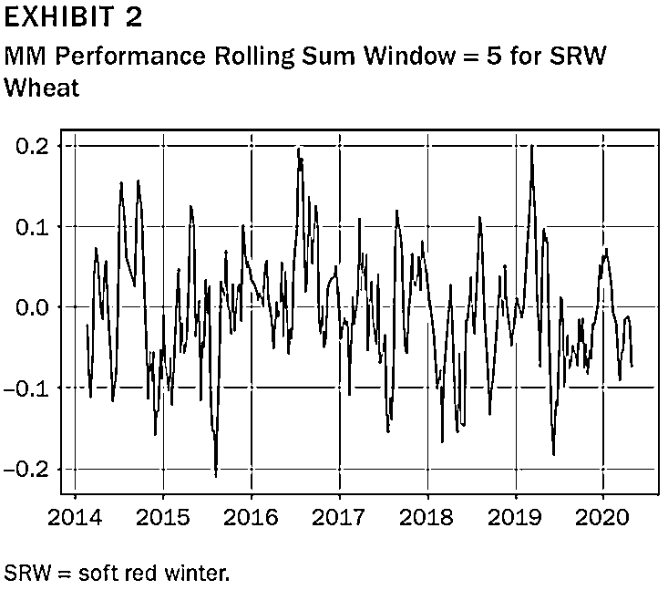

**第三类特征：CONCENTRATION AND CLUSTERING RANGE**

这类指标主要基于持仓情况和交易者的数量来构建超买超卖指标，该类特征由以下几个指标计算而来：

*   MM(L/S)：MMs 组，Long（或 short）的持仓数量

*   MM(L/S)T：MMs 组，Long（或 short）的交易者（Traders）数量

*   MM(L/S)%：MMs 组，Long（或 short）的持仓数量变化的百分比

*   MM(L/S)T%：MMs 组，Long（或 short）的交易者（Traders）数量变化的百分比

*   min(MM(L/S)%range)：过去一段时间（range），MM(L/S)%的最小值

Long(short) concentration range

<embed style="vertical-align: -1.556ex;width: 37.475ex;height: auto;" src="https://mmbiz.qlogo.cn/mmbiz_svg/a18XcQ1EBBggIibBXCZoqdrFDtUkcQMW0NeCFYhmJ7dTDYftAroGIAcddkibTUXGJWMenicf467hm2k6c1Z8u1Z4fZyQGrXQP2g/0?wx_fmt=svg" data-type="svg+xml">

Long(short) clustering range

<embed style="vertical-align: -1.556ex;width: 39.727ex;height: auto;" src="https://mmbiz.qlogo.cn/mmbiz_svg/a18XcQ1EBBggIibBXCZoqdrFDtUkcQMW0K2A7iaQC4nvFpNrrBtdfjsLNbN2LsjPr17TMkibficHzjKMDiaSC3XVicG21ibzobv4vsa/0?wx_fmt=svg" data-type="svg+xml">

本篇论文中，range 的取值为 2、5、10、20 及 50。

**数据标注与模型选择**

基于 López de Prado (2020)，作者采用趋势扫描标注法（Trend Scanning Labeling），用以标注当天的行情是处于一段上升趋势（+1）、下降趋势（-1）还是无趋势（0）中。代码参考如下：

```py
import statsmodels.api as sm1 

def tValLinR(close): # tValue from a linear trend
  x=np.ones((close.shape[0],2)) 
  x[:,1]=np.arange(close.shape[0]) 
  ols=sm1.OLS(close,x).fit() 
  return ols.tvalues[1]

def getBinsFromTrend(molecule,close,span): 
  '''
  Derive labels from the sign of t-value of linear trend Output
  includes: - t1: End time for the identified trend - tVal: t-value
  associated with the estimated trend coefficient - bin: Sign of the
  trend 
  ''' 
  out=pd.DataFrame(index=molecule,columns=['t1','tVal','bin'])
  hrzns=xrange(*span) 
  for dt0 in molecule: 
    df0=pd.Series()
    iloc0=close.index.get_loc(dt0) 
    if iloc0+max(hrzns)>close.shape[0]:
      continue

    for hrzn in hrzns: 
        dt1=close.index[iloc0+hrzn-1] 
        df1=close.loc[dt0:dt1] 
        df0.loc[dt1]=tValLinR(df1.values) 
        dt1=df0.replace([-np.inf,np.inf,np.nan],0).abs().idxmax() 
        out.loc[dt0,['t1','tVal','bin']]=df0.index[-1],df0[dt1], np.sign(df0[dt1]) # prevent leakage

    out['t1']=pd.to_datetime(out['t1']) 
    out['bin']=pd.to_numeric(out['bin'],downcast='signed') 
    return out.dropna(subset=['bin'])
```

数据范围为 CFTC 披露的 2014 年至 2020 年 5 月的 COT 分类持仓报告，作者选择的机器学习模型为随机森林（Random Forest）。

**指标重要性判断方法**

**Mean Decrease Accuracy Feature Importance（MDA）**

平均准确度下降法（MDA，Mean Decrease Accuracy）：OOS 样本外计算，适用于任何模型，最重要的是，它直接比较了将某特征进行无序打乱前后，训练结果的评价指标准确度的下降情况。

原理：打乱每个特征的特征值顺序，并且度量顺序变动对模型精确率的影响。对于不重要的变量来说，打乱顺序对模型的精确率影响不大，但对于重要的变量来说，打乱顺序就会降低模型的准确率。

实现步骤：

1、训练出一个随机森林模型，在测试集检验得到 accuracy0；

2、随机重排(permutation)测试集某特征 xi，检验得到 accuracyi；

3、(accuracy0- accuracyi)/accuracy0,即为特征 xi 的重要性。

**Shapley Values**

Shapley value 最大的优势是 SHAP 能对于反映出每一个样本中的特征的影响力，而且还表现出影响的正负性。因此 Shap 值承担了后 xgboost 时代树模型的解释任务。关 Shapley 的详细解释参考知乎文章：*https://zhuanlan.zhihu.com/p/91834300*

**Python 中的 SHAP 库可以很方便的实现 Shapely Values 的计算，在 Github 中超过了 15K 的 star。**

**实证步骤**

*   在包含所有特征的数据集上拟合随机森林分类器模型，使用四组的 k-fold 方案获得交叉验证的 log loss 和 accuracy 评分。

*   基于 MDA 和 Shapley 值，评估各特征的重要性。

*   基于筛选后的模型计算交叉验证的模型得分并与随机猜测的模型进行比较。 

**实证结果**

实证过程中，作者测试了两种情况，第一种是按照 CFTC 正常的披露时间（周五）测试模型表现；第二种是假设周二就可以获得 COT 的持仓报告。然后比较这两种情况下，模型的表现有没有区别。

从下表 6（周五公布）及下表 7（假设周二公布）的模型结果来看，其中 Naive 为随机猜测的模型。**可以看出，正常时间（周五）公布数据的模型效果还比不上随机猜测的模型，说明这些特征并没有预测的效果。相反，如果周二就能拿到持仓数据，效果明显要优于随机猜测的结果。**

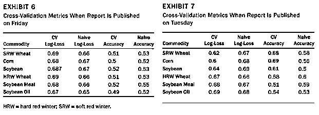

接下来，作者分别给出了对于 SRW Wheat、Corn 及 Soy Bean 三个期货品种，分别给出了筛选后比较重要的特征（见表 8，10 及 12），可以看出 MMs 组的第二类指标（如 cftc_mm_performance）均出现在较重要的指标列表中。

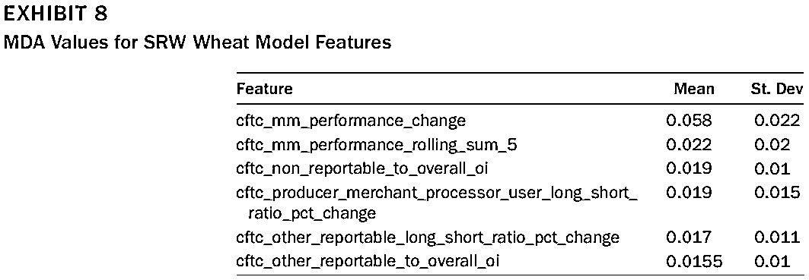

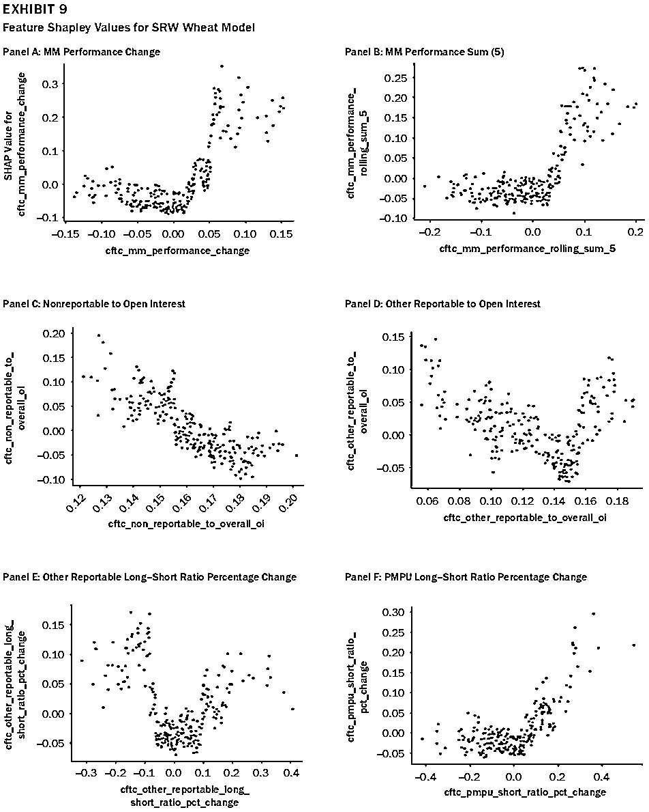

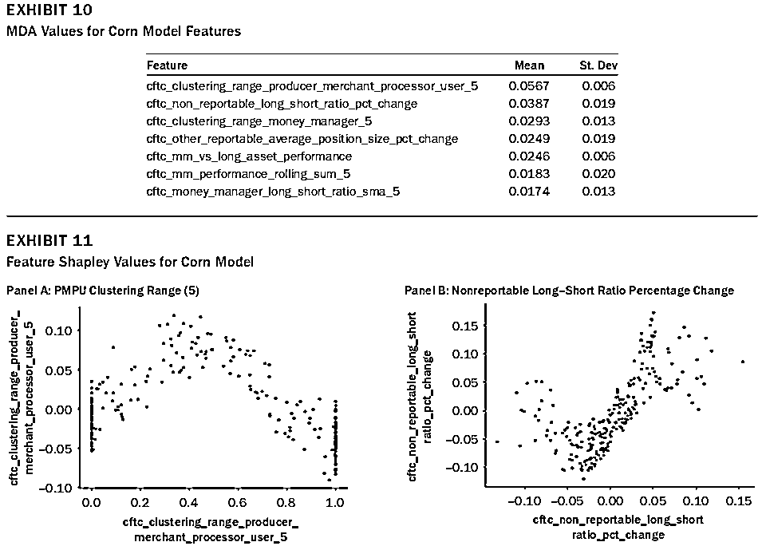

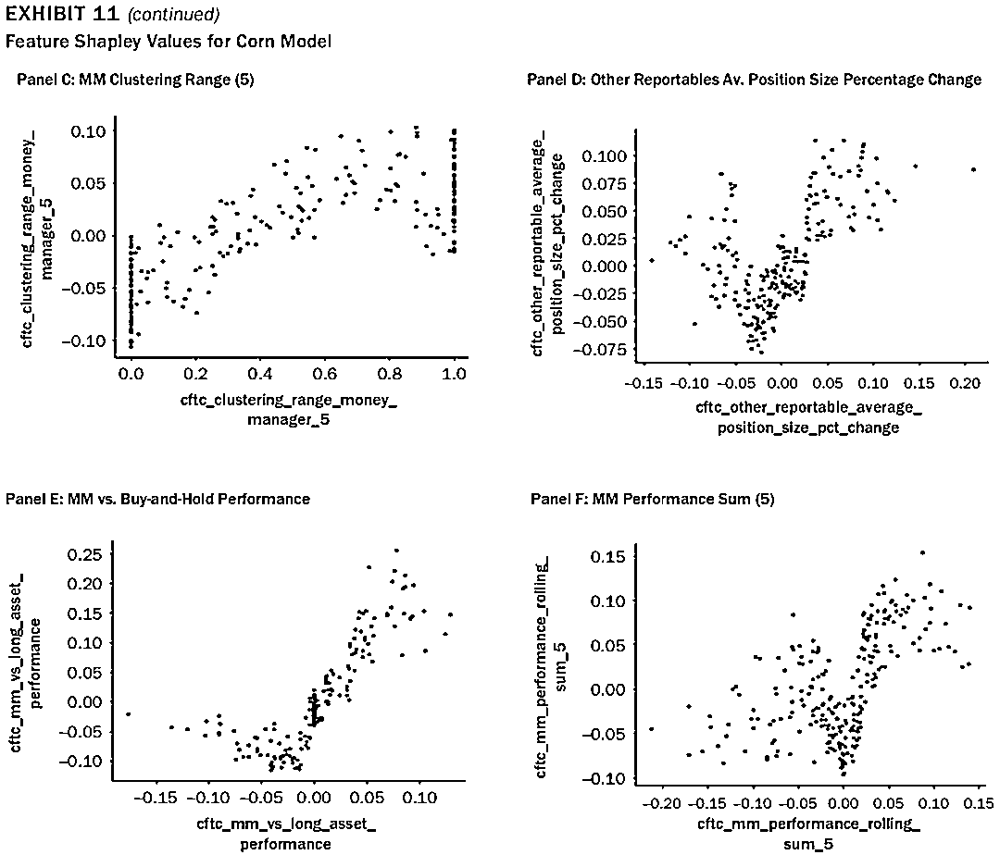

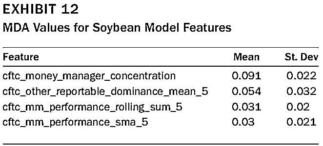

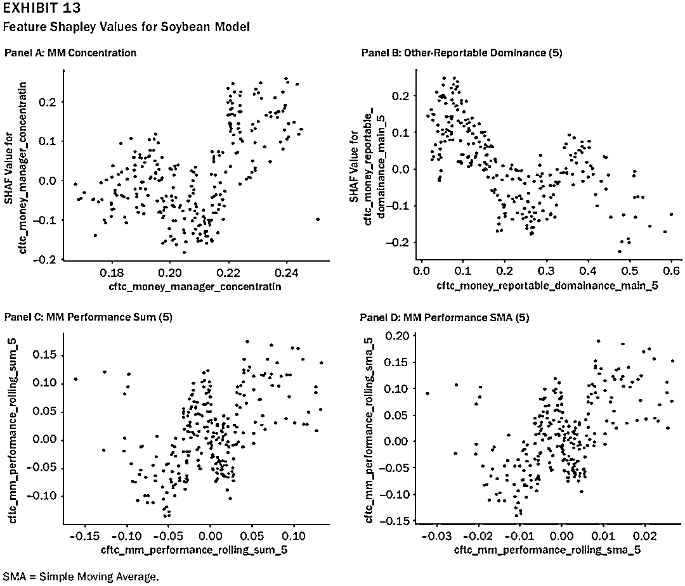

**参考文献：**

López de Prado, M. 2018\. Advances in Financial Machine Learning. Hoboken: John Wiley & Sons, 2018.

Machine Learning for Asset Managers. Cambridge, UK: Cambridge University Press, 2020.

量化投资与机器学习微信公众号，是业内垂直于**量化投资、对冲基金、Fintech、人工智能、大数据**等领域的主流自媒体。公众号拥有来自**公募、私募、券商、期货、银行、保险、高校**等行业**20W+**关注者，连续 2 年被腾讯云+社区评选为“年度最佳作者”。