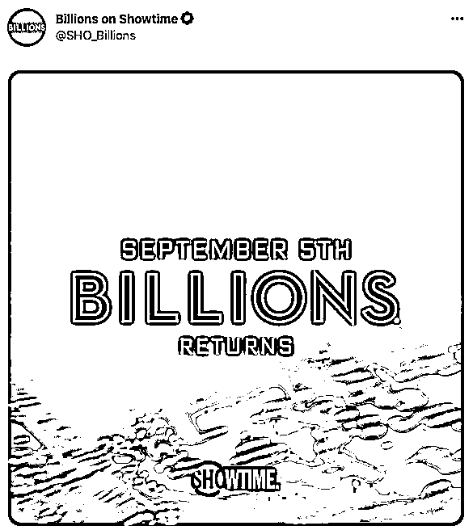
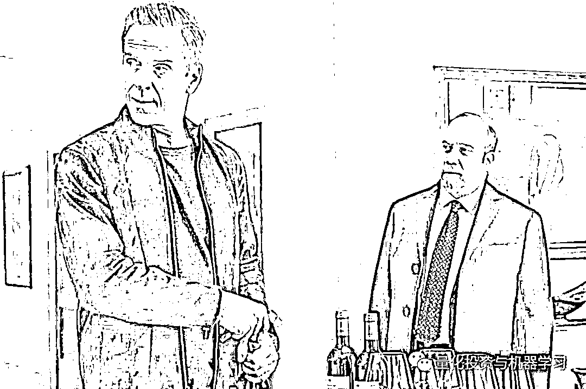
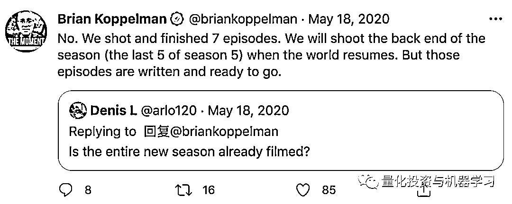
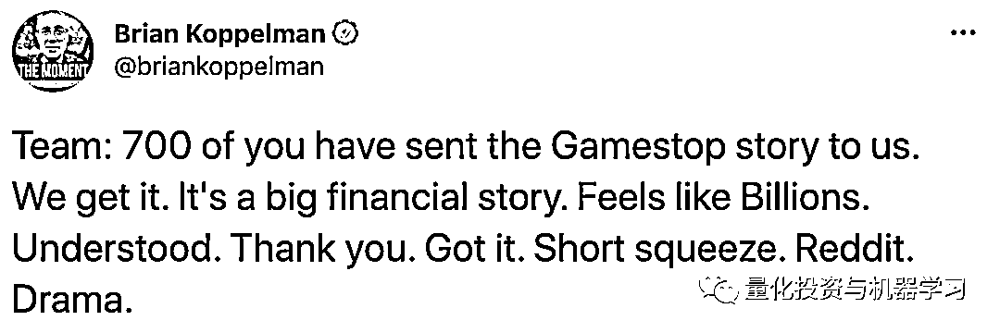
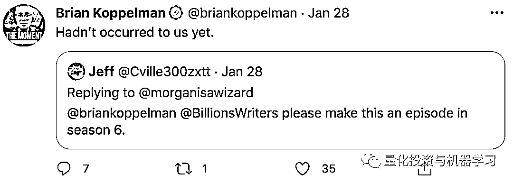

# 听说 Billions 要回归！

> 原文：[`mp.weixin.qq.com/s?__biz=MzAxNTc0Mjg0Mg==&mid=2653317514&idx=1&sn=5edc501797a3d3ae52caa94eb8f7ebc0&chksm=802dab9fb75a228925c197bc9e3c70202e0b4aa984a29ad38faaae75f05a2a30e2f95cd0ea10&scene=27#wechat_redirect`](http://mp.weixin.qq.com/s?__biz=MzAxNTc0Mjg0Mg==&mid=2653317514&idx=1&sn=5edc501797a3d3ae52caa94eb8f7ebc0&chksm=802dab9fb75a228925c197bc9e3c70202e0b4aa984a29ad38faaae75f05a2a30e2f95cd0ea10&scene=27#wechat_redirect)

昨天的文章一下子让 Quant 出圈了，通过大家后台留言与反馈下来：

 王思聪语录：Quant 版

2021-06-17

**我他妈不就是你的真命因子？**

评选为大家最喜欢的段子。也难怪，一个好因子是多么的难得。

今天周五要说的是另外一件事！

**Billions 要回归了！**

还要等 3 个月

好在有期待！

**第五季回顾** 

因为新冠疫情的原因，Billions 第五季只播出了 7 集。 

节目制作人 Brian Koppelman 在去年的 Twitter 上已经说过：

大家放心好啦！ 

去年 10 月，Showtime 宣布续订《Billions》第六季，并写到：**“剩下的五集在 2021 年播出，第六季也会随之播出”**。Billions 主要在纽约和周边地区拍摄，当第五季回归时，他们将继续拍摄第六季。

早在 2019 年 6 月，就有消息宣布，Billions 的联合创始人 Brian Koppelman 和 David Levien 已经与 Showtime 签署了一份全面协议，其中包括继续担任 Billions 的制作人。所以大家尽可放心！再等待几日，就可以连着第六季一起看啦！

**新剧集是否会包含 GameStop 情节?**

前段时间发生的 GameStop 事件，想必金融圈的人都已知晓。在 Reddit 上，对冲基金和投资者正在为 GameStop 的命运而战，这种剧情对于 Billions 太适合不过了**。要知道 Billions 剧中 Axe 原型是原 SAC 创始人，现 Point72 的掌门人****Steve Cohen。**

本尊在视频中很可爱：

今年年初，Melvin Capital 的因做空包括视频游戏零售商 GameStop 在内的一些公司，近阶段出现了巨额亏损。Point72 向其注资 7.5 亿美元。也因为此，产生了一系列的连锁反应，导致**Cohen**的家人受到了威胁，因此还注销了 Twitter：

 

节目制作人 Brian Koppelman 在 Twitter 回复到：

也继续在 Twitter 上委婉的回复大家：

不过至于能否采纳，大家也不要抱有太大期望！

**第五季剧情概览**

**在这一季，权力之争变成了生存之战，所有角色都必须适应，否则就有灭绝的危险。**

Bobby Axelrod 和 Chuck Rhoades 不仅要面对他们自己重燃的竞争对手，还要面对一些新面孔，他们希望能永久地把他们两个拉下马。Mike Prince 对 Axelrod 的统治地位构成了威胁，Chuck 发现自己以一个熟练而精明的地区检察官的形式与法律较量。Taylor Mason 被迫回到 Axe 资本，作为唯一一个能够在 Axe 和 Chuck 之间保持中立的人，是迫使 Taylor 回到 Axe 资本的原因。为了保护公司的员工和他们的资产，Taylor 会成为 Axe 的王牌还是 Chuck 希望一劳永逸地终结 Axe 的统治地位的“怪物杀手”？与此同时，Wendy Rhoades 重新评估了她过去效忠的对象，并开始组建一些新的、强大的自己的团队，该团队会让 Axe 和 Chuck 大吃一惊。

同时，让粉丝们第一次看到 ulianna Margulies 和 Corey Stoll 扮演的新角色。 

Margulies 将饰演一个名叫 Catherine Brant 的新角色，她被描述为“常春藤联盟的社会学教授和畅销书作者”。

Stoll 将扮演 Michael Prince，一个来自印第安纳州某小镇的商业巨头。

Chuck 已经准备好扳倒他的敌人了，哈哈~

在上一季中，Billions 改变了它的核心冲突，作为改革律师 Chuck Rhoades 与对冲基金巨头 Bobby Axelrod，利用他们的法律和货币权力对抗他们的敌人：美国司法部长 Waylon "Jock" Jeffcoat 和竞争对手 Taylor Mason。但是这个协议不会长久。在第四季结束时，Rhoades 和 Axelrod 再次密谋互相攻击。**一个律师和一个对冲基金经理，都渴望权力，试图超越对方！**

同时，高盛首席执行官 David Solomon 也客串 Billions 第五季，本色出演他自己！

Axelrod: “Hey, DJ D Sol, so, c'mon how about selling me a piece of your bank?”Solomon: “I'm really sorry, but Marcus isn't for sale at any price.”Axelrod: “Really? Lasry, you want to talk some sense into him?”Lasry: “I wish I could, but, he's not changing his mind. Sorry.”Solomon: “Sorry, Axe.”Axe: “Alright guys, well, enjoy the show. Thanks for coming.”期待第六季有更多精彩的现实案例！**美国大选？ SPAC？  比特币暴涨？ 纽约疫情？**

量化投资与机器学习微信公众号，是业内垂直于**量化投资、对冲基金、Fintech、人工智能、大数据**等领域的主流自媒体。公众号拥有来自**公募、私募、券商、期货、银行、保险、高校**等行业**20W+**关注者，连续 2 年被腾讯云+社区评选为“年度最佳作者”。