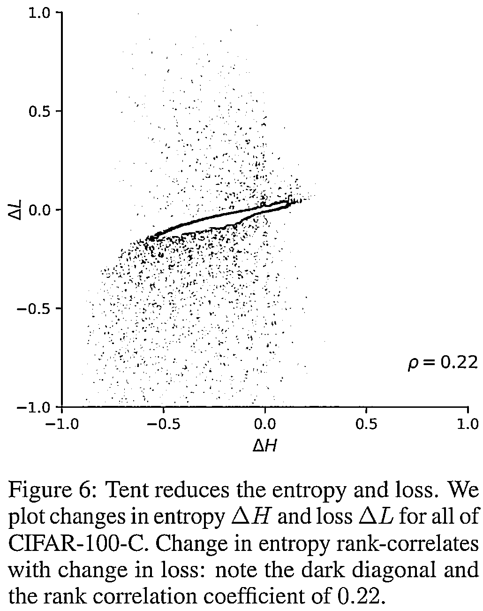
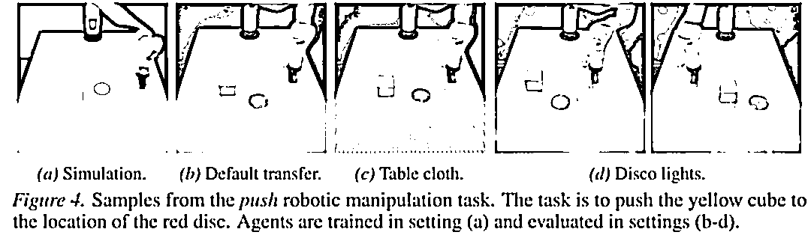

# Two Sigma 遴选：量化大佬都在看什么机器学习论文？

> 原文：[`mp.weixin.qq.com/s?__biz=MzAxNTc0Mjg0Mg==&mid=2653317460&idx=1&sn=476e7ba884bfcfb8304867fb81b88777&chksm=802dab41b75a2257c0af9b67c1b060b6785899dfed04fbec1d3ec46b2716259030545d1dbd53&scene=27#wechat_redirect`](http://mp.weixin.qq.com/s?__biz=MzAxNTc0Mjg0Mg==&mid=2653317460&idx=1&sn=476e7ba884bfcfb8304867fb81b88777&chksm=802dab41b75a2257c0af9b67c1b060b6785899dfed04fbec1d3ec46b2716259030545d1dbd53&scene=27#wechat_redirect)

**深度学习顶会：ICLR**

ICLR 全称为「International Conference on Learning Representations」（国际学习表征会议），2013 年由深度学习三座大山中的 Yoshua Bengio 和 Yann LeCun 牵头创办。众所周知，Yoshua Bengio 主管着蒙特利尔大学人工智能实验室，也就是 MILA，它是世界上最大的人工智能研究中心之一。Yann LeCun 是 Facebook 人工智能研究院的院长，被称为卷积神经网络之父。虽举办的年限比较短，但已经被学术研究者们广泛认可，被认为是**深度学习的顶级会议。**

在刚刚过去的 ICLR2021 年度会议中，有大量的机器学习的优秀论文。作为量化投资的大佬，Two Sigma 的研究员对于其中十几篇的论文特别感兴趣。能够吸引量化大佬的论文到底在讲什么？

**文中涉及的 14 篇论文，小编已经打包整理，欢迎各位小伙伴下载消化。**

**获取全部论文，详见文末**

**Learning without forgetting**

理想情况下，模型应该能够从新的数据中学习而不会忘记旧的知识。人们观察到，神经网络在更新新任务时，会灾难性地遗忘旧任务。

**Gradient Projection Memory for Continual Learning：**作者引入了一种正交的梯度下降法方法，可以对新任务进行微调，同时减少先前任务的性能下降。这是通过对初始化任务重要梯度的方向的记忆，然后对其进行正交化，以便对新任务进行梯度更新来完成的。

**Gradient Vaccine: Investigating and Improving Multi-task Optimization in Massively Multilingual Models：**作者提出了一种改进后的梯度投影的方法，将梯度的目标设置为余弦相似度。在多语言翻译的模型中，这里改进提高了翻译的效果。

**Few-shot learning**

Few-shot learning 是一种训练制度，在这种制度下，研究人员只能获得少量(例如少于 5 个)的样本来建立模型。在很难获得标记训练样本的领域，如诊断医学成像，这是一个非常重要的问题。Few-shot learning 通过使用目标域的数据来微调基于源域的现有的模型。下面的文章介绍了改进这种微调方法的新进展。

**Self-training for Few-shot Transfer Across Extreme Task Differences: **作者提出了这样一种方法，当一个域只有少量的标注数据及大量的未标注数据时，可以在未标记样本上使用使用原始未调整的模型，并把模型结果的聚类作为这些为标注数据的标签。这可以在源域和目标域非常不同的情况下提高微调性能。

**Free Lunch for Few-shot Learning: Distribution Calibration：** 使用少量的新数据对于预训练模型进行微调会存在严重过拟合的风险。作者的方法是从已有的训练模型类中找出最相似的模型，并用它们作为新类的附加训练样本。

**Robust optimization**

神经网络容易学习数据中存在的虚假的关系。这可能导致模型对样本外的数据表现不佳，并容易受到敌对性攻击。在 ICLR2021 年会议上提交的几篇论文探讨了这些关于模型健壮性挑战。

**Sharpness-aware Minimization for Efficiently Improving Generalization (SAM)：**作者引入了一个新的惩罚项，用于模型更容易收敛于平坦的区域。作者方法的一个特别有趣的方面是，在梯度下降时，只需要在相反的方向前进一小步，然后在那里重新计算梯度，再向前走一大步跨过附近最坏的区域。实际上，这就像是先退后一步，然后再向前走。这种方法相对简单但是有效，它提高了模型的鲁棒性。

**Systematic Generalisation with Group Invariant Predictions：**通过分布的偏移提高模型对于复杂但有意义的特征依赖，而不是对于简单但无意义的特征的依赖。比如，这种模型可以训练一个识别数字的神经网络，这个网络不会因为数字颜色的变化而受影响，主要依据字符的形状识别数字。

**How Does Mixup Help With Robustness and Generalization? ：**Mixup 是一种非常流行的数据增强的方法，作者在文章中提供了理论的分析，解释为什么 Mixup 能够隐性的减少对抗损失及隐性的采用了数据自适应的正则化。

**Post-deployment robustness**

深层神经网络在训练集和测试集采样于同一分布时具有较高的精度。然而，在实践中，由于研究或部署约束，生产可能需要对来自不同分布的样本进行模型推断。这些论文提出了通过在线更新模型来提高健壮性的方法。

**Tent: Fully Test-Time Adaptation by Entropy Minimization :** 提出了一种以最小化熵为目标，通过估计归一化统计量和优化转换参数进行特征在线转换的方法。结果表明，当采用该方法降低熵值时，损失也相应减小。该方法以 CIFAR-100-C 和 CIFAR-10-C 为基准，达到了最先进的性能。  

**Self-Supervised Policy Adaptation During Deployment (PAD) ：**试图通过在部署后不使用任何奖励来提高增强学习模型的稳健性。作者采用的方法是增加一个额外的目标，即观察帧被旋转的角度。作者表明，使用 PAD 的模型对于颜色、光线及材质的变化，表现得更稳健。

**Improving transformer runtime**

Transformers 是序列建模任务中最先进的模型，从语言建模到图像分类再到蛋白质序列建模。Transformers 的一个关键要素是注意机制，其运行时的复杂度为序列长度二次。这些论文的目的是提高运行时的复杂性，这对于长序列来说是无法实现的。ICLR 上不止一篇论文都在讨论这个具体问题，这说明了这个问题的重要性。 

**Random Feature Attention：**提出用随机特征注意模块代替传统的注意模块，该模块使用随机特征来逼近 softmax，而不是直接计算序列中每个元素的 softmax。这使得注意力运行时间在序列长度上呈线性，而不牺牲准确性，对于长序列尤其有利。对于超过 1000 的序列，随机特征注意提供比 softmax 多 5 倍的加速。  

**Rethinking Attention with Performers：**提出了一种新的方法，称为快速正交随机特征注意力(FAVOR)，利用随机特征将注意力运行时间从二次时间提高到线性时间。这种方法可以用来加速任何可内核化的注意力函数——不仅仅是 softmax——而不会丢失准确性。FAVOR 在各种序列建模任务(包括像素预测、文本建模和蛋白质序列建模)中都具有强大的性能。  

**Convolutional neural networks/computer vision**

最先进的卷积神经网络(CNNs)继续改进计算机视觉任务。ICLR 2021 的以下论文广泛讨论了在图像数据集上训练卷积神经网络时的学习和表示问题。

**Mind the Pad —CNNs can Develop Blind Spots：**作者探讨了卷积滤波器中的零填充如何导致空间偏差，从而抑制性能，尤其是在检测小对象时。这是因为有时填充应用不均匀，导致不对称的核函数的权重和盲点。作者展示了如何通过使用镜像填充或圆形填充来减轻这种影响。零填充长期以来一直是 CNN 设计的标准，但这篇论文表明，即使在 AlexNet 开创性的深度学习工作 10 年后，计算机视觉社区对这些模型如何工作的理解仍在以有意义的方式继续演变。

**Why Are Convolutional Nets More Sample-Efficient than Fully-Connected Nets?** 表明，对于全连通网络，泛化所需的样本数与输入规模成二次函数关系。相比之下，cnn 的缩放与输入大小无关。  

**The Intrinsic Dimension of Images and Its Impact on Learning：**采用维数估计技术来确定像 ImageNet 这样的标准图像数据集具有低维结构。本文还发现，在低内在维数数据集上训练的模型收敛速度更快，对不可见数据的泛化效果更好。作者通过明确地控制生成图像的尺寸，使用 GANs 来验证这一发现。令人欣慰的是，根据人类感知保持维度的转换，比如提升图像，似乎也能被深度学习模型以同样的方式“理解”。  

**论文下载**

后台回复（注意大小写）

***Two Sigma ICLR 2021***

量化投资与机器学习微信公众号，是业内垂直于**量化投资、对冲基金、Fintech、人工智能、大数据**等领域的主流自媒体。公众号拥有来自**公募、私募、券商、期货、银行、保险、高校**等行业**20W+**关注者，连续 2 年被腾讯云+社区评选为“年度最佳作者”。