# 供应链数据因子化研究：Customer Momentum

> 原文：[`mp.weixin.qq.com/s?__biz=MzAxNTc0Mjg0Mg==&mid=2653317372&idx=1&sn=ca755712e4a0b8d84b9beca7e513a8ce&chksm=802daae9b75a23ffe0d91ef55c22827772e7d28b727b91b13519aa095deede6b2736d808529a&scene=27#wechat_redirect`](http://mp.weixin.qq.com/s?__biz=MzAxNTc0Mjg0Mg==&mid=2653317372&idx=1&sn=ca755712e4a0b8d84b9beca7e513a8ce&chksm=802daae9b75a23ffe0d91ef55c22827772e7d28b727b91b13519aa095deede6b2736d808529a&scene=27#wechat_redirect)

量化投资与机器学习公众号独家解读

量化投资与机器学公众号 *** ***QIML Insight——深度研读系列 ******是公众号今年全力打造的一档**深度、前沿、高水准**栏目。

公众号**遴选**了各大期刊最新论文，按照理解和提炼的方式为读者呈现每篇论文最精华的部分。QIML 希望大家能够读到可以成长的量化文章，愿与你共同进步！

[第一期 ](http://mp.weixin.qq.com/s?__biz=MzAxNTc0Mjg0Mg==&mid=2653315304&idx=1&sn=8f36bc03096995655abea040e2ee3f94&chksm=802da2fdb75a2beb5d210c8235ab64fba0ba510b16683599189419f2ce0af483ea9c020707f6&scene=21#wechat_redirect) | [第二期](http://mp.weixin.qq.com/s?__biz=MzAxNTc0Mjg0Mg==&mid=2653315407&idx=1&sn=e9f5e375aedcb0b8f82d6c42b7ea3e80&chksm=802da35ab75a2a4c1aa8aa458bb5878ccbe0499b3c4e01bfff51508610c4e45f07d5b16fd6ab&scene=21#wechat_redirect) | [第三期](http://mp.weixin.qq.com/s?__biz=MzAxNTc0Mjg0Mg==&mid=2653315880&idx=1&sn=0d7bd33e5f1697973c1f365b729369b5&chksm=802da13db75a282b762267494b493c81b5595f35ca41da6a34625a13c02c6e1765d641ed7f0c&scene=21#wechat_redirect) | [第四期](http://mp.weixin.qq.com/s?__biz=MzAxNTc0Mjg0Mg==&mid=2653316512&idx=1&sn=d88a7b3d5c46f307370fe7e8939b4bbd&chksm=802da7b5b75a2ea3f74d3f7f1dff4c57c811a51f60f77104f0a8de86301f98f3b28814daa834&scene=21#wechat_redirect) | [第五期](http://mp.weixin.qq.com/s?__biz=MzAxNTc0Mjg0Mg==&mid=2653316725&idx=1&sn=4ef212b4f7ffca70da72a9b72917676e&chksm=802da460b75a2d762a41f36c89140ce6f364cf2ab1994ffccec7306b8186641f4598372495ed&scene=21#wechat_redirect)| [第六期](http://mp.weixin.qq.com/s?__biz=MzAxNTc0Mjg0Mg==&mid=2653316934&idx=1&sn=0bae7eba4fc5a8b462ee21ded87e3718&chksm=802da553b75a2c45232d3928fee7677c7fce7e2ccea7c77377e3748db3c7b884450f41ce323a&scene=21#wechat_redirect) 

> **本期遴选论文** **来源：**The Journal of Portfolio Management **August 2021** **作者：**Rei Yamamoto, Naoya Kawadai, and Hiroki Miyahara
> **标题：**Momentum Information Propagation through Global Supply Chain Networks

**核心观点**

*   **全球供应链数据中存在显著的 Alpha 信息**

*   **可以基于图论中的 Edge Betweeness Centrality 作为 Customer Momentum 计算时的权重，其与销售占比存在显著正相关性。**

*   **考虑更多层的客户，采用更长时间的动量，能够显著提高 Customer Momentum 因子的表现。**

供应链数据主要包含某家公司的供应商及客户的信息，公开信息中，可以获取某家公司供应链信息的主要来源包括：

*   上市公司披露的财务报告，其中包括主要供应商及客户的名单

*   招投标数据

*   新闻

*   航运数据

把所有公司的供应商及客户的数据整合在一起，就得到了供应链网络图谱数据。供应链数据在量化投资，特别是因子化的应用中，学术界最早可以追溯到 Cohen 和 Frazzini(2008)，他们发现客户的股票价格的变动会影响供应商的股票价格。随后在 Chen, Gao 和 Zhang(2019)基于美国供应商和中国客户之间的研究，也验证了这类现象，并取得了不错的策略表现。

总结过去多年的研究方法，关于供应链数据在量化中的应用，主要有以下几个方面：

*   股票价格的传导，比如 Customer Momentum 研究的是客户价格变动对供应商的影响；Supplier Momentum 研究的是供应商价格变动对于客户股票价格的影响。

*   下游经营情况对于上游股价的影响，比如客户的收入增长对于供应商股价的影响。

但总体而言，研究 Customer Momentum，且发现明显传导效果的研究成果比较多，在 Customer Momentum 研究的过程中，还有许多值得考虑的问题：

*   **多长时间的动量？**过去一个月，还是过去一年？

*   **不同客户的动量怎么加权？**等权？还是按销售占比加权。如果按销售占比加权，遇到没有具体销售数额时怎么处理？Ahern(2013)把应用图论的中心度作为销售占比的代理变量，取得的显著的效果。

*   **是否考虑客户的客户？**大部分研究中，只考虑直接关联的客户。但 Yoshino(2020)发现客户的客户对于供应商的股价也存在显著的影响。

以上的问题，作者在文章中，基于 Facset 全球产业链数据，都做了详细的实证研究。我们首先来了解下数据。

**供应链网络数据**

作者采用 2003 年 4 月至 2019 年 12 月，FacSet 供应链数据，该数据库总共有 76000 家供应商、120000 家客户、总计 140000 多条供应链关系。值得注意的是，该供应链数据只有关系确定的时间点，并没有关系结束的时间点。图 1 给出了 2019 年 12 月 Toyota 相关的部分供应链数据。最后一列是销售额占比，大部分是空值，只有 9%的数据有具体的销售占比。

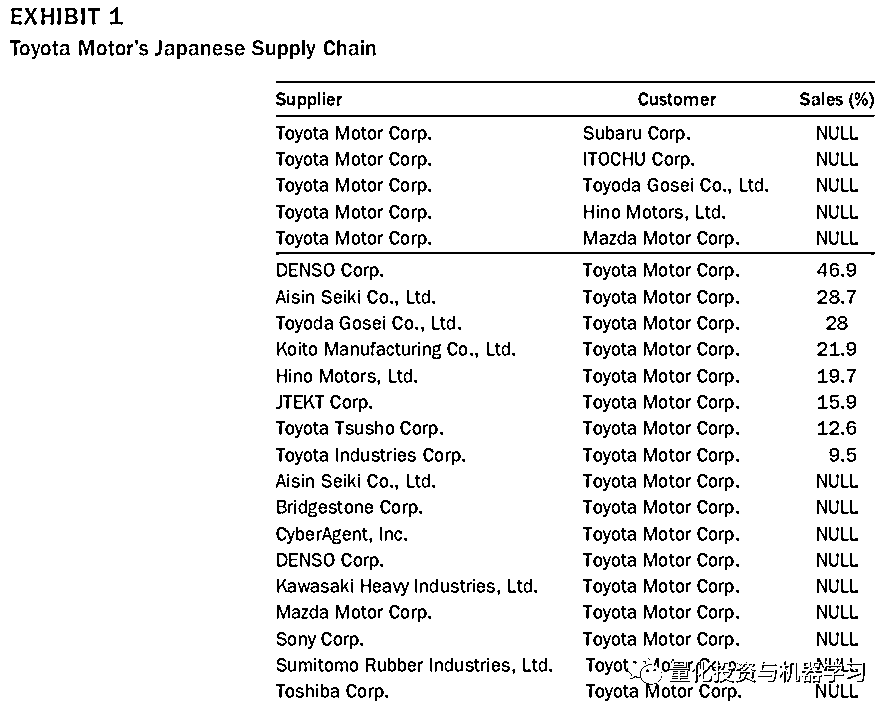

下图 2，作者基于 GICS 行业分类，做了一个各行业间供应链关系的网络图，图中圆圈的大小表示行业公司数量，连线的粗细表示行业间供应链关系的多少。

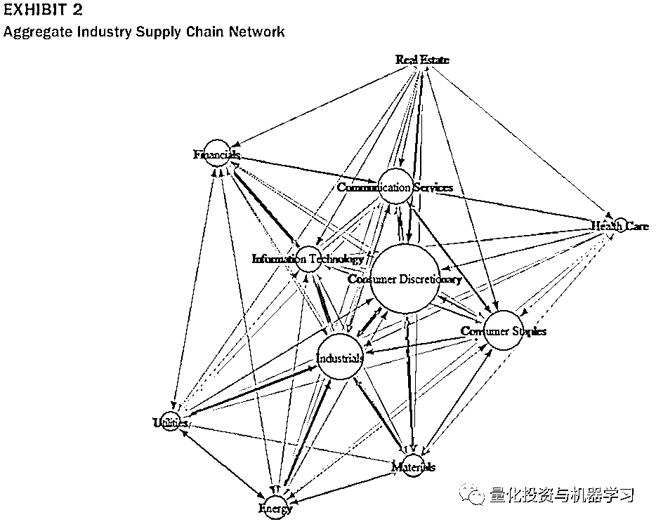

图 3 展示了历年数据中的供应链关系的数量及销售占比不为空的比率。

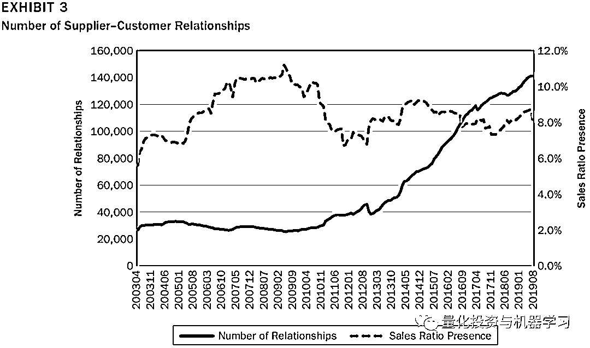

**Customer Momentum**

客户动量因子，主要研究的是客户的股价变动对于供应商股价的影响，所以在每个换仓时间点，需要计算每个股票作为供应商，其所有客户在过去一段时间的加权收益率。最简单的 Customer Momentum 计算方法如下，见 Cohen 和 Frazzini(2008)：<embed style="vertical-align: -3.014ex;width: 43.126ex;height: auto;max-width: 300% !important;" src="https://mmbiz.qlogo.cn/mmbiz_svg/a18XcQ1EBBggIibBXCZoqdl3YvMySvFrErnEUBNtKTdFRfNWQK1iaw78TC0icRomaIfj1efFYHG4tXUx2ib7ZCgMeHrC7Ihy0aIa/0?wx_fmt=svg" data-type="svg+xml">

其中 为 的客户 过去一个月收益率， 为销售占比。

但由于销售占比数据的缺失，基于上面的方法并不能有效的计算 Customer Momentum，所以 Hamuro 和 Okada(2018)想到了基于图网络的边中介中心度（Edge Betweeness Centrality）计算权重：

<embed style="vertical-align: -3.014ex;width: 46.626ex;height: auto;max-width: 300% !important;" src="https://mmbiz.qlogo.cn/mmbiz_svg/a18XcQ1EBBggIibBXCZoqdl3YvMySvFrEMvQwO0ZbHxUnE7YwAPibMS40lk6je0iaFsYRW2sNPHuA5fLibfGgXaGHehzsBicacVvl/0?wx_fmt=svg" data-type="svg+xml">

其中

<embed style="vertical-align: -3.014ex;width: 36.748ex;height: auto;max-width: 300% !important;" src="https://mmbiz.qlogo.cn/mmbiz_svg/a18XcQ1EBBggIibBXCZoqdl3YvMySvFrEpwwAcIagTCeAhpgkNGnpWicjNVS1qD0RUm79mLbSV7ZP7ekzrcJXcyMsXibUElbtHC/0?wx_fmt=svg" data-type="svg+xml">上式中 为 边的中介中心度。

**Edge betweenness centrality 是一个图或网络中经过某条边的最短路径的数量。Python 中的 NetworkX 可以很方便的计算该数值。**

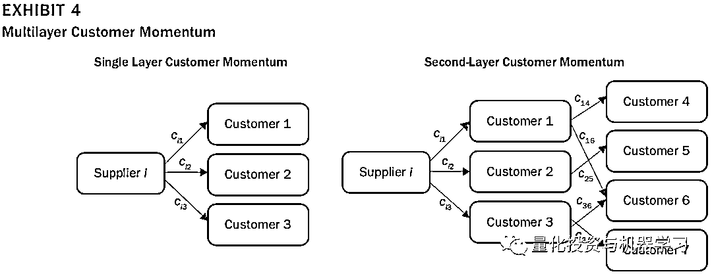

之前的大部分研究，都只讨论了供应商直接关联的客户（第一层）的 Customer Momentum，但 Yoshino 等(2020)发现，客户的客户，甚至递进了多层关系的客户，对供应商的股价仍有影响。如上图 4，左边是单层客户关系，右边是两层客户关系。所以当我们考虑多层（L 层）客户关系后，上式就变为：<embed style="vertical-align: -3.222ex;width: 54.681ex;height: auto;max-width: 300% !important;" src="https://mmbiz.qlogo.cn/mmbiz_svg/a18XcQ1EBBggIibBXCZoqdl3YvMySvFrEKZRSwfgiah5B4NyKRjSaibeZlfUTc09ZAnMqT5F4xSt2v49VHqpGgiayyhU4r3LiaL2e/0?wx_fmt=svg" data-type="svg+xml"><embed style="vertical-align: -3.222ex;width: 31.052ex;height: auto;max-width: 300% !important;" src="https://mmbiz.qlogo.cn/mmbiz_svg/a18XcQ1EBBggIibBXCZoqdl3YvMySvFrEnTn1eywCTZ8P2OS7CibNVR8pHqDgdQtBjL2ZrVeDs28RgxsPIEx1K3rZHic1bPOlKW/0?wx_fmt=svg" data-type="svg+xml">

**实证结果**

作者使用了月度的供应链数据，**其中不仅包括当月存续的供应链关系，还包括一年内结束的供应链关系**，因为即使供应链关系已经结束，其影响还在。股票池选取的是**MSCI 发达国家指数，包括了 23 个国家，近 3000 只股票。**

**覆盖度统计**

从图 5 可以看出，2004 年，供应链数据能覆盖平均大概 40%的股票，平均市值占比为 70%。到了 2019 年覆盖度达到了 90%左右。图 6 展示了不同行业的所有时间段的平均覆盖度，及 2019 年的覆盖度。

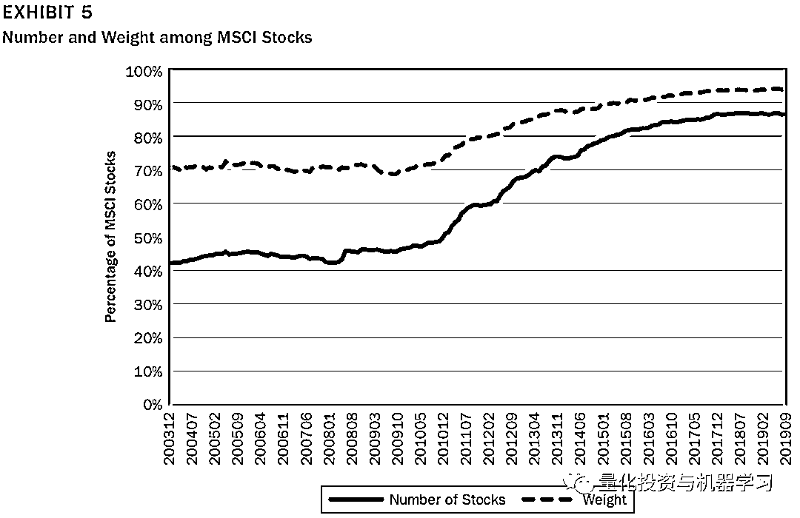

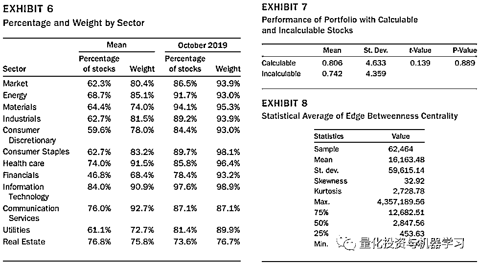

作者将所有股票按 Edge Betweeness Centrality 分成了 5 组，如图 9 所示，Mean 为每组销售占比的均值，可以看出，Edge Betweeness Centrality 与销售占比间存在明显的正相关性。这个结果给我们用 Edge Betweeness Centrality 作为权重提供了依据。

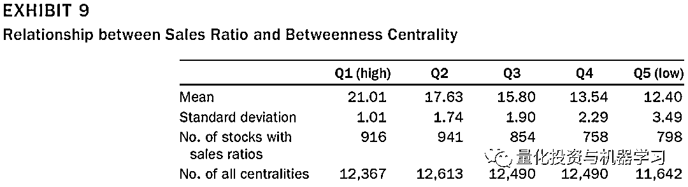

表 10 给出了不同 T 与 Layer 取值下，因子的自相关性，自相关性越高说明因子换手越小，比如第一行第一列，表示计算 Customer Momentum 用过去一个月的收益率，且只用直接关联的客户，这样因子的自相关性为 0，说明因子换手非常高。

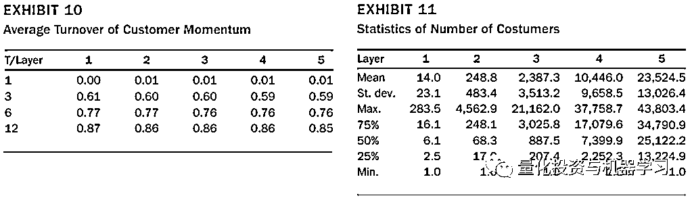

**测试结果**

针对 MSCI 发达国家指数成分股，基于 Customer Momentum 分为五组，做多 Top 组，做空 Bottom 组，月度调仓。下表 12 给出了测试结果：

*   其中 T 表示 Customer Momentum 计算时采用的不同的时间长度，比如 T=1，表示在等式 5 中采用过去 1 个月的收益率。

*   Layer 表示等式 5 中的 L，例如 Layer 为 5 时，表示考虑了 5 层的供应链关系。

*   mom 列是标准的动量因子（前 12 个月收益）多空测试的结果

*   第一行至第三行分别为多空策略的年化收益、年化标准差及夏普比率

*   第四行之后，是把收益与 Fama 因子回归后的结果，回归等式如下等式 7 所示：

<embed style="vertical-align: -0.623ex;width: 73.809ex;height: auto;" src="https://mmbiz.qlogo.cn/mmbiz_svg/a18XcQ1EBBggIibBXCZoqdl3YvMySvFrEhMUH1IDVlPT5hNt4E92TovpJElEia66ybtiaDfibUstPgrmgX41PYvjK7drVu1cuibS5/0?wx_fmt=svg" data-type="svg+xml">

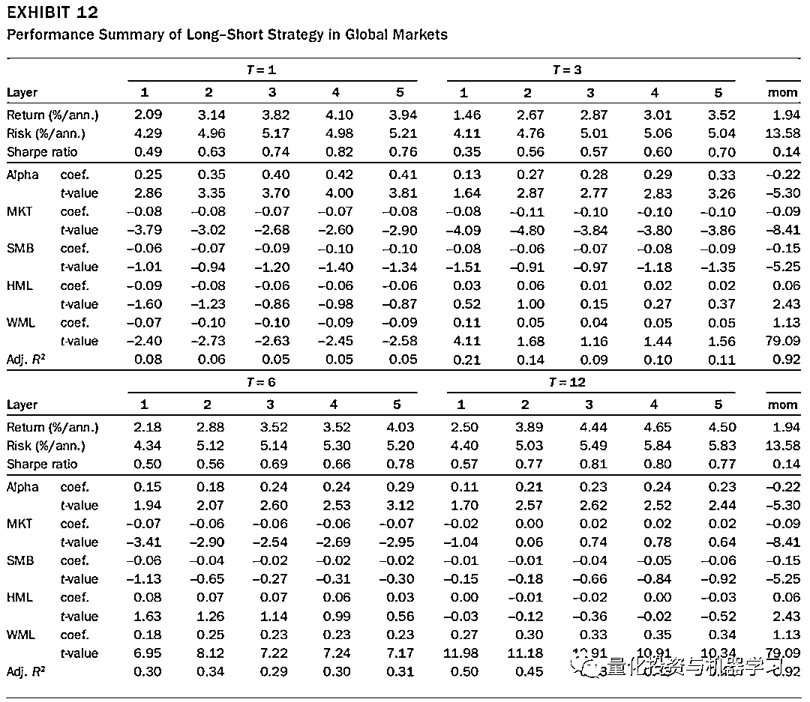

基于上表有以下发现：

*   与标准的动量策略相比，同样基于过去 12 个月收益的 Customer Momentum 因子效果更好（T=12，Layer=1）

*   对所有的 T，夏普比率基本随着 Layer 的增加而升高，基本在 Layer 为 3 达到最大。说明相对于只考虑直接的客户，客户的客户能带来更多的增量信息

*   T=1 与 T=12 的结果，相对更优，但如果考虑到换手率，T=12 的效果更优。

下图 13 给出了 T=12，Layer=3 的累计收益曲线图，年化收益 4.44%，夏普比率 0.81。

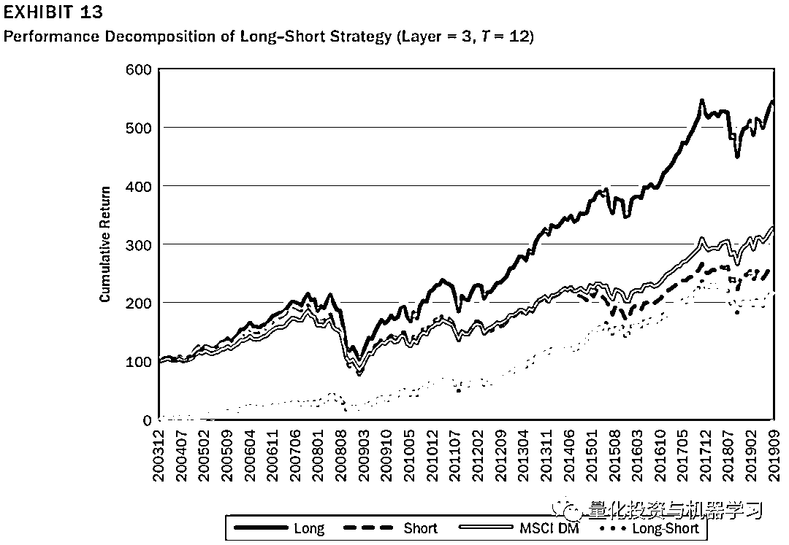

下表 14 展示了在美国、欧洲及日本市场分别测试的结果，整体而言，在各个市场，T=12 的效果均优于 T=1。

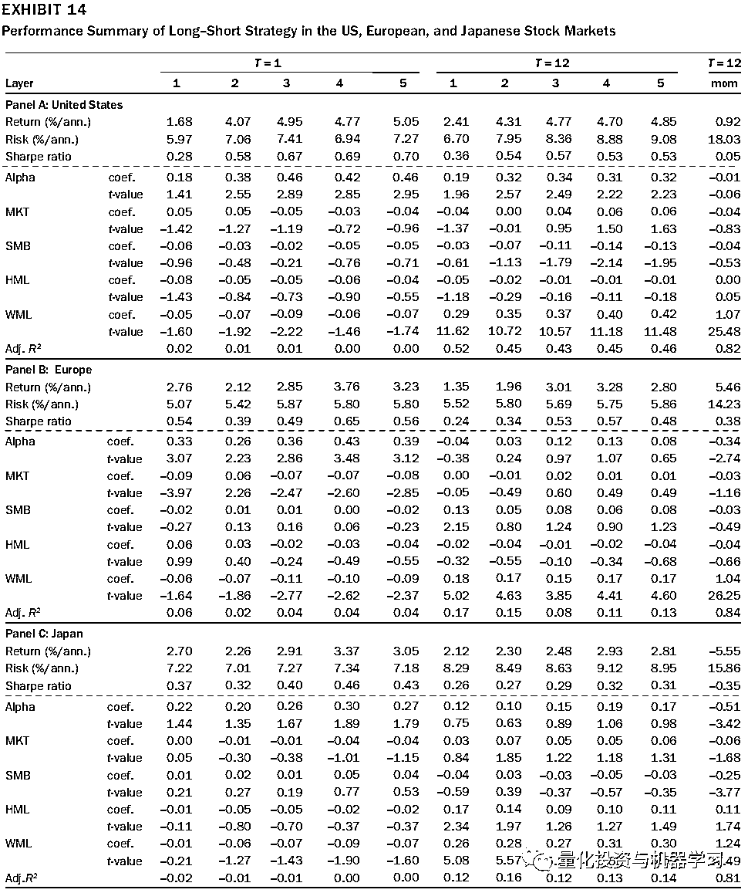

**总结**

供应链数据、产业链数据等越来越多样化的另类数据，正成为量化投资机构新关注的焦点，从逻辑出发，结合新兴的算法模型，将为 Alpha 的挖掘提供更多的可能性。

**参考文献（给出原文的参考文献，以供进行更深入的研究）**

Chen, R., Z. Gao, and X. Zhang. 2019\. “Return Predictability: Evidence from the US-China Supply Chain.” The Journal of Portfolio Management 45 (4): 143–151.

Cohen, L., and A. Frazzini. 2008\. “Economic Links and Predictable Returns.” Journal of Finance 63 (4): 1977–2011.

Dai, R., L. Ng, and N. Zaiats. 2020\. “Short Seller Attention.” SSRN, 2020.

Douglass, M. “Measuring Properties of Dynamic Customer-Supplier Networks.” Working paper, Stanford University, 2017.

Fama, E. F., and K. R. French. 1993\. “Common Risk Factors in the Returns on Stocks and Bonds.”Journal of Financial Economics 33 (1): 3–56.

Gofman, M., G. Segal, and Y. Wu. 2020\. “Production Networks and Stock Returns: The Role of Vertical Creative Destruction.” The Review of Financial Studies 33 (12): 5856–5905.

Grinold, R. C., and R. N. Kahn. 2011\. “Breadth, Skill, and Time.” The Journal of Portfolio Management 38 (1): 18–28.

Hamuro, Y., and K. Okada. “Predicting Stock Returns Based on the Time Lag in Information Diffusion through Supply Chain Networks.” Special Interest Group on Financial Informatics Technical Reports 40–45, Japanese Society for Artificial Intelligence, 2018.

Jegadeesh, N., and S. Titman. 1993\. “Returns to Buying Winners and Selling Losers: Implications for Stock Market Efficiency.” Journal of Finance 48 (1): 65–91.

Kim, D. Y., P. Zhu, W. Xiao, and Y. T. Lin. 2020\. “Customer Degree Centrality and Supplier Performance: The Moderating Role of Resource Dependence.” Operations Management Research 13: 22–38.

Newman, M. Networks: An Introduction 1st ed., Oxford, UK: Oxford University Press, 2010\. Paatela, A., E. Noschis, and A. P. Hameri. 2017\. “Abnormal Stock Returns Using Supply Chain Momentum and Operational Financials.” The Journal of Portfolio Management 43 (2): 50–60.

Seiler, A. “Measuring Performance in Supply Chain Networks.” Ph.D. thesis, Sanford Business School, 2016.

Shahrur, H., Y. L. Becker, and D. Rosenfeld. 2010\. “Return Predictability along the Supply Chain: The International Evidence.” Financial Analysts Journal 66 (3): 60–77.

Wu, L. 2015\. “Centrality of the Supply Chain Network.” 2015, https://ssrn.com/abstract=2651786. 

Yoshino, T., M. Morita, H. Tsuda, and T. Ohria. 2020\. “Customer Momentum Strategy: Empirical Study of the Japanese Stock Market.” Securities Analysts Journal 58 (5): 63–75 (in Japanese).

量化投资与机器学习微信公众号，是业内垂直于**量化投资、对冲基金、Fintech、人工智能、大数据**等领域的主流自媒体。公众号拥有来自**公募、私募、券商、期货、银行、保险、高校**等行业**20W+**关注者，连续 2 年被腾讯云+社区评选为“年度最佳作者”。