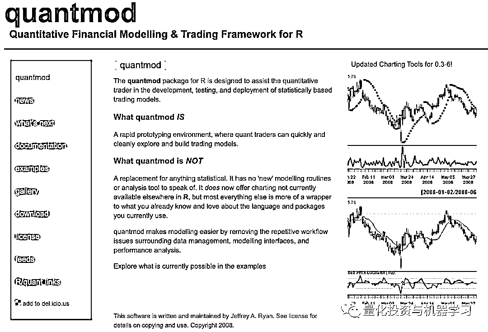

# 五、倍提升，加速 CPython！Quant 如何看？

> 原文：[`mp.weixin.qq.com/s?__biz=MzAxNTc0Mjg0Mg==&mid=2653317121&idx=1&sn=6d920e58c06d4280be27f37d26c6c763&chksm=802daa14b75a23028b66999a33f0302b1752fa1d5c6502a2e78d3ff97bbc59b37acba0df20c1&scene=27#wechat_redirect`](http://mp.weixin.qq.com/s?__biz=MzAxNTc0Mjg0Mg==&mid=2653317121&idx=1&sn=6d920e58c06d4280be27f37d26c6c763&chksm=802daa14b75a23028b66999a33f0302b1752fa1d5c6502a2e78d3ff97bbc59b37acba0df20c1&scene=27#wechat_redirect)

**今天既有正经推文，****也有量化八卦~**

去年 11 月，Python 之父 Guido van Rossum 宣布了他已经加入微软的消息：

在微软的日子里，他获得了选择项目的自由，并决定让 CPython 变得更快。微软将资助一个由 Guido van Rossum、Mark Shannon（加速计划的提出者，精通 Python 性能研究）、Eric Snow（Python 核心开发者之一、微软高级工程师）等多人组成的小团队来加速 CPython。

*团队将需要在一些约束条件下工作。比如：他们需要保持代码的可维护性，不破坏稳定的 ABI 兼容性，不破坏有限的 API 兼容性，不破坏或降低极端情况的速度，比如在 eval 堆栈上增加 100 万个用例。*

***加速 CPython！***

*在今年 2021 Python 语言峰会上，Guido Van Rossum 在表示：**他打算在 2022 年 10 月发布 3.11 版本时将快 CPython 的速度提高 1 倍。在接下来的四年里，他的目标是将 CPython 的速度提高到原来的 5 倍。***

***相关阅读***

** 

*整个计划被称为“香农计划”（即“Shannon Plan”，得名于提出者），期望花 4 年时间把 Python 提速 5 倍，即每年 1.5 倍。现在短期的计划是在 Python 3.11 版本中实现至少提速 1 倍。* 

*按照官方的发布周期，今年 10 月会发布 3.10 版本，而 3.11 版本将在 2022 年 10 月发布。*

*对于 3.11 版本的短期目标，Guido 还是在 ppt 中给自己兜了个底:*

**

*根据 Guido 的分享，第一项优化工作是“适应性的、专门的字节码解释器”，相关的设想已经起草到 PEP-659 中：*

**

*其它的优化内容还有：*

*   *优化帧堆栈，更快的调用，调整分配（optimize frame stack, faster calls, tweak allocation）。*

*   *2 开销”异常处理（“Zero overhead” exception handling）。*

*以及这些工作：*** 

*这些优化工作都要在不破坏接口兼容性的前提下实现，同时还要保持代码的可维护性。* 

## ***谁将从中受益？***

**

*1、运行 CPU 密集型纯 Python 代码的人**2、内置 Python 的网站的用户*

***对哪些人群效果甚微？***

**

*1、对于已经用 C 语言编写的代码（如 NumPy 和 TensorFlow）**2、I/O-bound 代码**3、多线程代码**4、及算法效率低下的代码*

*同时，团队还创建了一个 GitHub org，包含几个 repos：*

**** https://GitHub.com/faster-cpython/****

*Van Rossum 说道，基于 Python 工具的用户可以从这些变化中受益。从理论上讲，这可能包括像小摩（JPMorgan）、美国银行这样的投行，它们在风险定价系统中大量使用 Python 语言（尽管小摩在 Python2 向 Python3 方面切换已经很晚了）。同时，还包括使用 Python 进行数据分析的金融公司。*

*Van Rossum 没有评论这些变化对 Python 金融用户可能产生的影响。然而，考虑到 C++比 Python 快 100 倍以上，它不太可能让 Python 在短期内适用于交易系统。*

**

*https://benchmarksgame-team.pages.debian.net/benchmarksgame/fastest/gpp-python3.html*

***量化圈内人评价***

*Citadel 的前量化分析师 Jeffrey Ryan 评价道，**Python 的速度提高 2-5 倍在金融领域不会产生多大影响**。*

 *Python 中使用的大部分繁重的计算代码已经在内部使用了 C（或 c++ /Fortran），比如 blas/lapack/numpy/tensorflow 等。你可能会像这些库一样，用 C++编写一次，然后像这些库那一用 Python 封装它。* 

*Jeffrey Ryan 还说：即使 Python 在 2022 年及以后确实变得更快了，今日领域的用户可能会慢慢接受它的新迭代。对于大多数人来说。从 2\. x 到 3\. x 的变化太痛苦了，不想再经历一次。如果非要有什么不同的话，Jeffrey Ryan 建议到：“我认为这可以让人们重新考虑使用 Python，并转向更有意义的新语言，比如 Julia 或 Golang。”*

***量化八卦时间***

*说起**Jeffrey Ryan**，公众号给大家多扯一扯*

**

*Citadel，每个人都想为之工作的对冲基金，**但其竞业协议也是很苛刻！***

*2009 年，Citadel 向其高频交易公司前负责人 Mikhail Malyshev 支付了每月 3 万美元的补偿费，但当 Mikhail Malyshev 试图在竞业禁止期间成立自己的公司，Citadel 将他告上了法庭。*

*2011 年，Yi Zhang 在卡内基梅隆大学获得机器学习博士学位，并在 IBM 的 Watson 研究中心担任研究实习生后加入 Citadel。在接下来的 6 年里，他成为 Citadel 芝加哥办公室的量化研究员，从事统计套利和高频交易"Alpha Generation”的研究。2017 年，Yi Zhang 离开了 Citadel。**因为他有 2 年的竞业协议！***

***虽然严格，但是这还是不能阻止所有人对头部对冲基金的热情！*** 

*同样，2019 年 6 月，Jeffrey Ryan 离开了 Citadel，但是竞业协议让他一段时间内不能在同行工作了。对于 Quant 来说，这是一件大事，**因为 Ryan 不是一位普通的量化专家，他很特别！***

*如果你是 R 语言的一名爱好者的话。他组织了广受欢迎的 R/Finance 会议（现在已经是第 11 个年头了）：*

**

*他编写了流行的 xtx 工具，用于处理在 R 语言中不同的基于时间的数据类：*

**

*他还编写了 quantmod（Quantitative Financial Modelling Framework），该框架已被下载数百万次，用户可以构建、交易和分析量化金融交易策略：*

**

*今年，Jeffrey Ryan 结束竞业期，他并没有去外界传闻的 Point72，而是成立了一家量化咨询公司，名为：**Quant at Large**。其主要工作是帮助独立投资者和基金管理者掌握量化交易的所有相关知识，从软件、算法到数据 pipelines、分析工具、Alpha 研究、计算资源、风险和性能工具等，啥都有！*

*目前还不清楚 Jeffrey Ryan 是否会承担 Quant at Large 的所有工作，但目前看来他是唯一的员工。正如 Jeffrey Ryan 在他简历中写的，他在量化金融领域工作了 20 年。他于 2013 年加入 Citadel 量化策略部门，当时该基金刚刚起步。在此期间，他帮助团队构建了围绕“数据处理、Alpha 验证、风险管理和高性能计算”等工具。*

*所以他做这个信手拈来啊~*

*量化投资与机器学习微信公众号，是业内垂直于**量化投资、对冲基金、Fintech、人工智能、大数据**等领域的主流自媒体。公众号拥有来自**公募、私募、券商、期货、银行、保险、高校**等行业**20W+**关注者，连续 2 年被腾讯云+社区评选为“年度最佳作者”。*