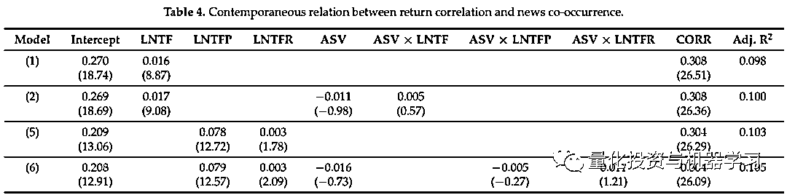

# News Co-Occurrences：关注同时出现在新闻中的股票

> 原文：[`mp.weixin.qq.com/s?__biz=MzAxNTc0Mjg0Mg==&mid=2653316934&idx=1&sn=0bae7eba4fc5a8b462ee21ded87e3718&chksm=802da553b75a2c45232d3928fee7677c7fce7e2ccea7c77377e3748db3c7b884450f41ce323a&scene=27#wechat_redirect`](http://mp.weixin.qq.com/s?__biz=MzAxNTc0Mjg0Mg==&mid=2653316934&idx=1&sn=0bae7eba4fc5a8b462ee21ded87e3718&chksm=802da553b75a2c45232d3928fee7677c7fce7e2ccea7c77377e3748db3c7b884450f41ce323a&scene=27#wechat_redirect)

量化投资与机器学习公众号独家解读

量化投资与机器学公众号 *** ***QIML Insight——深度研读系列 ******是公众号今年全力打造的一档**深度、前沿、高水准**栏目。

公众号**遴选**了各大期刊最新论文，按照理解和提炼的方式为读者呈现每篇论文最精华的部分。QIML 希望大家能够读到可以成长的量化文章，愿与你共同进步！

[第一期 ](http://mp.weixin.qq.com/s?__biz=MzAxNTc0Mjg0Mg==&mid=2653315304&idx=1&sn=8f36bc03096995655abea040e2ee3f94&chksm=802da2fdb75a2beb5d210c8235ab64fba0ba510b16683599189419f2ce0af483ea9c020707f6&scene=21#wechat_redirect) | [第二期](http://mp.weixin.qq.com/s?__biz=MzAxNTc0Mjg0Mg==&mid=2653315407&idx=1&sn=e9f5e375aedcb0b8f82d6c42b7ea3e80&chksm=802da35ab75a2a4c1aa8aa458bb5878ccbe0499b3c4e01bfff51508610c4e45f07d5b16fd6ab&scene=21#wechat_redirect) | [第三期](http://mp.weixin.qq.com/s?__biz=MzAxNTc0Mjg0Mg==&mid=2653315880&idx=1&sn=0d7bd33e5f1697973c1f365b729369b5&chksm=802da13db75a282b762267494b493c81b5595f35ca41da6a34625a13c02c6e1765d641ed7f0c&scene=21#wechat_redirect) | [第四期](http://mp.weixin.qq.com/s?__biz=MzAxNTc0Mjg0Mg==&mid=2653316512&idx=1&sn=d88a7b3d5c46f307370fe7e8939b4bbd&chksm=802da7b5b75a2ea3f74d3f7f1dff4c57c811a51f60f77104f0a8de86301f98f3b28814daa834&scene=21#wechat_redirect)| [第五期](http://mp.weixin.qq.com/s?__biz=MzAxNTc0Mjg0Mg==&mid=2653316725&idx=1&sn=4ef212b4f7ffca70da72a9b72917676e&chksm=802da460b75a2d762a41f36c89140ce6f364cf2ab1994ffccec7306b8186641f4598372495ed&scene=21#wechat_redirect)

> **本期遴选论文** **来源：**Journal of Risk and Financial Management 19 March 2019
> **作者：**Yi Tang、Yilu Zhou、Marshall Hong
> **标题：**News Co-Occurrences, Stock Return Correlations, and Portfolio Construction Implications

**核心观点**

*   **股票同时出现在新闻的频率与股票市值、股票波动及分析师覆盖度之间存在明显的关联性。**

*   **个股之间的相关性随着在新闻中同时出现频率的增加而增加。**

*   **个股在新闻中同时出现频率可以用于预测未来个股之间的相关性，从而应用与风险模型。**

随着 NLP 技术的发展，新闻分析数据在量化投资中的应用的场景越来越丰富。本篇论文从新闻中同时出现不同股票（News Co-Occurrences）的角度出发，去验证其所包含的经济学含义，并探索其在量化投资中的应用。

同时出现在一篇新闻的股票之间是否有某种程度上的关联？同时出现的频率与股票关注度之间的变化是否有关系？是否会对股票之间的相关性产生影响？这些都是作者试图在文中探索的问题。

作者主要采用了线性回归的方式进行实证分析，涉及的数据及相关指标说明如下：

*   数据时间范围：2007 年 5 月-2016 年 12 月
*   股票范围：S&P1500
*   计算准则：月度指标至少需要 24 个月的数据、日度指标至少需要 15 天的数据
*   所有指标都在月末计算

文中涉及的其他指标的说明：

**统计分析**

作者首先对不同分组的股票的相关指标做了统，一共分为三组：

*   COC=１：当月至少和别的股票出现在同一篇新闻的所有股票
*   COC=0：当月未曾和别的股票出现在同一篇新闻的股票
*   All stocks：S&P500 所有股票

对以上三组股票分别计算 2007 年 5 月至 2016 年 12 月每月末截面上各指标的均值，然后再计算时序上每月均值的平均值，计算结果如下表所示，可以看出：

*   第一列 Pi 表示，每个月，平均有 47%的股票至少和其他股票同时出现在至少一篇新闻里。

*   **和别的股票同时出现在一篇新闻的股票（COC=1）跟从未和别的股票出现在同一篇新闻的股票（COC=0）相比具有更低的风险（BETA 及 IVOL 更低）、更高的市值（ME）及更高的分析师覆盖（CVGR），且与其他股票之间的相关性也更高（CORR）。**

**News Co-Occurrences 与股票特征之间的关系**

**News Co-Occurrences 截面的变动**

作者采用 Fama-MacBeth 的方法对以下两个等式进行回归分析（先截面回归，再算回归系数在时序上的均值）

<embed style="vertical-align: -3.995ex;width: 82.356ex;height: auto;" src="https://mmbiz.qlogo.cn/mmbiz_svg/a18XcQ1EBBggIibBXCZoqdmrcATGp9tbjUyGJ0icW1gfP4KY3EOhLqxP0LwVd2S4iayzY2jQNd9avnekKMqKogvRfMGs6aWsNQt/0?wx_fmt=svg" data-type="svg+xml">

相关变量的解释： 

下表给出了回归的结果，其中 Model1 对应等式 4，Model2 对应等式 5。其中 Model1 中，IND、CS 及 GEO 的回归系数分别是 0.073、0.098 及 0.032，且在置信度 99%的区间里均显著。这意味着处于同一个行业，存在供应链关系或在同一个地区的股票有更高的概率出现在同一篇新闻中。即使在 Model2 中控制了其他变量（包括 BETA、SIZE、IVOL 及 CVRG），IND、CS 及 GEO 的回归结果与 Model1 相比基本没受影响。同时也可以看出，同时出现在新闻的数量与 BETA 成负相关，与 SIZE 和 CVRG 呈正相关，这个结果与表 1 的结果保持一致。

**News Co-Occurrences 的拆解**

作者用 LNTFP 和 LNTFR 分别表示模型的拟合值和残差。每个月，分别计算 LNTFP 及 LNTFR 的均值和标准差，再计算时序上的统计值。在表 2 的 B 部分，Expected 表示拟合值 LNTFP，Shock 表示残差 LNTFR。可以看出，Model1 和 Model2 的结果非常类似。再后续的分析应用中，作者选取了更完整的 Model2。

**News Co-Occurrences 与投资者关注度之间的关系**

为了研究 News Co-Occurrences 与投资者关注度之间的关系，作者采用了两个模型，等式 6 和 7 的区别是，等式 6 中 News Co-Occurrences 直接用 LNTF 表示。等式 7 中，News Co-Occurrences 用两个变量 LNTFP 和 LNTFR 表示，它们各自有自己的回归系数，这样做就可以看出是 LNTFP 更重要还是 LNTFR 更重要。

<embed style="vertical-align: -0.666ex;width: 34.644ex;height: auto;" src="https://mmbiz.qlogo.cn/mmbiz_svg/a18XcQ1EBBggIibBXCZoqdmrcATGp9tbjU8ia0NAvuhah3gZk4gC1EOPkApQq7FdO5JYPU7dfbVkiaLiae9W3tDaxpRHAhAcK39g/0?wx_fmt=svg" data-type="svg+xml">

<embed style="vertical-align: -0.666ex;width: 53.879ex;height: auto;" src="https://mmbiz.qlogo.cn/mmbiz_svg/a18XcQ1EBBggIibBXCZoqdmrcATGp9tbjKR69LIb6iaWtjt8pNPBicoCSZhHSWurRDibZcm91KdkZj4wwfdrib3GibjwnTquJp5xWt/0?wx_fmt=svg" data-type="svg+xml">

下表 3 给出了以上两个模型的回归结果，可以看出 LNTF、LNTFP 及 LNTFR 的回归系数均显著，但可以看出 LNTFR 相比 LNTFP 来的更显著，说明异常的 News Co-Occurrences 更能引起投资者的关注。

**News Co-Occurrences VS 股票之间的相关性：同步性**

作者通过以下两个模型，验证股票之间的相关性与 News Co-Occurrences 的关系。大部分变量在上文解释过。这里在重复下， CORR_ij,t 表示在 t 月，股票 i 与 j 日度收益率的相关系数。

<embed style="vertical-align: -6.218ex;width: 95.444ex;height: auto;" src="https://mmbiz.qlogo.cn/mmbiz_svg/a18XcQ1EBBggIibBXCZoqdmrcATGp9tbjz4Nb7BicGgyicGQgql2MByndVPBg343xmDI9vXrdue5A189ZHCiag4Ex9nVtaLcl3m2/0?wx_fmt=svg" data-type="svg+xml">以上两个模型的主要区别是，模型 8 使用了 LNTF，用以整体判断 News Co-Occurrences 与股票之间的相关性是否有关系。模型 9 分别使用了 LNTFP 和 LNTFR，就可以知道是 LNTFP 还是 LNTFR 与 CORR 的关联性更大。

表 4 给出了回归的结果：

其中 Model(2)对应是等式 8 的回归结果，可以看出，ASV 与 ASV*LNTF 的回归系数并不显著。且相比 Model(1)，LNTF 及 CORR 的回归结果基本无变化。总体可以看出，News Co-Occurrences 与股票之间的相关性存在显著的关联性。

其中 Model(6)对应是等式 9 的回归结果，可以看出，相对 LNTFR，LNTFP 的回归系数更显著，说明长期的 LNTFP 与股票之间的相关性的关联程度更大。

**News Co-Occurrences VS 股票之间的相关性：预测性**

上一部分，我们用当期的 CORR 与当期的 News Co-Occurrences 进行回归，检验它们的同步关联性。这一次，我们用当期的 News Co-Occurrences 与后面 K 期的 CORR 进行回归，检验 News Co-Occurrences 对 CORR 的预测性。

<embed style="vertical-align: -9.26ex;width: 93.152ex;height: auto;" src="https://mmbiz.qlogo.cn/mmbiz_svg/a18XcQ1EBBggIibBXCZoqdmrcATGp9tbjLqDdErkoWWsPbRTc5uT5A1iawWycibIHQ074EZiareonCvVBc0611NuWNwibuibBeLQtw/0?wx_fmt=svg" data-type="svg+xml">

下表 5 给型的回归结其中 PanelA 对应等式 10，PanelB 对应等式 11，PanelC 对应等式 12，PanelD 对应等式 13。果，不同的 K，表示不同的预测间隔，如 K=2，表示用当月的 News Co-Occurrences 预测未来 2 个月后的 CORR。主要结论如下：News Co-Occurrences 能够显著预测未来个股之间的相关性 CORR，且长期的均值 LNTFP 比短期的变动 LNTFR 具有更强的预测性，且不随着预测间隔的增加出现衰减。

**总结**

以上两部分可以知道：

*   News Co-Occurrences 的长期均值（LNTFP）与股票之间相关性的关联度更大
*   News Co-Occurrences 的短期变化（LNTFR）与投资者对股票的异常关注关联度更大
*   News Co-Occurrences 能够显著预测未来个股之间的相关性 CORR，且长期的均值 LNTFP 比短期的变动 LNTFR 具有更强的预测性，且不随着预测间隔的增加出现衰减。

量化投资与机器学习微信公众号，是业内垂直于**量化投资、对冲基金、Fintech、人工智能、大数据**等领域的主流自媒体。公众号拥有来自**公募、私募、券商、期货、银行、保险、高校**等行业**20W+**关注者，连续 2 年被腾讯云+社区评选为“年度最佳作者”。