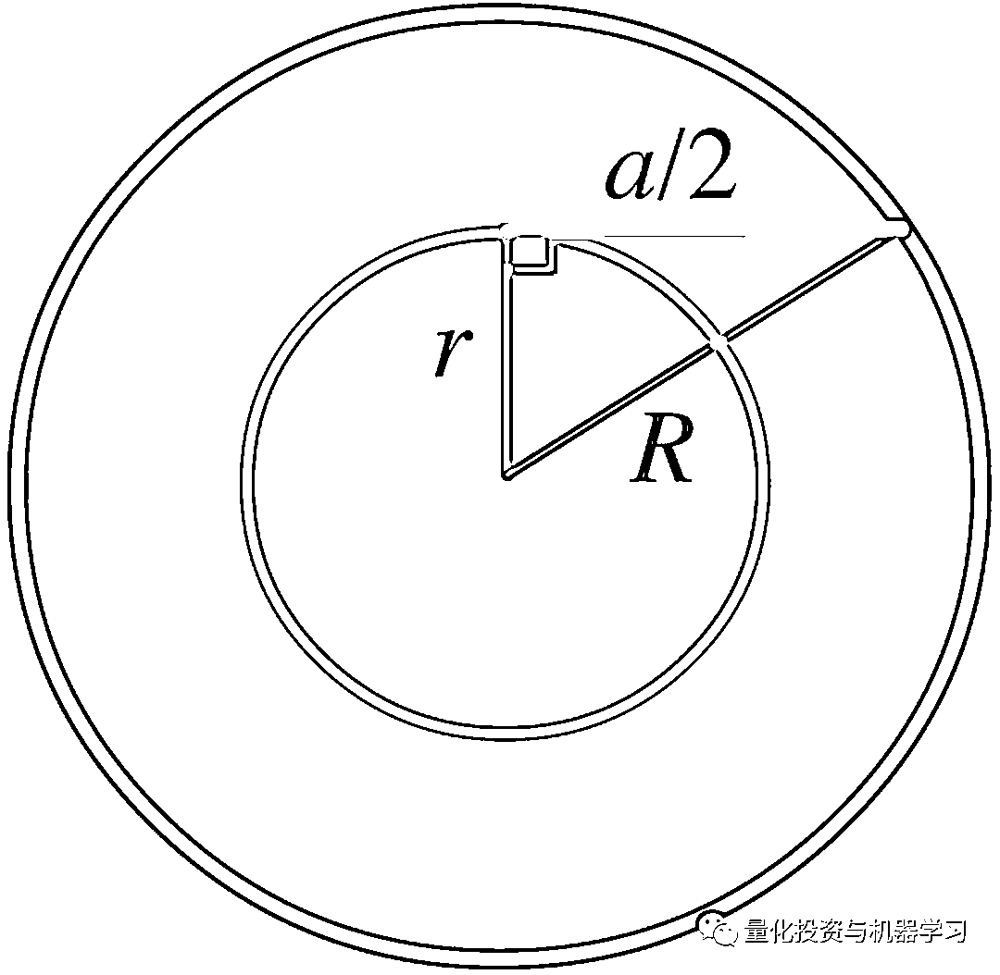
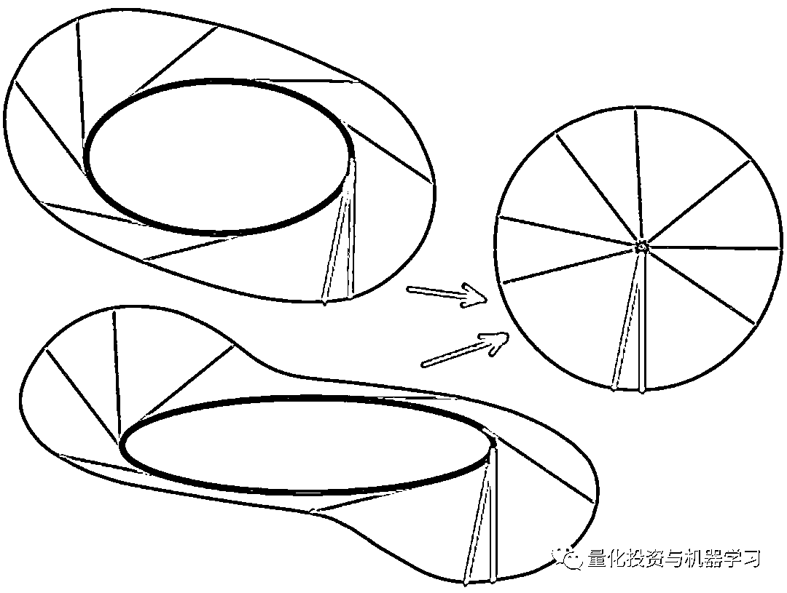

# Quant Puzzle：高级享受！

> 原文：[`mp.weixin.qq.com/s?__biz=MzAxNTc0Mjg0Mg==&mid=2653316870&idx=1&sn=9ecbea53c7f6cfee0c3344137eb6eb83&chksm=802da513b75a2c05272ba4e803ddcc6a01b3cfda07d228d8a45a47eeeac445fa62c08da673ce&scene=27#wechat_redirect`](http://mp.weixin.qq.com/s?__biz=MzAxNTc0Mjg0Mg==&mid=2653316870&idx=1&sn=9ecbea53c7f6cfee0c3344137eb6eb83&chksm=802da513b75a2c05272ba4e803ddcc6a01b3cfda07d228d8a45a47eeeac445fa62c08da673ce&scene=27#wechat_redirect)

身为一名 Quant，平时最大的乐趣就在于解决一些有趣的 Puzzle，不管你是在面试中还是在休息时，都可以让你的思维更加活跃，知识面更加宽广。

作为 20201 QIML Insight 的又一系列。今天公众号将正式推出：

这个系列是有趣的，我们会围绕有关 Quant 领域的 Puzzle。可能很烧脑，可能会超出你的知识面，但是如果能深入其中，必能发现很多乐趣。

**我们除了每天想模型、写代码，如果能在一些 Puzzle 中劳逸结合，那绝对是一种****高级****的乐趣享受！**

**Quant Puzzle 第一期**

你有两个圆形垫圈。每个都由相同的材料制成，每个都有相同的厚度。两个垫圈的中心孔直径不同。在每个垫圈上，从一边到另一边都画了一条直线，这两条直线长度相同，如下图所示：

**问题**

哪个垫圈更重?

**解题思路**

这个问题有两种解决方法：

*   第一种涉及**勾股定理**

*   第二种涉及**Mamikon 定理**

**1、勾股定理** 

画一个直角三角形，如下图所示，r 为内圆半径，R 为外圆半径。设 x 为连接外圆和内圆的半弦。

环的面积 A 是外圆和内圆面积之差：

使用勾股定理：

将上述两个方程结合起来，用弦长表示环的面积 A：

因此，面积只与弦长有关。由于两个弦的长度相同，故内环的面积是相同的。

再由于两个垫圈的厚度相同，覆盖面积相同。并且由于它们是由相同的材料制成的，所以，**两个垫圈的重量也是一样的！**

**2、Mamikon 定理**

▍定理原理：不论原始曲线的形状如何，切线扫描的面积等于其切线簇的面积。

将切线点绕内圆的中心旋转，结果是这条线扫过一个区域（左图）。

如果我们围绕切点旋转这条线，但保持该点静止（右图），这条线将扫过一个和前面一样的区域。这个面积与内圆的大小无关，它只取决于切线的长度。

这种面积的等效性就是 Mamikon 定理的一个例子。

**Mamikon 定理**

那么我们来为大家解释一下**Mamikon 定理**的原理，一下内容来自*知乎@数据文明*：

像许多其他伟大的发现，Mamikon 定理的方法只不过是基于一个非常简单的想法。在两个同心圆中，里面的圆做切线可以得到外面圆的一条弦。如下图：

接下来就是求这个环的面积，在一个半径为 的圆中面积为 ，在大圆中面积为 。所以圆环的面积为 。但是发现弦的长度为 。那么形成了一个直角边分别为 ， 斜边为 直角三角形。又由于勾股定理：所以最终的答案仅仅依靠 就可以表示圆环的面积。Mamikon 仅仅凭借这一发现便找到了定理的钥匙。

这样我们就可用其他的方法来求面积了，按照内圆把环分割为一个切线簇，将中间的圆缩为一个点，那么得到了一个直径为 a 的圆，圆的面积为 pi*a²/4 一个革命性的理论完成。

同心圆太简单那就来点复杂点的，如下图若一辆自行车后车轮做椭圆运动，那么前车轮的轨迹以红色表示，求绿色阴影部分面积。

因为自行车在走过的路径上没有重复，且自行车的长度一定，那么就可以用 Mamikon’s Theorem。将环用内椭圆切线去分割环，将椭圆缩为一个点。

最终证明了，面积和自行车后轮走过的轨迹无关，只和车摆过的角度与车身长度有关。

**关于 QIML Insight**

 Rebeco：A 股低风险异象的实证研究

2021-06-01

 波动因子：基于 NLP 的行业分类

2021-05-24

 MSCI：捕捉因子模型非线性的收益

2021-04-26

 拥挤交易：行业轮动与因子择时策略的构建

2021-04-06

 统一框架下的截面动量与时序动量策略

2021-04-01

 中国量化私募面试 Q&A 系列——鸣石投资

2021-05-19

 中国量化私募面试 Q&A 系列——白鹭资管

2021-04-20

量化投资与机器学习微信公众号，是业内垂直于**量化投资、对冲基金、Fintech、人工智能、大数据**等领域的主流自媒体。公众号拥有来自**公募、私募、券商、期货、银行、保险、高校**等行业**20W+**关注者，连续 2 年被腾讯云+社区评选为“年度最佳作者”。