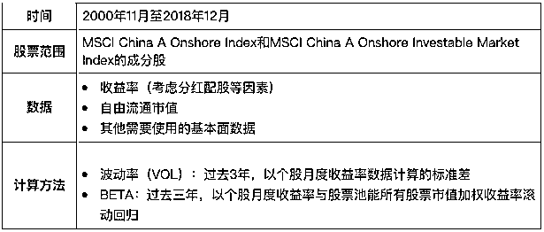
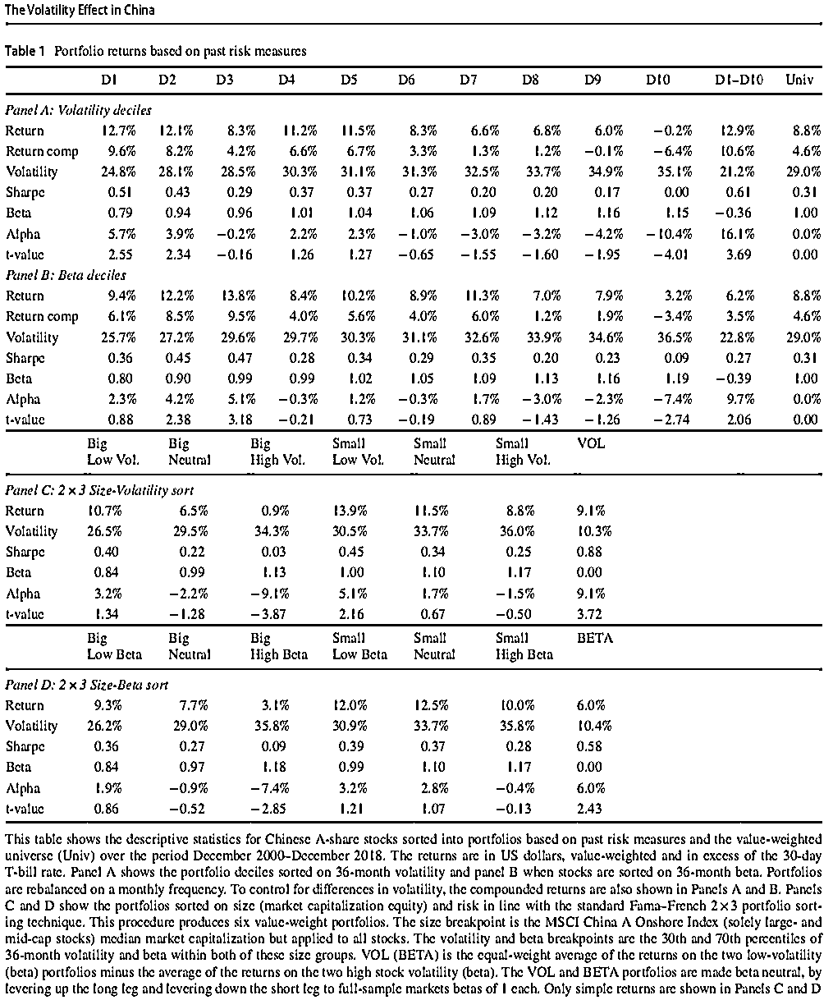
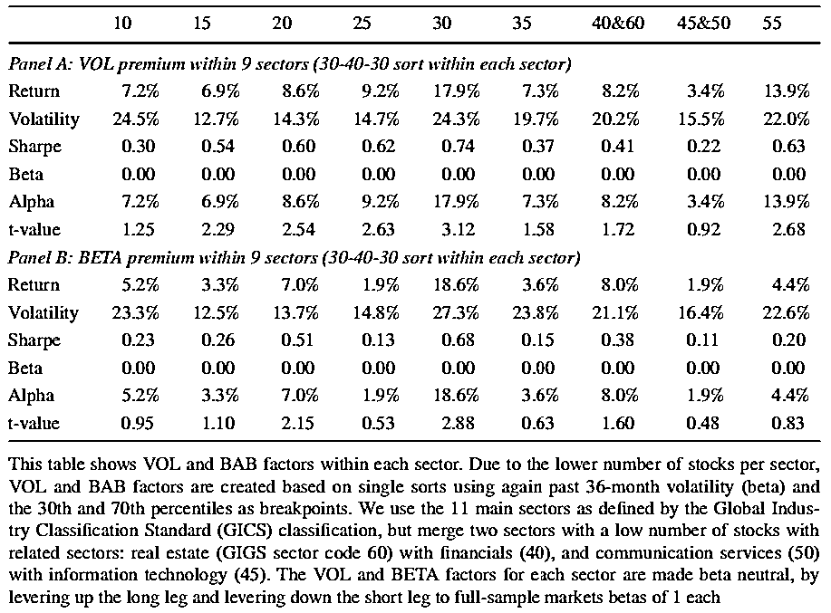
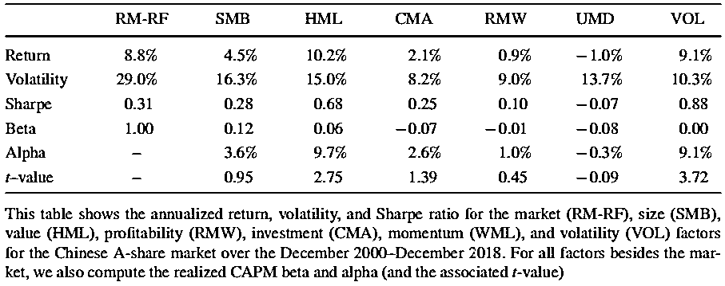
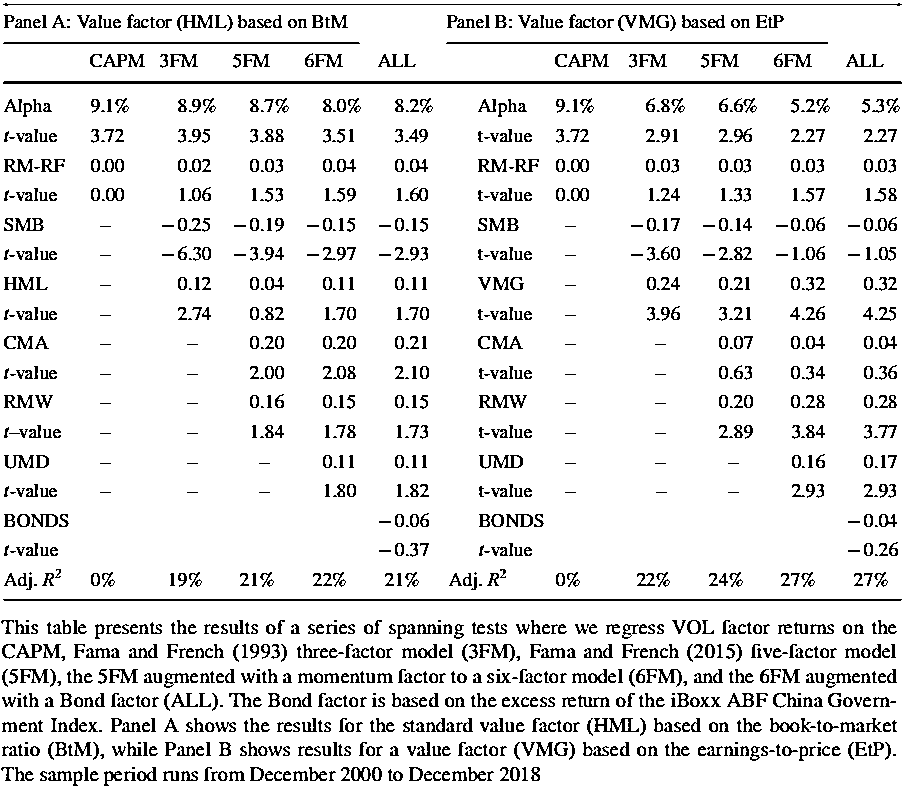
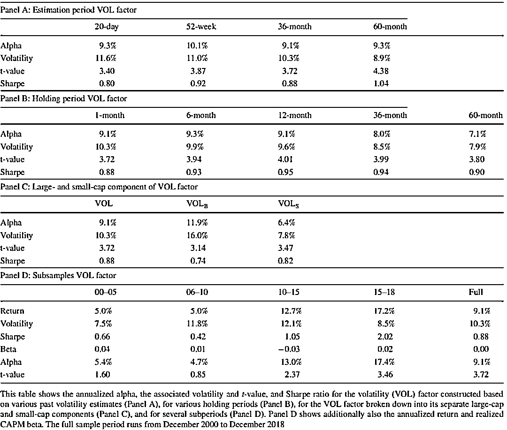

# Rebeco：A 股低风险异象的实证研究

> 原文：[`mp.weixin.qq.com/s?__biz=MzAxNTc0Mjg0Mg==&mid=2653316725&idx=1&sn=4ef212b4f7ffca70da72a9b72917676e&chksm=802da460b75a2d762a41f36c89140ce6f364cf2ab1994ffccec7306b8186641f4598372495ed&scene=27#wechat_redirect`](http://mp.weixin.qq.com/s?__biz=MzAxNTc0Mjg0Mg==&mid=2653316725&idx=1&sn=4ef212b4f7ffca70da72a9b72917676e&chksm=802da460b75a2d762a41f36c89140ce6f364cf2ab1994ffccec7306b8186641f4598372495ed&scene=27#wechat_redirect)

量化投资与机器学习公众号独家解读

量化投资与机器学公众号 *** ***QIML Insight——深度研读系列 ******是公众号今年全力打造的一档**深度、前沿、高水准**栏目。

公众号**遴选**了各大期刊最新论文，按照理解和提炼的方式为读者呈现每篇论文最精华的部分。QIML 希望大家能够读到可以成长的量化文章，愿与你共同进步！

[第一期 ](http://mp.weixin.qq.com/s?__biz=MzAxNTc0Mjg0Mg==&mid=2653315304&idx=1&sn=8f36bc03096995655abea040e2ee3f94&chksm=802da2fdb75a2beb5d210c8235ab64fba0ba510b16683599189419f2ce0af483ea9c020707f6&scene=21#wechat_redirect) | [第二期](http://mp.weixin.qq.com/s?__biz=MzAxNTc0Mjg0Mg==&mid=2653315407&idx=1&sn=e9f5e375aedcb0b8f82d6c42b7ea3e80&chksm=802da35ab75a2a4c1aa8aa458bb5878ccbe0499b3c4e01bfff51508610c4e45f07d5b16fd6ab&scene=21#wechat_redirect) | [第三期](http://mp.weixin.qq.com/s?__biz=MzAxNTc0Mjg0Mg==&mid=2653315880&idx=1&sn=0d7bd33e5f1697973c1f365b729369b5&chksm=802da13db75a282b762267494b493c81b5595f35ca41da6a34625a13c02c6e1765d641ed7f0c&scene=21#wechat_redirect) | [第四期](http://mp.weixin.qq.com/s?__biz=MzAxNTc0Mjg0Mg==&mid=2653316512&idx=1&sn=d88a7b3d5c46f307370fe7e8939b4bbd&chksm=802da7b5b75a2ea3f74d3f7f1dff4c57c811a51f60f77104f0a8de86301f98f3b28814daa834&scene=21#wechat_redirect)

> **本期遴选论文** **来源：**Journal of Asset Management 19-05-2021
> **作者：**David Blitz、Matthias X.Hanauer、Pim van Vliet
> **标题：**The Volatility Effect in China

随着中国资本市场的逐步开放，越来越多的海外机构开始关注 A 股市场，及 A 股市场的因子投资。今天为大家带来著名对冲基金 Robeco 关于 A 股低风险异象的实证研究。

**核心观点**

*   **A 股市场存在很强的低风险异象（low-risk anomaly），这种异象的主要原因是波动率，而不是 Beta；**

*   **A 股市场的低风险异象是非常清晰的，并不能被价值和规模等其他因子所解释；**

*   **A 股市场以个人交易者为主的特点是低风险异象的主要原因。**

**数据和方法**

**实证结果**

每个月，根据所有股票的 VOL 或 BETA 对股票进行从低到高的排序，并分成十组，计算下个月每组的市值加权超额收益率。

下表 A 部分展示了 VOL 因子的测试结果：

*   分组后，下一期每组的波动率（Volatility）从 D1 组的 24.8%到 D10 组的 35.1%，呈现单调递增的趋势，说明基于 VOL 分组是有效的；

*   D1 组的 VOL 最低，收益率最高，夏普比率为 0.51；D10 组的 VOL 最高，收益率最低，夏普比率为 0.00，D1-D10 的经 Beta 调整后的 Alpha 为 16.1%；

*   综上，可以发现存在明显的低风险异象（以 VOL 因子表示风险）。

下表 B 部分展示了 BETA 因子的测试结果：

*   分组后，下一期每组的波动率（Volatility）从 D1 组的 25.7%到 D10 组的 36.5%，呈现单调递增的趋势，说明基于 BETA 分组是有效的。

*   但是 D1 组的 Alpha 为 2.3%，统计上并不显著，D10 组的 Alpha 为-7.4%，且 D3 组的收益、Alpha 及 Sharpe 最高；D10-D1 的 Alpha 明显小于 VOL 因子。

*   Blitz and van Vliet (2007)在美国、欧洲及日本市场也发现了 VOL 因子比 BETA 因子更优的现象，但 A 股市场 BETA 与 VOL 的差距更为明显。

*   BETA 与 VOL 的差别在于 BETA 除了考虑了波动，还考虑了相关性。换句话说，主要是由于相关性，导致了 BETA 与 VOL 的差别。

下表 C 与 D 部分展示了 Fama 方法下 VOL 因子收益计算的方法，其中最右边的 VOL 列是由以下公式计算而来（BETA 的计算方式也一致）

<embed style="vertical-align: -0.566ex;width: 67.63ex;height: auto;" src="https://mmbiz.qlogo.cn/mmbiz_svg/a18XcQ1EBBggIibBXCZoqdvXiaZatVXVHNfQ8IXr3o78xlQTJiczrYXmjQDpvMgGQMoibj4no2lzEibtGLt7VDuxxiac0HC4ibnbUV9/0?wx_fmt=svg" data-type="svg+xml">

我们可以发现：

*   VOL 的 Sharpe 及 Alpha 均高于 D10-D1

*   Fama 方法测试下， BETA 同样不如 VOL

下表展示了考虑各个行业内 VOL 和 BETA 因子的表现，每列表示一个行业（其中房地产 40 和金融 60 合并，信息技术 45 和通信服务 50 合并）。我们可以发现每个行业的 Alpha 均为正值。同样的，VOL 的表现在绝大多数行业中要优于 BETA。

下表比较了 VOL 与其他 Fama-French 因子的表现，我们可以发现 VOL 的 Sharpe 明显最高，收益虽然比 HML 稍逊一点，但风险比 HML 小很多。

作者对 VOL 与其他因子进行回归，VOL 的因子收益作为因变量，其他因子收益作为自变量。一直从 CAPM 测试到 Fama 六因子模型。**可以发现：随着加入的因子越来越多，Alpha 并没有明显的降低，说明 VOL 因子有很多其他因子没有的信息。同时，也发现定义价值因子时，EP 比 BM 更有效。**

最后，通过改变计算 VOL 因子的所需历史数据的长度（从 1 个月到 60 个月），且区分大盘股和小盘股的方式，来测试 VOL 的稳健性。结果如下表：

*   A 部分展示了不同历史窗口长度下，VOL 因子的表现，可以发现即使调整历史数据的长度，VOL 因子表现没有很大的变化，比较稳健。

*   B 部分展示了不同持仓期下，VOL 因子的表现，可以发现并没有非常显著的区别，在 1 个月到 60 个月的持仓周期中，因子的 Alpha 并没有很大的起伏。

*   C 部分显示，在大盘及小盘股中，低波动 VOL 因子均有效，在小盘股中风险回报比更高。

*   最后 D 部分测试了不同时间段，低波动因子的表现，在 15-18 年期间，VOL 的表现最好。整体而言，从 2000 年以来，VOL 的表现越来越强。

**总结**

研究表明，在中国 A 股市场低风险异象还是比较明显。并且主要驱动因素是波动 VOL，而不是 BETA。且 VOL 与其他因子的相关性很低，近些年该异象不太没有消失，反而越来越强。与西方国家，低波动异象逐渐消失相比，该状况可能是由于中国市场非机构主导的因素导致。

参考文献

Blitz, D., and P. van Vliet. 2007\. The volatility efect. Journal of Portfolio Management 34(1): 102–113.

量化投资与机器学习微信公众号，是业内垂直于**量化投资、对冲基金、Fintech、人工智能、大数据**等领域的主流自媒体。公众号拥有来自**公募、私募、券商、期货、银行、保险、高校**等行业**20W+**关注者，连续 2 年被腾讯云+社区评选为“年度最佳作者”。