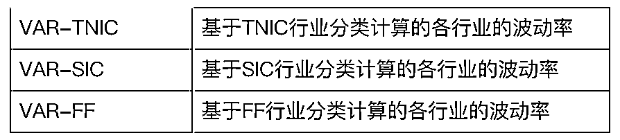
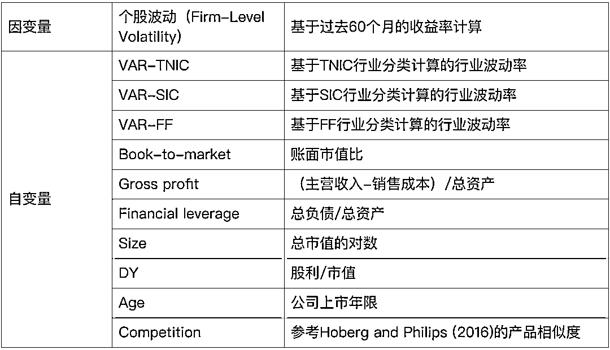
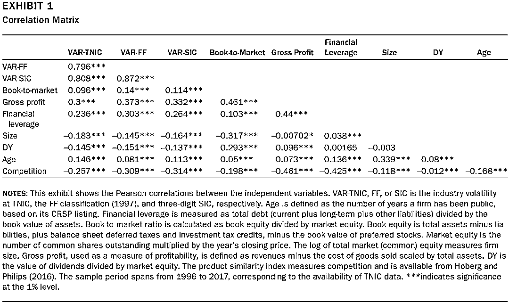
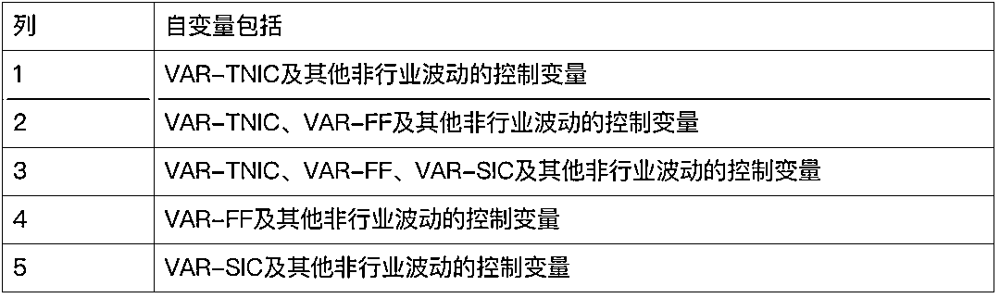
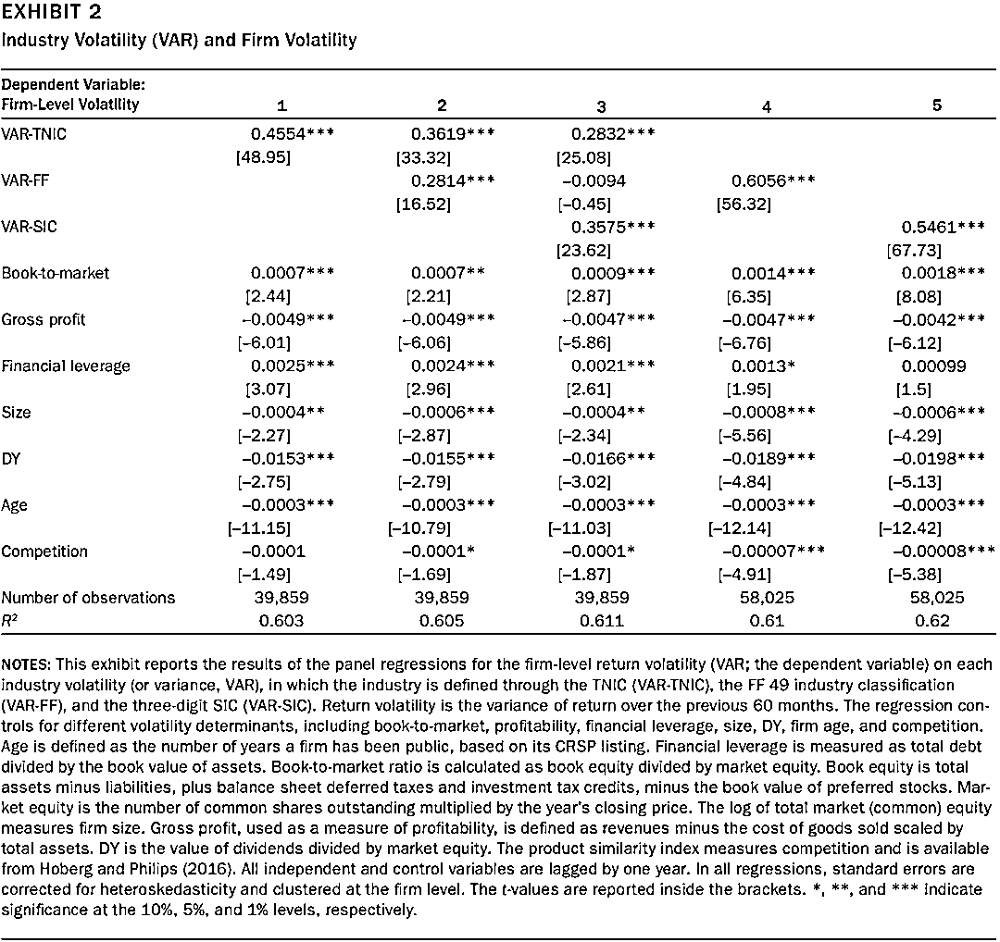
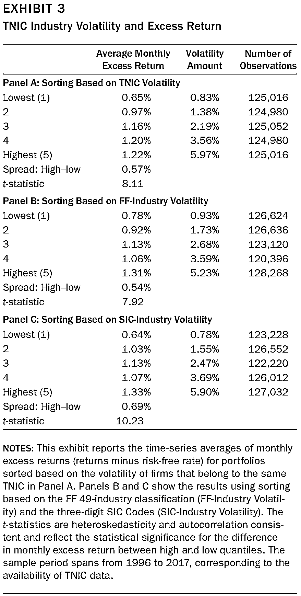
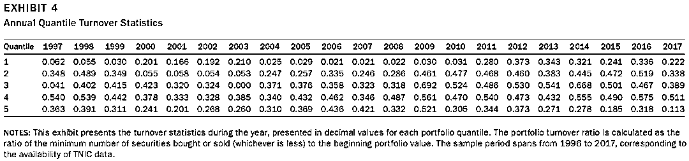
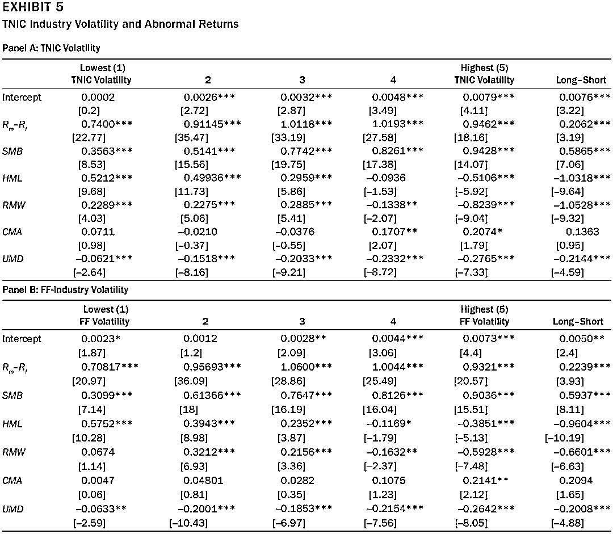
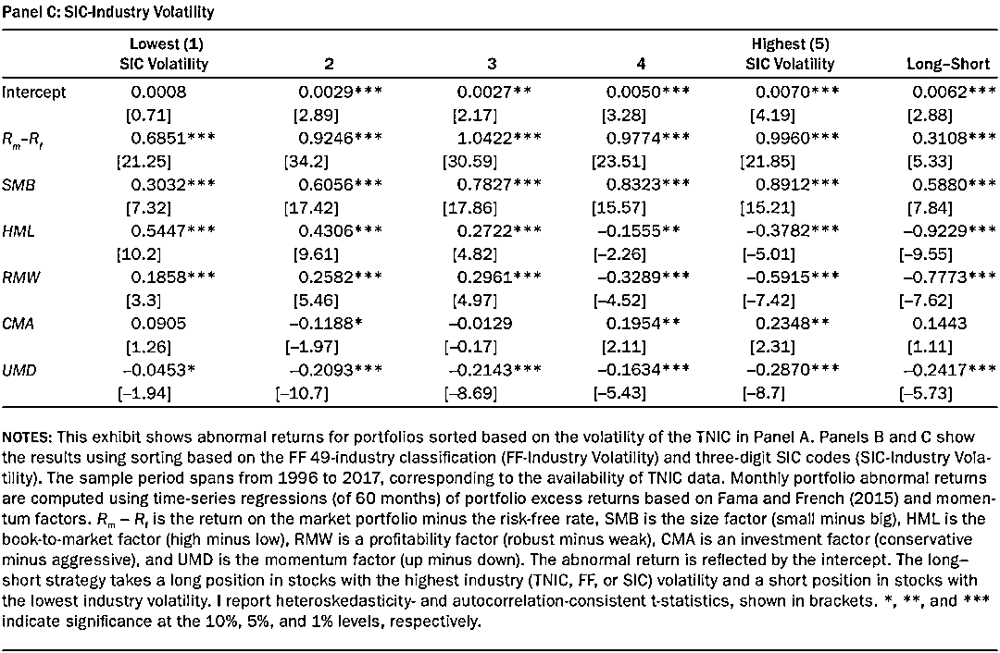

# 波动因子：基于 NLP 的行业分类

> 原文：[`mp.weixin.qq.com/s?__biz=MzAxNTc0Mjg0Mg==&mid=2653316512&idx=1&sn=d88a7b3d5c46f307370fe7e8939b4bbd&chksm=802da7b5b75a2ea3f74d3f7f1dff4c57c811a51f60f77104f0a8de86301f98f3b28814daa834&scene=27#wechat_redirect`](http://mp.weixin.qq.com/s?__biz=MzAxNTc0Mjg0Mg==&mid=2653316512&idx=1&sn=d88a7b3d5c46f307370fe7e8939b4bbd&chksm=802da7b5b75a2ea3f74d3f7f1dff4c57c811a51f60f77104f0a8de86301f98f3b28814daa834&scene=27#wechat_redirect)

量化投资与机器学习公众号独家解读

量化投资与机器学公众号 *** ***QIML Insight——深度研读系列 ******是公众号今年全力打造的一档**深度、前沿、高水准**栏目。

公众号**遴选**了各大顶刊最新论文，按照理解和提炼的方式为读者呈现每篇论文最精华的部分。QIML 希望大家能够读到可以成长的量化文章，愿与你共同进步！

[第一期 ](http://mp.weixin.qq.com/s?__biz=MzAxNTc0Mjg0Mg==&mid=2653315304&idx=1&sn=8f36bc03096995655abea040e2ee3f94&chksm=802da2fdb75a2beb5d210c8235ab64fba0ba510b16683599189419f2ce0af483ea9c020707f6&scene=21#wechat_redirect) | [第二期](http://mp.weixin.qq.com/s?__biz=MzAxNTc0Mjg0Mg==&mid=2653315407&idx=1&sn=e9f5e375aedcb0b8f82d6c42b7ea3e80&chksm=802da35ab75a2a4c1aa8aa458bb5878ccbe0499b3c4e01bfff51508610c4e45f07d5b16fd6ab&scene=21#wechat_redirect)| [第三期](http://mp.weixin.qq.com/s?__biz=MzAxNTc0Mjg0Mg==&mid=2653315880&idx=1&sn=0d7bd33e5f1697973c1f365b729369b5&chksm=802da13db75a282b762267494b493c81b5595f35ca41da6a34625a13c02c6e1765d641ed7f0c&scene=21#wechat_redirect)

> **本期遴选论文** **来源：**The Journal of Portfolio Management August 2021
> **作者：**Hussein Abdoh
> **标题：**Firm-Specific Industries, Volatility, and Return: A Text-Based Network Industrial Classification Approach

**核心观点**

TNIC 行业分类下的行业波动率相对传统行业（美国标准行业分类，SIC 与 Fama French 行业分类，FF）波动率对于个股波动率及超额收益解释度上是否存在差异，或者是否能够提供更多的信息。

*   **基于 TNIC 行业分类计算的波动率指标是解释公司波动和收益的潜在因子**

*   **基于 TNIC 行业波动率因子能获得传统行业分类解释不了的显著的超额收益**

*   **TNIC 可以提高资产定价模型的表现**

**什么是 TNIC 行业分类**

以下解释节选自因子动物园最新的文章《叮！您的行业分类需要更新啦~》，已经作者同意：

Hoberg and Phillips (2016)（HP (2016)）通过爬虫从美国证监会网站上获取了美股上市公司历年的 10-K 报告，并从中提取出了关于产品和业务的章节并计算公司的产品相似度。鉴于词向量方法非常成熟，他们沿袭了该方法。但为了剔除掉其他同产品和业务无关的词汇的影响，他们首先筛选出名词和专有名词，并从中剔除掉有至少 25% 的公司使用过的常用词汇，以及国家、州名等地理词汇。然后对于每一公司-年度观测，将其 10-K 报告表示为一个长为 的词向量 ，其中， W 为当年报告中出现的总词汇数，而 表示第   个词语的频率。最后，将所有公司的数据标准化后，合并为一个 的矩阵，其中， 为该财年的公司数量。

基于上述词频数据，便可以利用余弦相似度指标来估计公司间的两两相似度。具体而言：

<embed style="vertical-align: -5.18ex;width: 28.289ex;height: auto;max-width: 300% !important;" src="https://mmbiz.qlogo.cn/mmbiz_svg/a18XcQ1EBBggIibBXCZoqdlQ2FpIevMZWSNMk3fLbIgCmCvsD6n68hpQOjQwjvTlRoEYwNQVxLGibFLE6VKyvCn1FRltW2HPOw/0?wx_fmt=svg" data-type="svg+xml">

该指标值越大，则两家公司的产品越相似，也就越应被划入同一行业。有了公司产品相似度之后，我们就可以对公司进行行业分类了。

由于相似度可以看做距离指标（相似度越高，距离越小）。因此，我们可以采用聚类方法，将公司依据产品相似度分为指定数量的类别。虽然原则上聚类方法可以生成任意给定数量的类别，HP (2016) 也的确考察了很多不同的情况。但他们主要聚焦于 300 个行业分类的结果。

**实证**

基于 TNIC 的行业分类根据公司产品业务的相似度，找到最相似的公司，所以对于任意一家公司都可以找到其最相近的竞争者（产品业务最相似）。作者把在同一行业分类下的所有公司的波动率均值定义为该行业的波动率，波动率基于过去 60 个月的月度收益计算。

**个股波动与 TNIC 行业波动**

为了研究个股波动与行业波动之间的关系，作者对个股波动与行业波动做回归，除了行业波动外还加入了其他控制变量：

下图给出了自变量之间的相关性，可以看出 VAR-TNIC 与 VAR-SIC 及 VAR-FF 的相关性很高，但也不是完全相关，说明 VAR-TNIC 能提供部分其他行业分类不能提供的信息。

下表的不同列给出了不同场景下的回测结果：

从上表可以看出：

1、列 1 表明，VAR-TNIC 的回测系数显著为正（0.455,t-value=49）说明 VAR-TNIC 与个股波动显著相关。

2、列 3 表明，即使加入了 VAR-FF 和 VAR-SIC，VAR-TNIC 的回测系数显著为正（0.283,t-value=25），说明 VAR-TNIC 能提供部分 VAR-FF 和 VAR-SIC 不能提供的信息。

3、列 3、列 4 和列 5 表明，加入 VAR-SIC 和 VAR-TNIC 后，VAR-FF 的回归系数由 0.6056 下降到-0.0094，t-value 从 56.32 下降为-0.45；加入 VAR-TNIC 后，VAR-SICF 的回归系数由 0.5461 下降到 0.3575，t-value 从 67.73 下降为 23.62。说明 VAR-SIC 和 VAR-TNIC 已经包含了 VAR-FF 大部分信息，VAR-FF 由此显得不再重要；虽然 VAR-SIC 依然显著，但 VAR-TNIC 的加入能够提供更多额外的信息。

**个股超额收益与 TNIC 行业分类**

TNIC 行业分类除了能在解释个股波动时提供更多的信息外，与个股超额收益之间也存在显著的线性关系。作者基于不同行业分类的行业波动将股票分为五组，进行测试。测试结果如下表，可以看出基于 TNIC 行业波动的分组测试有更好的单调性，波动率越高，分组收益就越大。而基于 SIC 和 FF 行业分类的分组测试在组 3 和组 4 间并没有显示出单调性。表 4 给出了 TNIC 分类下，各组的换手率，基本上波动越低的分组换手率越低。

**资产定价模型与 TNIC 行业分类**

最后，作者基于 Fama 五因子及动量因子，在不同的行业波动分组下，进行回归测试。下表最左边是行业波动最小分组股票的回归结果，其中截距项是因子未解释的收益（Abnormal Return）。可以发现随着 TNIC 波动的上升（从组 1 到组 5），Abnormal Return 越来越大，也就是说 TNIC 波动大的股票有更多的 Abnormal Return。以多空组（Long-Short）的 Abnormal Return 来看，相对于 SIC 及 FF 行业分类，TNIC 行业分类的区分度更为明显。

**题外话**

对于公司行业的分类，市场上有多种体系，国内常用的中信及申万的行业分类。近年来基于公司经营业务的行业分类体系也越来越得到市场的关注，由于公司经营业务披露的不一致性，对业务标准化、统一化成了最大的难题。随着机器学习的发展，NLP 的技术越来越多的应用的这一场景中，国内的太平洋证券也在 2020 年 4 月的报告《金融工程指数增强：基于主营构成的指数增强策略》涉及了 NLP 在主营业务标准化上的应用。当然国内也有数据公司很早就开始尝试根据标准化主营业务，进行行业分类体系的构建。这也是基本面与量化结合的很重要的基础设施。最后希望，这类“准另类数据”能够在量化投资中大放光彩。

**参考文献**

1、Hoberg, Gerard, and Gordon Phillips. "Text-based network industries and endogenous product differentiation." Journal of Political Economy 124.5 (2016): 1423-1465.

2、Hussein Abdoh, "Firm-Specific Industries, Volatility, and Return: A Text-Based Network Industrial Classification Approach". Journal of Portfolio Management

量化投资与机器学习微信公众号，是业内垂直于**量化投资、对冲基金、Fintech、人工智能、大数据**等领域的主流自媒体。公众号拥有来自**公募、私募、券商、期货、银行、保险、高校**等行业**20W+**关注者，连续 2 年被腾讯云+社区评选为“年度最佳作者”。