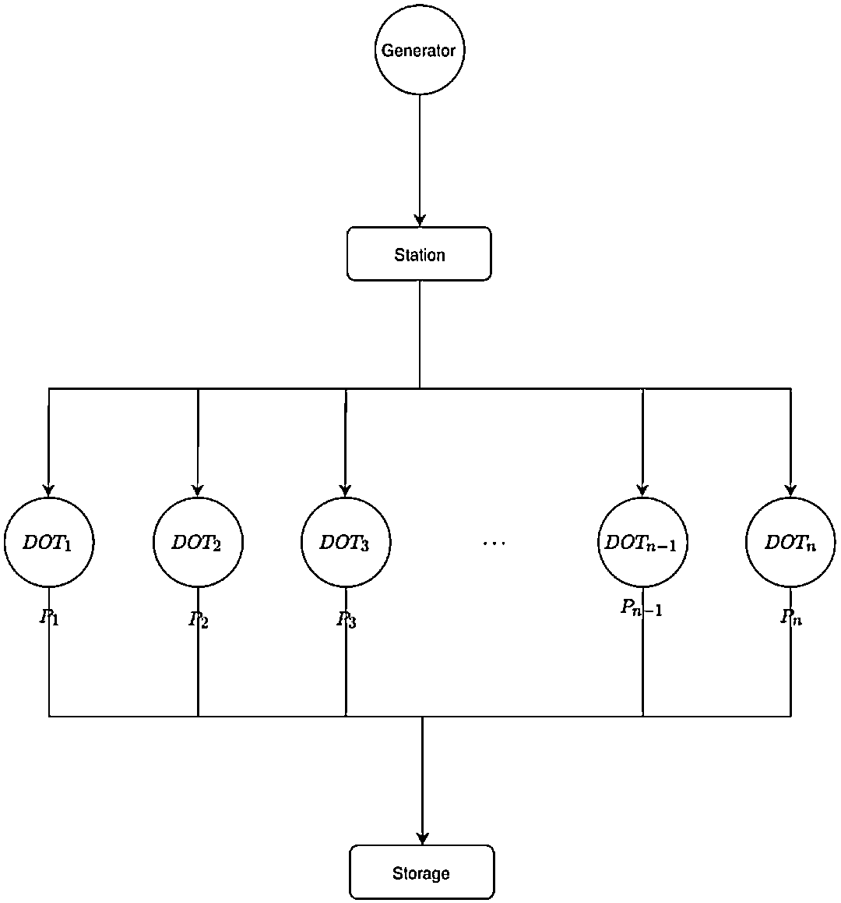
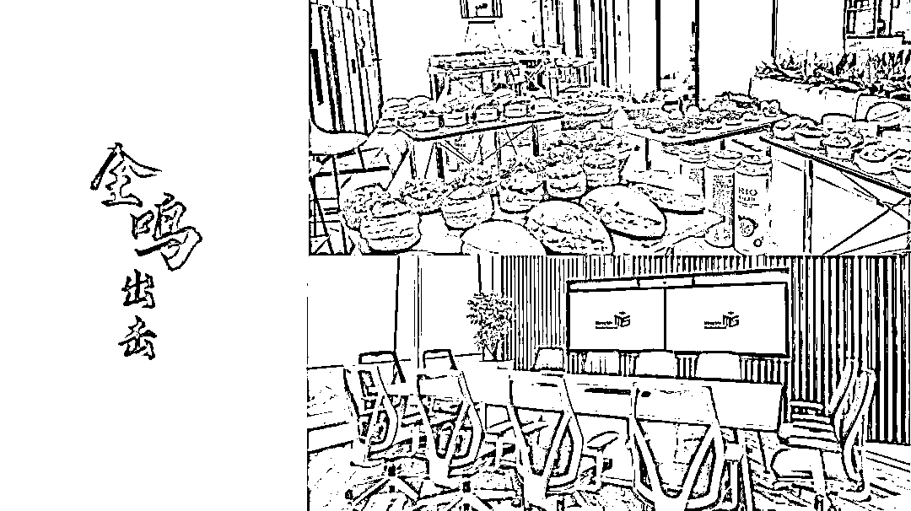

# 独家！中国量化私募面试 Q&A 系列——鸣石投资

> 原文：[`mp.weixin.qq.com/s?__biz=MzAxNTc0Mjg0Mg==&mid=2653316468&idx=1&sn=35be3f9b6be2b69f9697d4b81606c7c4&chksm=802da761b75a2e77df3214e602b017d29d3ffd76e704e110ea4065c7c736ac5deb0c9fd10507&scene=27#wechat_redirect`](http://mp.weixin.qq.com/s?__biz=MzAxNTc0Mjg0Mg==&mid=2653316468&idx=1&sn=35be3f9b6be2b69f9697d4b81606c7c4&chksm=802da761b75a2e77df3214e602b017d29d3ffd76e704e110ea4065c7c736ac5deb0c9fd10507&scene=27#wechat_redirect)

# 

量化投资与机器学习公众号 **独家出品**

量化投资与机器学公众号在 2021 年又双叒叕开启了一个全新系列：

这个系列对于国内量化圈来说意义深远！公众号邀请了**各大知名量化私募**一起参与此系列的创作。

**面试题都是独家一手资料，多部门层层把关、多角度精心编****写！**

回答部分题目且通过者，公众号会还联合每家机构提供形式多样的精彩福利和直通绿卡！

**第二期出题方：**

鸣石投资（Mingshi Investment）成立于 2010 年，是目前国内百亿级量化私募基金管理人中成立最早，少数拥有全频段交易信号的团队。鸣石参考海外对冲基金的架构搭建自身投研体系，注重因子研发的金融学逻辑并叠加 AI 算法。十年来，鸣石坚持在人才及硬件上的持续投入，基于集体的聚力不断实现策略的迭代升级。

本期，鸣石特设 **Tech Talent、AI Talent **近期两大热招岗位方向的面试题内容。

**Tech Talent：**精通 C++/Python/Golang，优秀的开发能力及项目管理能力。

**AI Talent：**AI 相关研究方向 PHD 或 大厂高级及专家级别算法工程师

鸣石提供薪酬 50%+涨幅的 Special Offer，期待与你 Win Together！

**Tech Talent**

**1、初出茅庐**

在 linux 中的 top/htop/uptime 命令运行后的 Load Average 具体指什么？Load Average 高是否意味着 CPU 遇到瓶颈？可以借助哪些工具来验证核心问题？

**答案**

Load Average 是指当前系统中处于运行或不可中断的进程数。

Load Average 高并不完全意味着 CPU 遇到瓶颈，如果当前系统中处于不可中断的进程比较多，那实质上 CPU 并没有被完全利用，可能是进程在等待磁盘 IO、网络 IO 或者其他导致不可中断的因素。

可借助 code review 或者 linux 基础工具 sar/vmstat/iftop/dmesg/lsof/dtrace/strace 来排查问题。

**2、小试牛刀**

现有 A 股上市公司平安银行最近 10 年的资金流入金额、资金流出金额。找到一个连续时间段（至少包含 1 天），期间的资金总净流入金额为最大，返回其最大值。并说明算法的时间复杂度。

**答案**

采用动态规划法：

**步骤 1：**按时间顺序从先到后，分别计算每日的净流入金额 mon[0], ..., mon[N-1]

**步骤 2：**设状态 f(i)表示截止第 i 天为结尾的连续时间段的最大总流入金额，则状态转移方程如下：

<embed style="vertical-align: -0.566ex;width: 48.523ex;height: auto;max-width: 300% !important;" src="https://mmbiz.qlogo.cn/mmbiz_svg/a18XcQ1EBBggIibBXCZoqdt9pibA966qj5KJaEkmTqia57AI1on6rRVb5lQdNCv3UNw30sXGLLlc5JN7oxtIuhelG1UDiaYuyP3C/0?wx_fmt=svg" data-type="svg+xml">

解释：当 f(i-1)<=0 时，f(i-1)对应的序列对 f(i)是没有贡献的，所以直接从第 i 天重新开始计算。反之，f(i-1)对应的序列对 f(i)是有贡献的，需要加入到 f(i)的计算中。

**步骤 3：**找到某一个连续时间段的最大总流入金额 target：

, 其中 0<=i

时间复杂度：O(N)

Tips：此题有多种解法，分治法、贪心法，皆可达到时间复杂度 O(N)。

**3、大显身手**

现有 1000*2000 的整数矩阵，以及 10000 次矩阵操作。

矩阵操作支持两种方式：

1、更新某一具体位置的值（例如：A[0][0] = 100）

2、打印某一区域的和（例如：打印顶点(1,2)、(30,50)围成子矩阵的所有元素的和）

需要高性能的实现该矩阵上述的两种操作，并说明算法的时间复杂度。

**答案**

需大家自行作答，请将结果提交**文末邮箱**，精彩**福利**等着你！

**4、崭露头角**

现有 台老旧机器，每台配置从 1C【物理核】1G RAM 到 32C【物理核】128G RAM 不等。每个机器都有一个空闲算力指标 ；

同时有一个大数生成器，随机生成 10~100 亿个 int64 型数，每生成一个数后都将该数发往数据分发中心 Station。

Station 不做任何计算，直接将该数转发给下游计算节点。在每个计算节点上都做同样的计算 ，其中 的逻辑此处可先暂时不考虑，默认完成一次 f 计算只需要 1C1G 的系统资源。计算完成后将 存储到某一个存储介质里。

小明看到这个问题后，画了如下的一个系统架构图，请问：

1、在这个系统架构里，有哪些地方容易成为系统瓶颈?

2、如果需要优化这个业务场景，还需要有哪些细节问题需要确认清楚?

3、如果现在 中 不仅仅是 generator 生成的数，还会是一个变长的 string，长度在 0.5K~10K，那当前这个系统架构中哪些环节会成为瓶颈?

4、如果现在 的一个银行系统转账的操作，即 generator 不是生成一个数字，而是生成一个指令，从 A 转账金额 M 到 B，那这个系统中哪个环节最为重要，或者这个系统中哪些地方会造成业务黑洞【即转账者认为已经转出去了，但收款方一直未收到】，如何避免这样的业务黑洞?

**答案**

需大家自行作答，请将结果提交**文末邮箱**，精彩**福利**等着你！

**AI Talent**

**1、场景定义**

假设待预测值 y_true 是（0，1）内的连续变量，使用简单 MLP 网络预测该值。

方案 1：使用 mse loss 预测。

方案 2：将区间等分为 10 份，每个 y_true 对应一个分类，使用 crossentropy loss。

如果不计区间分段造成的截断误差，两种方案哪种适合，为什么？除了这两个方案，你是否能提出一种更好的方案？（可以假定其他先验条件）

**答案**

需大家自行作答，请将结果提交**文末邮箱**，精彩**福利**等着你！

**2、基础理解**

有三个文本 abc，a 和 b 的余弦相似度是 0.9，b 和 c 之间是 0.95，问 a 和 c 之间余弦相似度的范围？

**答案**

需大家自行作答，请将结果提交**文末邮箱**，精彩**福利**等着你！

**试题答案投递方式&福利**

**福利**

**AI Talent **方向选出解题最优的 3 名投递者，给予如下现金奖励：

*   第 1 名 3000 元

*   第 2 名 1000 元

*   第 3 名 500 元

**Tech Talent **方向选出解题最优最优的 3 名投递者，给予如下现金奖励：

*   第 1 名 3000 元

*   第 2 名 1000 元

*   第 3 名 500 元

同时，参与试题投递者将有机会参加**『鸣石开放日』**活动，你将在开放日当天解锁：

*   鸣石欢乐下午茶

*   鸣石周边

*   量化讲座（与你分享有关因子研发，AI 赋能量化交易，量化领域所需 IT 技术栈等话题）

**投递方式**（有效期至 2021 年 7 月 1 日）

提交邮箱：***talent2021@mingshiim.com***

提交内容：**姓名+联系方式+你的简历*********+Tech/AI+答案**

*大家自愿提交，如果你想加入鸣石的话，这是一个很重要的加分项哦

量化投资与机器学习微信公众号，是业内垂直于**量化投资、对冲基金、Fintech、人工智能、大数据**等领域的主流自媒体。公众号拥有来自**公募、私募、券商、期货、银行、保险、高校**等行业**20W+**关注者，连续 2 年被腾讯云+社区评选为“年度最佳作者”。