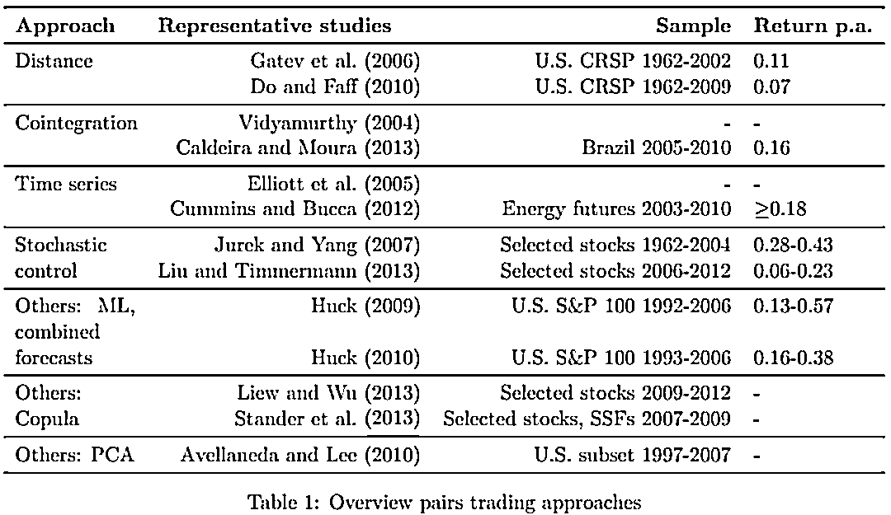
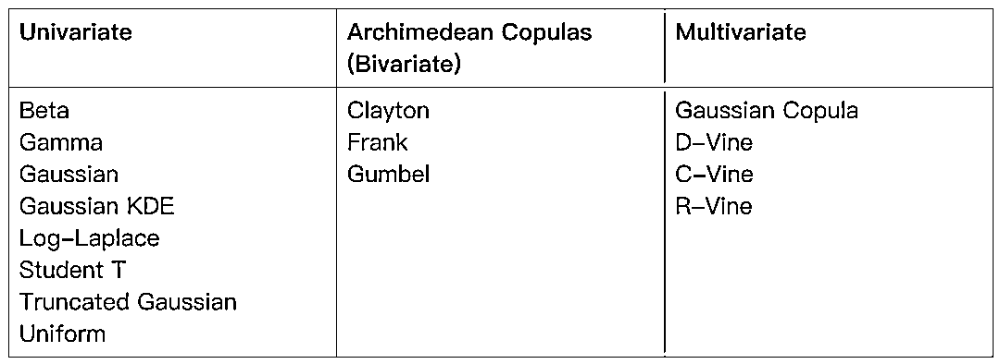
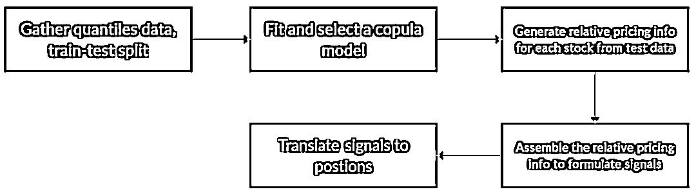
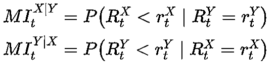
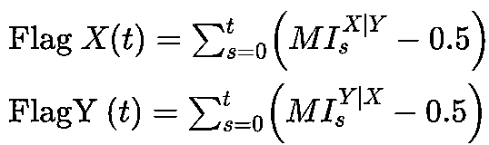

# 基于 Copula 函数的配对交易

> 原文：[`mp.weixin.qq.com/s?__biz=MzAxNTc0Mjg0Mg==&mid=2653316415&idx=1&sn=ce3cab16ee6f286606ec6d84bb7c0590&chksm=802da72ab75a2e3c65a0042e8720668fb6bd43911deca685578454460b3463241fdcec4a25a8&scene=27#wechat_redirect`](http://mp.weixin.qq.com/s?__biz=MzAxNTc0Mjg0Mg==&mid=2653316415&idx=1&sn=ce3cab16ee6f286606ec6d84bb7c0590&chksm=802da72ab75a2e3c65a0042e8720668fb6bd43911deca685578454460b3463241fdcec4a25a8&scene=27#wechat_redirect)

量化投资与机器学习公众号撰写

**配对交易**

配对交易的概念非常直观，主要遵循两个步骤的过程。首先，找到两只历史上价格一起波动（相关性较大）的证券。然后，在随后的交易期内监测两者之间的价差。如果价格偏离，差价扩大，做空其中一只证券，买入另一只证券。两只证券配对交易的概念也可以被扩展到多只证券中：比如可以监测一只证券与另外一个证券组合之间的价差变化，也可以监测两个证券组合之间的价差变化，这就是广义的配对交易，即统计套利。

配对交易的第一步是判断证券之间价格的波动是不是存在相关性，以寻找合适的证券配对。Krauss (2016) 中整理了关于配对交易的相关方法及对应的论文,主要的方法有以下几种：距离（Distance）、协整、时间序列分析、 随机控制、 机器学习及 copula。

**基于 Copula 函数的配对交易**

大部分寻找配对证券的方法，都会假设证券价格（收益率）服从假定的统计分布。例如，一般的会假设证券价格服从正态分布，两只证券的价格服从二元正态分布。但是，通常这种分布的假设会存在以下问题：

1、即使单只证券的边际分布服从正态分布，也并不意味着两个证券的价格一起会服从二元正态分布。

2、二元正态分布有很多假设条件，其中很大一部分是不切实际的。比如：两只证券之间的相关性是线性的，没有尾部依赖（尾部风险发生的概率极低），分布是对称的（价格上行和下行的可能性是一样的）。

但在真实的市场中，我们会发现很多时候，当价格波动较大，大幅上涨或下跌的时候，股票之间的相关性会比平稳市场中表现的更高，特别是市场恐慌的时候。有些股票，平时表现的相关性不高，一旦出现重大消息导致的大涨大跌时，会表现出更高的相关性。对于这些尾部依赖的问题，Copula 函数就可以很好的解决。

**直观的理解 Copula**

**SKlar 定理**

Copula 这个概念是 Sklar 在 1959 年提出的，理解 Copula 的前提是弄清楚 SKlar 定理：

任意两个随机变量分别服从连续边缘随机分布

<embed style="vertical-align: -0.566ex;width: 42.003ex;height: auto;" src="https://mmbiz.qlogo.cn/mmbiz_svg/a18XcQ1EBBggIibBXCZoqdpsNQdSojYL0RO7Tb98twkDfIyTQYMfcHYAeiaiaLSr3YjORY2fHHD8TJk1v4GjeJtLaUh9TC0zaeK/0?wx_fmt=svg" data-type="svg+xml">，若 <embed style="vertical-align: -0.566ex;width: 31.417ex;height: auto;" src="https://mmbiz.qlogo.cn/mmbiz_svg/a18XcQ1EBBggIibBXCZoqdpsNQdSojYL0wphsnd8JDVBZ7rGSQv1AYtBeYbAj2QxAT0yA7FI4lmUM00neQQUo5rV5RGic35A7A/0?wx_fmt=svg" data-type="svg+xml"> 是  的二元联合分布函数，那么存在唯一的 Copula 函 ，使得 <embed style="vertical-align: -0.566ex;width: 28.43ex;height: auto;" src="https://mmbiz.qlogo.cn/mmbiz_svg/a18XcQ1EBBggIibBXCZoqdpsNQdSojYL0ia1Le9R7CZtLr6KJIcstLkuMDvLkQqD6rRlmMkj3K3SpY04picwwRS94CkD4e64TiaN/0?wx_fmt=svg" data-type="svg+xml">。反之如果  是一个 Copula 函数，而  是两个任意的概率分布函数，那么有上式定义的  函数一定是一个联合分布函数，且对应的边缘分布刚好就是 。

> Sklar 认为，对于 N 个随机变量的联合分布，可以将其分解为这 N 个变量各自的边缘分布和一个 Copula 函数，从而将变量的随机性和耦合性分离开来。其中，随机变量各自的随机性由边缘分布进行描述，随机变量之间的耦合特性由 Copula 函数进行描述。换句话说，一个联合分布关于相关性的性质，完全由其 Copula 函数决定。

仔细理解以下等式，等式左边变量是 分别是 的边缘分布函数，值域均为 ，右边 为 的联合分布函数，值域为 ，也就是说 copula 是两个随机变量边缘分布函数的函数，其结果与两个变量的联合分布函数一致。

<embed style="vertical-align: -0.566ex;width: 28.43ex;height: auto;max-width: 300% !important;" src="https://mmbiz.qlogo.cn/mmbiz_svg/a18XcQ1EBBggIibBXCZoqdpsNQdSojYL0lKVQWoLyyDXNDBRHr8hGHY1XOs5IM6UYEE3q5j5LQ1lUU6DxDxxKpn8FQ2QfoQKO/0?wx_fmt=svg" data-type="svg+xml">

如果用 ，那么上式可以写成：

<embed style="vertical-align: -0.669ex;width: 28.608ex;height: auto;max-width: 300% !important;" src="https://mmbiz.qlogo.cn/mmbiz_svg/a18XcQ1EBBggIibBXCZoqdpsNQdSojYL0xsJIO1snF3icxOrx8UyCVuxdl1UTV6vKibLaiayVpJDJpgj7A385P0Ziaz2GRiaQZXPt9/0?wx_fmt=svg" data-type="svg+xml">

其中， 为反函数，可以看出，一个联合分布关于相关性的性质，完全由它的 Copula 函数决定，跟边缘分布没有任何关系。

**正式定义**

对于一个二元的 copula 函数 : ，只要满足以下条件：

*   定义域为[0,1]X[0,1]，值域为[0,1] ， 即 C:[0,1]X[0,1] -> [0,1 ]
*   C(u,0)=C(0,v) = 0;   C(u,1)=u;  C(1,v)=v
*   0<=C 对 u 的偏导<=1 ;   0<=C 对 v 的偏导<=1

#### 

**尾部依赖**

Copula 中有一个重要的概念，也是 copula 吸引我们最主要的原因：tail dependence（尾部依赖）。比如二元高斯分布中，描述的是两个变量整体的相关性，而真实的情况时，两个股票在大幅下跌时（或上涨时）更有相关性，尾部依赖的定义如下。<embed style="vertical-align: -3.645ex;width: 28.93ex;height: auto;max-width: 300% !important;" src="https://mmbiz.qlogo.cn/mmbiz_svg/a18XcQ1EBBggIibBXCZoqdpsNQdSojYL0Jm6cfBQrLh8frWJurcesYibWns3FSj5Ve8K8ZQa2ibDrTOVQ93sJelsfJCy08KR8Ga/0?wx_fmt=svg" data-type="svg+xml">

**有哪些常用的 Copula 函数？**

Copula 函数主要分为两大类：Elliptical copulas 和 Archimedean copulas。其中 Elliptical copulas 是通过已知多元分布反推出来的，比如多元正态分布对应的 Copula 为高斯 Copula，多元 t 分布对应的 Copula 为 t-Copula。Archimedean copulas 是人工构造出来的满足 Copula 定义的 Copula 函数。还有一种混合 copula（Mixed copulas）结合了 Ellipyical copula 和 Archimedean copulas，比如 Clayton-Frank-Gumbel mixed copula：<embed style="vertical-align: -0.566ex;width: 75.612ex;height: auto;" src="https://mmbiz.qlogo.cn/mmbiz_svg/a18XcQ1EBBggIibBXCZoqdpsNQdSojYL08R32YibnX7XboCcBEResmcHaCaXc3fxRsgXbrjEib9dPdcibibhEWBlD6PDiajbMwNC2U/0?wx_fmt=svg" data-type="svg+xml">

**Archimedean copulas**

Archimedean Copula 函数簇的分布函数有着统一的函数表达形式：<embed style="vertical-align: -0.566ex;width: 37.671ex;height: auto;max-width: 300% !important;" src="https://mmbiz.qlogo.cn/mmbiz_svg/a18XcQ1EBBggIibBXCZoqdpsNQdSojYL0mLHbTgf2DlORxbQ1iaz7cHbeOKGxehg9jm5JcZXjOxnlGzy9JAdI17enpB9MG8aR2/0?wx_fmt=svg" data-type="svg+xml">

其中 称为 Archimedean Copula 函数的生成函数，生成函数需要满足以下条件：

条件 1 :

是一个连续 , 严格減函数和凸函数 , 且 ( )。

条件 2 :

<embed style="vertical-align: -2.244ex;width: 59.323ex;height: auto;" src="https://mmbiz.qlogo.cn/mmbiz_svg/a18XcQ1EBBggIibBXCZoqdpsNQdSojYL0Q5qXtm1WExCdTQHZ3lIehohC96jo2PbDwaprWdGibcOdnTTqBiciaVZOg3EKqMz8FM6/0?wx_fmt=svg" data-type="svg+xml">

<svg xmlns="http://www.w3.org/2000/svg" role="img" focusable="false" viewBox="0 -833.9 10821.6 1083.9" aria-hidden="true" style="vertical-align: -0.566ex;width: 24.483ex;height: 2.452ex;"><g stroke="currentColor" fill="currentColor" stroke-width="0" transform="matrix(1 0 0 -1 0 0)"><g data-mml-node="math"><g data-mml-node="mo"><text data-variant="normal" transform="matrix(1 0 0 -1 0 0)" font-size="935.2px" font-family="serif">并</text><text data-variant="normal" transform="translate(935, 0) matrix(1 0 0 -1 0 0)" font-size="935.2px" font-family="serif">且</text><text data-variant="normal" transform="translate(1868.2, 0) matrix(1 0 0 -1 0 0)" font-size="935.2px" font-family="serif">要</text><text data-variant="normal" transform="translate(2803.2, 0) matrix(1 0 0 -1 0 0)" font-size="935.2px" font-family="serif">求</text></g><g data-mml-node="mtext" transform="translate(5565.7, 0)"><text data-variant="normal" transform="translate(250, 0) matrix(1 0 0 -1 0 0)" font-size="935.2px" font-family="serif">在</text></g><g data-mml-node="mo" transform="translate(9888.4, 0)"><text data-variant="normal" transform="matrix(1 0 0 -1 0 0)" font-size="935.2px" font-family="serif">是</text></g></g></g></svg>N<svg xmlns="http://www.w3.org/2000/svg" role="img" focusable="false" viewBox="0 -750 4666 950" aria-hidden="true" style="vertical-align: -0.452ex;width: 10.557ex;height: 2.149ex;"><g stroke="currentColor" fill="currentColor" stroke-width="0" transform="matrix(1 0 0 -1 0 0)"><g data-mml-node="math"><g data-mml-node="mo"><text data-variant="normal" transform="matrix(1 0 0 -1 0 0)" font-size="935.2px" font-family="serif">维</text><text data-variant="normal" transform="translate(933.2, 0) matrix(1 0 0 -1 0 0)" font-size="935.2px" font-family="serif">单</text><text data-variant="normal" transform="translate(1866.4, 0) matrix(1 0 0 -1 0 0)" font-size="935.2px" font-family="serif">调</text><text data-variant="normal" transform="translate(2799.6, 0) matrix(1 0 0 -1 0 0)" font-size="935.2px" font-family="serif">的</text><text data-variant="normal" transform="translate(3732.8, 0) matrix(1 0 0 -1 0 0)" font-size="935.2px" font-family="serif">。</text></g></g></g></svg>

即：

<embed style="vertical-align: -2.474ex;width: 67.12ex;height: auto;" src="https://mmbiz.qlogo.cn/mmbiz_svg/a18XcQ1EBBggIibBXCZoqdpsNQdSojYL03CAMU8w2ib4icRRM2d6lpUG8w69MUekhHnDdU4RSOV5iaZ48YdSWNAFmyVUZH8brUh4/0?wx_fmt=svg" data-type="svg+xml">

根据不同的生成元函数能够得到不同的阿基米德 Copula 函数，常见有：Frank Copula、Clayton Copula 及 Gumbel Copula。

*   Gumbel:
*   Frank:<embed style="vertical-align: -1.469ex;width: 40.261ex;height: auto;" src="https://mmbiz.qlogo.cn/mmbiz_svg/a18XcQ1EBBggIibBXCZoqdpsNQdSojYL0PInjhpRzRpMQf4Kpiave6RRaJeL8eOsz0nouBxYVOXcFNk6oKVuNF6oTCkabLDsicD/0?wx_fmt=svg" data-type="svg+xml">
*   Clayton:<embed style="vertical-align: -0.797ex;width: 33.576ex;height: auto;" src="https://mmbiz.qlogo.cn/mmbiz_svg/a18XcQ1EBBggIibBXCZoqdpsNQdSojYL0MGB6tYWYr07cqJApYREfBXXGWf0LbyECQBOv3V89x28UicPZSxt8tRFwYzL4Yf7pO/0?wx_fmt=svg" data-type="svg+xml">
*   Joe:<embed style="vertical-align: -0.791ex;width: 38.842ex;height: auto;" src="https://mmbiz.qlogo.cn/mmbiz_svg/a18XcQ1EBBggIibBXCZoqdpsNQdSojYL0mibREl8GkLmYZFNZLHnMUEAlq9GNmxA7Vl2icYS2BvLTCKxwTl3pK0XBmdW0ZeWahu/0?wx_fmt=svg" data-type="svg+xml">
*   N13:
*   N14: 

Gumbel Copula 函数对上尾部的厚尾特性比较敏感，对下尾部的厚尾特性不敏感，因此适合于对上尾部厚尾特性明显而下尾部厚尾特性不明显的耦合结构建模；Clayton Copula 函数适合于对下尾部厚尾特性明显而上尾部厚尾特性不明显的耦合结构建模；FrankCopula 的密度分布呈“U”字形，适合于描述具有对称厚尾结构变量的耦合关系。

我们可以看到，以上所有的 copula 都只有一个参数 ，它决定了两个变量之间的紧密程度。我们在拟合数据时，也就是在拟合这个参数 。

**如何选择 Copula 函数？**

实际应用场景中，我们要根据具体的需求，结合各 copula 函数的性质，选取合适的 copula 函数，以下是几个需要注意的地方：

*   上尾依赖（Upper tail dependence） 意味着两个随机变量可能同时出现非常大（分布的右侧）的值。例如，当处理收益序列时，上尾依赖意味着这两只股票很可能同时获得较大收益。
*   下尾依赖（Lower tail dependence） 意味着两个随机变量可能同时出现非常小的值（分布的左侧）。这比上尾依赖更强，因为股票更有可能一起下跌而不是一起上涨。
*   Frank copula 和 Gaussian copula 根本没有尾部依赖关系。正是基于 Gaussian copula 为 CDO 定价，导致了 2008 年的金融危机。
*   与 Gaussian copula 相比，Frank copula 具有更强的中心依赖性。
*   对于 VaR 的计算, Gaussian copula 过于乐观，而 Gumbel copula 过于谨慎。
*   具有上尾依赖性质的 copula: Gumbel, Joe, N13, N14, Student-t.
*   具有下尾依赖性质的 copula: Clayton, N14 (weaker than upper tail), Student-t.
*   没有尾部依赖性质的 copula: Gaussian, Frank.

**数据拟合**

基于已知的数据拟合 copula 函数主要分为两个步骤：将数据转换为对应的分位数或概率值（0-1 区间），对概率值进行拟合。常用的方法主要基于极大似然估计和经验分布，Python 中有现成的工具包可以方便的完成这些工作：

Python Copula 工具包：*https://github.com/sdv-dev/Copulas*

主要支持以下 copula 的拟合：

**基于 Copula 的交易策略**

接下来，我们基于过去的文献对于 Copula 应用在配对交易的实际策略做一个汇总。

**核心逻辑：条件概率**

基于 copula 的配对交易策略，条件概率一直是核心逻辑，如果两个证券 的 copula 函数为 ，则其条件概率的可以如下表示：

<embed style="vertical-align: -1.891ex;width: 72.07ex;height: auto;max-width: 300% !important;" src="https://mmbiz.qlogo.cn/mmbiz_svg/a18XcQ1EBBggIibBXCZoqdpsNQdSojYL01ibGyCcDJ9CpLWHkUwjoqDto8tpES7OFld7uib4lV45Iyn0OKygPx5C08licFLykxxN/0?wx_fmt=svg" data-type="svg+xml">

条件概率怎么应用到策略中呢？比如：

*   当 ，就意味着 被低估（Undervalued），就可以做多 做空 。

*   当 ，就意味着 被低估（Undervalued），就可以做多 做空 。

以上只是一个简单的示例。真实策略开发的流程涉及到模型训练测试等，可以参考以下流程：

**策略 1：基于一定阈值的价格条件**

具体可参考：[Liew et al. 2013] [Botha et al. 2013]

*   进场规则：

*   <embed style="vertical-align: -0.65ex;width: 57.922ex;height: auto;" src="https://mmbiz.qlogo.cn/mmbiz_svg/a18XcQ1EBBggIibBXCZoqdpsNQdSojYL0nZs8MicCaBFHadjQo1zXrhCT4YkLgXgCmwMCXh2KE6NZtexKicV4rwXfLrT4ibnbbFX/0?wx_fmt=svg" data-type="svg+xml"> 就意味着  被低估（Undervalued）且  高估（Undervalued），就可以做多  做空 。

*   <embed style="vertical-align: -0.65ex;width: 57.922ex;height: auto;" src="https://mmbiz.qlogo.cn/mmbiz_svg/a18XcQ1EBBggIibBXCZoqdpsNQdSojYL0icpNMSWHCM1KaUStuy42mMLfE422TRQKrU7C22aMtMjEoTBsLLR4xiabRLgSicK4urE/0?wx_fmt=svg" data-type="svg+xml">就意味着  被低估（Undervalued）且  高估（Undervalued），就可以做多  做空 。

出场规则：只要任何一种情况的概率突破 0.5，就离场。比如进场规则 1 中，某个时刻 超过了 0.5，就触发了出场规则。

**策略 2：基于一定阈值的价格条件**

策略 1 是基于价格触发的进出场规则，其实基于收益率的交易规则在 copula 的应用中更为常见，很多多品种的统计套利多基于收益率。具体可参考：[Xie et al. 2014] [Stübinger et al. 2016] [Rad et al. 2016] [da Silva et al. 2017].

**错误定价指数（Mispricing Index, MPI）**

以下是基于条件概率，对于证券数学公式: 的错误定价指数的定义：

其中 分别为 在 t 期间的收益率。

**累积错误定价指数（Cumulative Mispricing Index, CMPI）**

把过去一段时间的 MPI（减去 0.5）相加，就是累积错误定价指数：

**进场规则**

*   大于等于 时，做 且做多

*   小于等于 时，做空 且做多

*   大于等于 时，做空 且做多

*   小于等于 时，做空 且做多

**出场规则**

*   如果进场规则是 ，那么当 回到 0 或者触发止损后出场

*   如果进场规则是 ，那么当 回到 0 或者触发止损后出场

*   出场后， 均重置为 0

**总结**

当然以上的逻辑都是基于已经选好的配对，那在配对确定的逻辑上，我们可以根据相关系数 Kendall's tau 系数等指标，也可以根据基本面的业务逻辑，比如根据公司的细分行业分类，主营业务是否一致等逻辑。Copula 本身只是用来对两个或多个变量之间的依赖关系进行建模的数学工具，当我们把它应用在交易策略的逻辑中时，还有很多现实的问题需要细化，本文从 copula 的理解，数据的拟合到策略的逻辑，给大家做了一个比较完整的介绍，希望能给大家带来一些启发。

**参考文献**

1、Krauss, Christopher. “Statistical Arbitrage Pairs Trading Strategies: Review And Outlook.” Journal of Economic Surveys, vol. 31, no. 2, 2016, pp. 513–545., doi:10.1111/joes.12153.

2、Pei, Hansen. “Copula for Pairs Trading: A Detailed, But Practical Introduction.” Hudson & Thames, 20 Jan. 2021, hudsonthames.org/copula-for-pairs-trading-introduction/. 

3、Pei, Hansen. “Copula for Pairs Trading: Sampling and Fitting to Data.” Hudson & Thames, 4 Feb. 2021, hudsonthames.org/copula-for-pairs-trading-sampling-and-fitting/. 

4、Pei, Hansen. “Copula for Pairs Trading: A Unified Overview of Common Strategies.” Hudson & Thames, 17 Feb. 2021, hudsonthames.org/copula-for-pairs-trading-overview-of-common-strategies/.

5、B Sabino da Silva, F., Ziegelman, F. and Caldeira, J., 2017\. Mixed Copula Pairs Trading Strategy on the S&P 500\. Flávio and Caldeira, João, Mixed Copula Pairs Trading Strategy on the S&P, 500.

6、Liew, R.Q. and Wu, Y., 2013\. Pairs trading: A copula approach. Journal of Derivatives & Hedge Funds, 19(1), pp.12-30.

7、Patton, A.J., 2012\. A review of copula models for economic time series. Journal of Multivariate Analysis, 110, pp.4-18.

8、Patton, A.J., 2009\. Copula–based models for financial time series. In Handbook of financial time series (pp. 767-785). Springer, Berlin, Heidelberg.

9、Rad, H., Low, R.K.Y. and Faff, R., 2016\. The profitability of pairs trading strategies: distance, cointegration and copula methods. Quantitative Finance, 16(10), pp.1541-1558.

10、Stander, Y., Marais, D. and Botha, I., 2013\. Trading strategies with copulas. Journal of Economic and Financial Sciences, 6(1), pp.83-107.

11、Stübinger, J., Mangold, B. and Krauss, C., 2018\. Statistical arbitrage with vine copulas. Quantitative Finance, 18(11), pp.1831-1849.

12、Vidyamurthy, G., 2004\. Pairs Trading: quantitative methods and analysis (Vol. 217). John Wiley & Sons.

13、Xie, W., Liew, R.Q., Wu, Y. and Zou, X., 2016\. Pairs trading with copulas. The Journal of Trading, 11(3), pp.41-52.

量化投资与机器学习微信公众号，是业内垂直于**量化投资、对冲基金、Fintech、人工智能、大数据**等领域的主流自媒体。公众号拥有来自**公募、私募、券商、期货、银行、保险、高校**等行业**20W+**关注者，连续 2 年被腾讯云+社区评选为“年度最佳作者”。