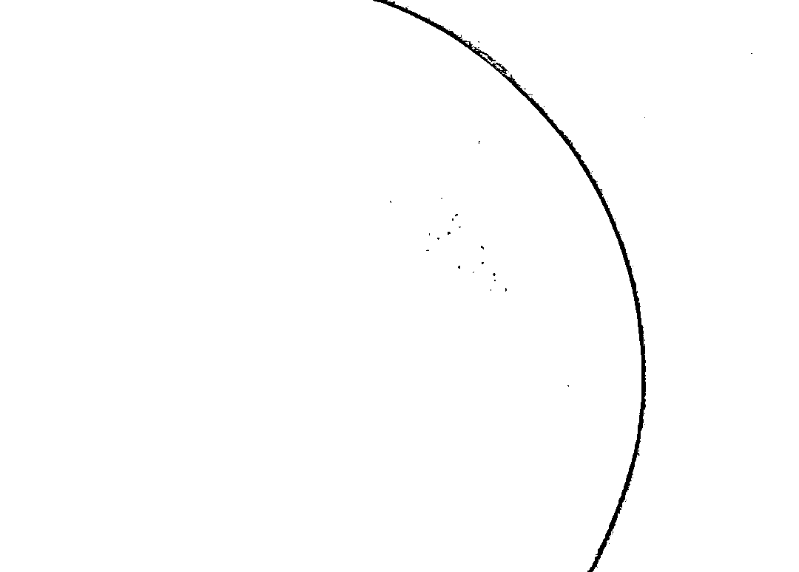
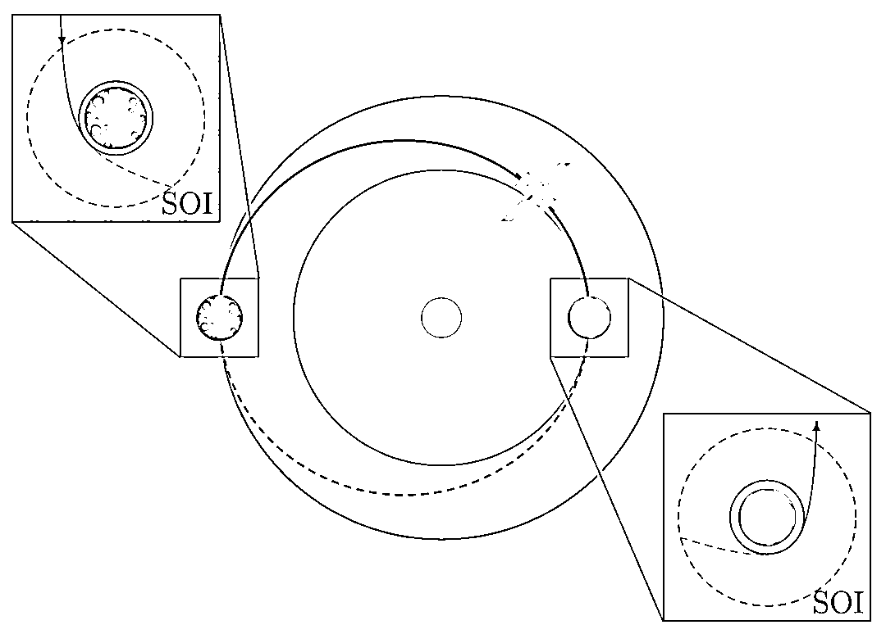
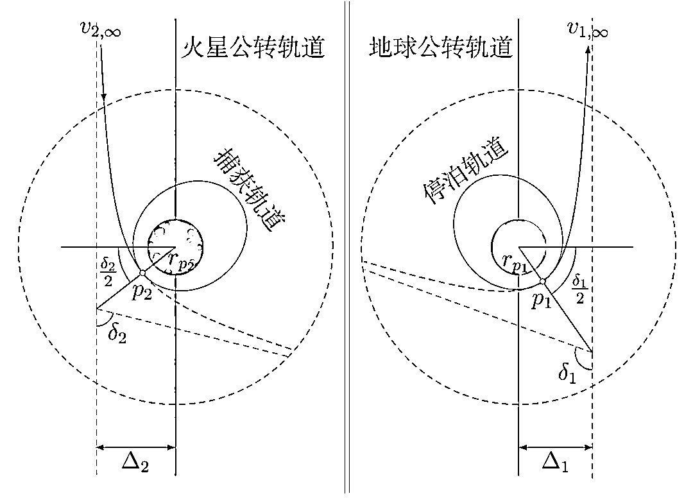

# 数学为王！天问一号是如何到达火星的?

> 原文：[`mp.weixin.qq.com/s?__biz=MzAxNTc0Mjg0Mg==&mid=2653316353&idx=1&sn=81eb18dd627730114d87bbc25b4f5396&chksm=802da714b75a2e02e194dcc185f21117c9e93438ce57070ca4ebd3f6df9cf1fc75e61a5e1284&scene=27#wechat_redirect`](http://mp.weixin.qq.com/s?__biz=MzAxNTc0Mjg0Mg==&mid=2653316353&idx=1&sn=81eb18dd627730114d87bbc25b4f5396&chksm=802da714b75a2e02e194dcc185f21117c9e93438ce57070ca4ebd3f6df9cf1fc75e61a5e1284&scene=27#wechat_redirect)

## **引言**

2021 年 5 月 15 日，火星探测器“天问一号”成功着陆火星乌托邦平原南部^([1])，**我国首次火星探测任务着陆火星取得圆满成功。后续，“祝融号”火星车将依次开展对着陆点全局成像、自检、驶离着陆平台并开展巡视探测**。“天问一号”的成功着陆标志着我国成为继美国之后第二个让火星车成功着陆并运行的国家，也成为首个通过一次发射，完成“环绕、着陆、巡视探测”任务的国家。

图 1: 天问一号发回的第一张火星照片

自 2020 年 7 月 23 日成功发射以来，**在地火转移阶段完成了 1 次深空机动和 4 次中途修正，于 2 月 10 日，成功实施火星捕获，进入大椭圆环火轨道，成为我国第一颗人造火星卫星。2021 年 2 月 24 日，天问一号探测器成功实施第三次近火制动，进入周期 2 个火星日的火星停泊轨道后，对火星开展全球遥感探测，并对预选着陆区进行详查，探测分析地形地貌、沙尘天气等，为着陆火星做准备。**目前，探测器在太空已累计飞行近 10 个月，飞行里程达 3.2 亿公里。天问一号是如何从地球到达火星的？和地球上两点之间往返不同，去火星要复杂得多。地球和火星都是环绕太阳旋转的行星，而由于轨道半径不同，两者的公转周期也不同。这导致了地球和火星之间的直线距离呈周期性变化，最近时为 5460 万公里，最远时可达 4 亿公里。因此需要提前对探测器飞行路线进行规划。

图 2: “天问一号”转移轨道和修正（TCM）

图 2 为“天问一号”的转移轨道和飞行过程中的轨道修正。理论上探测器可以沿任意路径到达火星，但是有一条称为“**霍曼转移轨道**”的飞行路径效率最高^([2])。该轨道是由德国物理学家霍曼在 1925 年提出的，途中只需两次引擎推进，相对节省燃料。若将地球和火星的椭圆形轨道近似为圆形，则从地球到火星的霍曼转移轨道呈环绕太阳的椭圆形。轨道的近日点在地球轨道，远日点在火星轨道。从地球发射的探测器首先加速到霍曼转移轨道速度，到达火星轨道后再加速到火星环绕速度（图 3）。

图 3: 成功到达火星

为使探测器和火星同时到达同一个点，探测器必须在特定的时间范围内发射^([3])。这个特定的时间范围称为“发射窗口”。若错过“发射窗口”（图 4），则需要再等两年多的时间。也正因如此，多个国家于 2020 年 7 月至 8 月的火星探测发射窗口期发射了火星探测器，包括美国的“毅力”号火星车、阿拉伯联合酋长国的“希望”号火星探测器。

图 4: 错过发射窗口

想要通过霍曼转移轨道将探测器从地球轨道转移到火星轨道，就必需在特定的时间以特定的速度从地球发射探测器，并在特定的位置对探测器进行特定的加速或减速。本文将建立模型来确定地球和火星之间的霍曼转移轨道，以及实现霍曼转移轨道的条件（发射速度、变轨速度、发射时间）和效率，并应用模拟来验证模型的结果。

## 模型

为描述地球、火星和探测器的运动，我们需要一个以太阳为参照点的坐标系。如图 5 所示，以地球绕太阳公转的轨道平面（黄道）作为基准平面，用 0 到 360 描述天体围绕黄道的位置。

图 5: 黄道坐标系和日心经度

由于黄道上没有明显可以作为黄道经度 0 的点，因此春分点常被指定为黄经 0。这种坐标系在天文学中被称为黄道坐标系，相应的坐标被称为日心经度（太阳经度）。

图 6: 地球和火星轨道近似为同平面的圆

地球和火星，以及探测器的动力学是非常复杂的。为了简化问题，我们做出了一些假设：

*   地球和火星的轨道都是以太阳为中心的圆。实际上地球和火星的轨道并不是圆，而是略呈椭圆。
*   地球和火星都以恒定的速度绕太阳运动。由普勒第二定律可知，单位时间内行星与太阳的连线所扫过的面积相等。因此行星在近日点速度大，在远日点速度小。但由于地球和火星的轨道非常接近圆，因此公转过程中速度变化不大。
*   地球和火星的轨道在同一平面上。实际上地球和火星的公转轨道并不在同一平面内，但两平面非常接近，仅有微小的夹角。忽略这一夹角，可使复杂的三维问题简化为二维问题。

严格上来讲，以上假设都不正确。但在这些假设下，问题将得到极大地简化。作为模型演示，已经足够说明问题。在后面的模拟中，将去掉这些假设。

### 轨道变更

在确定地火间的霍曼转移轨道之前，我们需要先了解一下探测器轨道变更所需的速度和能量。太空中的探测器想要从低轨道变更到高轨道（半长轴更大的轨道），必须通过发动机向后喷气获得向前的加速度。反之，高轨道变更到低轨道则需要减速。假设这种加速是瞬时完成的。尽管探测器加速至新轨道的速度过程需要一定时间，但加速过程远小于轨道周期。

图 7: 探测器通过发动机加速后变轨

如图 7 所示，当起始轨道和最终轨道有相交时，可在交点处瞬间加速一次，便可完成变轨。对于更一般的情况，可能需要多次变轨。具体来说，对于给定的轨道 1 和 2，在交点处两轨道速度分别为  和 。若探测器想要从轨道 1 变更到轨道 2，只需在交点处加速 ，即<mjx-container jax="SVG" display="true" role="presentation" tabindex="0" ctxtmenu_counter="3" style="overflow-x: auto;outline: 0px;display: block;text-align: center;margin: 15px 0px;" data-formula="\boldsymbol{v}_2 = \boldsymbol{v}_1 + \Delta \boldsymbol{v}"></mjx-container>如果考查两轨道的能量差（变轨过程消耗的能量），我们可以计算出速度的大小改变<mjx-container jax="SVG" display="true" role="presentation" tabindex="0" ctxtmenu_counter="7" style="overflow-x: auto;outline: 0px;display: block;text-align: center;margin: 15px 0px;" data-formula="v_2² = v_1² + \Delta v² + 2v_1\Delta v \,\cos\beta"></mjx-container>其中  为  和  的夹角。因此变轨后，探测器的能量（动能）增量为<mjx-container jax="SVG" display="true" role="presentation" tabindex="0" ctxtmenu_counter="12" style="overflow-x: auto;outline: 0px;display: block;text-align: center;margin: 15px 0px;" data-formula="\Delta E = \frac{1}{2}m\left(\Delta v² + 2v_1\Delta v \,\cos\beta\right)"></mjx-container>其中  为探测器的质量。通过上式可以看出，当  最大， = 0 时，探测器获得的能量增量最大。

图 8: 探测器在近地点加速逃逸地球

因此，若要将绕地球椭圆轨道上的探测器变更到逃逸轨道（脱离地球引力场的轨道，图 8），效率最高的办法是当探测器运动到近地点（ 最大）时瞬间加速，且加速度方向与运动速度同向（ = 0）。

### 霍曼转移

为了方便演示（图 9），我们将地球放置于日心经度为 0 位置（探测器在此位置发射），将火星放置于日心经度为 180 位置（探测器在此位置登入火星）。那么霍曼转移轨道就是连接处于 0 地球和处于 180 火星的椭圆。

图 9: 霍曼转移轨道半长轴的计算

地球到太阳的平均距离为 149.60   km，将此长度规定为 1 个天文单位，即 1.0 AU，而火星到太阳的平均距离为  = 1.524 AU。易计算出霍曼转移轨道半长轴：<mjx-container jax="SVG" display="true" role="presentation" tabindex="0" ctxtmenu_counter="17" style="overflow-x: auto;outline: 0px;display: block;text-align: center;margin: 15px 0px;" data-formula="a = \frac{1.0\,\mathrm{AU} + 1.524\,\mathrm{AU}}{2} = 1.262\, \mathrm{AU}"></mjx-container>如图 10 所示，探测器想要通过霍曼转移轨道从地球轨道转移到火星轨道，就需要在地球轨道上瞬间加速后，进入椭圆轨道（霍曼转移轨道），由此椭圆轨道的近拱点开始，抵达远拱点后再瞬间加速，再进入火星轨道，并设法被火星的引力场捕获。要注意的是，三个轨道的半长轴是越来越大的，因此两次引擎推进皆是加速。可以证明，当高轨道半径与低轨道半径之比不大时（ /  < 11.9），“霍曼转移轨道”具有最小的速度改变量  =  + ，也因此效率最高^([4])。

图 10: 通过两次加速实现霍曼转移

为了确定两次加速所需的速度增量，需要确定探测器在地球轨道、霍曼转移轨道（近、远拱点）、以及火星轨道上的速度。首先，我们先计算一下地球和火星的轨道速度。由万有引力提供向心力，可得圆形轨道上天体的运动速度<mjx-container jax="SVG" display="true" role="presentation" tabindex="0" ctxtmenu_counter="21" style="overflow-x: auto;outline: 0px;display: block;text-align: center;margin: 15px 0px;" data-formula="m \frac{v²}{r} = \frac{GMm}{r²} \quad\Longrightarrow v = \sqrt{\frac{GM}{r}}"></mjx-container>其中  为万有引力常数， 为太阳质量。代入地球轨道半径  和火星轨道半径  的数值，可得地球和火星的轨道速度分别为  = 29.78 km/s 和  = 24.13 km/s。

图 11: 开普勒第二定律

接下来，我们研究一下探测器在霍曼转移轨道（椭圆形轨道）上的运动特征。为了方便说明，我们暂时忽略地球和火星对探测器的引力作用，仅考虑太阳对探测器的引力。根据开普勒第二定律（图 11）或角动量守恒，探测器在霍曼转移轨道近拱点（**p**eriapsis）和远拱点（**a**poapsis）的速度满足：<mjx-container jax="SVG" display="true" role="presentation" tabindex="0" ctxtmenu_counter="25" style="overflow-x: auto;outline: 0px;display: block;text-align: center;margin: 15px 0px;" data-formula="v_\mathrm{p}\,r_1 = v_\mathrm{a}\,r_2"></mjx-container>探测器在霍曼转移轨道上的总能量可以表示为动能和势能之和，并且由能量守恒可知<mjx-container jax="SVG" display="true" role="presentation" tabindex="0" ctxtmenu_counter="29" style="overflow-x: auto;outline: 0px;display: block;text-align: center;margin: 15px 0px;" data-formula="E = \frac{mv_\mathrm{p}²}{2} - \frac{GMm}{r_1} = \frac{mv_\mathrm{a}²}{2} - \frac{GMm}{r_2} = - \frac{GMm}{2a}"></mjx-container>由以上两式，可以求得探测器在转移轨道上的近拱点和远拱点的速度分别为
<mjx-container jax="SVG" display="true" role="presentation" tabindex="0" ctxtmenu_counter="57" style="overflow-x: auto;outline: 0px;display: block;text-align: center;margin: 15px 0px;" data-formula="v_\mathrm{a} = \sqrt{GM \left(\frac{2}{r_2} - \frac{2}{r_1+r_2}\right)} = 21.48\, \mathrm{km/s}"></mjx-container><mjx-container jax="SVG" display="true" role="presentation" tabindex="0" ctxtmenu_counter="68" style="overflow-x: auto;outline: 0px;display: block;text-align: center;margin: 15px 0px;" data-formula="v_\mathrm{a} = \sqrt{GM \left(\frac{2}{r_2} - \frac{2}{r_1+r_2}\right)} = 21.48\, \mathrm{km/s}"></mjx-container>而地球和火星的轨道速度分别为  =  和  = 。因此，两次瞬间加速的速度增量分别为<mjx-container jax="SVG" display="true" role="presentation" tabindex="0" ctxtmenu_counter="86" style="overflow-x: auto;outline: 0px;display: block;text-align: center;margin: 15px 0px;" data-formula="\Delta v_1 = v_\mathrm{p} - v_1 = \sqrt{\frac{GM}{r_1}}\left(\sqrt{\frac{2r_2}{r_1+r_2}} - 1\right) = 2.94\,\mathrm{km/s}"></mjx-container><mjx-container jax="SVG" display="true" role="presentation" tabindex="0" ctxtmenu_counter="84" style="overflow-x: auto;outline: 0px;display: block;text-align: center;margin: 15px 0px;" data-formula="\Delta v_2 = v_2 - v_\mathrm{a} = \sqrt{\frac{GM}{r_2}}\left(1-\sqrt{\frac{2r_1}{r_1+r_2}}\right)= 2.65\,\mathrm{km/s}"></mjx-container>因此，整个任务的  =  +  = 5.59 km/s。需要注意的是，以上对探测器的讨论，仅考虑了太阳的引力，而忽略了地球和火星对探测器的引力作用。

### 发射窗口

绕太阳的圆形轨道公转周期为 <mjx-container jax="SVG" display="true" role="presentation" tabindex="0" ctxtmenu_counter="90" style="overflow-x: auto;outline: 0px;display: block;text-align: center;margin: 15px 0px;" data-formula="T = \frac{2\pi r}{v} = \frac{2\pi r^{3/2}}{\sqrt{GM}}\quad\text{或}\quad \frac{T²}{r³} = \frac{4\pi²}{GM}=k"><svg xmlns="http://www.w3.org/2000/svg" width="41.621ex" height="5.858ex" role="img" focusable="false" viewBox="0 -1569.3 18396.5 2589.3" aria-hidden="true" style="height: auto;max-width: 300% !important;"><g stroke="currentColor" fill="currentColor" stroke-width="0" transform="matrix(1 0 0 -1 0 0)"><g data-mml-node="math"><g data-mml-node="mtext" transform="translate(9462.1, 0)"><text data-variant="normal" transform="matrix(1 0 0 -1 0 0)" font-size="848.6px" font-family="serif">或</text></g></g></g></svg></mjx-container>注意，以上周期公式也适用于椭圆形轨道（霍曼转移轨道），只需将圆形轨道半径  替换为椭圆形轨道的半长轴  即可。上式实际上就是著名的开普勒第三定律（图 12）：各个行星绕太阳公转周期的平方和它们的椭圆轨道的半长轴的立方成正比。

图 12: 开普勒第三定律

若以天文单位 AU 为长度单位，以年（365.25 天）为时间单位。则地球的轨道半径  = 1.0 AU，公转周期  = 1 年，火星的轨道半径  = 1.524 AU，则可求出上式中的  = 1。据此可以求出火星的公转周期为<mjx-container jax="SVG" display="true" role="presentation" tabindex="0" ctxtmenu_counter="95" style="overflow-x: auto;outline: 0px;display: block;text-align: center;margin: 15px 0px;" data-formula="T_\mathrm{M}² = 1.524³ \quad\Longrightarrow\quad T_\mathrm{M} = 1.88\,\text{年} = 687.18\,\text{天}"><svg xmlns="http://www.w3.org/2000/svg" width="45.306ex" height="2.565ex" role="img" focusable="false" viewBox="0 -883.9 20025.4 1133.9" aria-hidden="true" style="height: auto;max-width: 300% !important;"><g stroke="currentColor" fill="currentColor" stroke-width="0" transform="matrix(1 0 0 -1 0 0)"><g data-mml-node="math"><g data-mml-node="mtext" transform="translate(14051.7, 0)"><text data-variant="normal" transform="matrix(1 0 0 -1 0 0)" font-size="848.6px" font-family="serif">年</text></g><g data-mml-node="mtext" transform="translate(19177.7, 0)"><text data-variant="normal" transform="matrix(1 0 0 -1 0 0)" font-size="848.6px" font-family="serif">天</text></g></g></g></svg></mjx-container>同样，还可以求出探测器绕椭圆形霍曼转移轨道运动的周期为<mjx-container jax="SVG" display="true" role="presentation" tabindex="0" ctxtmenu_counter="99" style="overflow-x: auto;outline: 0px;display: block;text-align: center;margin: 15px 0px;" data-formula="T_\mathrm{H}² = 1.262³ \quad\Longrightarrow\quad T_\mathrm{H} = 1.42\,\text{年} = 517\,\text{天}"><svg xmlns="http://www.w3.org/2000/svg" width="41.92ex" height="2.565ex" role="img" focusable="false" viewBox="0 -883.9 18528.5 1133.9" aria-hidden="true" style="height: auto;max-width: 300% !important;"><g stroke="currentColor" fill="currentColor" stroke-width="0" transform="matrix(1 0 0 -1 0 0)"><g data-mml-node="math"><g data-mml-node="mtext" transform="translate(13832.8, 0)"><text data-variant="normal" transform="matrix(1 0 0 -1 0 0)" font-size="848.6px" font-family="serif">年</text></g><g data-mml-node="mtext" transform="translate(17680.7, 0)"><text data-variant="normal" transform="matrix(1 0 0 -1 0 0)" font-size="848.6px" font-family="serif">天</text></g></g></g></svg></mjx-container>从地球到达火星，只需要沿着霍曼转移轨道飞行半周，因此大约需要 259 天。

火星绕太阳公转一周（360）需要 687 天，这意味着在探测器沿着霍曼转移轨道飞行半周的 259 天中，火星绕太阳转过的角度为<mjx-container jax="SVG" display="true" role="presentation" tabindex="0" ctxtmenu_counter="103" style="overflow-x: auto;outline: 0px;display: block;text-align: center;margin: 15px 0px;" data-formula="\frac{360}{687}\times 259 = 136^\circ"></mjx-container>要计算探测器发射时火星的位置，则从火星接受到探测器的位置（180）上减去火星转过的角度 136，即 180 - 136 = 44。因此，如果想让探测器到达火星轨道时正好能够与火星相遇，则需要在火星日心经度刚好领先地球 44 时从地球上发射探测器（图 13）。

图 13: 发射探测器时火星相对地球位置

接下来考虑如果错过发射窗口，需要多长时间才能等到下一次发射窗口。由于地球公转的角速度大于火星，只要地球刚好比火星多绕太阳转一周时，就是下一次发射窗口（图 14）。

图 14: 相对于图 13 的下一次发射窗

因此，两次发射窗口的时间间隔  可表示为<mjx-container jax="SVG" display="true" role="presentation" tabindex="0" ctxtmenu_counter="107" style="overflow-x: auto;outline: 0px;display: block;text-align: center;margin: 15px 0px;" data-formula="T\left(\frac{2\pi}{T_\mathrm{E}} - \frac{2\pi}{T_\mathrm{M}}\right) = 2\pi"></mjx-container>代入地球和火星的公转周期可得<mjx-container jax="SVG" display="true" role="presentation" tabindex="0" ctxtmenu_counter="112" style="overflow-x: auto;outline: 0px;display: block;text-align: center;margin: 15px 0px;" data-formula="T = \frac{T_\mathrm{E}T_\mathrm{M}}{T_\mathrm{M}-T_\mathrm{E}} = \frac{687\times 365}{687-365} = 779"></mjx-container>从几何角度解释也容易理解：在 779 天内地球绕太阳运动了 2 周 48 度角，火星运动了 1 周 48 度角，火星和地球的相对位置又回到了 779 天前（相差 44 角）。

### 逃逸和捕获

霍曼转移轨道背后的基本假设是：只有一个天体对探测器施加引力，例如可认为地球卫星只受地球引力作用。因此，霍曼转移轨道模型适用于将地球卫星从低轨道转移到地球同步轨道。如果要应用霍曼转移轨道模型将探测器从地球轨道转移到火星轨道，探测器就必须在“转移”之前先要“逃离”地球的引力范围（sphere of influence, SOI）^([5])，地球的 SOI 是围绕地球的虚拟边界，其半径约为 924,800 km。如果探测器位于地球的 SOI 范围内，我们可以只考虑地球引力而忽略太阳引力。当探测器超出地球的 SOI 后，在太阳引力的作用下沿霍曼转移轨道向火星飞去，此时可以仅考虑太阳引力。当探测器到达火星引力范围（火星的 SOI 半径约为 577,300 km）并继续向火星飞行时，会由于火星引力的作用而加速，此时可以只考虑火星引力作用而忽略太阳引力^([6])。

图 15: 地球和火星的引力范围(SOI)

如图 16 右，以地球为参考系，探测器起始位于近地停泊轨道上。为简化问题，不妨设停泊轨道半径等于地球半径，其轨道速度即为第一宇宙速度  = 7.91 km/s。探测器在  点加速至 ，沿双曲线逃离地球并进入霍曼转移轨道，由能量守恒可知  需满足<mjx-container jax="SVG" display="true" role="presentation" tabindex="0" ctxtmenu_counter="116" style="overflow-x: auto;outline: 0px;display: block;text-align: center;margin: 15px 0px;" data-formula="\frac{1}{2} m v_\mathrm{i}² - \frac{GM_\mathrm{E}m}{R_\mathrm{E}} = \frac{1}{2} m v_{1,\infty}²"></mjx-container>其中  =  -  为逃离地球引力范围后获得的最终（相对于地球）速度，代入地球质量  = 5.965   kg 和半径  = 6378 km，可得  = 11.56 km/s。该速度与地球公转轨道的偏移量可由角动量守恒确定：<mjx-container jax="SVG" display="true" role="presentation" tabindex="0" ctxtmenu_counter="120" style="overflow-x: auto;outline: 0px;display: block;text-align: center;margin: 15px 0px;" data-formula="\Delta_1 = \frac{v_\mathrm{i} \cdot r_{p_1}}{v_{1,\infty}} = 25027\,\mathrm{km}"></mjx-container>双曲线逃逸轨道的离心率可由以下方程确定：<mjx-container jax="SVG" display="true" role="presentation" tabindex="0" ctxtmenu_counter="124" style="overflow-x: auto;outline: 0px;display: block;text-align: center;margin: 15px 0px;" data-formula="e_1 = 1 + \frac{r_{p_1}\cdot v_{1,\infty}²}{G M_\mathrm{E}} = 1.1386"></mjx-container>从近地点到逃离地球引力范围的过程中，速度方向转过的角度为：<mjx-container jax="SVG" display="true" role="presentation" tabindex="0" ctxtmenu_counter="128" style="overflow-x: auto;outline: 0px;display: block;text-align: center;margin: 15px 0px;" data-formula="\frac{\delta_1}{2} = \sin^{-1}\frac{1}{e_1} = 61^\circ"></mjx-container>重新计算第一次加速  =  -  = 3.66 km/s。

图 16: 探测器的逃离和捕获

同样，当探测器到达火星引力范围内，探测器会沿双曲线轨道达到捕获轨道。为简化问题，不妨设捕获轨道的轨道半径等于火星半径，其轨道速度  =  = 3.54 km/s。如图 16 左，当探测器沿双曲轨道到近火点位置  时，需速度需从  减至 ，从而被火星捕获。根据能量守恒，探测器到近火点（相对于火星）的速度  满足：<mjx-container jax="SVG" display="true" role="presentation" tabindex="0" ctxtmenu_counter="132" style="overflow-x: auto;outline: 0px;display: block;text-align: center;margin: 15px 0px;" data-formula="\frac{1}{2} m v_\mathrm{f}² - \frac{GM_\mathrm{M}m}{R_\mathrm{M}}= \frac{1}{2} m v_{2,\infty}²"></mjx-container>其中  =  -  为进入火星 SOI 的速度。代入火星质量  = 6.417   kg 和半径  = 3389.5 km，可得  = 5.68 km/s。 该速度与火星公转轨道的偏移量可由角动量守恒确定：<mjx-container jax="SVG" display="true" role="presentation" tabindex="0" ctxtmenu_counter="136" style="overflow-x: auto;outline: 0px;display: block;text-align: center;margin: 15px 0px;" data-formula="\Delta_2 = \frac{v_\mathrm{f} \cdot r_{p_2}}{v_{2,\infty}} = 7271\,\mathrm{km}"></mjx-container>到达火星的双曲线轨道离心率可由以下方程确定：<mjx-container jax="SVG" display="true" role="presentation" tabindex="0" ctxtmenu_counter="140" style="overflow-x: auto;outline: 0px;display: block;text-align: center;margin: 15px 0px;" data-formula="e_2 = 1 + \frac{r_{p_2}\cdot v_{2,\infty}²}{G M_\mathrm{M}} = 1.5553"></mjx-container>从进入火星引力范围到近火点的过程中，速度方向转过的角度为：<mjx-container jax="SVG" display="true" role="presentation" tabindex="0" ctxtmenu_counter="144" style="overflow-x: auto;outline: 0px;display: block;text-align: center;margin: 15px 0px;" data-formula="\frac{\delta_2}{2} = \sin^{-1}\frac{1}{e_2} = 40^\circ"></mjx-container>重新计算第二次加（减）速  =  -  = 2.13 km/s。

通以上面的计算可知，探测器从地球的停泊轨道到达火星的捕获轨道的整个轨迹可以看成是三条轨道的拼接：即逃逸地球轨道（双曲线）+ 地-火霍曼转移轨道（椭圆）+ 到达火星轨道（双曲线）。有人可能会担心两条双曲线轨道与椭圆轨道的偏移量  和 ，但这两个偏移量与星际距离相比非常小。当然，在实际的航天活动中必需考虑到这个偏移量。此外，从上面的计算中还可以知道，探测器从地球的停泊轨道到达火星的捕获轨道，只需经过一次加速和一次减速，整个任务的  =  +  = 5.78 km/s。

## **模拟**

为了模拟探测器在地球、太阳和火星引力作用下的运动，需要建立探测器和天体的运动方程。在星际转移过程中，探测器和天体的尺寸远小于它们之间的距离，因此可将探测器和天体简化为质点，并且不考虑天体的自转。考虑太阳系中  个天体（包括探测器），其中  和  天体间的万有引力为<mjx-container jax="SVG" display="true" role="presentation" tabindex="0" ctxtmenu_counter="148" style="overflow-x: auto;outline: 0px;display: block;text-align: center;margin: 15px 0px;" data-formula="\boldsymbol{F}_{i,j} = G\frac{m_i\cdot m_j}{|\boldsymbol{r}_{i,j}|³} \boldsymbol{r}_{i,j}"></mjx-container>其中  = 6.67   mkgs 为万有引力常数， 和  分别为两个天体的质量， =  - 。天体  受到其它  个天体的作用合力为：<mjx-container jax="SVG" display="true" role="presentation" tabindex="0" ctxtmenu_counter="152" style="overflow-x: auto;outline: 0px;display: block;text-align: center;margin: 15px 0px;" data-formula="\boldsymbol{F_i} = \sum_{j=1,\, j\neq i}^N \boldsymbol{F}_{i,j}"></mjx-container>因此，第  个天体（或探测器）的运动方程可表示为<mjx-container jax="SVG" display="true" role="presentation" tabindex="0" ctxtmenu_counter="156" style="overflow-x: auto;outline: 0px;display: block;text-align: center;margin: 15px 0px;" data-formula="\frac{\mathrm{d}\,\boldsymbol{r}_i²}{\mathrm{d}² t} = \frac{\boldsymbol{F}_i}{m_i}"></mjx-container>如果给出某一时刻探测器、地球、太阳和火星位置和速度，就可以借助 MATLAB 中的`ode113`函数求解上述微分方程的数值解，来得到它们在相互作用下各自的运动状态^([7])。

我们首先将上述天体的运动方程应用到太阳系八大行星（在 06 年捷克布拉格举行的第 26 届国际天文学会上通过决议，将冥王星降级成矮行星）以及冥王星运动的求解，用以验证方程和程序的正确性。模拟结果如图 17 所示。

图 17: 太阳系八大行星以及冥王星的运动模拟

从模拟结果中可以看出，除了冥王星以外，太阳系中的其它八大行星的轨道几乎在同一个平面。

### 地**-**火转移

接下来，我们应用天体的运动方程对探测器地－火转移过程进行模拟，模拟中仅考虑太阳的引力作用。

由于地球和火星的轨道平面非常接近，我们首先根据前文的模型做一个二维模拟（不考虑垂直于黄道平面的坐标），如图 18。模拟时间从 2015 年 1 月 1 日开始，模拟所使用的地球和火星的初始位置和速度是其真实值在黄道平面中的投影，模拟过程中动态监测地球和火星的日心经度。当火星日心经度领先地球 44 时，过地球中心  和太阳中心作连线并延长，与火星轨道交于  点。点  和点  到太阳的距离分别为  和 ，根据前文模型的公式，可计算得到探测器在地－火转移轨道上的起始速度 。

图 18: 理论模型的二维模拟结果

模拟结果显示，尽管探测器能够到达火星轨道，但却并没有和火星同时到达同一个位置，这将导致探测器无法被火星捕获。理论模型的二维模拟中，探测器没有能够被火星捕获，原因主要是模型假设了地球和火星轨道是以太阳为中心的同心圆。

接下来，我们根据天问一号的实际发射和到达时间，做一个三维模拟。给定发射和到达时间的地－火转移问题是典型的 Lambert 问题^([8])。本文使用 Lambert 问题已有的求解程序^([9])，根据天问一号发射和到达火星轨道的时间，可以唯一地确定转移轨道以及转移轨道上的起始速度（图 19）。注意，图 19 中的模拟实际上是三维的。

图 19: 天问一号的三维模拟结果

模拟结果表明，天问一号的转移轨道与火星轨道并不精确相切，天问一号在到达转移轨道的远日点之前就已经到达了火星轨道，并与火星在同一时刻到达了同一位置。模拟得到的探测器起始速度  = 32.78 km/s，此时地球的公转速度  = 32.78 km/s，相应的  = 3.44 km/s；到达火星轨道时探测器的速度为 21.26 km/s，此时火星的公转速度  = 23.30 km/s，相应的  = 2.04 km/s。整个任务的  = 5.48 km/s，这与我们使用模型分析得到的 5.59 km/s 非常接近。

### 逃逸和捕获

在地-火转移的模拟中，我们仅考虑了太阳的引力作用。正如模型中提到的，探测器在地球的 SOI 范围内的逃逸过程，以及探测器进入火星 SOI 范围后的捕获过程，可以忽略太阳引力而只考虑地球或火星引力。据此，我们对探测器逃逸地球和被火星捕获的过程分别进行了模拟，模拟仅考虑地球或火星对探测器的万有引力，模拟结果如图 20 和图 21。

图 20: 逃逸地球的模拟

逃逸地球的模拟结果（图 20）显示，探测器从地球表面发射进入红色轨道，在红色轨道的远地点加速变轨后进入停泊轨道（蓝色），而后在近日点加速沿紫色双曲线轨道逃离地球。

图 21: 被火星捕获的模拟

被火星捕获的模拟（图 11）显示，探测器沿紫色双曲线轨道接近火星，在近火点减速进入火星捕获轨道（绿色），而后在捕获轨道远火点减速，并最终落入火星表面。

## **结论**

天问一号从地球到达火星经历了逃逸地球，地-火霍曼转移，以及被火星捕获三个阶段。本文通过建立模型和模拟，确定了三个阶段的过程和实现条件。模型和模拟结果都表明，整个任务速度改变量在 5.5 km/s 左右。“发射窗口”为火星的太阳经度领先地球 44 左右时，两次“发射窗口”的时间间隔为 779 天（约 26 个月）。

**火星探测风险高、难度大，探测任务面临行星际空间环境、火星稀薄大气、火面地形地貌等挑战，同时受远距离、长时延的影响，着陆阶段存在环境不确定、着陆程序复杂、地面无法干预等难点。**天问一号的成功着陆，标志着我国成为继美国之后第二个让火星车成功着陆并运行的国家，也成为首个通过一次发射，完成“环绕、着陆、巡视探测”任务的国家。“天问一号”任务对研究火星大气和地质等科学问题，对研究天体地质和演化有很多的借鉴意义，对地球的环境变迁变化也有借鉴意义。“天问一号”任务将使我国积累更多深空探测领域的经验，推动我国在行星探测、空间科学、空间技术等方面的发展，使我国跻身全球深空探测领先者的行列。让我们再次为中国航天工作者点赞！

**参考文献**

[1] Wikipedia contributors. Tianwen-1 — Wikipedia, the free encyclopedia, 2020: https://en.wikipedia.org/wiki/Tianwen-1

[2] Wikipedia contributors. Hohmann transfer orbit — Wikipedia, the free encyclopedia, 2021: https://en.wikipedia.org/wiki/Hohmann_transfer_orbit 

[3] California Institute of Technology. Jet propulsion laboratory, 2020: https://www.jpl.nasa.gov/edu/teach/activity/lets-go-to-mars-calculating-launch-windows 

[4] S. Widnall, J. Peraire. Orbit transfers and interplanetary trajectories, 2008: https://ocw.mit.edu/courses/aeronautics-and-astronautics/16-07-dynamics-fall-2009/lecture-notes/MIT16_07F09_Lec17.pdf 

[5] Craig A.Kluever. Interplanetary trajectories, 2018: https://wodeshu.gitee.io/orbit/text00016.html 

[6] Howard D. Curtis. Capture orbit, 2020: https://www.sciencedirect.com/topics/engineering/capture-orbit 

[7] Paul Connolly. Solar system simulation in matlab, 2015: https://personalpages.manchester.ac.uk/staff/paul.connolly/teaching/practicals/solar_system.html 

[8] Wikipedia contributors. Lambert’s problem — Wikipedia, the free encyclopedia, 2021: https://en.wikipedia.org/wiki/Lambert%27s_problem 

[9] Bogdan Danciu. Interplanetary mission design, 2018: https://www.mathworks.com/matlabcentral/fileexchange/66192-interplanetary-mission-design 

[10] David R. Williams. Mars/earth comparison, 2020: https://nssdc.gsfc.nasa.gov/planetary/factsheet/marsfact.html

量化投资与机器学习微信公众号，是业内垂直于**量化投资、对冲基金、Fintech、人工智能、大数据**等领域的主流自媒体。公众号拥有来自**公募、私募、券商、期货、银行、保险、高校**等行业**20W+**关注者，连续 2 年被腾讯云+社区评选为“年度最佳作者”。