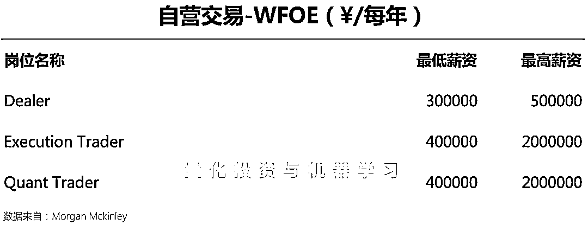

# Quant 有多爽？Morgan Mckinley 发布 2021 中国薪酬报告

> 原文：[`mp.weixin.qq.com/s?__biz=MzAxNTc0Mjg0Mg==&mid=2653316301&idx=1&sn=9ae54171ac599c7eed6f4ff7d6e761ff&chksm=802da6d8b75a2fce518d604e9e0ae2460103a359e1d30a903617f0f3e21a83fa13efb17fce6b&scene=27#wechat_redirect`](http://mp.weixin.qq.com/s?__biz=MzAxNTc0Mjg0Mg==&mid=2653316301&idx=1&sn=9ae54171ac599c7eed6f4ff7d6e761ff&chksm=802da6d8b75a2fce518d604e9e0ae2460103a359e1d30a903617f0f3e21a83fa13efb17fce6b&scene=27#wechat_redirect)

量化投资与机器学习公众号报道

大家好，周五了！

为了让大家过一个不愉快的周末，小编又来贩卖焦虑了

作为国际知名的猎头顾问公司，Morgan Mckinley 近期发布了**2021**中国**薪酬报告**，让我们重点看看与 Quant 相关的职位有多『爽』！

**1 爽=6.4 亿。**起因概括为：郑爽 77 天收入 1.6 亿，平均日收入 208 万，估算劳逸结合情况下年收入 6.4 亿。网友们戏称为新的年收入计量单位。

各位自己体会。有啥想说的，欢迎下方留言~

量化投资与机器学习微信公众号，是业内垂直于**量化投资、对冲基金、Fintech、人工智能、大数据**等领域的主流自媒体。公众号拥有来自**公募、私募、券商、期货、银行、保险、高校**等行业**20W+**关注者，连续 2 年被腾讯云+社区评选为“年度最佳作者”。