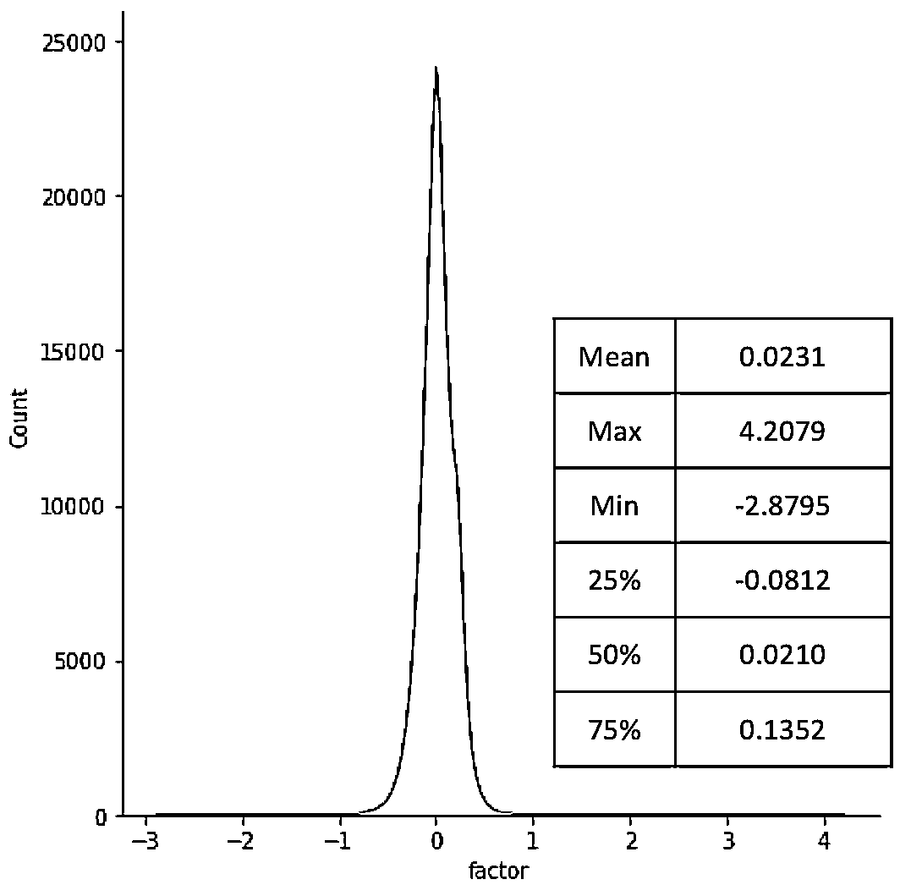
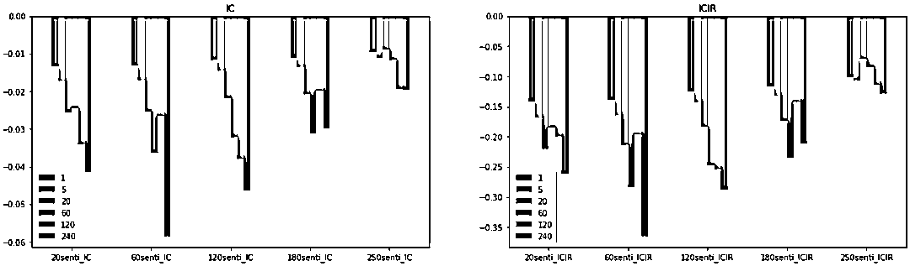
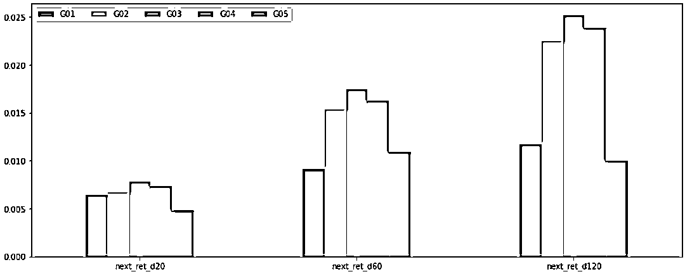
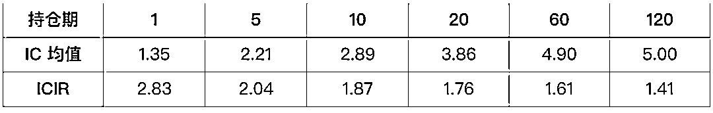
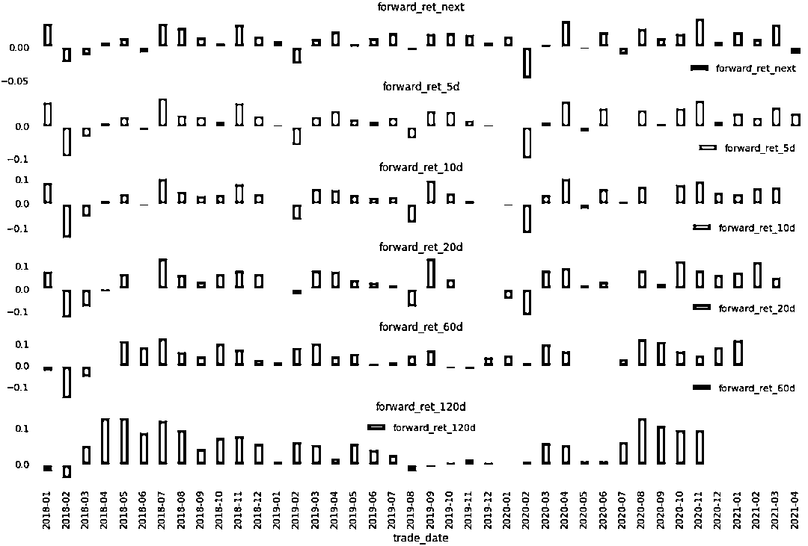
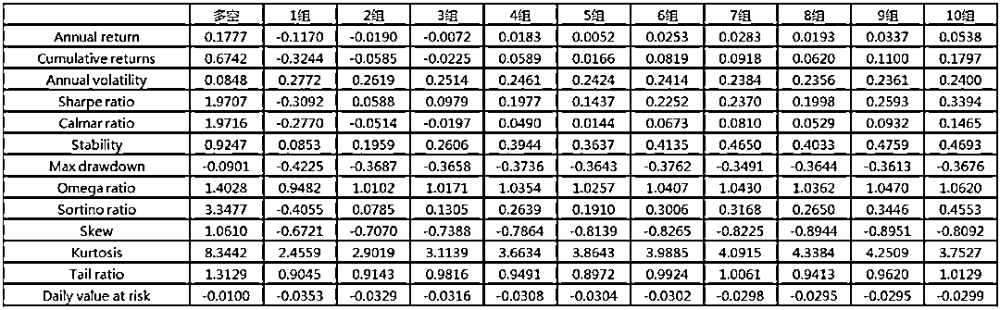
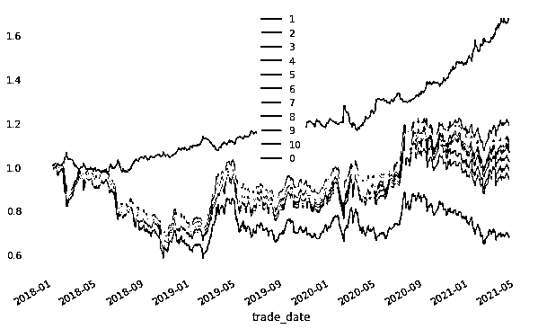

# Sentiment Beta：Risk or Alpha？

> 原文：[`mp.weixin.qq.com/s?__biz=MzAxNTc0Mjg0Mg==&mid=2653316282&idx=1&sn=2541e63ed73becf4ac517e19b815af02&chksm=802da6afb75a2fb9362e8fa0b840a82dc7c295f095324a598a3162072ded5320cc6c53ad49ed&scene=27#wechat_redirect`](http://mp.weixin.qq.com/s?__biz=MzAxNTc0Mjg0Mg==&mid=2653316282&idx=1&sn=2541e63ed73becf4ac517e19b815af02&chksm=802da6afb75a2fb9362e8fa0b840a82dc7c295f095324a598a3162072ded5320cc6c53ad49ed&scene=27#wechat_redirect)

量化投资与机器学习公众号出品

**核心观点**

参考 CAPM 的逻辑，个股收益与市场情绪变动回归得到的 Sentiment Beta，可以刻画市场情绪对于个股收益的影响。

*   市值行业中性化后的 Sentiment Beta，月度 IC 均值为-4%左右，ICIR 为-0.15。分组测试表明，处于中间组的股票（受市场情绪影响小）的收益显著高于分布的两端。

*   对 Sentiment Beta 的绝对值取负数后的 new Sentiment Beta，是一个显著的 Alpha 因子。月度 IC 接近 4%，ICIR 接近 1.8，多空年化收益超 17%，夏普接近 2。

*   新闻文本分析数据是指通过训练后的机器学习模型对海量的新闻文本进行关键信息提取及情绪分析后得到的结构化数据，该数据正逐渐被应用在量化投资领域。主要应用的方向有以下几个：

**▌个股情绪因子**

通过新闻中个股的情绪聚合计算日度个股情绪因子，主要依赖股票实体识别的算法以及个股情绪判定的模型。通过对个股情绪因子测试分析表明，个股情绪因子与股票收益之间有明显的相关性，因子的 IC 值 4%左右，多空分层非常稳定。详见 JPMorgan 2020(1)。

****▌**市场、行业情绪指数**

通过对全市场新闻中行业新闻进行聚合分析，借助滤波算法，计算出各行业的情绪。并加权得到整个 A 股市场的情绪指数（以下简称 CSMS）。该应用主要依赖行业识别的算法以及新闻情绪判定的模型。该指数能有效预测市场关键性节点，关于指数的构建与应用，详见 JPMorgan 2020(2)。

****▌**高频事件驱动策略**

通过新闻中关联公司的事件，第一时间驱动交易。该应用主要依赖事件识别的算法及事件与主体关联的算法，我们还未做进一步的研究分析。

本文尝试从市场情绪（CSMS）对个股收益的影响，尝试构建相关因子，并做研究分析。

**Sentiment Beta**

市场情绪指数（CSMS）反应的是当前市场整体的情绪水平，常用在大盘择时策略中，在之前的报告中（参考：[JPMorgan 最新报告解读：A 股新闻情绪指数策略（附下载）](http://mp.weixin.qq.com/s?__biz=MzAxNTc0Mjg0Mg==&mid=2653308124&idx=1&sn=9f990aab91d3840b6babda5d95879c50&chksm=802d86c9b75a0fdf5124c602ce916e532a71dd208be9819c4ac62c05a097ff7da682dcfed701&scene=21#wechat_redirect)），我们发现市场情绪指数对于大盘行情有一定的预测作用，结合传统技术分析的方法能够获得非常显著的超额收益。在本篇报告中，我们借鉴市场 Beta 的概念，提出 Sentiment Beta（Senti-Beta）的概念，用以刻画市场情绪对于个股收益的影响。对于任意股票 i，Senti-Beta 的具体计算逻辑如下：<embed style="vertical-align: -2.023ex;width: 51.4ex;height: auto;max-width: 300% !important;" src="https://mmbiz.qlogo.cn/mmbiz_svg/a18XcQ1EBBggIibBXCZoqduStgLs8b9a8C2cuQssiasVqcCqUibNsbCYzkAtHcpvs3rWt12esI7BnFiaGlAn9H6e3QtgT80ZFVFL/0?wx_fmt=svg" data-type="svg+xml">其中 为股票 的日度收益， 为市场情绪指数值， 为股票 的 Sentiment Beta。

在计算 Sentiment Beta 时还有以下几点需要注意：

> 1、每日收盘后计算每个股票当日的 Sentiment Beta。
> 2、以前 N 的数据，采用的是时间序列回归。
> 3、如果去除停牌日之后，数据长度小于 min(30, N/3)，则当日 Beta 值为 NaN。

我们计算了 2018 年 1 月至 2021 年 3 月的 Senti-Beta, 以 120 日计算的 Senti-Beta 为例，其原始值分布如下，可以看出分布比较对称，但峰度非常高：

既然 Senti-Beta 度量了股票受市场情绪的影响，那我们自然会好奇，这种影响程度会不会与股票市值有关，直观理解中，我们认为小市值股票更容易受到市场情绪的影响。由于影响本身有正负之分，我们将 Senti-Beta 取绝对值用以度量市场情绪对股票收益的绝对影响。如下图所示，我们计算了 Senti-Beta 绝对值与市值的相关性，可以看出绝大部分时间两者相关性不大，但如 2020 年初，相关性达到了-25%（也是所有时间段相关性绝对值最大的取值），意味着小市值股票更容易受到市场情绪的影响（无论是正面影响还是负面影响），而当时市场由于新冠疫情的影响经历了急剧的下跌与大幅的震荡。这是一个很有意义的结论，**当市场波动大时，小市值股票更容易受到市场情绪的影响**，那么构建 Senti-Beta 中性化的组合就可以对冲掉市场情绪对于组合的影响。

**Sentiment Beta：风险因子 or Alpha 因子？**

Senti-Beta 与股票收益之间会存在什么样的关系？我们首先对 Senti-Beta 进行了市值行业中性化，并计算了不同持仓周期的 IC 值，如下图所示，无论持仓周期长短，IC 均值都为负值，也就是说 Senti-Beta 越大股票收益越小。以 120 日回溯期、20 日持仓周期为例，因子 IC 均值超过了-3%，而因子的 ICIR 只有-0.15（未年化）。说明因子本身与股票收益之间有关系，但因子方向性不稳定。从这些特征来看，Senti-Beta 更符合一个风险因子的特征。

再来看分组测试，我们把股票分为五组，可以很清楚的看到，无论是多长的持仓周期，处于中间组的股票的平均收益要明显好于处于两边组的股票。也就是说，受市场情绪影响（Senti-Beta 的绝对值）越大的股票收益越小，受市场情绪影响（Senti-Beta 的绝对值）越小的股票收益越大。

**有效的 Alpha 因子：Senti-Beta 的绝对值**

既然 Senti-Beta 与股票收益存在明显的非线性关系，那我们对原始的 Senti-Beta 做了以下改进(取绝对值并乘以-1)：<embed style="vertical-align: -0.566ex;width: 38.676ex;height: auto;max-width: 300% !important;" src="https://mmbiz.qlogo.cn/mmbiz_svg/a18XcQ1EBBggIibBXCZoqduStgLs8b9a8OpjapNTCJyfGSLnzQNN7xesEAasic0jdiavMMVGqMbbINxws2gibd4vmQicoTs3wvBYa/0?wx_fmt=svg" data-type="svg+xml">我们的假设是，股票收益与市场情绪影响的绝对大小有关，越容易受市场情绪影响（new-Senti-Beta 越小）的股票收益越小；越不容易受市场情绪影响（new-Senti-Beta 越大）的股票收益越大。  

下表给出了不同持仓期因子的 IC 均值与 ICIR 值，持仓期 20 天以上时，因子 IC 均值接近 4%，ICIR 接近 1.8，符合一个 Alpha 因子的特征：

下图是不同持仓期，每个月 IC 的均值，可以发现在 2020 年 2 月份之后，因子表现一直比较稳定：

分组测试中，我们以中证全指成分股，每月初调仓，以下是收益统计，其中多空组的年化收益 18%，最大回撤 9%，夏普比率接近 2。从分组收益图还可以看出，空头组（受情绪影响最大的组）的收益明显要低于其他组别：

**总结**

本文通过对个股收益与市场情绪指数做回归，构建了 Senti-Beta 因子，我们发现受市场情绪影响小的股票的收益要明显好于受市场情绪影响大的股票，并由此构建了 new-Senti-Beta 因子。该因子月度调仓的多空组的年化收益达到 18%，最大回撤 9%，夏普比率接近 2。

关于 Senti-Beta 及 new-Senti-Beta，还有很多问题及疑问待解决：

*   Senti-Beta 因子结合传统风险模型后的效果提升是否明显？
*   new-Senti-Beta 在指数增强中的实际应用效果怎么样？
*   对个股情绪因子进行 new-Senti-Beta 中性化处理后，因子效果是否有显著提升？
*   对传统量价因子进行 new-Senti-Beta 中性化处理后，因子效果是否有显著提升？
*   这两个因子与 Value，Size，Momentum 之间还有什么可挖掘的信息？

以上问题，我们下期文章一一分解。

最后，感谢 ChinaScope 为公众号提供 SmarTag 新闻文本分析数据及 A 股新闻情绪指数（CSMS）。有需要的小伙伴可以点击**阅读原文**，联系获取。

**参考文献**

JPMorgan 2020 (1), News Sentiment in China Using ChinaScope NLP for Trade Timing A-Shares

JPMorgan 2020 (2), News Sentiment for China Macro Trading the A-Share market using ChinaScope

量化投资与机器学习微信公众号，是业内垂直于**量化投资、对冲基金、Fintech、人工智能、大数据**等领域的主流自媒体。公众号拥有来自**公募、私募、券商、期货、银行、保险、高校**等行业**20W+**关注者，连续 2 年被腾讯云+社区评选为“年度最佳作者”。