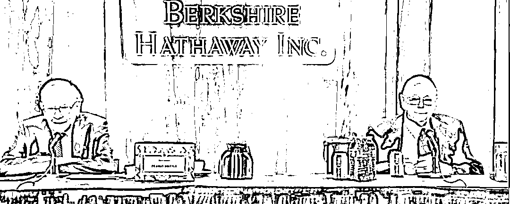
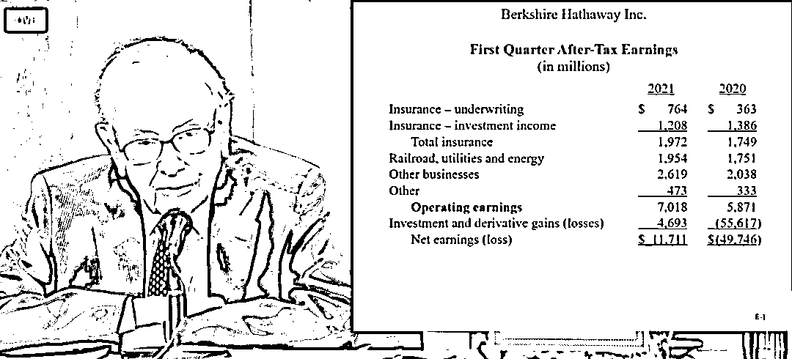
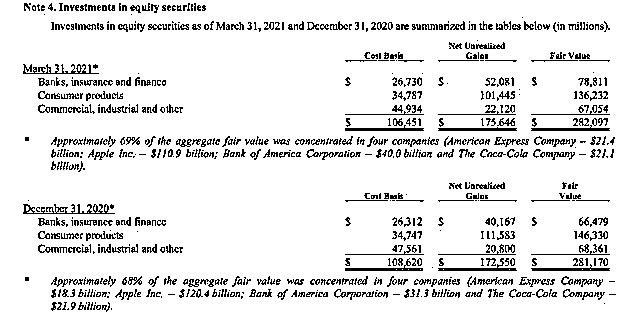

# 精华版 | 2021 巴菲特股东大会

> 原文：[`mp.weixin.qq.com/s?__biz=MzAxNTc0Mjg0Mg==&mid=2653316178&idx=1&sn=bc78d2993e544a7e6abe450ecfb69dc6&chksm=802da647b75a2f510f3f18646c7b89c81346d701302a45a699e6cc8d4f721411061ab7b934b8&scene=27#wechat_redirect`](http://mp.weixin.qq.com/s?__biz=MzAxNTc0Mjg0Mg==&mid=2653316178&idx=1&sn=bc78d2993e544a7e6abe450ecfb69dc6&chksm=802da647b75a2f510f3f18646c7b89c81346d701302a45a699e6cc8d4f721411061ab7b934b8&scene=27#wechat_redirect)

内容来源：网易财经、第一财经、北京商报、华尔街见闻、21 世纪经济报等

**导读**

  美国东部时间 5 月 1 日，伯克希尔·哈撒韦公司的年度股东大会在美国洛杉矶如期举行。沃伦·巴菲特和他的长期商业伙伴查理·芒格就热门问题进行一一解答。熬过了极为特殊的 2020 年后，“股神”巴菲特有哪些最新感悟？

美国东部时间 5 月 1 日，伯克希尔·哈撒韦公司(Berkshire Hathaway)的年度股东大会在美国洛杉矶如期举行。

“奥马哈先知”(Oracle of Omaha)沃伦·巴菲特(Warren Buffett)和他的长期商业伙伴查理·芒格(Charlie Munger)就热门问题进行一一解答。

**2000 公里，“90 后”CP 再次同框**

今年，90 岁高龄的巴菲特将专程飞赴加州，与合作了 60 多年的 97 岁老搭档芒格“合体”，年度股东大会的地点也暂时移师洛杉矶。去年因疫情出行限制，芒格没有参加 2020 年股东大会。

这是年度股东大会第二次在几乎没有与会者的情况下举行，也是首次不在内布拉斯加州的奥马哈小镇举行。

芒格一直充当着副手角色，在以往的年会上芒格虽较少发言，但其简明有力的话语总能给人很大启迪。

巴菲特是成功的投资家，长期位居世界富豪榜前列；芒格是他的事业搭档和终身挚友。他们分别担任市值 4640 亿美元的伯克希尔·哈撒韦公司正副董事长，是“价值投资”理念的最佳代表，一个被称为“股神”，一个被称为“投资大师”。

**巴菲特定居的奥马哈和芒格定居的洛杉矶相隔 2000 公里。**

在问答环节，4 人回答了股东的多个问题，但对于退休和接班人的问题则没有涉及。

**1、巴菲特建议投资指数基金**

会上，巴菲特首先罗列了当今世界上最大的 20 家公司，如苹果、沙特阿美、微软、亚马逊、Facebook 等，并提问这些公司中有多少在 30 年后还会在榜单上。

巴菲特提醒道，1989 年排名前 20 的公司没有一家出现在今天的榜单上。30 多年前，全球最大的公司中超过一半是日本公司，上榜的美国公司是埃克森美孚、通用电气、默克、IBM、American Tel&Tel 和 Philip Morris。

巴菲特指出，这个故事说明对于资本家而言，资本主义运作得十分出色**。“世界可能以非常、非常戏剧性的方式发生变化。”他补充称，最好的投资方式是投资指数基金。**

此外，巴菲特警告新手投资者，选择伟大的公司比仅仅选择一个有前途的行业要复杂得多。“选股要比找出未来什么会成为一个好行业重要得多。”

巴菲特以汽车行业为例。20 世纪初，大约有 2000 家公司进入汽车行业，因为投资者和企业家都期望该行业有一个令人惊讶的未来。而到了 2009 年，仅有三家汽车制造商幸存，其中两家破产。

巴菲特强调，世界可能会发生剧烈的变化，所以投资指数基金将是一个好的选择。

**2、巴菲特支持持有化石燃料公司**

在回答有关化石燃料公司受到越来越多批评的问题时，巴菲特表示，他对持有雪佛龙（Chevron）没有异议。即使可再生能源成为全球的侧重点，但他预计雪佛龙未来将造福社会。

巴菲特称，“两极化的人都有点疯狂。我不希望（政府）在三年内禁止所有碳氢化合物。这并不可行。另一方面，随着时间的推移，人类将适应正在发生的事情。”

巴菲特指出，虽然他和芒格已经发誓戒掉烟草股，但他们拥有销售香烟的零售商。

他补充道，“每一个企业都有某种东西是你知道之后就会不喜欢。如果你期望伴侣、朋友或公司尽善尽美，那你将找不到合适的。”

**3、巴菲特：卖苹果后悔了**

巴菲特承认，在 2020 年出售一小部分苹果股票是一个错误。2020 年第四季度里，伯克希尔减持了 3.7%的苹果股票，至约 9.44 亿股。

巴菲特表示：**“我们有机会买下苹果，但去年我卖掉了一些股票。这可能是个错误。”**

这位“奥哈马的先知”接着说，**苹果的股票是“非常非常便宜的”。他指出，“它对人们来说是不可或缺的。”** 苹果产品广受全世界欢迎，在人们的生活中扮演着重要角色。

苹果是伯克希尔投资组合中最大的头寸，价值近 1110 亿美元。

“一辆汽车要 35000 美元，如果你问有些人，是否愿意舍弃苹果产品，我敢肯定，他们宁愿选择放弃汽车。”

**4、芒格称不加限制的联邦支出将“以灾难告终”**

巴菲特和芒格在会上谈到了美国政府近期的刺激措施：高政府支出和极低利率的结合。芒格表示，他认为这种极端情况难以永远持续。

芒格认为，职业经济学家对自己的分析过于自信，但很多事情都被证明是错误的。不过，他指出，呼吁加大财政支出、较少考虑预算赤字的《现代货币理论》(Modern Monetary Theory)不一定是正确答案。

芒格称，“现代货币理论家们也比他们应有的更有信心。我不认为我们任何人都知道后果。这种极端的刺激举措很有可能比大家想象的更可行，但我认为，一旦继续这样做，没有任何限制，它将以灾难告终。”

**5、SPAC 不会永远流行**

作为华尔街的“新宠”，SPAC 备受关注。

**巴菲特也对 SPAC 发表了看法。他表示，华尔街对 SPAC 的疯狂追捧不会永远延续，因为它会让交易环境更具竞争性。**

巴菲特指出：

“这是一个杀手。据我所知，SPAC 通常需要在两年内花完所有的钱。如果你用枪指着我的头，要我两年内买一家公司，我会买一家。这总是有来自私人股本基金的压力。”

他强调，“尽管现在是钱在哪里，华尔街就去哪里。但是，这种情况不会永远持续下去。”

巴菲特和芒格还对股市中猖獗的投机行为提出了警告，特别是对 SPACs 的投机，并表示这是新投资者涌入股市的副产品。巴菲特警告称，没有人告诉你这种狂热什么时候会结束。

**6、芒格：比特币“令人厌恶”**

芒格在会上向比特币和加密货币“开火”，“我认为这些发展是令人厌恶的，而且违背了文明的利益。”

他认为比特币是“凭空捏造出来的金融产品”。芒格坦言，“我当然讨厌比特币的成功。”“我不欢迎对绑架者和勒索者如此有用的货币。”

**巴菲特回避了有关比特币的问题，**因为他表示他不想让做多比特币的人感到悲伤。

随着特斯拉和华尔街各大银行的参与，比特币似乎渐渐成为主流，这个全球最大的加密货币今年出现了令人瞩目的反弹，价格更是在 4 月份突破了 6 万美元。不过近两周由于各方因素，比特币“跌跌不休”，甚至一度跌破 4.8 万美元。

芒格长期以来一直批评比特币的极端波动性和缺乏监管。他在今年 2 月曾表示，比特币的波动性太大，无法很好地作为交换媒介。他说，**“这真的是一种人造的黄金替代品。因为我从来没有买过黄金，所以我也从来没有买过比特币。”**

**7、巴菲特：还是不会买航空股**

去年巴菲特在股东大会上披露，将 2016 年大举买入的四大美国航空公司——美国航空、西南航空、美联航和达美航空股票持仓全数抛售，但并没有解释原因。

在今年的股东大会上，巴菲特说，他觉得他的行动没有任何问题，美国政府已经在疫情爆发后给航空公司提供帮助。事实上，伯克希尔并不是航空公司业的大股东，也正因为不是大股东，政府才可能更容易接受援助这个行业。

“如果有一个非常、非常富有的股东持股 8%或者 9%，这些航空公司的结局很可能截然不同。”

“一个实际售价不到 1000 亿美元的行业亏了很多钱，他们失去了未来盈利的能力……国际旅游没有恢复。我觉得，这是伯克希尔历史上伟大的时刻，我们得到的净值超过了美国其他公司。我认为航空公司已经因为我们的抛售表现得更好。”

去年巴菲特说，对航空公司股的估值犯了“可以理解的错误”，买入的时候投资金额是有吸引力的，事实证明他看错了这个行业。新冠疫情改变了他对航空公司的看法，不清楚未来三四年人们是否会像去年那样坐飞机。今年巴菲特说，**伯克希尔持有约 7000 亿美元的航空股，最后仅卖掉了 1%到 1.5%，减持的比例其实并不大。**

巴菲特指出，航空业去年的困境并不是出于自身的问题，和 2008 年银行业造成金融危机不同。**但所有航空公司的整体经营规模比不上一个苹果公司，所以它们不会跻身伯克希尔的前十五大投资。**

对于航空业的前景，巴菲特说，由于商务出行的复苏还滞后，航空出行可能没有回到疫情爆发前的水平。国际范围内，他还不想买航空公司股。

巴菲特强调，伯克希尔依然通过其他企业持有很大的航空公司风险敞口。目前持有约 19%的美国运通，对服务航空业的公司精密机件（Precision Cast Parts）还有持股。他希望四大美国航空公司经营良好，认为这些公司的管理层已经在疫情期间做了出色的工作。

**8、芒格谈中国脱贫：让 8 亿人脱离贫困，是史无前例的成就**

芒格谈到中国让 8 亿人脱离贫困，是史无前例的成就，并表示向中国致以敬意。

**9、巴菲特：仍钟爱银行股，但持股比例不会超过 10%**

对于银行股，巴菲特在股东会上表态称，虽**然他仍钟爱银行股，但对美国银行的持股不想超过 10%。**“现在美国的银行业务比 10 或 15 年前好得多……世界各地的银行业务可能会让我担心，但我们的银行比 10 年或 15 年前要好得多。”

**10、巴菲特：我们看到了严重的通货膨胀**

巴菲特表示，在新冠疫情复苏期间，他们看到了价格压力上升的迹象，这证实了许多市场参与者对通胀压力增加的担忧。

他说：“我们看到了严重的通胀。我们在涨价，别人也在涨价。而且它正在被接受。我们做了很多房地产业务，成本一直在涨，涨，涨。钢铁的成本每天都在上涨。”

**一季度扭亏为盈**

“股神”沃伦·巴菲特的公司伯克希尔哈撒韦（以下简称"伯克希尔"）发布 2021 年第一季度财报，业绩扭亏为盈，彰显该公司的业务正从新冠病毒大流行的冲击中恢复。

财报指出，该公司董事长巴菲特第一季度一直在大举回购伯克希尔的股票，但回购速度略有放缓。

具体来看，伯克希尔总收入为 645.99 亿美元，高于市场预期的 636.6 亿美元，去年同期为 612.65 亿美元；净利润为 117.11 亿美元，相当于每股 A 类股收益 7638 美元；上年同期为亏损 497.46 亿美元，相当于每股 A 类股亏损 30653 美元。

剔除部分投资业绩，伯克希尔营业利润为 70.18 亿美元，同比增长 20%，仅次于 2019 年第三季度的增长。利润部分来自于保险，制造、服务和零售业务，其中保险承保业务第一季营业利润为 7.64 亿美元，高于去年同期的 3.63 亿美元；该公司的铁路、公用事业和能源部门的营业利润为 19.5 亿美元，高于去年同期的 17.5 亿美元。

截至 2021 年第一季度末，伯克希尔持有约 1454 亿美元现金，高于 2020 年底的约 1383 亿美元。

伯克希尔的股权投资也取得了强劲增长，第一季度增长了约 46.9 亿美元。**不过，巴菲特对投资者表示，不要关注投资收益或损失的季度波动。**

伯克希尔在一份声明中称**：“任何一个季度的投资收益(亏损)数额通常都是没有意义的，它提供的是每股净收益数据，对于那些对会计规则知之甚少或根本不了解的投资者来说，这可能是极其具有误导性的。”**

**重仓四大股票、暂不买航空股**

财报显示，巴菲特在第一季度重仓四大股票。

截至 2021 年 3 月 31 日，巴菲特前**4 大持仓为美国运通、苹果、美国银行、可口可乐**，这四只股票持仓占其投资组合比重为 69%，公允价值分别为：美国运通公允价值为 214 亿美元，苹果公允价值为 1109 亿美元，美国银行公允价值为 400 亿美元，可口可乐公允价值为 211 亿美元。

尽管苹果仍是伯克希尔投资组合中最大的头寸，但是巴菲特在 5 月 1 日对年度股东大会上承认，**去年卖出一小部分苹果股票“可能是个错误”。2020 年第四季度，伯克希尔减持 3.7%的苹果股票至约 9.44 亿股。**

巴菲特表示，“我们有机会买它，但去年我卖掉了一些股票。这可能是个错误。” 他补充道，苹果的股票是“非常非常便宜的”，因为苹果“对人们来说是不可或缺的，在他们的生活中扮演着巨大的角色。”

**此外，巴菲特强调，将暂时不会购买航空公司的股票。**去年的年度股东大会上，巴菲特宣布，伯克希尔在 2019 年 12 月抛售了其持有的美国四大航空公司：美国航空、达美航空、西南航空和联合航空的大量股份，这些公司的价值约为 40 亿美元。

但是，自巴菲特去年宣布这一决定以来，航空股已出现反弹。受联邦政府提供 540 亿美元就业支持、投资者对新冠病毒疫苗的乐观情绪以及需求反弹的提振，美国航空、达美航空和美联航的股价都比一年前上涨了 80%以上，西南航空的股价也上涨了一倍。

有批评人士指出，尽管航空公司，尤其是商务旅行的长期前景仍然不稳定，但这位传奇投资者的这一举动是糟糕的。

巴菲特则表示，“一个股价低于 1000 亿美元的行业失去了预期的盈利能力，而国际旅行一去不复返。我不认为出售航空股是伯克希尔历史上的重大时刻，因为我们的净资产仍比美国任何公司都多。在我们出售之后，航空公司股票表现得更好。**我希望他们一切顺利，但我仍然不想购买航空股。”**

**大会要点实录**

以下是伯克希尔股东大会要点实录：

**1、大会开场白**

巴菲特首先介绍了今年大会暂时转到芒格居住了 62 年的大本营洛杉矶举行，随后介绍 2018 年起升任伯克希尔非保险业务副董事长的 Greg Abel，以及一同升任公司保险业务副董事长的 Ajit Jain 也出席大会回答股东提问。

分析称，这两个人都是“后巴菲特时代”伯克希尔首席执行官的主要竞争者。不过鉴于 2020 年芒格因疫情出行限制未能出席股东大会，由 Abel 代班这一背景，外界普遍认为 Abel 是 CEO 接班人。

**2、巴菲特点评股市三十年的变迁**

巴菲特列举了截止 2021 年 3 月 31 日的全球 20 个市值最大上市企业，前六个公司中有 5 家是美国公司，除了当地政府控股的沙特阿美。巴菲特认为这说明美国环境利好，而 30 年前的全球 20 大市值排名中众多的是日本公司：

短短 30 年内，最高市值公司的市值从 1040 亿美元增长到 2.05 万亿美元。从市值水平来看，是变大了，最大市值一定程度反映了一些通胀，但这期间其实并不是高通胀时期。你可以看到 30 年里，世界变化极大。但如果你的股票持仓足够多元化，那就会表现很好，当然我个人更喜欢美国公司。

如果你喜欢挑选个股来投资的话，很难确保你能挑选到很多年后还顽强存活的公司。例如，1903 年我爸爸出生时，是汽车改变了美国，曾经至少有 2000 家跟汽车相关的公司，而到 2009 年时就只有三大巨头了。这是汽车业在金融领域里发生的变化，变化是巨大的。

**3、问：你曾说当别人恐惧时我贪婪，但疫情中伯克希尔也抛售了航空股，等于别人恐惧时你们也恐惧了，如何回顾当初伯克希尔的决策？**

巴菲特表示，我们那个时候没有卖很多。我们总共拥有 7000 亿，其实只卖了 1%的部分。航空业不是我们投资组合里重要成分，当初想帮助航空公司，有少数股东觉得不好做。整个经济停滞情况下，救不了。航空公司其实最开始受到政府很多帮助。我们知道短期内航空业回不来的。不过整体上，经济复苏比想的快。我们现在还持有不少股票。我知道航空业有了不少复苏，但是我还是不想买航空股。

**4、问：为何不用公司持有的巨额现金来进行大象级别收购？**

巴菲特表示，伯克希尔持有现金大概相当于公司业务价值的 15%，规模是合理的，之后比例会降低。去年 3 月的疫情改变了形势，伯克希尔必须确保在任何状况下都有自有资金，不能想着依赖政府和银行等其他机构借钱。去年 3 月大家都希望渡过难关，政府没有意料到这种情况。我们没有办法在这种疯狂的环境下出手做这么大的投资，没办法一下子部署几百亿资金进行收购。

**5、问：15 年伯克希尔表现不如市场，你们如何让大家继续持有你们，而非大盘指数？**

芒格表示，对长期投资者来说，是长期持股还是持股多元化，持有伯克希尔等于持股多元化。

巴菲特随即打趣称，我一直以来都有推荐 SP500，我可没推荐伯克希尔。我不觉得普通人能选股，我有时还建议你不要买我们的股票。当然 90%的情况下，你买国债或者标普比较安心，我也建议。伯克希尔是很好的可以持有的个股，如果您对股市不了解，那就买标普。

**6、问：1997 年投资烟草公司是否后悔？类比怎么看投资石油天然气、购买雪佛龙股票？考虑到有关气候变化的警告，怎么看碳氢相关投资？**

巴菲特称，任何情况都有可能，1997 年的情况和现在不同。好事多和沃尔玛也卖烟草，这只是一种行业。你觉得这个行业不好，那就投股指、基金等。我无意对进入某个行业做出批评。

抽烟是个人决定，以前我跟女婿说抽烟对人类有害，我们决定不投了。现在很难判断一种业务。我不知道我是不是觉得雪佛龙有益于社会，我也的确觉得世界是在变化的。

**7、问：巴菲特为何反对披露气候与社会责任相关内容的股东提案？**

芒格称，我们不知道全球变暖的具体答案。巴菲特表示，伯克希尔公司在商业基础设施上的投资很大，高于所有公司，最近美国总统也在不断提到基建。之前我们也在考虑关闭煤电电厂，但是我们需要有足够多的其他能源的来源，才可以关闭煤电。企业已经知道气候变化的答案，很多质疑的人，我可以说他们没有读过我们的财报。

曾经担任伯克希尔能源业务主管的现任副董事长 Greg Abel 表示，2007 年时候我们已经提出气候变化是个威胁，当时提到了创新，如何设立合理目标，之后我们都围绕去碳化开展。

伯克希尔已经宣布要在输电网基础设施上投入 180 亿美元，目前投入了 50 亿，未来十年还投 130 亿。伯克希尔 2015 年就做出承诺，其中一条是要把 150 亿美元投入可再生能源，现在投入已经远超。我们提前完成了 28%的减排目标，公司可以在 2030 年达到巴黎气候协议的要求。2020 年已经关闭 16 座火电厂，到 2030 年还会关 16 座，2050 年以前可以关闭所有烧煤的火电厂。

**8、问：巴菲特和芒格两人对 Costco 和富国银行等投资理念有分歧，如何理解？**

芒格表示并没有冲突，自己喜欢 Costco，伯克希尔也喜欢。巴菲特也称，我们 62 年期间挺和谐，没有什么大冲突。

被问及两位负责具体业务的副董事长如何合作时，Ajit Jain 表示，芒格和巴菲特的合作天衣无缝，这是无法复制的，我尊敬 Greg，但我们不像芒格和巴菲特那样经常互动。遇到对方负责业务的问题时会随时交流。Abel 也称，Ajit 非常了解了解伯克希尔的文化，很荣幸有他这样的同事。

**9、问：为何伯克希尔去年出售了部分苹果股票，而不是趁低买入？**

巴菲特表示，我们现在持有苹果 5.3%，是很安全的水平，而且持仓远超其他行业企业。

他和芒格都称，苹果的管理层非常棒，CEO 库克可能创意上比不过乔布斯，但是“我们见过最棒的公司管理者”。苹果产品广受全世界欢迎，利润率非常高，客户满意度可以达到 99%；对于手机本身来说，甚至超越汽车成为人们生活不可或缺的产品。

“去年伯克希尔出售了部分苹果股票，但由于回购了自家股票，令股东所持有的苹果比例不降反升。我不希望政府过多干扰科技业，这些公司市值非常高，对我们也是有利的。

我不觉得苹果估值疯狂，估值需要和利率做比较。周四美国财政部的四周短期美债拍卖有 400 亿美元规模，但得标利率为 0。现在美国债券没什么收益了，我们在接近零的利率环境，如果长期来看利率是这样的话，那么股票价格就显得低。找不到什么债券能有苹果和谷歌这种公司的盈利水平。”

**10、巴菲特：SPAC 有投机属性**

巴菲特表示，SPAC 按规定两年内必须花钱出去，如果利用别人的钱来赌博，自然表现好于伯克希尔。芒格称，我不喜欢职业投资者骗人投资割韭菜，SPAC 是一种“容易钱”（easy money），如果过度的话就会有很大问题，用来赌博的话是种羞耻行为。

**11、问：股市是否处在泡沫化，现在应该持现离场观望，还是投资更多到股市？**

巴菲特称，有时候我们买了一些股票并不安心，要保留相应现金来保护股东。

在谈及回购问题时，芒格称，回购股票用来推升股价是不道德的，但是如果公平操作并用来回馈股东，就没有问题。巴菲特称，回购是股东投票同意的，97%的股东不是为了拿股息。

**12、问：如何看待拜登政府的资本利得税提升计划？**

巴菲特表示，我不喜欢回答政治类问题。

**13、问：大涨之后，巴菲特和芒格还认为加密货币是一文不值的吗？**

巴菲特表示，我能预料到这个问题，但我选择不回答，我和芒格都没没持有比特币，不想回答这个问题让大家不开心。

芒格直言，我痛恨比特币的成功，不喜欢一个凭空创造的金融产品就赚几十亿美元，也不喜欢虚拟货币绑架现有的货币系统。

**14、巴菲特：马斯克的火星殖民计划可能保费挺高**

当被问及是否愿意作为马斯克旗下 SpaceX 火星殖民计划的保险公司时，负责伯克希尔保险业务的副董事长 Ajit Jain 直接称：“这很好回答，不会。”

巴菲特随后笑着称，给马斯克担保，我会很小心，不过这取决于保费是多少，我猜我心目中的保费跟马斯克预想的很不一样。

**15、巴菲特：第一大风险要素是选择的管理层不合适**

巴菲特表示，人们总是认为美国反垄断法和税法修改会影响到伯克希尔，最大的风险因素是为旗下业务选择了错误的管理层。我们不是通过作出宏观经济预言来赚钱的。

谈及银行股持仓时，巴菲特称喜欢银行股和金融股，但对美国银行 BOA 的持仓不想超过 10%，所以去年卖出了一些。他不想解释对威瑞森 Verizon 等电信股的持股逻辑，“觉得可以买就买了。”

**16、如何看待 Robinhood 等热门散户炒股神器？**

巴菲特称，Robinhood 已经成为过去一年或一年半股市赌博属性的非常重要组成部分，他们声称免佣金，吸引了很多想要赌博的人，Robinhood 这种软件没有违法但谈不上道德。赌徒押注的方式不是我尊重的方式，是在“向希望收税”。芒格则生气地表示，这种事情就是个严重错误。

**17、巴菲特：通胀已显著上涨**

巴菲特表示，在新冠疫情经济复苏期间，看到了价格压力上升的迹象，这印证了许多市场参与者对通胀压力增加的担忧。

巴菲特称，我们看到了大量的通货膨胀。我们在提价，人们也在对我们提价。这正在被接受。

巴菲特列举了房地产领域的情况：伯克希尔做了很多住房相关业务。成本在上升，上升，上升。钢铁成本每天都在上涨。巴菲特指出，钢铁成本大幅提升影响了伯克希尔的住房和家具业务。

巴菲特称，人们口袋里有钱了，他们支付更高的价格。这不会停止，这几乎是一场购买狂潮。经济真的很红火。我们过去没有预料到。这对于一部分人来说是个可怕的局面。经济对价格并不敏感。人们预计，通胀还会继续持续下去。

量化投资与机器学习微信公众号，是业内垂直于**量化投资、对冲基金、Fintech、人工智能、大数据**等领域的主流自媒体。公众号拥有来自**公募、私募、券商、期货、银行、保险、高校**等行业**20W+**关注者，连续 2 年被腾讯云+社区评选为“年度最佳作者”。