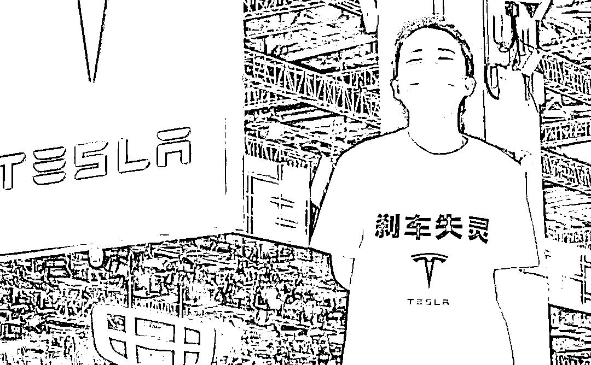
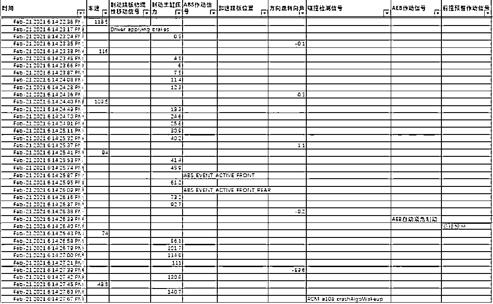

# 数学为王！特斯拉『刹车失灵』事故还原

> 原文：[`mp.weixin.qq.com/s?__biz=MzAxNTc0Mjg0Mg==&mid=2653315965&idx=1&sn=0f4c94f76d1cea1b998ebb20d2f41f8f&chksm=802da168b75a287e2259f2aa278923bd0dc1cdfb0504e4bab81d9456545addbb778f467c9975&scene=27#wechat_redirect`](http://mp.weixin.qq.com/s?__biz=MzAxNTc0Mjg0Mg==&mid=2653315965&idx=1&sn=0f4c94f76d1cea1b998ebb20d2f41f8f&chksm=802da168b75a287e2259f2aa278923bd0dc1cdfb0504e4bab81d9456545addbb778f467c9975&scene=27#wechat_redirect)

# 

## ****引言**** 

**2021 年 4 月 19 日，在上海车展特斯拉展台，一位身穿“刹车失灵”字样 T 恤的女车主爬上车顶大喊“特斯拉刹车失灵”，引来参观者围观，随后女车主被工作人员强行带离现场。20 日，上海警方发布通报称，该女子因扰乱公共秩序被处以行政拘留五日。随后，车顶“维权”事件引发了社会热议，并持续发酵。**

**

图 1: 上海国际车展维权女车主** 

**当事人张女士介绍，事发前她与家人驾驶特斯拉 Model 3 出门游玩，其父在开车时看到远处红绿灯后，很自然地把脚从电门抬了起来，但是车并没有降速，反而以很快的速度追尾了前方多个车辆，最后撞在路边的水泥防护栏才停了下来，事故造成张女士及其父母受伤住院。**

**对于车展维权事件，特斯拉的“强势”和“傲慢”的回应，引发了后续央媒、政府部门的介入。在“重压”之下，特斯拉向车主道歉并于 4 月 22 日公开了女车主交通事故发生前一分钟行车数据（图 2），该数据包含了车速、方向盘转向角、制动主缸压力等信息。**

**

图 2: 特斯拉给出的数据** 

**同时，特斯拉还为该数据作出了一份文字说明：**

> **在驾驶员最后一次踩下制动踏板时，数据显示，车辆时速为 118.5 千米每小时。在驾驶员踩下制动踏板后的 2.7 秒内，最大制动主缸压力仅为 45.9 bar，之后驾驶员加大踩下制动踏板的幅度，制动主缸压力达到了 92.7bar，紧接着前撞预警及自动紧急制动功能启动（最大制动主缸压力达到了 140.7bar）并发挥了作用，减轻了碰撞的幅度，制动防抱死系统（ABS）作用之后的 1.8 秒，系统记录了碰撞的发生。驾驶员踩下制动踏板后，车速持续降低，发生碰撞前，车速降低至 48.5 千米每小时。**

**根据数据和特斯拉提供的说明，可以将制动过程分为开始制动、ABS 工作和 AEB 自动紧急制动三个阶段，具体如图 3 所示。**

**

图 3: 特斯拉数据的分阶段图** 

**此外，事故发生前 30 分钟，刹车记录超 40 次，同时车辆有多次超过 100 km/h 和多次刹停的情况发生。张女士认为这些数据并不是她所要求的车辆原始数据，并且否认了事故当天存在超速驾驶的行为。**

**很多网友认为特斯拉有修改数据的嫌疑。事发于两个相距 500 米的红绿灯之间，红绿灯的摄像头没有启用。事发时天色已暗，国道两边并没有路灯，也没有监控摄像头。所以特斯拉单方面提供的数据并没有得到印证。如果假定特斯拉提供的数据是可信的，那么能否根据该数据还原出事故发生前的行车状态和轨迹呢？本文将建立车辆运动方程，根据车辆前轮转向和车速，确定出车辆的运动状态和轨迹。在此基础上对事故的原因进行分析。**

## **模型**

**为了能够根据车速和方向盘转向角随时间的变化还原出事故中车辆的运动状态，需要研究车辆运动与车速和前轮转向角之间的关系。接下来本文先介绍一下车辆转向的原理，然后在此基础上推导出车辆的运动方程。**

### **车辆转向原理**

**现代汽车使用了一种叫阿克曼转向的技术^([1-3])。在该技术出现前，车辆（如马车）主要使用如图 4 所示的单铰链转向技术。尽管单铰链转向也能使内外转向轮路径指向同一个圆心，但其存在很多缺点。因为要绕着中间单一的轴转弯，摆动空间过大会引起很多不稳定。而且因为两个前轮是平行的，转弯过度时容易卡死而动不了。**

**

图 4: 单铰链转向几何原理** 

**阿克曼转向（图 5）技术有效避免了单铰链转向的缺点。车轴转弯的时候，内外车轮转过的角度不一样，内侧轮胎转弯半径小于外侧轮胎。使四个轮子路径的圆心大致上交会于后轴的延长线上瞬时转向中心，让车辆可以顺畅的转弯。**

**

图 5: 阿克曼转向几何原理** 

**为了具体说明阿克曼转向几何原理，我们将车辆简化为图 6 所示的结构。**

**

图 6: 阿克曼转向几何模型** 

**图中  为轴距（前轴中点到后轴中点的距离）， 为轴长， 和  分别为内外侧前轮转向角， 为车辆中心线到瞬时转动中心的距离。则有 <mjx-container jax="SVG" display="true" role="presentation" tabindex="0" ctxtmenu_counter="3" style="overflow-x: auto;outline: 0px;display: block;text-align: center;margin: 15px 0px;" data-formula="\begin{aligned}
\tan\phi_i &amp;= \frac{L}{R-W/2}\\
\tan\phi_o &amp;=\frac{L}{R+W/2}\\
\tan\phi\phantom{_o} &amp; = \frac{L}{R}
\end{aligned}"></mjx-container>其中  为假想位于前轴中点的车轮应有的转向角。将上式中的  和  取倒数并作差，便可得到阿克曼转向公式： <mjx-container jax="SVG" display="true" role="presentation" tabindex="0" ctxtmenu_counter="20" style="overflow-x: auto;outline: 0px;display: block;text-align: center;margin: 15px 0px;" data-formula="\cot\phi_o - \cot\phi_i = \frac{R+W/2}{L} - \frac{R-W/2}{L} = \frac{W}{L}"></mjx-container>**

### **车辆运动方程**

**如图 7 所示，车辆的状态可以由 (, , , ) 来描述。其中 (, ) 表示车辆后轴中点位置， 表示车身朝向， 表示前轮转向角。**

**

图 7: 车辆的运动方程模型** 

**要根据前轮转向角  和车速  获取车辆运动状态，实际上就是确定下面一组微分方程： <mjx-container jax="SVG" display="true" role="presentation" tabindex="0" ctxtmenu_counter="24" style="overflow-x: auto;outline: 0px;display: block;text-align: center;margin: 15px 0px;" data-formula="\begin{aligned}
\frac{\mathrm{d}x}{\mathrm{d}t} &amp;= f_1(x,y,\theta,v,\phi)\\
\frac{\mathrm{d}y}{\mathrm{d}t} &amp;= f_2(x,y,\theta,v,\phi)\\
\frac{\mathrm{d}\theta}{\mathrm{d}t} &amp;= f_3(x,y,\theta,v,\phi)
\end{aligned}"></mjx-container>在图 7 所示的瞬间，后轴中点的瞬时运动方向是垂直于到瞬时转动中心的方向的，因此 <mjx-container jax="SVG" display="true" role="presentation" tabindex="0" ctxtmenu_counter="5" style="overflow-x: auto;outline: 0px;display: block;text-align: center;margin: 15px 0px;" data-formula="\frac{\mathrm{d}x}{\mathrm{d}t} = v\cdot \cos\theta,\quad \frac{\mathrm{d}y}{\mathrm{d}t} = v\cdot \sin\theta"></mjx-container>其中  为车辆（后轴中点）的速度。接下来需要确定车辆朝向的转动速度 。如果用  表示车辆行驶的距离（速度对时间的积分），则有  = 。根据阿克曼转向几何原理可知  = <mjx-container jax="SVG" role="presentation" tabindex="0" ctxtmenu_counter="11" style="" data-formula="L"></mjx-container> / ，因此有 <mjx-container jax="SVG" display="true" role="presentation" tabindex="0" ctxtmenu_counter="33" style="overflow-x: auto;outline: 0px;display: block;text-align: center;margin: 15px 0px;" data-formula="\mathrm{d}\theta = \frac{\tan\phi}{L}\cdot \mathrm{d}s
\quad\rightarrow\quad 
\frac{\mathrm{d}\theta}{\mathrm{d}t} = \frac{v}{L}\tan\phi"></mjx-container>综上所述，我们得到了描述车辆运动的三个微分方程： <mjx-container jax="SVG" display="true" role="presentation" tabindex="0" ctxtmenu_counter="9" style="overflow-x: auto;outline: 0px;display: block;text-align: center;margin: 15px 0px;" data-formula="\dot{x} = v\cdot \cos\theta,\quad \dot{y} = v\cdot \sin\theta,\quad \dot{\theta} = \frac{v}{L}\tan\phi"></mjx-container>其中  为车速， 为轴距， 为前轮转向角。**

## **结果**

**上文建立的车辆运动方程显示，只要给出车辆控制参数（前轮转向角和车速）关于时间的函数，就能通过数值积分还原出车辆的行驶状态和轨迹。随时间变化的控制参数是由驾驶员控制的：前轮转向角由方向盘控制，车速由油门和刹车控制。在还原特斯拉事故的行车轨迹之前，本文先将模型应用到泊车情况，并以此对模型进行测试。**

### **泊车测试**

**我们人为设置了一个泊车场景，道路和车位情况如图 8 所示。驾驶员需要通过控制车辆前轮转向角和车速，将车从左下角位置移动到右边的停车位中，并且使车头朝外。**

**

图 8: 泊车测试模拟动画** 

**模型给出的模拟动画已经显示在图 8 中，对应的控制参数（前轮转向角和车速）如图 9 所示。**

**

图 9: 泊车对应的控制参数** 

**通过观察图 8 中车辆中心（红）和后轴中点（蓝）的轨迹，还可以发现：车轮在转弯时，两点的轨迹并不重合，红点轨迹的曲率半径总是略大于蓝点的。这与阿克曼转向几何原理是一致的。**

### **事故还原**

**接下来，本文将应用车辆运动方程来还原事故发生时的车辆行驶状态和轨迹。要求解车辆的运动方程，首先需要给出车辆和道路的信息。图 10 给出了特斯拉 Model 3 尺寸参数^([4])，其中轴距  2.87 m，车长 4.7 m，车宽  2.09 m。方向盘与前轮转向角的传动比为 10:1^([5])，即方向盘每转动 10，前轮转动 1。**

**

图 10: 特斯拉 Model 3 尺寸参数** 

**事发路段和位置如图 11 所示，事故发生在胶海线与铁东路交叉的红绿灯路口前^([7])，事发路段几乎是一条笔直的公路，公路宽约 10 m，该路段与东西方向的夹角约为 5.4 度。因此车辆的初始朝向可假设为  = 5.4。**

**

图 11: 特斯拉事故事发路段和位置** 

**此外，还需要知道事发时间段内的控制参数信息（车速和方向盘转向角）。由于特斯拉给出的数据采集频率较低，我们对碰撞前 6.3 秒内的方向盘转向角和车速数据进行了添加和插值，从而得到了方向盘转向角 <mjx-container jax="SVG" role="presentation" tabindex="0" ctxtmenu_counter="62" style="" data-formula="f_\phi(t)"></mjx-container> 和车速 <mjx-container jax="SVG" role="presentation" tabindex="0" ctxtmenu_counter="65" style="" data-formula="f_v(t)"></mjx-container>，结果如图 12 所示。**

**

图 12: 对特斯拉公布的数据插值结果** 

**图 13 为模型还原出来的事发前的行车状态和轨迹。通过对还原动画的简单分析，可以看出：事发前，车辆沿右侧车道行驶，当司机看到远处红绿灯后，开始刹车减速。但由于制动效果未能达到司机的期望，随后司机为避让前方障碍而猛打方向盘撞在了路边的水泥防护栏上。这与车主张女士对事故的定性描述基本一致。**

**

图 13: 由特斯拉公布数据还原的动画** 

## ****分析****

**根据特斯拉提供的数据还原出来车辆行驶状态和轨迹，与车主张女士对事故的定性描述并不矛盾。因此数据没有明显假的地方，否则就会出现矛盾。车主张女士和广大网友对特斯拉的质疑主要有：对特斯拉车速数据的质疑、对是否可能超速行驶的质疑、对制动系统能力的质疑^([7])。下面简要分析一下这三点。**

### **车速数据的真实性**

**对于特斯拉车这种现代智能汽车，每个车轮都配有独立的轮速传感器，轮速传感器通过车轮转速乘以轮胎周长就可以算出每个车轮的速度，计算方法和原理简单而可靠。轮速传感器技术相当成熟，失效率很低。为防止整车控制器因轮速传感器失效而获取到错误的数据，四个轮速传感器采集的车速是会进行交叉核验的，以确保数据的真实性。四个轮速传感器同时失效的可能性几乎为零。因此，除非特斯拉恶意地篡改了数据，否则数据的真实性几乎不可能有问题。**

**如果数据真实，是不是就代表特斯拉提供的数据没问题？这可不一定，数据真，不代表数据全。从公布的数据看，数据的采样频率确实较低，这也是本文不得不对方向盘转向角和速度做插值的原因。**

### **是否可能超速行驶**

**在事故当天是否超速这一问题上，张女士表示：“当天回程正赶上高峰期，那个路段两个红绿灯仅仅相隔 500 米，怎会开到 118 km/h？”。那么在不到 500 米的距离里，车辆能否从 0 加速到 118 km/h 呢？针对车主的这一质疑，我们可以计算一下特斯拉从  = 0 加速到  = 118 km/h 需要多少距离。特斯拉百公里加速时间约为 3.5 秒，假设加速过程中加速度恒定为  = 100/3.5 = 28.5 km/h/s，则有 <mjx-container jax="SVG" display="true" role="presentation" tabindex="0" ctxtmenu_counter="42" style="overflow-x: auto;outline: 0px;display: block;text-align: center;margin: 15px 0px;" data-formula="s = \frac{v_t²}{2a} = \frac{(118\,\mathrm{km/h})²}{2\times 28.5\,\mathrm{km/h/s}}\,\approx 67.9\,\mathrm{m}"></mjx-container>因此，以最大加速度加速的话，可以在 70 m 内加速至 118 km/h。此外，根据以上公式也可以看出，即使以最大加速度的一半加速，也可以在 135 m 的距离内加速至 118 km/h。**

### **制动系统是否正常**

**有网友质疑：“按特斯拉提供的数据，22 秒 36 分秒为最高时速 118.5 km/h，此时应该松开了电门，车辆在动能回收作用下减速，随后踩刹车，在 23 秒 38 分秒时速度降至 116 km/h。不奇怪吗？在动能回收和刹车的共同作用下，车辆一秒多钟只降速 2.5km/h？这种降速，感觉刹车没起作用啊？”。**

**针对这一质疑，我们简单得分析一下车辆一秒降速 2.5 km/h 是否正常。一辆轿车以 120 km/h 匀速行驶所需的功率一般在 15-20 kW 之间，考虑到按特斯拉 model 3 滚阻和风阻较低，我们取  15 kW 来计算，即车辆需要 15 kW 的输入功率才能克服阻力以维持车速。也就是说，在相同的速度下，阻力的功率也是 15 kW。特斯拉车空车重为 1611 kg，考虑到车上坐了一家人，我们以  2000 kg 作为车重。如果动能回收和机械制动完全不起作用，单纯松开踏板，假设在时间 <mjx-container jax="SVG" role="presentation" tabindex="0" ctxtmenu_counter="10" style="" data-formula="\mathrm{d}t"></mjx-container> 内，车辆前进了 <mjx-container jax="SVG" role="presentation" tabindex="0" ctxtmenu_counter="21" style="" data-formula="\mathrm{d}s"></mjx-container>，则阻力的功率可表示为^([7]) <mjx-container jax="SVG" display="true" role="presentation" tabindex="0" ctxtmenu_counter="35" style="overflow-x: auto;outline: 0px;display: block;text-align: center;margin: 15px 0px;" data-formula="P = \frac{W}{t} = \frac{F\times \mathrm{d}s}{\mathrm{d}t} = \frac{M\times a\times \mathrm{d}s}{\mathrm{d}t}"></mjx-container>其中  为阻力， 为减速度。因此，减速度可表示为 <mjx-container jax="SVG" display="true" role="presentation" tabindex="0" ctxtmenu_counter="38" style="overflow-x: auto;outline: 0px;display: block;text-align: center;margin: 15px 0px;" data-formula="a = \frac{P\times \mathrm{d}t}{M\times \mathrm{d}s} = \frac{P}{M\times v}"></mjx-container>代入数据可得  = 0.23 m/s，这样的减速度可以让车辆在 1 s 减速 0.81 km/h。而实际情况是 1 秒减速 2.5 km/h，说明动能回收或机械制动是起作用的。**

**既然回收或机械制动是起作用的，那最大制作用是否足够？根据汽车之家的测试^([8])显示，性能正常特斯拉 Model 3 的百公里刹车距离约为 38 m，因此完美的情况下减速度约为 <mjx-container jax="SVG" display="true" role="presentation" tabindex="0" ctxtmenu_counter="55" style="overflow-x: auto;outline: 0px;display: block;text-align: center;margin: 15px 0px;" data-formula="a = \frac{v_t²}{2s} = \frac{(100\,\mathrm{km/h})²}{2\times 38\,\mathrm{m}}\,\approx 10.15 \,\mathrm{m/s²} = 1.04 \,g"></mjx-container>其中  = 9.8  表示重力加速度。注意：百公里刹车距离的测试是一开始就将刹车踩到底。那本次事故中的实际减速效果如何？可以通过 26.43 秒到 27.45 秒之间的车速计算出车辆的平均减速度 <mjx-container jax="SVG" display="true" role="presentation" tabindex="0" ctxtmenu_counter="59" style="overflow-x: auto;outline: 0px;display: block;text-align: center;margin: 15px 0px;" data-formula="\frac{74\,\mathrm{km/h}-48.5\,\mathrm{km/h}}{27.45\,\mathrm{s} - 26.43\,\mathrm{s}} = 6.94\,\mathrm{m/s²} = 0.71\,g"></mjx-container>结果已经标注在图 3 中。考虑到路面状况、温度、胎压等实际因素，实际减速表现与汽车之家的测试距离有一定的差距，但是这种差距属于正常范围内的差距。**

## **结论**

**对于特斯拉“刹车失灵”事故的原因，到底是特斯拉的刹车问题，还是车主的超速行驶，目前相关部门还没有给出定论。本文建立了车辆运动方程，根据特斯拉提供的数据，还原了事发时车辆的运动状态和运动轨迹。**模拟结果显示：事发前，涉事车辆沿右侧车道行驶，当司机看到远处红绿灯后，开始刹车减速。但由于制动效果未能达到司机的期望，随后司机为避让前方障碍而猛打方向盘撞在了路边的水泥防护栏上。模型结果与车主张女士对事故的定性描述基本一致，特斯拉提供的数据与车主对事故的定性描述并不矛盾。因此数据没有明显虚假的地方，否则就会出现矛盾。****

**在此基础上，本文针对车主和网友的三方面质疑（车速数据是否真实、是否可能超速行驶、以及制动系统是否正常）进行了讨论。结果表明特斯拉车速数据基本是可信的，超速行驶的可能是存在的，特斯拉提供的数据表明制动系统是正常工作的。因此，如果特斯拉没有恶意篡改数据，那事故的主要原因可能是车辆超速行驶。**

****本文的模型和分析建立在数据真实且有限的基础上，结论仅代表作者本人观点。事故原因的最终认定以相关部门的调查结果为准。**但无论最终结果是什么，本文的模型和分析都提示我们：**

****小心驾驶，永保安全；飞车逞快，祸在眼前！****

****参考资料****

**[1]Wikipedia contributors. Ackermann steering geometry, 2021: https://en.wikipedia.org/wiki/Ackermann_steering_geometry**

**[2]Robert Eisele. Ackerman steering, 2008: https://www.xarg.org/book/kinematics/ackerman-steering**

**[3]Steven M. LaValle. A simple car, 2006: http://planning.cs.uiuc.edu/node658.html**

**[4]Bryan Maddock. Tesla model 3: https://www.dimensions.com/element/tesla-model-3**

**[5]Simon Alvarez. Tesla engineers share model 3 steering, drivetrain, and suspension secrets, 2019: https://www.teslarati.com/tesla-model-3-steering-drivetrain-suspension-secrets-revealed**

**[6]命运的波江等. 如何评价特斯拉公布安阳刹车事故前 1 分钟数据, 2021: https://www.zhihu.com/question/456002925**

**[7]三斤哥等. 如何看待河南一女车主坐特斯拉车顶维权, 2021: https://www.zhihu.com/question/448569872**

**[8]汽车之家-专业评测中心. 刹车排行, 2020: https://www.autohome.com.cn/channel2/bestauto/list.aspx?type=2**

 **量化投资与机器学习微信公众号，是业内垂直于**量化投资、对冲基金、Fintech、人工智能、大数据**等领域的主流自媒体。公众号拥有来自**公募、私募、券商、期货、银行、保险、高校**等行业**20W+**关注者，连续 2 年被腾讯云+社区评选为“年度最佳作者”。**