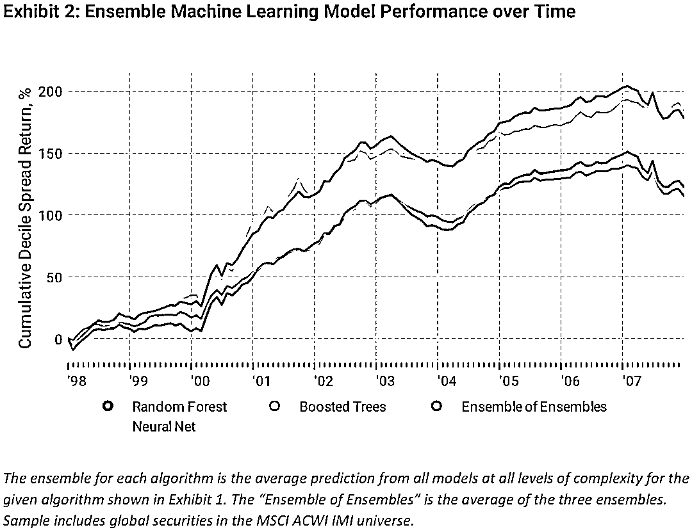

# MSCI：捕捉因子模型非线性的收益

> 原文：[`mp.weixin.qq.com/s?__biz=MzAxNTc0Mjg0Mg==&mid=2653315880&idx=1&sn=0d7bd33e5f1697973c1f365b729369b5&chksm=802da13db75a282b762267494b493c81b5595f35ca41da6a34625a13c02c6e1765d641ed7f0c&scene=27#wechat_redirect`](http://mp.weixin.qq.com/s?__biz=MzAxNTc0Mjg0Mg==&mid=2653315880&idx=1&sn=0d7bd33e5f1697973c1f365b729369b5&chksm=802da13db75a282b762267494b493c81b5595f35ca41da6a34625a13c02c6e1765d641ed7f0c&scene=27#wechat_redirect)

量化投资与机器学习公众号独家解读

量化投资与机器学公众号 *** ***QIML Insight——深度研读系列 ******是公众号今年全力打造的一档**深度、前沿、高水准**栏目。

公众号**遴选**了各大顶刊最新论文，按照理解和提炼的方式为读者呈现每篇论文最精华的部分。QIML 希望大家能够读到可以成长的量化文章，愿与你共同进步！

[第一期](http://mp.weixin.qq.com/s?__biz=MzAxNTc0Mjg0Mg==&mid=2653315304&idx=1&sn=8f36bc03096995655abea040e2ee3f94&chksm=802da2fdb75a2beb5d210c8235ab64fba0ba510b16683599189419f2ce0af483ea9c020707f6&scene=21#wechat_redirect) | [第二期](http://mp.weixin.qq.com/s?__biz=MzAxNTc0Mjg0Mg==&mid=2653315407&idx=1&sn=e9f5e375aedcb0b8f82d6c42b7ea3e80&chksm=802da35ab75a2a4c1aa8aa458bb5878ccbe0499b3c4e01bfff51508610c4e45f07d5b16fd6ab&scene=21#wechat_redirect)  

> **本期遴选论文**
> 来源：MSCI Research Insights March 2021
> 作者：George Bonne, Jun Wang, Howard Zhang
> 标题：Machine Learning Factors: Capturing Nonlinearities in Linear Factor Models

**核心观点**

*   通过机器学习模型将线性因子模型中的特质收益做更细的挖掘，找出其中非线性的部分。

*   同一类模型中，由不同参数复合的机器学习模型的效果要好于单个的机器学习模型。

*   不同类模型的复合模型也优于单一类别的复合模型。

*   非线性的机器学习模型因子是一个明显的 Alpha 因子，能够带来稳定的增益表现。

多因子模型在量化投资中占据了绝对的 C 位，以 Barra 风险模型，采用截面因子暴露对股票收益率进行建模的方法在业界得到了广泛的使用，可以用非常简单的等式表示截面股票收益与因子暴露之间的关系：其中 是股票收益向量， 是所有股票的因子暴露矩阵， 是因子收益向量， 是股票特质收益（没有被因子暴露解释的部分）。其中 是 股票收益中能被因子**线性解释**的部分。但实际上，因子之间**非线性**的关系也会对股票收益产生影响，这部分收益部分包含在 里。在本篇论文中，作者对所有 与 构建机器学习模型，用以挖掘出   中能够被因子间非线性的关系解释的部分：
其中 G 为某个机器学习的模型， 可以看做是 X 经机器学习模型 G 合成后的因子，主要用于挖掘 X 因子间非线性部分，所以完整的模型如下：

这是一个非常有逻辑且有创新的方法，这主要体现在以下几个方面：

**1、不同于很多的论文，直接将股票总收益与因子暴露之间通过机器学习的暴力拟合，这里先将线性收益部分剥离后，再对残差收益（或特质收益）进行建模，提高了模型的解释性。**

**2、在机器学习模型 G 中所使用的因子 X，与线性部分使用的因子完全一样，这样就能更有逻辑的区分线性部分和非线性部分。**

**实证分析**

**数据及方法说明**

**测试结果**

**1、机器学习模型复杂度 VS 整体模型的表现**

下图展示了三种机器学习模型在不同复杂度下的表现，Y 轴是月度 IC 的平均值。在看懂下图时需要清楚以下几点：

*   **算法复杂度的定义，**下图 X 轴表示了算法复杂度，从左边最简单到右边最复杂，但不同模型的算法复杂度的定义不一样：

*   Boosted Trees：复杂度表示树的深度，最简单（X 轴最左边）的树为 2 层。

*   Random Forest：复杂度表示子树的数量，最简单（X 轴最左边）的模型有 50 棵树。

*   Neural Networks：复杂度表示单层隐含神经元的数量，其中最简单的神经元数据为 8 个（X 轴最左边）。

*   **复杂度标准化，**标准化的复杂度是用模型当前复杂度除以模型最小复杂度的值，比如复杂度为 10 的 Neural Networks 表示其神经元的数量为最小复杂度（8 个）的 10 倍，也就是 80 个。

*   **复合模型，**图中虚线表示的是对应实线代表模型的复合模型的表现，当 X 轴为 n 时代表的复合模型，为 x 从 1 至 n 所代表的基础模型的平均值。以蓝色虚线 Neural Net Ensemble 为例，当 X 轴为 3 时，其所代表的 Neural Net Ensemble 复合模型，为 Neural Net 复杂度为 1,2,3 时的平均结果。

理解了以上定义，可以看到，当模型复杂度上升时，Boosted Tree 和 Neural Net 的表现在下降，Random Forest 的效果表现在上升。复合模型（虚线）的效果，总是要比非复合（实线）要好。所有模型中，Neural Networks 复合模型的表现最为优秀。

下图展示了三个复合模型的表现，Y 轴是分组收益 Top 与 Bottom 收益差的累计值。除了三个复合模型，还构建了复合模型的复合模型（红线表示，下文用 EE 做简称）。可以看出 EE 的表现最佳，Long/Short 的年化收益为 18%左右。

但是从上图也可以发现不同算法模型的表现虽然有差距，但整体还是比较相似，下图给出了不同模型预测结果相关性的平均值，具体来说就是不同模型每期的预测结果计算截面相关性，再取均值。可以看到同类型算法不同参数的相关性基本在 0.35-0.55 之间。但是上图 2 中，不同复合模型的时间序列的相关性达到了 0.73 以上。也就是说，不同模型间对于有效信号提取的比率差不多，但复合之后能够有效的提高信噪比。

**2、模型稳定性**

作者通过模型每个月预测值之间的自相关性来判读模型的稳定性，可以看出除了在模型重新训练的时候相关性变化比较大，其余时间，不同月份之间的预测值自相关性还是比较稳定的。

**3、探索机器学习模型的可解释性：单因子的重要性**

各个不同的因子对于效果的影响有多大，不同因子间的相互作用会不会对预测结果产生重大的影响。弄清这些问题之前，首先要有一个明确的度量因子重要性的指标，需要明白以下两个概念：

*   **Partial Dependence**，用来度量单个因子对模型预测效果的边际影响，具体做法针对一个已经训练好的模型，每一次，把所有股票的某个因子（需要度量的因子）设为一个固定的值，然后对所有预测结果计算平均值（作者这里计算的标准差），接下来，改变因子的值，再计算一般，按固定间隔遍历该因子所有可能的取值。

*   **Feature Importance**，定义为因子 Partial Depedence 的变动范围（最大值-最小值）。

**如果一个因子不重要，那边改变因子取值时，预测结果不会有很大的变化，所以越重要的因子，对预测结果的越有影响，预测结果的变动范围就越大。**

从下图可以看到，对这个三个机器学习模型来说，最重要的都是 Liquidity 和 Momentum 因子，整体而言量价类的因子要比基本面因子来得更重要。

下表展示了不同模型对于因子重要性的相关性，可以看出不同的模型对于因子的重要性的认知还是很一致的。

下图 7 把 Neural Network 模型中，10 个最重要因子的 Partial Dependence Plot（PDP）画了出来，可以看到当 Momentum 因子暴露高的股票的特质收益更高，而 Liquidity 因子暴露低的股票的特质收益更低。

在三个不同的模型中，Liquidity 和 Mementum 的 PDP 非常类似，但是 Tree 类型的机器学习模型的 PDP 曲线更粗糙。在表 3 中，作者给出不同模型预测结果的相关性很低，但这里有给出对于因子重要性的判断，相关性又很高。这说明，不同模型都能捕捉到 Liquidity 和 Mementum 的预测能力，但对于噪音，不同模型的噪音就不一样。所以通过复合模型，能够在保留信号的同时，抵消掉部分噪音，得到更好的预测结果。

**4、探索机器学习模型的可解释性：因子相互作用的重要性**

上一部分，作者通过 Partial Difference 量化了不同因子各自的重要性，接下来需要量化两个因子间相互作用带来的增益效应。作者给出了因子间相互作用强度（Interaction Strength）的定义：

**两个因子同时变动时 Partial Difference 与 两个因子单独变动时 Partial Difference 之和的差的 Range。**

说的很拗口，举个例子说明一下，有 A、B 两个因子：

*   当 A 固定为 a1 时，其他因子保持原值时，partial difference 为 Pa1

*   当 B 固定为 b1 时，其他因子保持原值时，partial difference 为 Pb1

*   当 A 固定为 a1 时，当 B 固定为 b1 时，其他因子保持原值时，partial difference 为 Pab1

*   那么此时由于 A 和 B 交互带来 partial difference 的变化为 PI = Pab1-Pa1-Pb1

*   那么 AB 因子对的相关作用强度所有 PI 中最大值与最小值之差

一共 22 个因子，所以有 232 个因子对，前 10 个相互作用最大的因子对如下图 9 所示，图 10 给出了 Momentum-Size 因子对的 PDP。

可以看到，Momentum 因子与 Size 有很大的相关性，当 Momentum 很低且 Size 也很低的时候，相互作用很强。

**5、样本外测试表现**

图 11 给出了，样本外经复合机器学习模型构建的机器学习因子与传统 22 个风格因子之间的相关性，整体相关性都不高，在-0.15 到 0.1 的区间。图 12 是该因子与 4 个最相关因子以及 Beta 和 Momentum 的相关性的时间序列。Beta 和 Momentum 的相关性均值为 0 附近，但整体波动比较大，而与其他因子的相关性比较稳定。

下图 13 给出了 ML Factor 的因子分组测试，可以看出有非常明显的单调性，多空年化收益样本内为 19.7%，样本外为 34.4%。

图 14 给出了，考虑其他 22 个因子后的多因子模型中，机器学习因子的纯因子收益的累计值。表 15 给出了各个因子测试结果的对比，机器学习因子的因子收益 IR 最高，最大回撤也非常小。整体而言该因子更像一个 Alpha 因子。

**总结**

针对同一套因子，通过线性收益与非线性收益的单独建模，从逻辑上支撑了机器学习在多因子模型中的应用。最终的因子表现非常亮眼，希望能给大家更多启发。

量化投资与机器学习微信公众号，是业内垂直于**量化投资、对冲基金、Fintech、人工智能、大数据**等领域的主流自媒体。公众号拥有来自**公募、私募、券商、期货、银行、保险、高校**等行业**20W+**关注者，连续 2 年被腾讯云+社区评选为“年度最佳作者”。