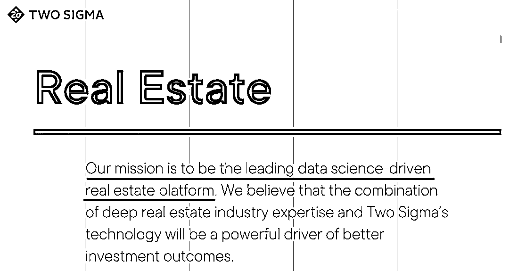
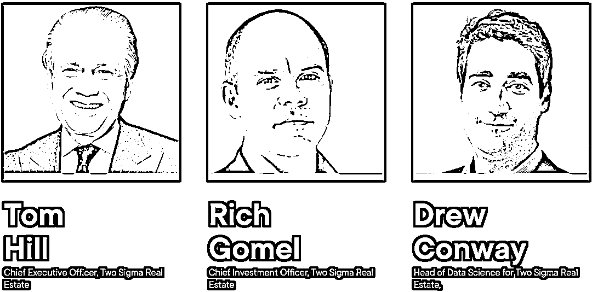

# 量化买房？Two Sigma 进军房地产

> 原文：[`mp.weixin.qq.com/s?__biz=MzAxNTc0Mjg0Mg==&mid=2653315820&idx=1&sn=3ee0a9dac65061eae186e21fbdd53c6a&chksm=802da0f9b75a29ef36581b10c39e5925ba30371cc89f53230044e1573038307763110c41e4fc&scene=27#wechat_redirect`](http://mp.weixin.qq.com/s?__biz=MzAxNTc0Mjg0Mg==&mid=2653315820&idx=1&sn=3ee0a9dac65061eae186e21fbdd53c6a&chksm=802da0f9b75a29ef36581b10c39e5925ba30371cc89f53230044e1573038307763110c41e4fc&scene=27#wechat_redirect)

量化投资与机器学习公众号报道

全球顶尖的对冲基金 Two Sigma，近期尝试将**数据科学领域的专业知识扩展到非公开市场**。由此成立了一个团队来投资私人房地产资产。

此团队目前主要由以下成员组成：

WeWork 房地产投资平台管理合伙人 Rich Gomel 于近期加入了 Two Sigma 房地产团队，担任首席投资官，Gomel 拥有超过 20 年的房地产经验，曾在摩根大通旗下的 Junius Real Estate Partners 和喜 Starwood Capital Group 工作。Tom Hill 将担任首席执行官。这将是 Two Sigma 30 亿美元私人投资业务的一部分，Hill 也是该业务的负责人。Drew Conway 于 2019 年加入 Two Sigma，作为团队数据科学负责人，主要打造其房地产数据平台。

Hill 在近期的一次采访中说道：“房地产数据丰富，但没有人用这些数据来弄清楚要买什么，在哪里买。如果你真的有预测工具，可以预测供给与需求，那么它就真的很强大。同时，这也有助于让那些有才华的专业投资人把精力用在刀刃上！”

Two Sigma 最初将专注于北美多个行业的房地产资产，包括多户住宅、零售、酒店和工业，**采用人力主导、并利用计算机驱动的研究和技术来寻找投资机会。**

Conway 表示：“这些数据将帮助 Two Sigma 投资团队，更好的了解其决策过程以及与同行的关系。”

在一个关于 Two Sigma 如何将计算机科学与房地产投资结合起来的例子：Two Sigma 的一位博士花了三个月的时间设计了一种方法，用来预测未来哪些市场最有可能采取房租管制政策。Hill 表示，当 Two Sigma 购买的公寓楼因失去了提高租金的灵活性而遭遇价值大幅下跌时，这些数据将有助于让大家从容应对，避免措手不及。

Two Sigma 还在使用其他数据集来理解消费者行为，筛选信用卡和债务信息以评估危机区域，并检查有关移动信息和 Covid-19 传播的数据。

通过以上观点我们可以看出，另类数据目前在国际头部的对冲基金中已经使用的相当成熟。Two Sigma CTO Jeff Wecker 在前端时间彭博的讲话也谈到了这一点。

“不光是我们现在常见的另类数据，比如**新闻流和社交媒体越来越有价值**，但过滤出假信号是一个相当具有挑战性的过程！”

量化投资与机器学习微信公众号，是业内垂直于**量化投资、对冲基金、Fintech、人工智能、大数据**等领域的主流自媒体。公众号拥有来自**公募、私募、券商、期货、银行、保险、高校**等行业**20W+**关注者，连续 2 年被腾讯云+社区评选为“年度最佳作者”。