# Man Group：配置中国

> 原文：[`mp.weixin.qq.com/s?__biz=MzAxNTc0Mjg0Mg==&mid=2653315812&idx=1&sn=4160e87f70442d12b7744a1a5b35f79d&chksm=802da0f1b75a29e732cb70dd011173c28855fdb7ab1635322b519b73138959aa66daa3ee6ead&scene=27#wechat_redirect`](http://mp.weixin.qq.com/s?__biz=MzAxNTc0Mjg0Mg==&mid=2653315812&idx=1&sn=4160e87f70442d12b7744a1a5b35f79d&chksm=802da0f1b75a29e732cb70dd011173c28855fdb7ab1635322b519b73138959aa66daa3ee6ead&scene=27#wechat_redirect)

量化投资与机器学习公众号独家编译

**与全球市场相比，中国金融和商品市场的交易是否为系统投资者提供了有吸引力的回报和多样化特征？**

**引言**

多样化是系统管理者战略的基石: 更大的多样化意味着更大的资金池，从而能从中获取更多样性的回报。

在最近规则变化的推动下，中国提供了进入一些全球流动性最强的市场的机会：2020 年 9 月，中国证监会（CSRC）宣布了一项期待已久的规则，从 2020 年 11 月 1 日起生效。这一规则变化将逐步扩大合格境外机构投资者（QFII）许可证的投资范围，除其他外，包括期货合约和私募证券投资基金。这一新发展可能为海外投资者带来投资机会，迄今为止，这些投资机会只有在岸的中国投资者能够获得。它补充了现有的离岸通道，如股票通、债券通和中国银行间债券市场，并为离岸投资者进入中国国内资本市场提供了便利。在我们看来，所有这些变化对于系统性策略的投资者来说应该是件好事。

在本文中，我们将讨论中国金融市场的规模、与全球同行相比的多元化潜力，并总结如何进入这些市场。最后，根据我们七年在本地市场交易的经验，我们探讨与一般交易的全球市场相比，使用著名的投资策略交易这些市场是否可以提供有吸引力的回报和多样化特性。

**中国金融市场的规模**

以国内生产总值（GDP）衡量，中国目前是世界第二大经济体，在过去 30 年中，中国经济取得了巨大的增长，从 1990 年的 3970 亿美元增长到 2020 年底的 14.9 万亿美元，年均增长率为 13.2% 。这种增长已经转化为其金融和商品市场。

**大宗商品**

在 1978 年的重大经济改革之后，城市化和工业化的转变，以及人均收入的提高，导致了对农产品、能源和金属等大宗商品需求的增加。商品期货最初是为满足农民和生产者的套期保值需求而设立的，现在通过提高定价和透明度，在中国经济中发挥着更大的作用。大宗商品期货在中国的 3 家大宗商品交易所交易: 大连商品交易所期货交易所、上海期货交易所和中国郑州商品交易所期货交易所。就相对于全球交易所的规模而言，中国大宗商品交易所在期货和期权交易量最大的 10 家交易所中总计排名第三（图 1）。值得注意的是，图 1 中列出的其他交易所并不像不像 DCE、 SFE 和 ZCE 只交易商品。

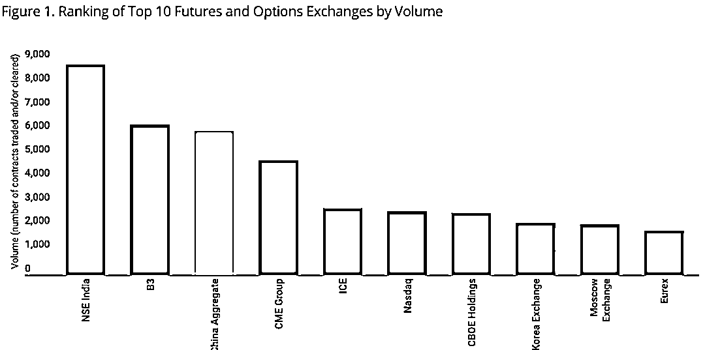

日期: 2020 年 1 月至 12 月。资料来源: 国际汽联；截至 2020 年 12 月 31 日。按成交及/或结算的合约数目排列。按附属交易所分列的期货和期权交易量。NSE India: National Stock Exchange of India. ICE: Intercontinental Exchange. China aggregate: Combination of Dalian Commodity Exchange, Shanghai Futures Exchange and Zhengzhou Commodity Exchange.

截至 2021 年 2 月，共有 63 种商品期货在 DCE、 SFE 和 ZCE 上市。这个名单正在不断扩大，最近一次是在 2021 年 1 月，当时中国——全球最大的猪肉消费国和生产国——推出了首份实物交付的活体动物期货合约。此外，作为到 2060 年实现碳中和承诺的一部分，中国计划在广州一个尚未发展的期货交易所推出碳排放期货。

以交易合约数量衡量的市场交易量，也高于全球大宗商品期货。图 2 显示了交易量最大的中国商品市场(黄柱)和全球商品市场(蓝柱)。2020 年，全球交易量最大的五个商品期货市场都是中国商品。我们选出的名单突出了中国市场另一个吸引人的特点，即商品品种包括其他地方不存在的独特的期货市场，例如苹果、沥青和鸡蛋期货。

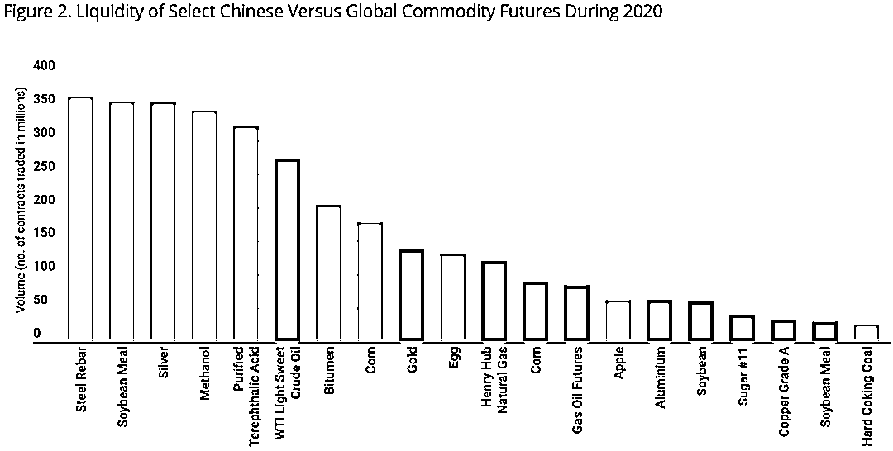

日期: 2020 年 1 月至 12 月，交易所交易的期货交易量

**股票及债券市场**

中国还是股票和债券等传统资产类别的主要参与者。下图 3 显示了截至 2020 年底按国家分列的 5 大股票市值。2020 年末，中国股市创下 10.9 万亿美元的历史新高，巩固了世界第二大股市的地位，仅次于美国。在债券方面，根据美国国际清算银行储备委员会公布的数据，以未偿还债务证券总额计算，中国同样拥有世界第二的头衔。

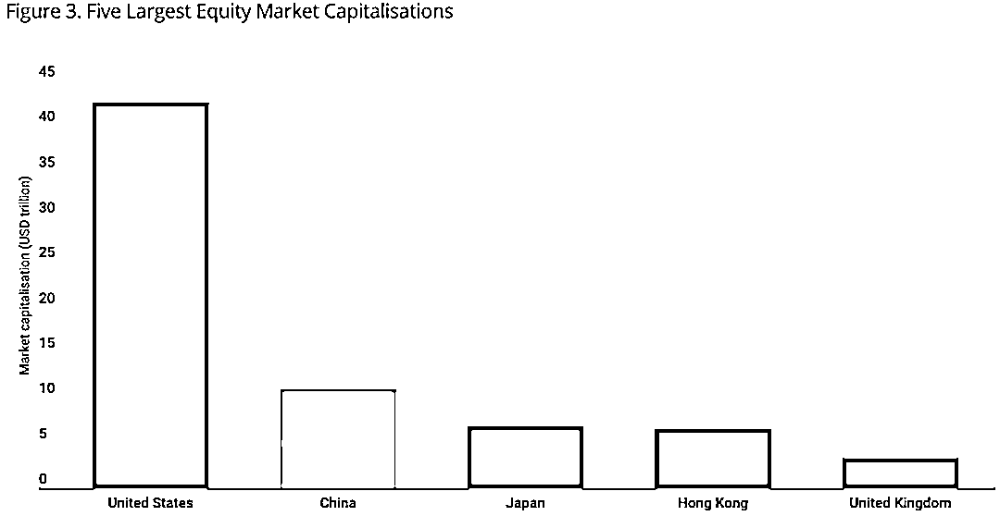

资料来源彭博数据

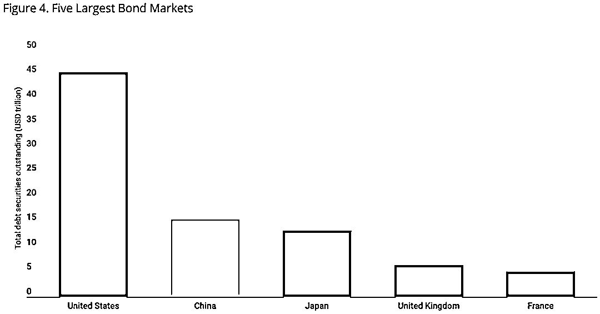

资料来源：国际清算银行，截至 2020 年 6 月 30 日未清偿债务证券总额。

此外，过去 3 年，外资参与中国在岸股票和债券市场的活动有了显著增长。从 2018 年 1 月至 2020 年 10 月，通过境外途径进入中国内地 A 股(北向股票市场交易)和国内债券市场(中国银行间债券市场)的交易量分别增长了两倍和一倍。这种增长主要归功于 MSCI 指数将中国 A 股纳入指数，以及将中国纳入各种全球债券指数，如巴克莱银行全球综合指数和摩根大通新兴市场债券指数。不过，随着富时罗素(FTSE Russell)的世界政府债券指数从 2021 年 10 月开始逐步采用 5.7% 的最终权重，预计还会有更多被动资金流入中国。

**多元化**

可以说，中国金融市场最吸引人的特点，与全球同行相比，是它们的多元化潜力。

**大宗商品**

沥青和鸡蛋期货等商品意味着，在中国交易所上市的大宗商品市场中，有很大一部分是独一无二的。然而，从阿尔法角度来看，这些独特的市场只有在与全球商品市场相关性较低的情况下才是真正有用的。表 1 证实了这一点，表 1 显示了图 1 所示的中国商品与国外主要商品市场之间的相关性。中国商品名称用浅蓝色突出显示。

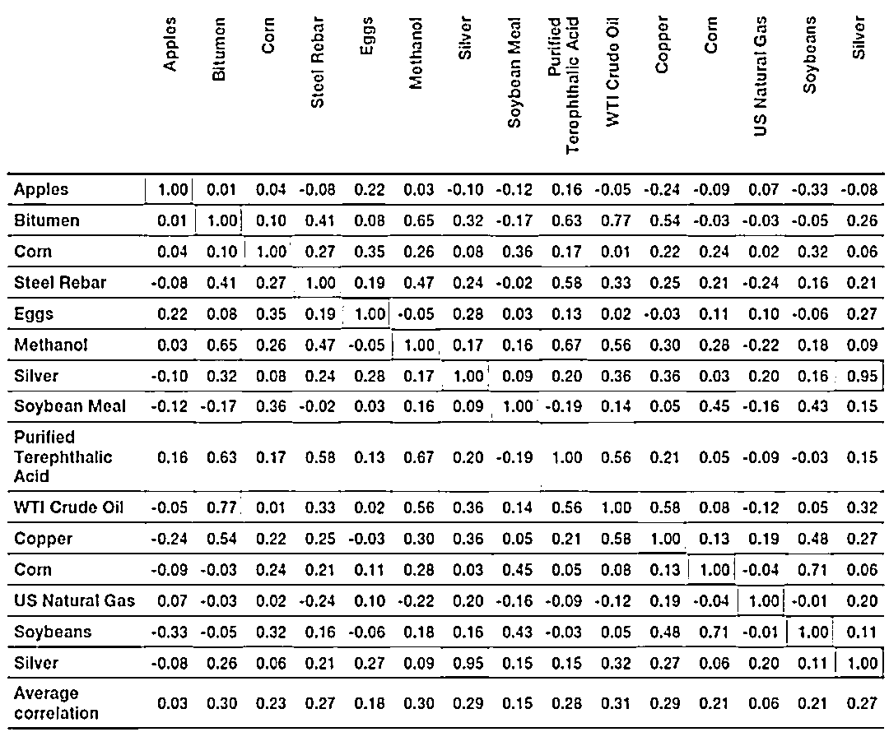

表 1\. 中国商品与全球主要商品的月度相关性。日期范围：2015 年 1 月 -2020 年 12 月。基于美元月收益率的相关性。资料来源: MAN

苹果和鸡蛋是独特的农产品市场。然而，由于当地生长条件的不同以及运输和替代成本的不同，就连玉米与美国玉米的相关系数也只有 0.24。引人注目的是，它甚至不是最相关的市场。高相关性的例子包括沥青和白银。沥青，用于路面和屋顶，是一种高粘度的石油蒸馏残留物，自然与汽油和原油有较高的相关性。值得注意的是，一些未列入表 1 的中国大宗商品(如中国原油)与全球同类商品的相关性也更高。

**股票**

表 2 显示了 2006 年以来全球主要股票指数之间的相关性。中国沪深 300 指数与其它主要股指的相关性平均不到 50% 。同样值得注意的是，非中国股指之间的相关性很高，从 0.65 到 0.93 不等。

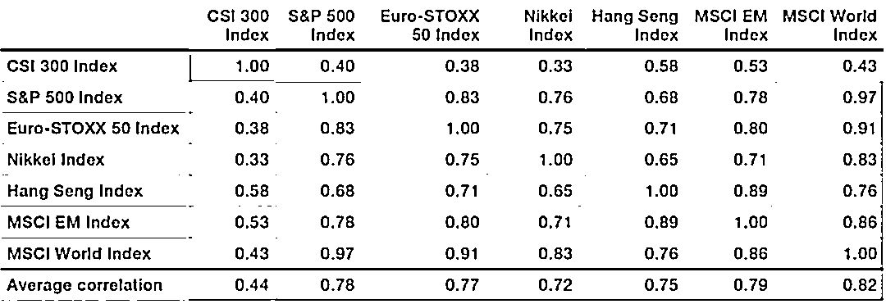

表 2\. 中国沪深 300 指数与主要股市指数的月度相关性。日期范围：2006 年 1 月 1 日至 2020 年 12 月 31 日 来源: 彭博，MSCI。

**债券**

由于发达市场债券收益率处于非常低的水平，外国投资者可能会发现中国债券具有吸引力。如图 5 所示，中国债券既没有显示出发达市场收益率的下降，也没有达到 1% 或更低的绝对水平。

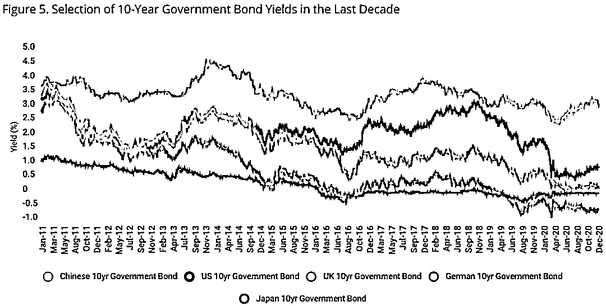

日期范围：2011 年至 2020 年，来源: 彭博

这些观察结果解释了中国债券与表 3 中其他债券之间的低平均相关性。此外，中国债券与发达国家和新兴市场债券指数的相关性较低。其相关性最高的是 Pan-Asia Local Currency，这并不奇怪，因为中国约占指数的 25% 。

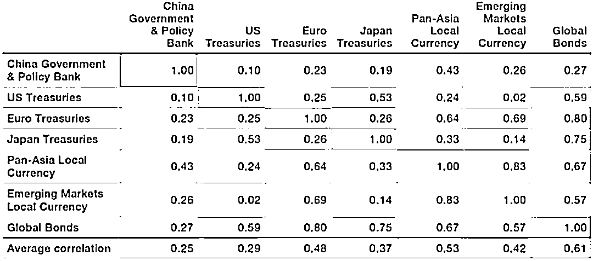

表三. 中国债券与全球债券基准的每月相关性。日期范围:2006 年至 2020 年，资料来源：彭博社，Markit，J.P. Morgan。

**进入中国金融市场**

由于进入多元化、流动性强的中国市场具有明显的优势，因此，即使在 QFII 之前，离岸投资者也可以通过一系列途径进入中国市场，这也就不足为奇了。在本节中，我们重点介绍了 QFII 的主要途径，讨论了 QFII 的准入可能带来的变化，并根据我们自 2014 年以来从在岸角度交易这些中国市场的经验提供了一些见解。

**大宗商品**

2020 年底宣布的新扩大 QFII 投资范围，可以说是大宗商品资产类别最令人兴奋的消息。合格投资者的合同需要提交交易所批准，并经中国证监会批准。截至本报告撰写之时，已有 20 个大宗商品市场提交中国证监会批准合格投资者进入交易所，但迄今尚未批准任何大宗商品期货。

外国投资者也可以在没有 QFII 的情况下交易所谓的国际化商品期货合约。2018 年，中国试图加强其在其主导的大宗商品市场的定价能力，原油成为首个国际化合约。目前，总共有七种国际合约可供交易，最近的一种是 2020 年 12 月的棕榈油合约。尽管在国际合约方面取得了这些进展，但 QFII 路线预计将提供更广阔的市场空间。

**股票**

自 2002 年推出 QFII 计划以来，中国内地股市的准入状况有所改善。在上海和深圳证券交易所交易的中国 A 股，目前可以通过 QFII 和沪港通获得。就 QFII 而言，与“股票联通”计划相比，许可证持有者可以获得更广泛的现金权益。截至 2020 年 12 月 31 日，在上海和深圳证券交易所上市的公司总数为 4233 家，其中包括大型、中小型和科技板块，如中国创业板(ChiNext)和 STAR Markets。此外，透过「股票市场交易通」计划发售的股票只限于 1,468 只 A 股(截至 12 月 31 日)。QFII 和“股票联通”都允许做空，尽管根据我们的经验，借贷成本可能高得令人望而却步，并可能导致一些投资策略不切实际。

**金融期货**

QFII 允许许可证持有者进入股指期货，例如沪深 300 指数，尽管目前这只允许用于对冲目的。

**债券**

目前，外国投资者可透过「中国银行间债券市场直接联通」及「债券通」取得现金债券。前者是在岸银行间市场，只有少数外国专门机构可以取得现金债券，而后者则可透过香港更广泛地取得。两者都提供进入中国境内债券市场的途径，大致可分为以下几类: 地方政府债券、政策性银行债券、公司债券和中央政府债券。然而，CIBM Direct 允许使用更广泛的工具，如回购协议和利率互换，并在交易对手方中提供比债券连接更多的选择。

自 2020 年以来，Man AHL 一直通过 CIBM Direct 在岸交易现金债券，主要是因为其成本相对较低，但 QFII 也将向海外投资者开放这一渠道。

**债券期货**

中国债券在替代性投资中的使用受到一定限制，因为它们需要全额资金，因此仅限于无杠杆的使用。在这方面，期货将提供明显的优势，但尽管根据最近扩大的 QFII 投资规定，债券期货至少要到 2022 年才会获准通过 QFII 进行交易。债券期货一旦获得批准，是否只能用于套期保值，就像股指期货一样，目前仍不确定。

**潜在投资策略**

前面的章节已经确定，中国市场规模庞大，流动性强，与全球同类市场相关性低，这一点与正在讨论的任何资产类别都一致。此外，由于 QFII 涵盖所有资产类别的市场准入范围广泛，交易成本较低，它似乎将为海外投资者提供最全面的准入途径。

作为一家系统化的投资管理公司，我们花了 30 多年时间寻找不相关的市场，并拥有 7 年以上在岸工具交易中国市场的经验，我们很享受这些市场向海外投资者开放的机会。此外，2020 年 9 月，Man AHL 成为首批在中国获得 QFII 牌照的全球系统化管理人之一。在本节的其余部分，我们将重点介绍两种投资策略，我们认为这两种策略可能提供具有吸引力的、不相关的 alpha。

**大宗商品动量策略**

我们首先关注的是动量，这是一个我们已经交易了 30 多年的策略。我们之所以关注商品期货，是因为近期 QFII 制度下的短期股票和债券期货受到质疑。我们还假设所有的中国商品合约都是允许交易的，只包括符合我们内部流动性标准的中国和全球商品合约。在 37 个中国和 14 个全球大宗商品市场中，我们应用了一个基于 10 天和 40 天移动平均线交叉的模型，目标收益波动率为 15% 。我们不包括任何管理费用，但是，预期的交易成本也包括在内。图 6 显示，中国大宗商品市场显示出更加一致的 alpha 产生，在 15 年中的 13 年里表现优于全球大宗商品。

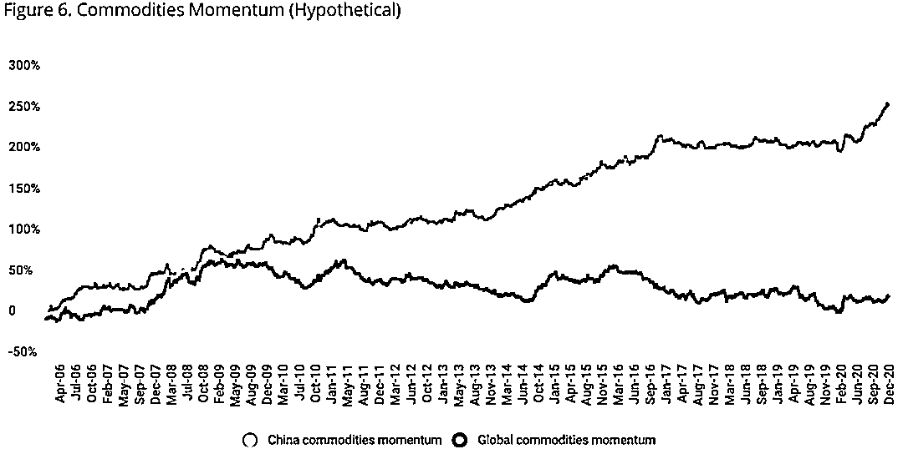

日期：2006 年 1 月 -2020 年 12 月。资料来源: MAN

**平衡的多资产策略**

股票和债券市场可以通过离岸路线进入，尽管在我们的经验中，做空证明是不切实际的。正因为如此，我们发现探索一个只有长期平衡的多资产投资组合是值得的，其风险分配为 60% 的股票和 40% 的债券。我们采用经风险调整的方法，因为股票/债券组合的名义配置因其较高的波动性而倾向于股票。自 2006 年 1 月 1 日以来，中国沪深 300 指数的年度波动率约为 28% ，而摩根士丹利资本国际全球指数(MSCI World Index)在同一时间段内的年度波动率为 18% 。

在中国，我们分别使用沪深 300 指数和沪深综合债券指数作为股票和债券的指标，而全球投资组合则使用 MSCI 全球指数和 Bloomberg Barclays 全球综合债券指数。此外，可以合理地假设，机构投资者可能不会独立配置到中国，而是将其作为现有全球投资组合的多样化投资。因此，我们将全球 60/40 投资组合与全球 80% 权重、中国 20% 权重的投资组合进行了比较。这两种投资组合都经过了 10% 的波动性调整。如图 7 所示，混合 80% 的全球/20% 的中国投资组合每年的表现比全球版本高出 2.3% 。与此同时，在 15 年期间，中国和全球投资组合之间的相关性为 0.23。这些观察表明，向中国适度配置资金，可能有利于传统的股票/债券投资组合。

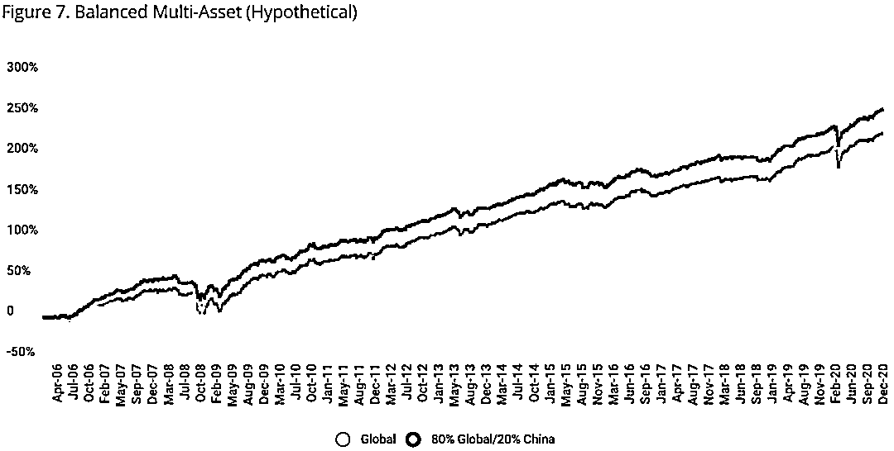

日期: 2006 年 1 月 -2020 年 12 月。资料来源: MAN，彭博社

**中国应对禽流感疫情的策略**

此外，在当前不确定的市场环境下，自 20104 年以来仅次于美国的世界第二大经济体——中国的经济表现出了比其他国家更好的抵御疫情的能力。图 8 显示了国际货币基金组织 2021 年 1 月对主要经济体和中国的预测(实线)与前一年(虚线)的比较。2020 年，发达经济体、新兴市场和发展中经济体的国内生产总值(GDP)出现下滑，而中国的 GDP 增长了 3.2% ，这得益于政府通过有效封锁措施采取的积极行动、增加公共投资以抵消私营部门资本支出以及注入流动性以放宽银行获得资金的渠道。

图 8 表明，除了我们的历史观察，中国市场已提供了巨大的多样化给投资者，有很好的证据表明，这种多样化可能会持续到未来几年。

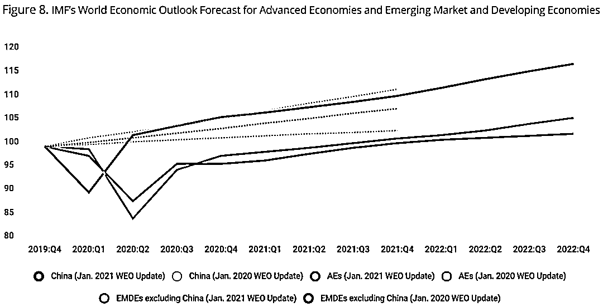

日期：2019 年第四季度-2022 年第四季度。资料来源：国际货币基金组织工作人员估计。AEs=经济体，EMDEs = 新兴市场和发展中经济体，WEO = 世界经济展望。

**总结**

最近的监管改革为外国投资者进入中国在岸市场打开了更大的大门。进入中国国内资本市场的渠道继续放宽，而拥有 QFII 牌照的投资者则处于有利地位，可以受益于更大的准入、更低的交易成本以及允许投资工具的进一步扩张。无论是股票、债券还是大宗商品，中国已经是全球最大的市场之一。此外，股票和债券等传统资产迄今与全球基准的相关性较低，而大宗商品市场往往是中国所独有的。大宗商品势头等另类投资策略似乎正在多元化，并显示出较高的阿尔法回报潜力，而管理良好、只做多中国股票/债券投资组合既是全球股票/债券投资组合中一个很好的多元化投资选择，也是一个潜在的回报增强选择。

量化投资与机器学习微信公众号，是业内垂直于**量化投资、对冲基金、Fintech、人工智能、大数据**等领域的主流自媒体。公众号拥有来自**公募、私募、券商、期货、银行、保险、高校**等行业**20W+**关注者，连续 2 年被腾讯云+社区评选为“年度最佳作者”。