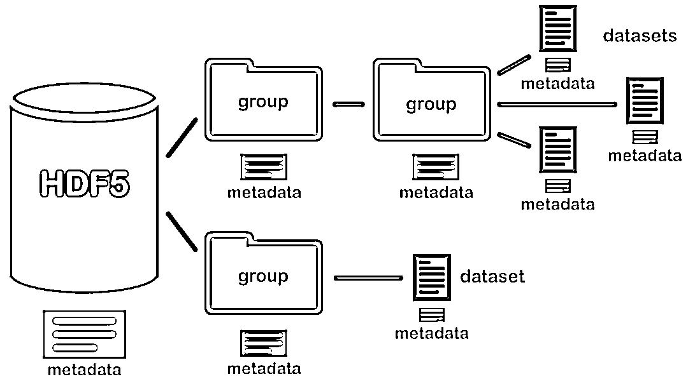
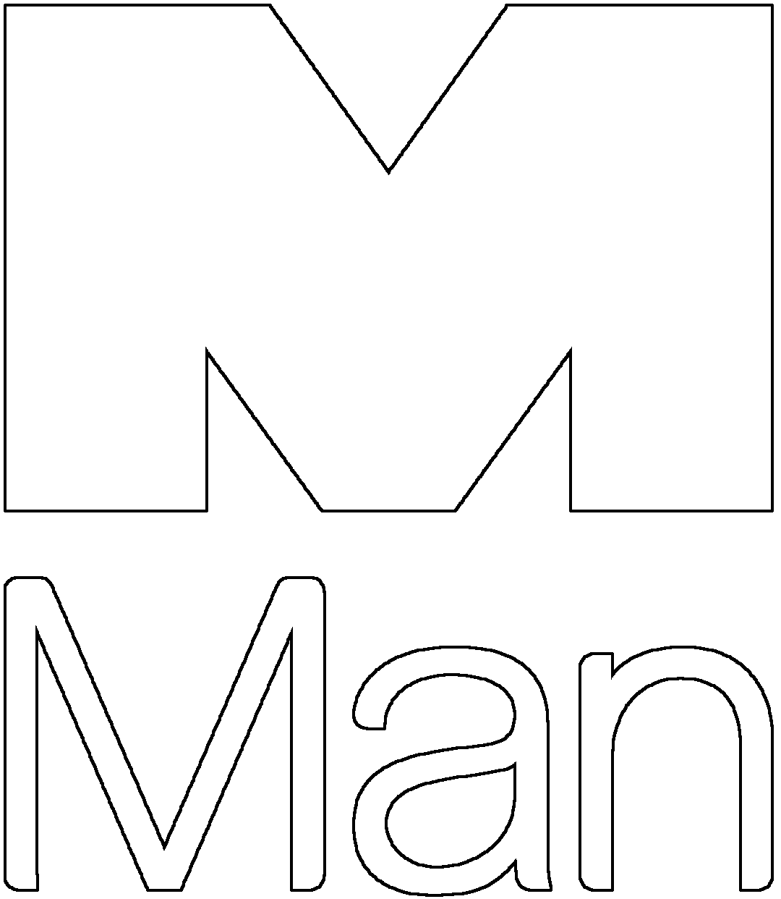
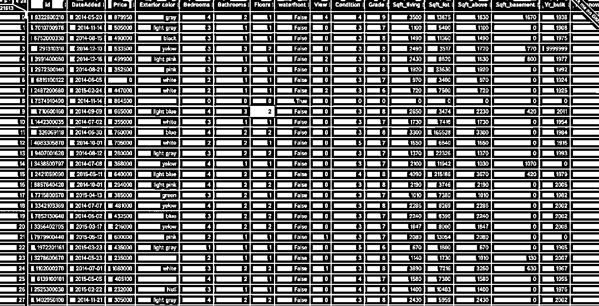
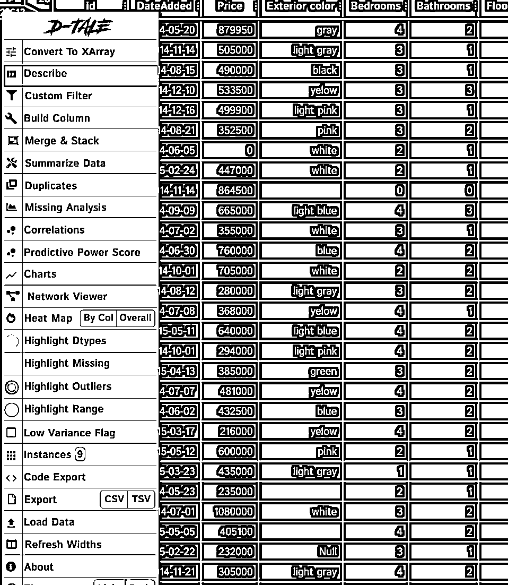
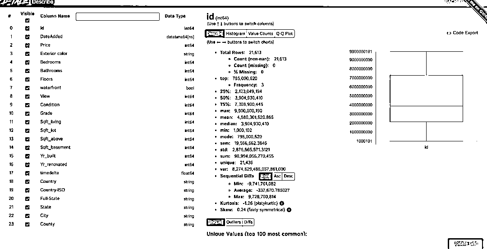
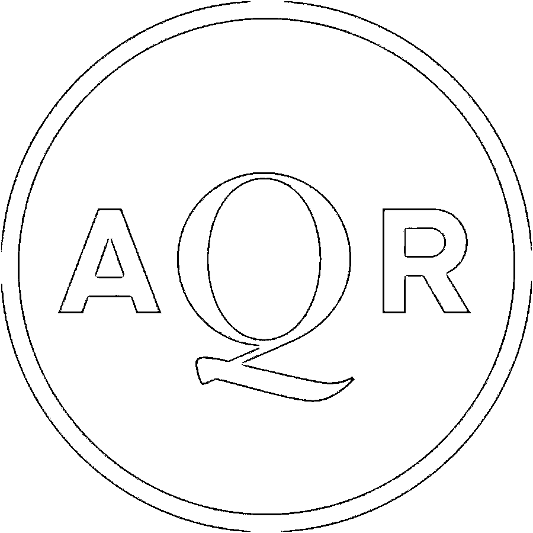

# 盘点对冲基金大佬『开源』的 Python 工具包！

> 原文：[`mp.weixin.qq.com/s?__biz=MzAxNTc0Mjg0Mg==&mid=2653315736&idx=1&sn=ede40c5d62737b818a152189ed4556f7&chksm=802da08db75a299b073dea768e580491fa5c3adeba484bbc3729467742183ea30fee68b065e6&scene=27#wechat_redirect`](http://mp.weixin.qq.com/s?__biz=MzAxNTc0Mjg0Mg==&mid=2653315736&idx=1&sn=ede40c5d62737b818a152189ed4556f7&chksm=802da08db75a299b073dea768e580491fa5c3adeba484bbc3729467742183ea30fee68b065e6&scene=27#wechat_redirect)

# 


量化投资与机器学习公众号独家报道

讨论量化，总是离不开编程、数据与策略！

讨论量化对冲基金的时候，大家总觉得他们非常神秘 ，无论市场风云变幻，总能赚的盆满钵满。实际上，在赚钱的同时，各大海外量化基金也不忘与大家分享自己的技术与研究。

接下来，公众号就给大家盘点一下，那些年，**各大对冲基金开源且在 Github 上 Star 数量比较高的 Python 工具包。**


**Versioned HDF5**

**Versioned HDF5 是 D.E.SHAW 与 QuanSight 联合开发的带有版本控制功能的 HDF 工具包。**

在许多科学计算和工业应用中，存储和操作大量数据的问题是一个挑战。HDF5 是一种开源数据存储技术，它实现了一种层次结构（类似于文件系统结构），用于在单个文件中存储大量的不同类型的数据。HDF5 文件中的数据被组织成组和数据集；你可以将它们分别看作本地文件系统中的文件夹和文件。你还可以选择将与每个项目关联的元数据存储在一个文件中，这使其成为一个自描述和强大的数据存储模型。



假设你有一个内容随时间变化的 HDF5 文件。你可能希望添加或删除数据集，更改数据或元数据的内容，并保留更改发生前的记录，以及恢复此文件的以前版本的方法。由于 HDF5 是一种二进制文件格式，使用常规的版本控制工具(如 git)可能会很困难。

Versioned HDF5 就是为了解决原生 HDF5 在版本控制上的不便利性，该库是构建在 h5py 之上的版本化抽象，可以将同一数据的不同版本(包括版本元数据)存储在单个 HDF5 文件中。

具体安装和使用说明请参考：

*https://github.com/deshaw/versioned-hdf5*



**D-Tale**

面向 Pandas 中的 DataFrame 进行可视化的工具包。D-Tale 能够针对 DataFrame 生成交互式的图形界面，并支持在其中定义所需的数据展现形式，也可以根据需要对数据进行探索性分析。

安装使用非常简单，在 notebook 里导入 dtale 后，直接运行以下命令就可以将 DataFrame 进行如下可视化输出：

```py
import dtale
df = pd.read_csv('./house_data.csv')
dtale.show(df)
```



点击左上角的三角形，可以展开更多的操作选项，比如 Describe 可以自动对 DataFrame 各列进行统计描述：



以下就是对 DataFram 进行 Describe 操作后的可视化输出：



当然，还有更多更方便好玩的功能等待大家去挖掘，详细参考：

***https://github.com/man-group/dtale***

总结来说，Dtale 就是一个 Python 内置版的 Excel，可以方便的对数据进行可视化分析，进行各维度的统计，是数据分析的得力助手。

**Arctic**

由 MAN AHL 于 2012 年开发，并于 2015 年开源，Arctic 构建在 MongoDB 之上，针对数值数据的高性能数据库。在量化投资中，可以用来存储海量的 Tick 级行情数据。它支持 Pandas、 numpy 数组和 pickle 对象，并支持其他数据类型和版本控制。每个客户机每秒可以查询数百万行，网络带宽达到 10 倍的压缩，磁盘达到 10 倍的压缩，每个 MongoDB 实例每秒可扩展到数亿行。Artic 主要有以下优势：

*   序列化许多数据类型，如 Pandas DataFrames、 Numpy 数组、 Python 对象通过 pickle 等等，所以你不必手动处理不同的数据类型。

*   在客户端默认情况下使用 LZ4 压缩，从而在网络/磁盘上节省大量资源。

*   允许您对一个对象的不同阶段进行版本化，并对状态进行快照(在某些方面类似于 git) ，并允许您自由地恢复之前的版本。

*   数据分块(把一个数据集分解成更小的部分)是否适合你 AQR。

*   可以基于 Mongo 的用户管理功能对用户进行权限管理。

*   有不同类型的存储模块，每个模块都有不同的优势。比如：VersionStore 允许你对内容进行版本化和快照化，TickStore 用于存储和高效检索流数据，ChunkStore 允许你对内容块进行分块和高效检索。

由于 Arctic 构建在 Mongo 之上，充当了 Python 与 Mongo 的中间层，省去了 Python 与 Mongo 交互时繁杂的查询语句，还能大大提高查询与数据传输的速度。

安装完 Arctic 之后，通过以下命令连接 MongoDB（必须已经安装 MongoDB）：

```py
import Arctic
conn = Arctic('127.0.0.1')

# 新建数据库
conn.initialize_library('stock_data')

# 连接数据库
lib = conn['stock_data']

# 写入和读取数据
data = pd.DataFrame(.....)
lib.write('symbolname', data)
df = lib.read('symbolname')
```

其中 read 方法支持多个参数：

*symbol, 代码*

*as_of=None, 当数据存在多个快照时，取出当时的 Point in time 数据，非常有用*

*date_range=None, 数据的时间范围*

*from_version=None, 数据的版本*

具体安装和使用说明请参考：

***https://github.com/man-group/arctic***



**2009 年开源：Pandas**

想不到吧，Pandas 竟是 AQR 开源的！

**总结**

开源工具的使用，避免了大家重复造轮子，除了对冲基金大佬开源的工具外，各大 IT 巨头开源的机器学习工具包也在量化策略的研究中发挥了巨大的作用。微软也在前段时间开源了开发量化策略的机器学习工具包 Qlib。此前，Quantopian 开源的 Zipline、Alphalens 及 Pyfolio 也在业界得到了广泛的使用。

**开源，免费的就是最好的！**

量化投资与机器学习微信公众号，是业内垂直于**量化投资、对冲基金、Fintech、人工智能、大数据**等领域的主流自媒体。公众号拥有来自**公募、私募、券商、期货、银行、保险、高校**等行业**20W+**关注者，连续 2 年被腾讯云+社区评选为“年度最佳作者”。