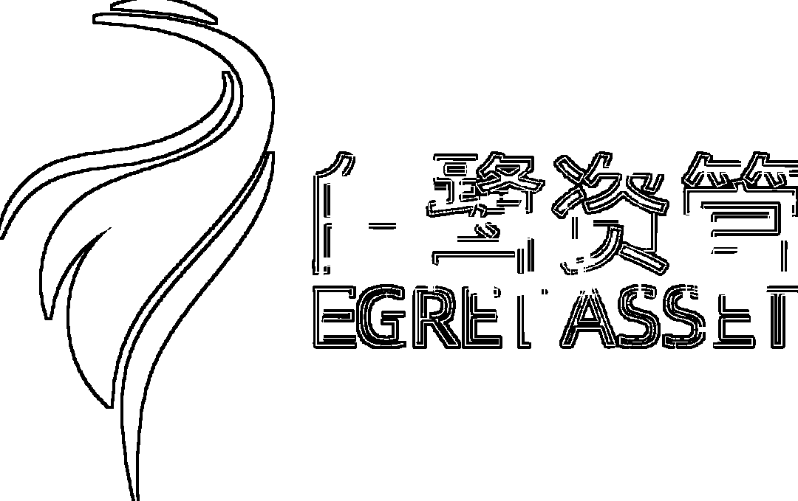
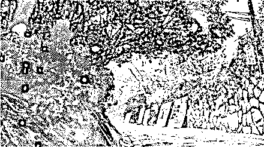
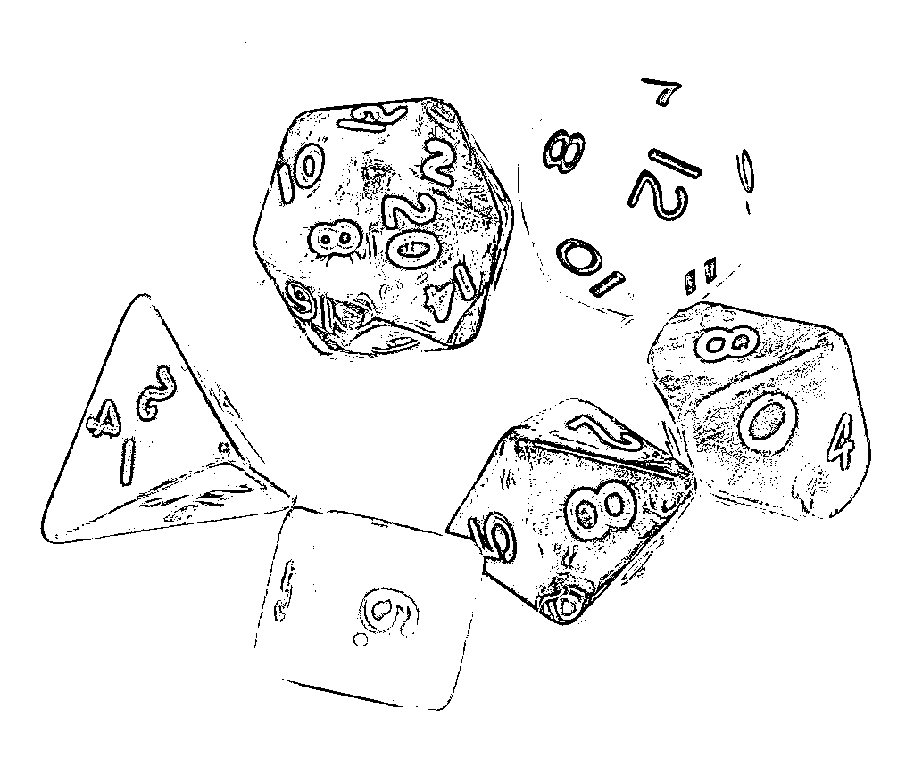
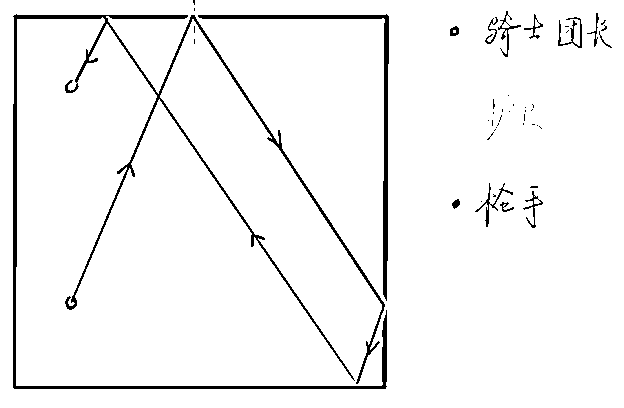
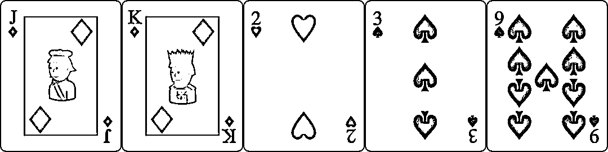

# 独家！中国量化私募面试 Q&A 系列——白鹭资管

> 原文：[`mp.weixin.qq.com/s?__biz=MzAxNTc0Mjg0Mg==&mid=2653315678&idx=1&sn=951b57c5025be182f627c8b41bbb0b2c&chksm=802da04bb75a295dbd9edbad2f67bf8ab27cfbe92687d2f83ec49d4847ea94cb79fef3e1a9b1&scene=27#wechat_redirect`](http://mp.weixin.qq.com/s?__biz=MzAxNTc0Mjg0Mg==&mid=2653315678&idx=1&sn=951b57c5025be182f627c8b41bbb0b2c&chksm=802da04bb75a295dbd9edbad2f67bf8ab27cfbe92687d2f83ec49d4847ea94cb79fef3e1a9b1&scene=27#wechat_redirect)

# 


**量化投资与机器学习公众号独家**

**量化投资与机器学公众号在 2021 年又双叒叕开启了一个全新系列：**

****

**这个系列对于国内量化圈来说意义深远！公众号邀请了**各大知名量化私募**一起参与此系列的创作。**

****面试题都是独家一手资料，多部门层层把关、多角度精心编****写！****

**回答部分题目且通过者，公众号会还联合每家机构提供形式多样的精彩福利和直通绿卡！**

****第一期出题方：****

****

**浙江白鹭资产管理股份有限公司（简称：白鹭资管）是一家专注于二级市场、依靠数学和计算机科学进行量化投资与交易的对冲基金。我们致力于打造兼具全球视野和本土智慧的一流投资团队，成为全球顶尖的量化多策略对冲基金。公司于 2013 年成立，在杭州和上海两地均设有办公室。 **

**白鹭资管在量化选股、日内统计套利、CTA、期权等多方面具备卓越的研发和迭代能力。“Multi- Strategy”的组织架构以及“One Team One Family”的组织文化是我们的 icon，也是白鹭的核心竞争力。白鹭资管是中国唯一一家连续三年获得多策略金牛奖的私募基金。**

****独家面试 Q&A****

****1、非 Markov 随机游走****

**是一个正整数上的随机游走。**

**<embed style="vertical-align: -0.798ex;width: 33.548ex;height: auto;" src="https://mmbiz.qlogo.cn/mmbiz_svg/a18XcQ1EBBggIibBXCZoqdpfAu2LicgqN1RPBn5t0dXU1znSkCONhsw4MBZl2nQRz2iaHJktJkHhYZL1sa2fxricBam6H3Zc5xSe/0?wx_fmt=svg" data-type="svg+xml">**

**<embed style="vertical-align: -0.798ex;width: 33.548ex;height: auto;" src="https://mmbiz.qlogo.cn/mmbiz_svg/a18XcQ1EBBggIibBXCZoqdpfAu2LicgqN1hRGrPYChJyibQfiapoMXu1hlOySibUktBLDCszXoxOKW7JLHBoX8QL8BPiaBrwac9po4/0?wx_fmt=svg" data-type="svg+xml"> for any**

**请计算从 开始在被吸收之前到达 的概率。**

****答案****

**Consider , . We show that is a martingale**

**Since**

**<embed style="vertical-align: -0.798ex;width: 60.52ex;height: auto;" src="https://mmbiz.qlogo.cn/mmbiz_svg/a18XcQ1EBBggIibBXCZoqdpfAu2LicgqN1v6t0q2jzZAP6UP4e8V872Siao2hTpe3fOLhhoJzcx2e4LBMSKA8gl92bkfRzdDsW8/0?wx_fmt=svg" data-type="svg+xml">**

**Thus by the Optional Sampling theorem**

**<embed style="vertical-align: -0.687ex;width: 39.678ex;height: auto;" src="https://mmbiz.qlogo.cn/mmbiz_svg/a18XcQ1EBBggIibBXCZoqdpfAu2LicgqN16QD7P9G64f5cibs2mtmQHLLrPZrM3U8y3uHdEiay2GamUNK5Iibzia57gL82DnpbhEXb/0?wx_fmt=svg" data-type="svg+xml"> **

****2、秒速五厘米****

**一朵樱花从高一米的树枝上飘落，在竖直方向上做布朗运动，波动率 ，且沿竖直方向向下有 的平均漂移速度。**

*   **计算樱花飘落的平均时间**
*   **计算樱花飘落时间的阶矩**
*   **计算 T 的分布**

****

****答案****

**It's the same as computing for a Brownian motion with drift and variance parameter .**

**Similary to the computation of the moments of a normal random variable by the generating function , Brownian motion with a bounded stopping time has the property that**

 **Compute the derivative of both side, we can get by induction the disired moments .

E[T]

<embed style="vertical-align: -6.672ex;width: 48.973ex;height: auto;max-width: 300% !important;" src="https://mmbiz.qlogo.cn/mmbiz_svg/a18XcQ1EBBggIibBXCZoqdpfAu2LicgqN1iaNdNwvKkWbyqD0l8ricYTmbqauYetDYnyJwEH0j7VgTRFLcsYdr7qGRzrW2dH5dqj/0?wx_fmt=svg" data-type="svg+xml">

Thus we have .

Thus we have

<embed style="vertical-align: -3.257ex;width: 27.705ex;height: auto;max-width: 300% !important;" src="https://mmbiz.qlogo.cn/mmbiz_svg/a18XcQ1EBBggIibBXCZoqdpfAu2LicgqN1xCCvXEuhuoEMUJdY6QsBt9csicj7JuOQjs7fmmrFXbgXAoaEjqACmibVQ1WEuQeqma/0?wx_fmt=svg" data-type="svg+xml">

Note that is a constant, terms like can always be factored as . Thus we can compute all by induction.** 

****3、异形骰子****

*   **同时掷枚骰子，计算所有骰子点数之和被 整除的概率。**
*   **考虑一种有 个 面的骰子，假设投掷一次可以等概率的得到点数, , 。同时投掷 枚这样的骰子，计算所有骰子点数之和被 除余 的概率。**

****

****答案**** 

**需大家自行作答，请将结果提交**文末邮箱**，精彩**福利**等着你！** 

****4、刺杀骑士团长****

**枪手和骑士团长共处在一个正方形的房间，两人的位置固定不动。枪手的目标是射杀骑士团长，假设子弹可以在四个墙面上完全弹性反射，没有能量耗散。骑士团长可以在房间布置有限个护卫以格挡特定方向的子弹，请问：**

*   **有没有一种办法选择这些护卫的位置，使得无论枪手沿任何方向射击，都无法击杀骑士团长？**

*   **当房间是三维的正方体，六个墙面都可以完全反射子弹。有没有一种办法选择这些护卫的位置，使得无论枪手沿任何方向射击，都无法击杀骑士团长？**

****

****答案****

**需大家自行作答，请将结果提交**文末邮箱**，精彩**福利**等着你！**

****5、必胜策略****

**Bob 和 Alice 被邀请参加一个卡牌游戏。庄家从一组扑克牌(四种花色，A-K)给 Bob 随机发放 张。Bob 可以选择其中四张依次展示给 Alice 看，然后 Alice 被要求猜测 Bob 手中剩下的一张牌的花色和点数。**

****问：**Bob 和 Alice 能否仅仅根据牌的花色和点数设计出一个策略，使得无论 Bob 拿到的是哪五张牌，Alice 都能成功猜测出最后一张牌的花色和点数。**

****

****答案****

**需大家自行作答，请将结果提交**文末邮箱**，精彩**福利**等着你！**

****智力测试题****

****1、白鹭的小伙伴们酷爱乒乓球双打。男生们的水平尤为出色。当两男生对战一男一女时，有女生的一边每得一分的概率只有 1/3。现在两方约定，有女生的一方只要得 5 分就算赢下这一局，两男生的一边则要得 11 分才算赢下这一局。 ****

**a. 请问有女生的一边赢得一局的概率是多少？ **

**b. 若保留赛点制，即当双方比分打到 10 比 4 时，需要领先对方 2 分才算赢得比赛。请问此时有女生的一边赢得一局的概率是多少？**

****答案****

**需大家自行作答，请将结果提交**文末邮箱**，精彩**福利**等着你！**

 ****2、AB 两地相距 20 公里，有 1000 升煤油需要用一台煤油车从 A 地运到 B 地。煤油车运载量是 200 升。车子本身耗煤油为每公里 1 升。 **** 

**a. 请问怎么操作可以让到达 B 地的煤油最多，最多多少升？ **

**b. 若 AB 两地相距 100 公里呢？ **

**c. 若 AB 两地相距 200 公里呢？**

****答案****

**需大家自行作答，请将结果提交**文末邮箱**，精彩**福利**等着你！**

**3、<embed style="vertical-align: -0.672ex;width: 26.844ex;height: auto;" src="https://mmbiz.qlogo.cn/mmbiz_svg/a18XcQ1EBBggIibBXCZoqdpfAu2LicgqN1O54dQwqTpl44vbEePKtHfolb1sPrKRg8g95T52rTevBZYUu2sUznfanLL0YjGfXa/0?wx_fmt=svg" data-type="svg+xml">，**

****答案****

****4、有一个只有 12 条棱围成的正方体铁架，有一只蜗牛在沿铁架爬行。铁架上还有乌龟在沿铁架爬行，并虎视眈眈地想捉到蜗牛成为美餐。蜗牛的速度是乌龟的三倍。****

****问：**在初始位置任意的情况下，至少几只乌龟共同参与铁架上的围追堵截，才能捉到蜗牛？并请详述捕捉方案。**

****答案****

**需大家自行作答，请将结果提交**文末邮箱**，精彩**福利**等着你！**

****算法题****

****1、现有一个整数数组。****

****问：**求所有符合要求的子序列的和的最大值，要求该子序列至少有两个值，且第一个值和最后一个值相同。**

****答案****

**需大家自行作答，请将结果提交**文末邮箱**，精彩**福利**等着你！**

****2、现有一个非递减的正整数数组和一个正整数 N。****

****问：**请判断该数组能否被分成若干个长度不小于 N 的递增子序列。注：数组中每个元素只能分到一个子序列中。**

****答案（参考 LeetCode）****

****题目要求将数组分成一个或几个长度至少为 k 的不相交的递增子序列。****

****首先假设将数组分成 n 个子序列，每个子序列的长度为 k。根据题意，每一个子序列都是严格递增的，也就是说每个子序列没有相同的数字，所以需要统计每个数字的个数并找到最多的那一个的个数 t。需要把这 t 个数字分配到 n 个子序列中且不能分配到相同的子序列，所以 n >= t。****

****其次因为所有数字出现次数最多为 t，其他数字出现的次数一定小于等于 t。那么他们一定可以分配到 n 个不同的子序列中。如果 n 无限大很有可能每个子序列的数量小于 k，所以 n 应该越小越好。当 n = t 的时候可以取到最小值，又因为题目要求长度至少为 k，此时长度的总和为 t * k，此时只需要保证这个长度小于等于整个数组的长度，就能满足题目的要求。****

****时空间优化 当需要统计每个数组的个数的时候，很自然的就会想到使用哈希表，又快又方便。但是本题还有一个信息我们没有用到，那就是非递减的正整数数组，所以我们完全不需要使用哈希表。根据非递减的特性，我们可以使用一个 pre 变量记录上一个值并记录 pre 对应的值的个数。当 pre != nums[i] 时，说明上一个数统计完了，就可以进行比较了。所以只需要一次遍历并且不需要额外的空间记录没用的数据。****

```py
**`class Solution {
public:
    bool canDivideIntoSubsequences(vector<int>& nums, int K) {
        int pre = nums[0], cnt = 0;
        for (int n : nums) {
            if (n == pre)
                ++cnt;
            else {
                pre = n;
                cnt = 1;
            }
            if (cnt * K > nums.size())
                return false;
        }
        return true;
    }
};`**
```

****部分未公布答案试题，我们将选择性择期公布，尽情期待！**********试题答案投递福利、方式****** 

******福利******

******全部答对：**2000 元现金奖励 + 面试直通车（HR、PM 直聊）****

******答对 5 题及以上：**500 元现金奖励 + 白鹭周边****

******答对 3 题及以上：**200 元现金奖励 + 白鹭周边****

******答对 1 题及以上：**白鹭周边****

******投递方式**（有效期至 2021 年 12 月 31 日）****

****提交邮箱：***talents@hz-bailu.com*******

****提交内容：**你的简历***** ****+ 代码（如果你觉得需要）+答案文档******

*****大家自愿提交，如果你想加入白鹭的话，这是一个很重要的加分项哦****

****量化投资与机器学习微信公众号，是业内垂直于**量化投资、对冲基金、Fintech、人工智能、大数据**等领域的主流自媒体。公众号拥有来自**公募、私募、券商、期货、银行、保险、高校**等行业**20W+**关注者，连续 2 年被腾讯云+社区评选为“年度最佳作者”。****