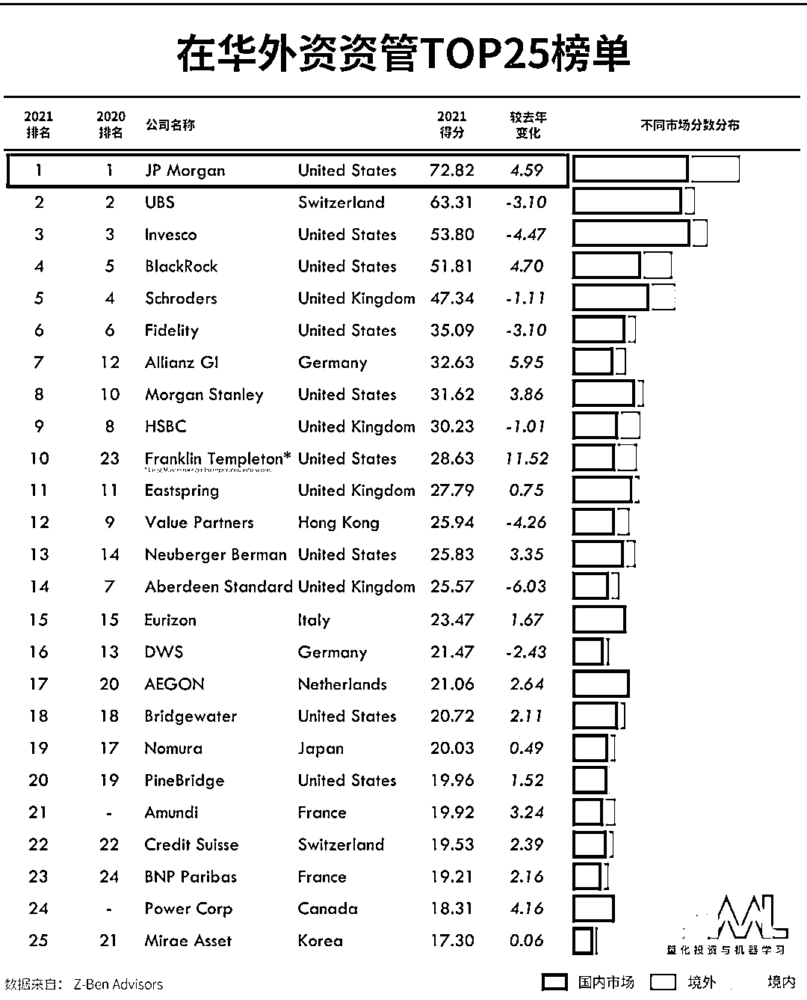
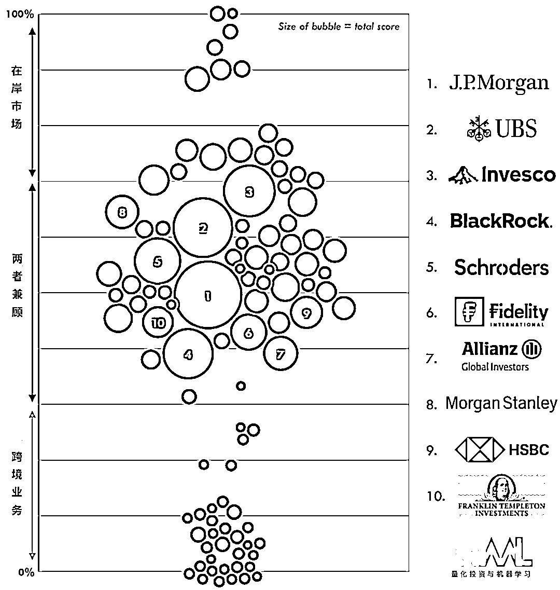
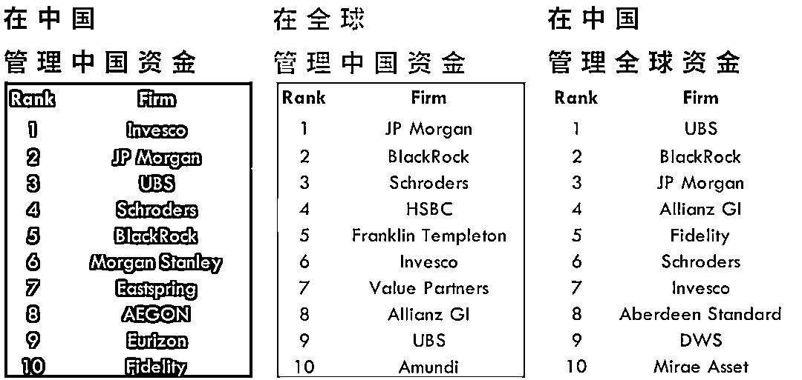
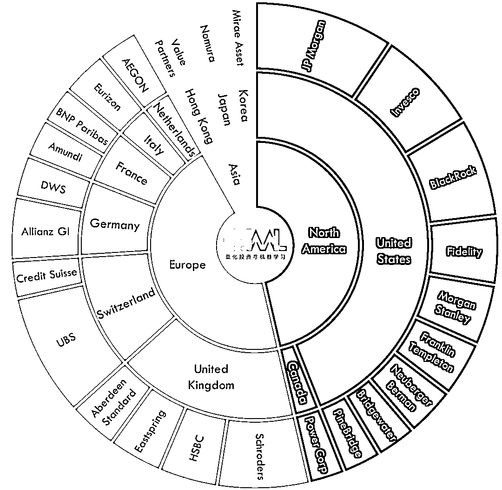

# 刚刚！2021 在华外资资管 TOP 榜单出炉，猜猜谁第一？

> 原文：[`mp.weixin.qq.com/s?__biz=MzAxNTc0Mjg0Mg==&mid=2653315581&idx=1&sn=46b4cee132513c583f9dd9f82ae40f1b&chksm=802da3e8b75a2afeeccaec8eecbe92911f63ed72b68338833264c500c9dfaf139b1ef23d70c9&scene=27#wechat_redirect`](http://mp.weixin.qq.com/s?__biz=MzAxNTc0Mjg0Mg==&mid=2653315581&idx=1&sn=46b4cee132513c583f9dd9f82ae40f1b&chksm=802da3e8b75a2afeeccaec8eecbe92911f63ed72b68338833264c500c9dfaf139b1ef23d70c9&scene=27#wechat_redirect)

# 

**量化投资与机器学习公众号报道**

**刚刚，泽奔咨询发布了第六份《2021 China Rankings》报告，在这份报告中，**摩根大通（J.P. Morgan）再一次荣登中国表现最佳外资资管公司宝座。****

**瑞银（UBS）和景顺（Invesco）分别位列第二和第三与去年相同，贝莱德（BlackRock）则提升一名，桥水排名和去年一样在第 18 位。**

****

**在排名前 100 位的企业中，在岸企业和跨境企业的得分比较高。**

****

**管理资金类前十机构：**

****

**我们还可以看到，美国所占的份额从 2020 年的 42%增加到 2021 年的 44%，排名前 10 位的公司也有所增加。来自欧洲和亚洲的前 25 名所占份额分别下降了 2 个百分点和 1 个百分点。**

****

**随着国内金融市场的不断开放，外资机构入华速度加快，截至目前，已有 31 家外资私募完成备案，同时多家外资机构正在积极申请公募牌照。不少外资机构在加速布局中国公募基金业务，2020 年 4 月，路博迈集团向中国证监会提交了设立外商独资公募基金管理公司的成立申请，并于 9 月 18 日获得正式受理。**

**中国的资产管理市场已经成为全球最大和增速最快的市场之一，近年来国际化进程明显提速，对海外资产管理人相当具有吸引力。根据 Morgan Stanley 和 Oliver Wyman 的估计，中国是全球第三大资产管理市场，仅次于美国和英国，管理资产规模为 5.3 万亿美元。**预计到 2023 年，这一规模将增至 9 万亿美元，在未来 10 年为西方基金管理公司提供全球最大的单一增长机会。****

**同时，外资机构进入中国市场，也应首先**充分尊重中国本土法规与市场规则**，同时也应有充分的**耐心去了解和适应国内行业环境与格局**，基于中国国内投资者的实际需求并结合自身情况来推进业务发展。**

**量化投资与机器学习微信公众号，是业内垂直于**量化投资、对冲基金、Fintech、人工智能、大数据**等领域的主流自媒体。公众号拥有来自**公募、私募、券商、期货、银行、保险、高校**等行业**20W+**关注者，连续 2 年被腾讯云+社区评选为“年度最佳作者”。**