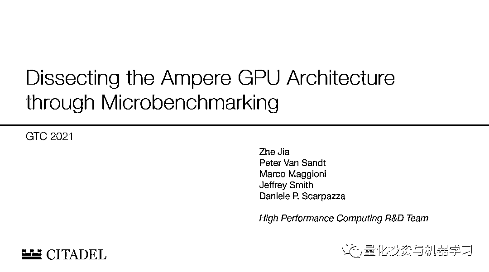
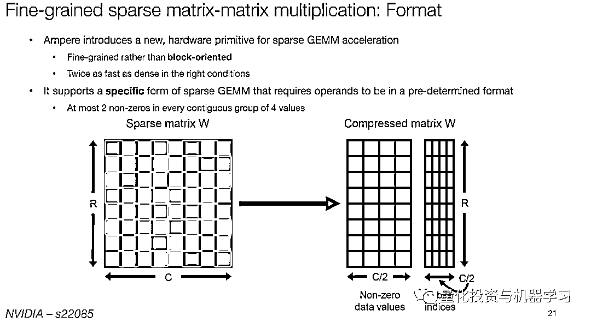
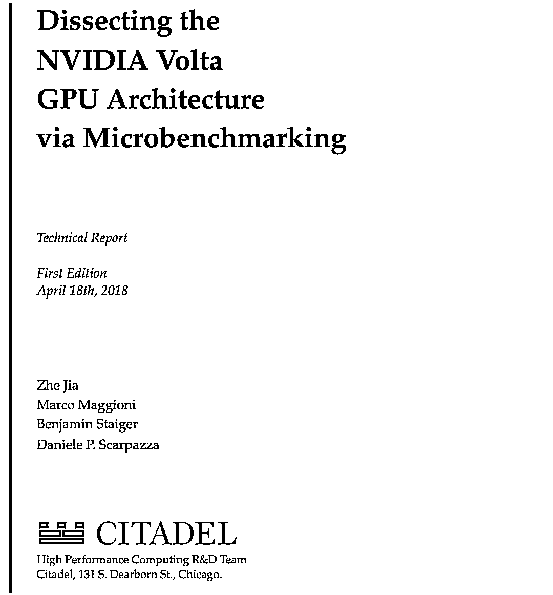
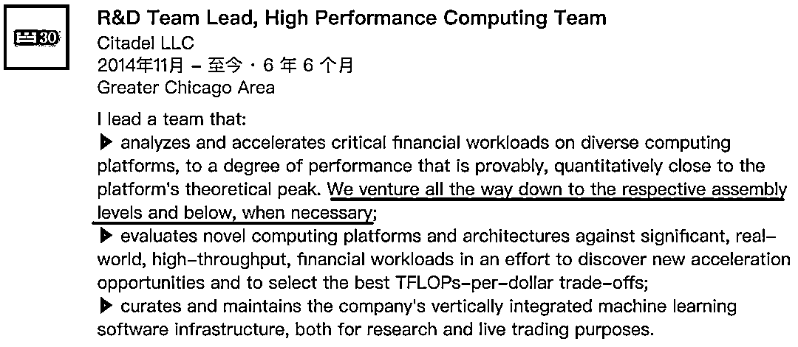

# Citadel 的工程师：裸机搞一搞！

> 原文：[`mp.weixin.qq.com/s?__biz=MzAxNTc0Mjg0Mg==&mid=2653315550&idx=1&sn=f3817557b5fdc150e3eeb5a8400fdbfc&chksm=802da3cbb75a2addd77710b0cf16251c841af401b03c884f3705dea38de3aa5b637b2110f9db&scene=27#wechat_redirect`](http://mp.weixin.qq.com/s?__biz=MzAxNTc0Mjg0Mg==&mid=2653315550&idx=1&sn=f3817557b5fdc150e3eeb5a8400fdbfc&chksm=802da3cbb75a2addd77710b0cf16251c841af401b03c884f3705dea38de3aa5b637b2110f9db&scene=27#wechat_redirect)

# 

**量化投资与机器学习公众号报道**

**在本周的 Nvidia GTC GPU 技术大会上，Citadel 工程师 Jia Zhe、Peter Van Sandt 介绍了 Nvidia 的 Ampere A100 GPU 的相关话题。**

 ****获取演讲完整 PPT，见文末**** 

**** 

****

**这已经不是 Citadel 的工程师们第一次公布他们对软件和硬件交互的应用了。2018 年，Zhe、Marco Maggioni、Benjamin Staiger 和 Daniele p. Scarpazza 发表了一篇论文，介绍了他们关注于解析 Citadel GPU 微架构的内容，以实现**裸机（Bare Metal）性能能调优**。**

****

**论文地址：https://arxiv.org/pdf/1804.06826.pdf**

**Scarpazza 于 2014 年从对冲基金 DE Shaw Research（DE Shaw 的研究部门）跳槽到 Citadel，负责位于纽约总部的 Citadel 高性能计算团队。Scarpazza 在他的领英个人资料中表示：**

****

**其研究结果被用于 Citadel 的机器学习应用，既用于研究，也用于真实交易。**

**在 Nvidia 大会的演讲中，Jia 和 Van Sandt 介绍了 Ampere A100 GPU 如何将 cache capacity 提高近三倍，Global Memory 提高 2.5 倍，Global Memory bandwidth 提高 1.7 倍。他们通过挖掘二级分区，并详细了解 GPU 中内存使用背后的原子过程来实现这一点。结果是效率大幅提高，延迟时间减少。**

**Citadel 强调，需要那些在工作中既懂硬件又懂软件的精英工程师人才。在 DE Shaw，Scarpazza 将自己的工作描述为“计算机科学、计算机架构、物理化学和生物学令人兴奋的交叉领域”，在 Citadel 也同样如此。Scarpazza 也表示，将有一篇关于其与 NVIDIA 合作的学术论文于今年 6 月份发表。**

****演讲 PPT 获取******公众号**后台**回复*******CitadelGTC2021*****

**量化投资与机器学习微信公众号，是业内垂直于**量化投资、对冲基金、Fintech、人工智能、大数据**等领域的主流自媒体。公众号拥有来自**公募、私募、券商、期货、银行、保险、高校**等行业**20W+**关注者，连续 2 年被腾讯云+社区评选为“年度最佳作者”。**