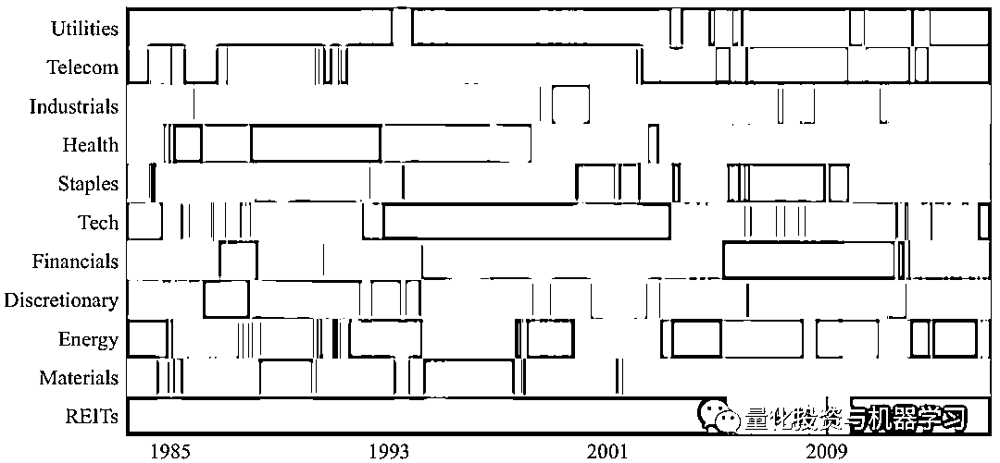
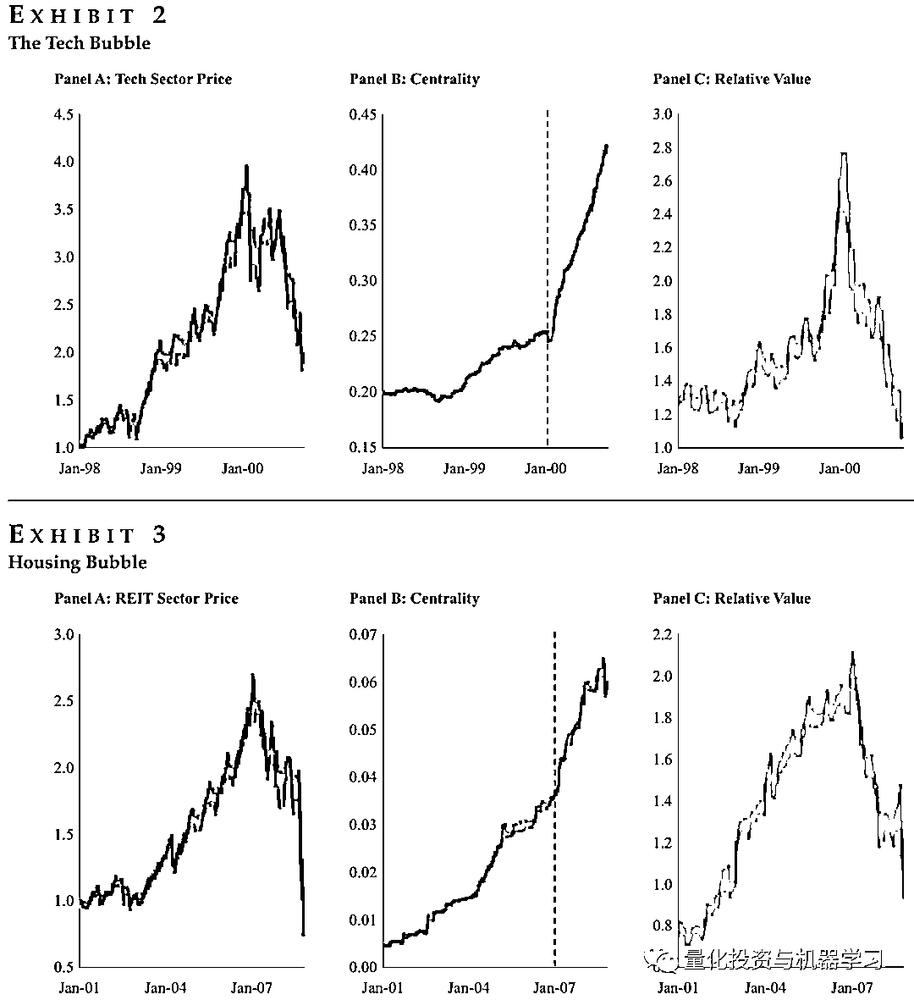
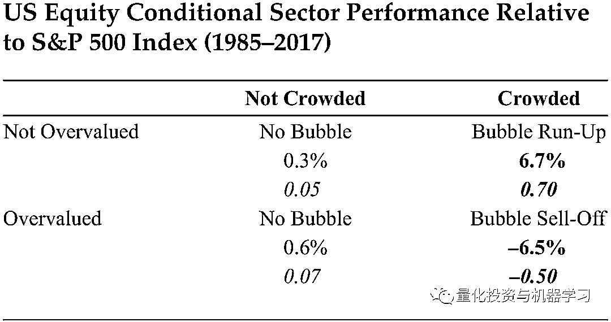
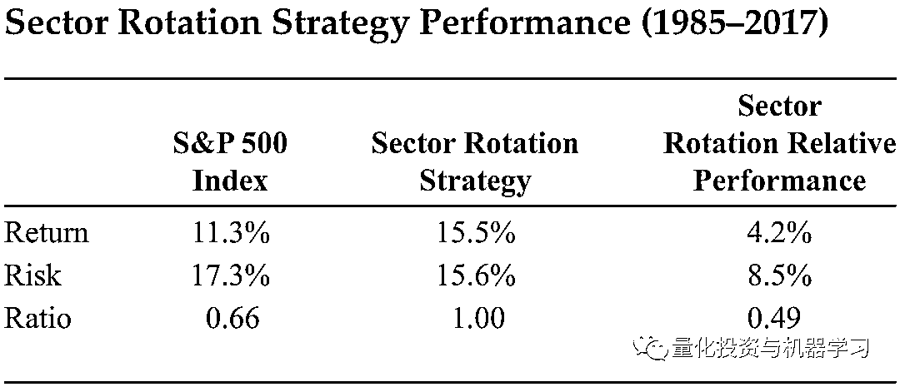
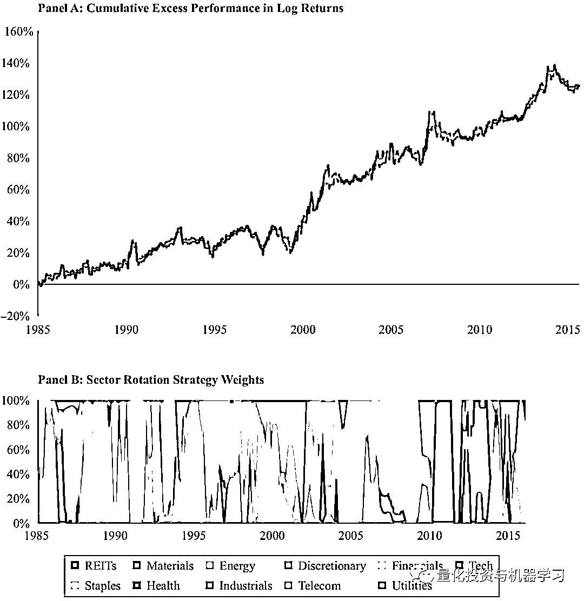
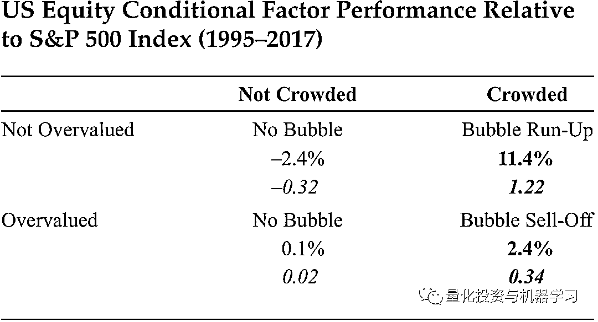
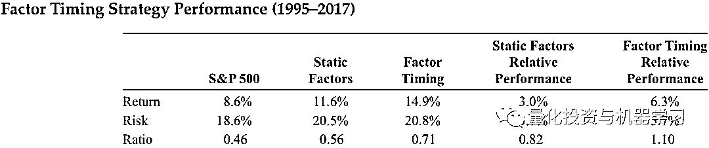
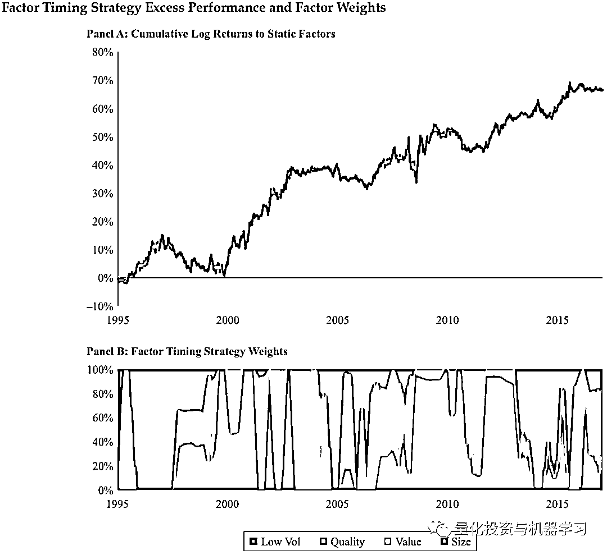

# 拥挤交易：行业轮动与因子择时策略的构建

> 原文：[`mp.weixin.qq.com/s?__biz=MzAxNTc0Mjg0Mg==&mid=2653315407&idx=1&sn=e9f5e375aedcb0b8f82d6c42b7ea3e80&chksm=802da35ab75a2a4c1aa8aa458bb5878ccbe0499b3c4e01bfff51508610c4e45f07d5b16fd6ab&scene=27#wechat_redirect`](http://mp.weixin.qq.com/s?__biz=MzAxNTc0Mjg0Mg==&mid=2653315407&idx=1&sn=e9f5e375aedcb0b8f82d6c42b7ea3e80&chksm=802da35ab75a2a4c1aa8aa458bb5878ccbe0499b3c4e01bfff51508610c4e45f07d5b16fd6ab&scene=27#wechat_redirect)

量化投资与机器学习公众号独家解读

量化投资与机器学公众号 *** ***QIML Insight——深度研读系列 ******是公众号今年全力打造的一档**深度、前沿、高水准**栏目。

公众号**遴选**了各大顶刊最新论文，按照理解和提炼的方式为读者呈现每篇论文最精华的部分。QIML 希望大家能够读到可以成长的量化文章，愿与你共同进步！

> **本期遴选论文** 来源：The Journal of Portfolio Management July 2019, 45 (5) 46-57
> 作者：William Kinlaw、Mark Kritzman、David Turkington
> 标题：Crowded Trades: Implications for Sector Rotation and Factor Timing

**核心观点**

**1、资产中心度及相对价值指标的结合能够有效的判断资产是否发生拥挤交易（泡沫）及所处的阶段。**

**2、基于拥挤交易的行业轮动策略能够显著跑赢市场基准，并取得较优的风险回报比。**

**3、拥挤交易在因子择时中的应用也能带来显著的超额收益。**

**前言**

拥挤交易是指大量资金购买或出售同一项资产或一组具有相似特征的资产，导致资产价格发生重大变化。然而，要注意的是并不是所有大的价格波动都是由拥挤的交易引起的。由基本面变化带来的资产价格的调整是可持续，这类价格的变化很难把握；但在基本面没有变化的情况下发生的价格调整更有可能是暂时性的，价格偏离后的回归也相对较容易预测，我们把这种价格的大幅调整称为泡沫。

是否能够辨别当前是否有泡沫，且识别出当前所处泡沫的阶段，是本篇文章探讨的核心。作者在文中提出了基于**资产中心度（Asset Centrality）**指标来判断资产是否存在泡沫的方法，并结合**相对价值指标**来更精细化的判断当前泡沫所处的阶段-是泡沫膨胀期还是破裂期，最后利用拥挤交易构建了行业轮动及因子择时交易策略。

**怎么度量交易是否拥挤？**

**资产中心度**

作者使用一种称为资产中心性的度量指标来判断资产是否存在交易拥挤（或泡沫）。该指标的具体及算方法如下：

1、计算各资产收益率的协方差矩阵（收益率会乘以各资产市值占比的开方）；

2、对以上的协方差矩阵进行主成分分析，得到特征向量；

3、根据以下等式计算 Absorption Ratio：<embed style="vertical-align: -3.139ex;width: 16.274ex;height: auto;max-width: 300% !important;" src="https://mmbiz.qlogo.cn/mmbiz_svg/a18XcQ1EBBggIibBXCZoqdhuN8o5DMia8Yq2pxgibxJyiaDz0UuWNecg4Z2UvhpzEHlYlJTWW0NGDMJLh7asf9g4tv69WNSazkw1/0?wx_fmt=svg" data-type="svg+xml">上式中 等于资产的数量， 等于特征向量的数量， 为第 个特征向量， 为第 个资产的收益率方差。Absortption Ratio 通常用来度量风险集中度。4、根据计算公式计算资产中心度：<embed style="vertical-align: -2.76ex;width: 29.73ex;height: auto;max-width: 300% !important;" src="https://mmbiz.qlogo.cn/mmbiz_svg/a18XcQ1EBBggIibBXCZoqdhuN8o5DMia8YKBeKwug3cRhAVUB0zq1OKqgQM9tI3v8WZCwk2p4iaibjnDVn3IdymKMI23iaGQdxrxG/0?wx_fmt=svg" data-type="svg+xml">上面的式子中， 是资产中心度， 是第 个特征向量的 Absorption ratio， 为第 个资产在第 个特征向量暴露的绝对值， 是选取的特征向量的数量（一般根据 PCA 分析结果确定）， 为资产的数量。下图展示了 1985 至 2017 年美股 11 个行业的资产中心度，资产中心度指标本身能够度量各行业是否存在拥挤交易。但泡沫本身会经历膨胀期到破灭期，资产中心度指标并不能准确的判断当前泡沫所处的阶段。为此，还需要其他指标的辅助。

**相对价值指标**

作者采用 PB 来度量资产的价值，以行业的相对价值指标为例。首先计算该行业的 PB，将每个行业当前的 PB 除以过去 10 年的 PB 均值。然后再将上述结果除以其他所有行业的均值，得到一个相对标准化的 PB。

相对价值主要的用途是结合上面的资产中心度指标，来判断当前发生交易拥挤（泡沫）的资产（或行业）所处的阶段，如果资产中心度高且相对价值指标高（过高估值），作者认为该资产处在泡沫破灭期。如果资产中心度高且相对价值指标低（估值正常），作者认为该资产处于泡沫膨胀期。

**两个指标在历史重大泡沫期的表现**

在过去 30 年里，最大的两个泡沫分别是 1998 年-2000 年的科技股泡沫，及 2008 年的次贷危机。下图 2 及图 3 分别展示了两个泡沫时期，资产价格、资产中心度及相对价值指标的走势。可以看出，资产中心度指标可以定位泡沫开始膨胀的时间，但之后该指标一直上升，同时相对价值指标则可以定位泡沫开始破灭的时间。由此可以看出，两个指标的结合，相对单个指标的使用更能准确的区分泡沫的各个阶段。

**行业轮动策略**

由于基本面、政策甚至资金的影响，不同行业在某些时间段会受到市场资金的集中热捧，并由此产生泡沫。作者基于以上两个指标，计算出行业中性度及行业相对价值，且定义行业中心度较高且相对价值较低的行业正处在泡沫膨胀期，而行业中性度同样较高但相对价值也很高的行业正处在泡沫破灭期。并基于不同阶段的行业，构建了行业轮动交易策略。

**行业中心度**

1、每个交易日，准备 11 个美股行业指数近两年的历史日度收益率数据；

2、对于每个行业的日度收益，乘以该行业的市值权重的开方；

3、为了突出近期数据的重要性，采用半衰期为一年的指数时间衰减对步骤 2 的收益率做处理；

4、基于前三步处理后的收益率数据计算协方差矩阵，并根据等式 2，计算行业中心度（设置 n=2）；

5、计算每日行业中心度的 Z-Score：今日行业中心度与前三年均值的差，除以前三年行业中心度的标准差。

**行业相对价值**

1、每个交易日，准备 11 个美股行业的市帐率 PB；

2、将每个行业当前的 PB 除以过去 10 年的 PB 均值；

3、将步骤 2 计算的结果除以其他 10 个行业的均值，得到一个相对标准化的 PB（relative normalized price-to-book ratio）。

**构建行业组合**

1、根据以上两个指标，对所有 11 个行业进行排序，选取各个指标排名靠前的 3 个行业；

2、基于以上排序构建以下四种情景：

*   中心度指标前三之后，相对价值指标前三之后（无泡沫）

*   中心度指标前三之后，相对价值指标前三（无泡沫）

*   中心度指标前三，相对价值指标前三之后（泡沫膨胀期）

*   中心度指标前三，相对价值指标前三（泡沫破灭期）

3、我们每日对 11 个行业，参照步骤 2，进行划分，并计算了 1985-2017 年来各情景的年化收益率，如下表：

从上表可以看出，泡沫膨胀期的组合年化收益优于标普 500 的表现大约 6.7%，处理泡沫破灭期（交易拥挤，估值偏高）的组合的表现组差，比标普 500 低 6.5%。

**交易策略**

上表的测试采用等权的方式构建组合，主要是用于测试不同的组合相对于标普 500 的表现。接下来，作者基于组合优化构建了更实际的交易策略。

1、对于泡沫上升期的行业假设预期收益为 5%，对于泡沫破灭期的行业假设预期收益为-5%，对于其他行业假设预期收益为 0；

2、根据过去 5 年的历史数据计算行业的协方差矩阵；

3、根据以上的预期收益和协方差矩阵，求解最优权重（Mean-Variance Optimization）；

4、为了控制换手率，每天的权重等于过去一个季度最优权重的平均值。

下表给出了回测结果，相对于标普 500，该策略的收益更高且风险更低，信息比率为 1.0。在图 6 中，A 部分是策略的累计收益曲线，B 部分是各时间点不同行业在组合中的权重。

作者也在其他市场测试了该策略，不同市场的表现如下表 7 所示，所有的市场明显的超额收益，除了澳大利亚，大部分市场的风险也得到了降低。

**因子择时策略**

除了在行业轮动中的应用，作者还讨论了拥挤交易在因子择时中的应用。作者一共探讨了以下几个因子：规模、价值、质量及低波动因子。之所以没有讨论动量因子，主要原因是作者认为动量因子很可能是其他 4 个因子发生了拥挤交易而产生的。

**构建基于因子的投资组合**

1、基于标普 500 的成分股，对股票分别按以下因子进行排序：

*   市值（小规模因子）
*   PB（低估值因子）
*   ROE（高质量）
*   前两年的日度收益波动率（低波动）

2、分别基于以上的排序，将股票分为 10 组，组内基于市值加权构建组合；

3、每天进行排序，记录每个分组的日度收益率；

4、定义每个因子的总收益等于前两组收益的市值加权平均值；

5、定义每个因子的相对收益等于总收益减去标普 500 的收益率（对于低波动因子，相对收益=因子收益*（标普 500 波动率/因子总收益波动率）- 标普 500 收益）。

**因子中心度**

1、对每个因子，计算过去两年，10 分组的每组；

2、为了突出近期数据的重要性，采用半衰期为一年的指数时间衰减对步骤 1 的收益率做处理；

3、基于步骤 2 的收益率数据，对 10 分组中每组计算协方差矩阵，并参考等式 2 计算每组的资产中心度；

4、因子中心度等于前两个组合的资产中心度之和；

5、计算每日欧美总中心度的 Z-Score：今日因子中心度与前三年均值的差，除以前三年因子中心度的标准差。

**因子相对价值**

1、对每个因子，计算 10 分组中每组的市值加权 PB；

2、每组的 PB 除以过去 10 年的均值；

3、将步骤 2 计算的结果除以其他 9 个分组的均值，得到一个相对标准化的 PB；

4、计算前 2 组的结果（来自步骤 3 的结果）的市值加权均值，这个均值作为该因子的相对价值。

基于因子中心度与因子相对价值的排序，我们分为以下几个情景：

*   中心度指标后二，相对价值指标后二（无泡沫）
*   中心度指标后二，相对价值指标前二（无泡沫）
*   中心度指标前二，相对价值指标后二（泡沫膨胀期）
*   中心度指标前二，相对价值指标前二（泡沫破灭期）

下表给出了不同情景下的相对标普 500 的收益率，与行业测试情况类似，泡沫上升期的因子组合获得 11.4%的超额收益，但与行业测试不同的是，泡沫破灭期的因子组合相对市场，还能获得 2.4%的超额收益。

基于行业轮动中的交易规模，作者在因子中进行了类似的测试，下表 9 给出了测试结果，其中 Static Factors 是对四个因子等权的结果。可以发现采用基于以上方法进行因子择时（Factor Timing）的结果最优。

**总结**

作者在本文中提出了，基于资产中心度及相对价值两个指标相结合判断资产是否存在交易拥挤，及所处泡沫的阶段。并将这套方法应用在了行业轮动和因子择时策略上，测试结果表明，**基于拥挤交易的行业轮动及因子择时策略均能够显著的跑赢市场基准，获得明显的超额收益。**

量化投资与机器学习微信公众号，是业内垂直于**量化投资、对冲基金、Fintech、人工智能、大数据**等领域的主流自媒体。公众号拥有来自**公募、私募、券商、期货、银行、保险、高校**等行业**20W+**关注者，连续 2 年被腾讯云+社区评选为“年度最佳作者”。