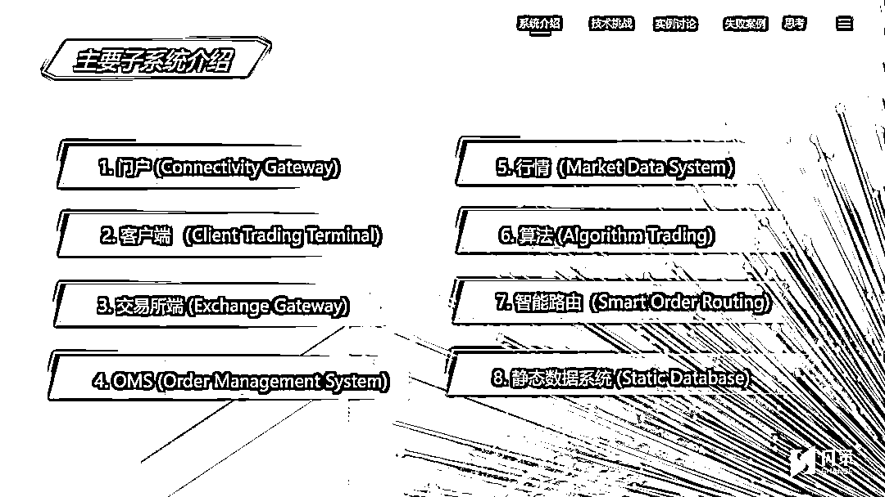
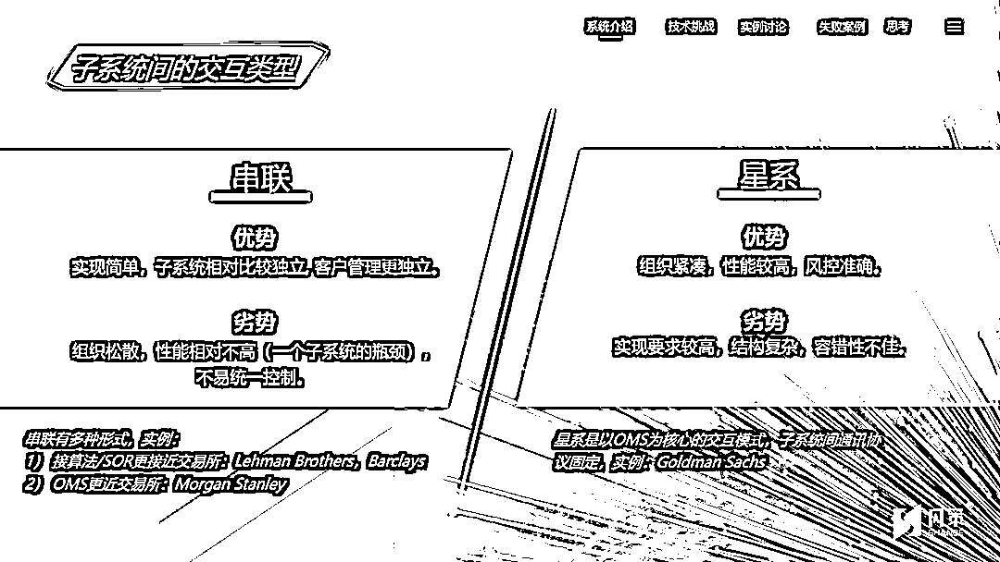
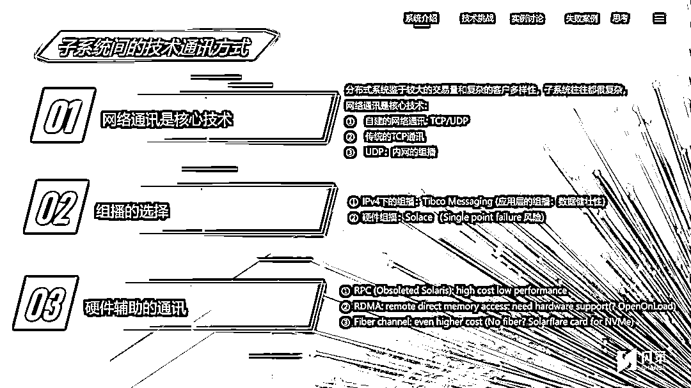
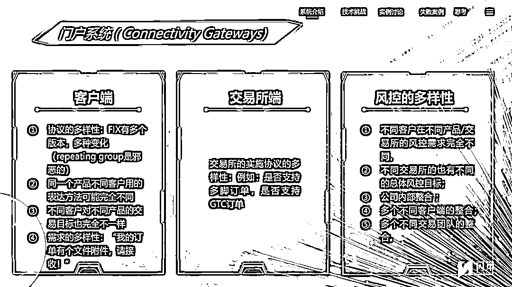
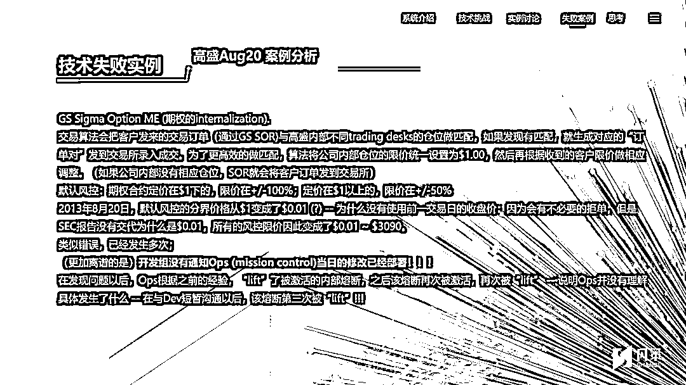

# 闪耀策略的光芒！

> 原文：[`mp.weixin.qq.com/s?__biz=MzAxNTc0Mjg0Mg==&mid=2653315359&idx=1&sn=6edb1d09480104fe9dfaac0ff5ea9bdc&chksm=802da30ab75a2a1c825850933a8e542042c1d2076b81443bdfd3020daf78d2a78dc401613906&scene=27#wechat_redirect`](http://mp.weixin.qq.com/s?__biz=MzAxNTc0Mjg0Mg==&mid=2653315359&idx=1&sn=6edb1d09480104fe9dfaac0ff5ea9bdc&chksm=802da30ab75a2a1c825850933a8e542042c1d2076b81443bdfd3020daf78d2a78dc401613906&scene=27#wechat_redirect)

**量化投资与机器学习公众号独家策划**

*****QIML Insight***是量化投资与机器学习公众号在 2021 年全力打造的深度专题系列。我们从数据、策略到交易的各个环节，邀请各路大咖为读者分享业界的前沿技术与研究动态。**

**第一期 ***QIML Insight ***第一位分享嘉宾为上海闪策信息科技有限公司 CTO 刘可。接下来让我们看看上周三的**演讲全文实录**。**

**** **点击图片，查看回播** 

****正文****

**大家好，我是闪策科技的 CTO 刘可，非常感谢量化投资与机器学习公众号的邀请，让我有机会在这里和大家分享：**“量化交易系统的技术实现与挑战”**，这个题目很大，一个小时讲清楚这个主题非常困难，所以我会挑一些我个人觉得比较重要的内容讲，最后再做一两个案例分析。**

**我先介绍一下我自己，我是上海闪策信息科技有限公司 CTO， 2000 年从复旦大学毕业，随后到美国留学，2007 年博士毕业后一直在纽约从事金融行业的信息技术服务，2015 年年初，回到上海参与闪策科技的成立与建设。**

**在纽约工作的这段时间，我主要参与了比利时 KBC，彭博和巴克莱这几家公司的金融交易系统的建设、维护和技术支持，而且我参与工作的时期，特别是 2012 年到 2015 年间，正好是美国量化交易系统一个比较大的发展和转型的阶段，这段经历也帮助我在量化交易系统的细节上积累了一些知识和经验。**

**接下来，就让我们进入正题吧。**

**今天的演讲内容有三大块，一是量化交易系统主要的子系统，二是每个子系统可能会用到的技术、以及我们在技术实践中碰到的一些挑战和困难，最后我举一两个例子，来谈一下技术实践的困难和可能性，特别是技术带来的新问题。**

****量化交易主要子系统的技术实现****

****一、量化交易子系统有哪些？****

**量化交易主要的子系统，包括闪策现在的交易系统也是量化交易的一种子系统，主要分为以下 8 个部分。每一个子系统都是独立的功能支撑体系，需要大量的人力物力的投入和长期的技术支持，才能够做到稳定的运行和维护。每一个子系统可以单独给客户使用，把他们组合起来也可能成为一个更大的系统。**

**对于搭建量化交易系统而言，必要的是门户、客户端、OMS、行情，其他的都不是必须的。**

****

**第一个，门户（Connectivity Gateway），主要是整个大的系统和交易所连接的部分。**

**第二个，客户端，主要和客户连接，这都是对外连接的。**

**第三个，交易所端。**

**第四个，OMS，即 Order Management System，它是介于客户端到门户之间的中间部分，能够管理所有的订单，记录所有的仓位，以及成交信息的保存和记录。**

**第五个，行情系统，用于从交易所接收行情。**

**第六个，算法模块，有一些复杂的交易策略需要用到算法模块，算法其实不是一个特别复杂的功能，它更多的是提供一些固定的算法功能给客户用，让交易团队选择不同的算法模块来组合成不同的策略，这些策略经过自我升级后进行交易。**

**第七个，智能路由在中国是没有的，在这里只是稍微提一下。**

**第八个，静态数据更多的是涉及到场外的一些数据信息的服务处理。**

****二、子系统间的交互类型****

****

**子系统之间有多种连接方式，主要分串联和星系两种。**

**串联的概念非常简单——把子系统像火车车厢一样连起来，前面是客户端，紧接着是 OMS，然后是门户，三个连成一串，一个连一个。串联细分到不同领域也有不同的实现方法，在国外也有不同的实例。**

**它的优势是各个子系统相对比较独立，一般在大的投行机构，每一个子系统都是独立的技术组去做开发和技术支持，相互之间没有太大的交集。**

**劣势是比较松散，每一个系统的性能都是独立控制，整个系统的瓶颈会出现在某一个子系统上面。一个子系统不协调，就会成为整个系统的瓶颈。把这个子系统优化了，可能另外一个子系统又变成瓶颈，没有办法进行统一控制。**

**还有一种连接方式是星系，即以 OMS 作为核心，其他的功能模块都是分支出来作为辅助，不单独对外进行连接，所有的客户端和交易所的 Gateway 都是通过 OMS 对外连接，然后不同的功能就变成 OMS 自己的功能模块。**

**它的优势是紧凑，能够进行整体优化，风控也很准确。**

**劣势就是它非常复杂和庞大，需要相当多的人力物力去做统一的管理，计划要非常周密，如果设计得好，最后会变成一个巨霸的系统。**

****三、子系统间的技术通讯方式****

**子系统之间的相互通讯方式有传统的，也有非传统的，我就不再多说了。**

****

****四、子系统间通讯协议的设计****

**不同子系统之间的通信协议会有很大的差别，这些通信协议的设计能够直接影响到整个系统的性能。不仅仅是通讯本身的性能，甚至会影响到子系统内部的性能，这是我们做系统设计的时候需要着重考虑的东西。**

****五、子系统灾备设计的发展****

**为了防止系统出错，在设计系统的时候，需要针对每个子系统进行灾备设计。**

**国内很多系统的灾备做得都比较完善，为应对不同的要求会形成大量冗余的技术，所以灾备会做得非常复杂，从而影响到交易核心的性能。**

**在系统设计的过程中，灾备子系统本身往往没有从一开始就放在主要的系统架构设计当中。可能是交易主系统已经完全设计以后或者实现的过程当中，甚至是实现以后，才考虑到要启动灾备系统，这样会造成灾备系统与交易主系统的结合不紧密，性能受影响，甚至会影响到主要的功能，最后影响到后期的开发和维护。**

**所以，灾备是一个非常重要的主题。古人云“兵马未动,粮草先行”，系统设计很重要一点是当你开始设计系统的时候，灾备就要先走起来，先做灾备的设计，出了错要怎么处理，用什么方式去处理，第二步再去设计交易的核心系统。**

**这样的话，对整个系统的设计、性能上会有很大的帮助和前瞻性的预期。**

****六、门户系统****

****

**门户系统它包括两端，一个交易所端，一个客户端。客户端有很多不同的连接方法，客户可以用很多不同的方法来跟一个交易系统进行连接。**

**国外用的最多的是 FIX 协议，即 Financial Information Exchange，FIX 已经进化到很多个版本，但是 FIX 有一个问题，它本身是 String-based，就是以字符串为基础的协议，没有优化过，所以它的性能并不是很好。此外，同一个产品不同的客户有不同的表达方法，因此协议也难以统一。**

**为了更好的性能，我们在系统设计时，会针对客户端进行比较完善的系统协议设计，有了协议性能的提升，系统本身的性能才会有一定的提高。像纳斯达克它就有专门的 OUCH 协议，它是一个二进制的协议。在国内，比如上海（证券）交易所和深圳（证券）交易所，他们也有不同的交易协议，也有基于 FIX STEP 这样的字符协议，也有 MDGW 这样的二进制协议，闪策也有自己的二进制协议。**

**所以，其实国内外的情况是差不多的，只是协议内容不同，但设计方法和思路是一样的，都是为了能够更高效、有效地支持交易系统的通讯，而且满足真正的多样性。**

**交易所协议就更复杂了，国内有一个统一的标准，但是统一的标准并没有向开发商完全地开放，国内都是交易所提供交易接口，开发商进行接口调用。**

**从我们开发商的角度看，这样会造成大量的信息壁垒，当然这也是历史原因造成的，接口形式可能更方便大家调用，但是降低了接口的有效性和交易所连接的有效性，不利于市场的高效发展。**

****量化交易技术挑战****

****一、门户系统客户端技术实现****

****

**门户系统的设计比较复杂，很容易剑走偏锋，把路走错了。就像我刚才讲的灾备系统的设计，它相对其他系统更复杂，但又是必须的。**

**当我们要提供一个交易系统给客户或券商使用的话，灾备是第一要考虑的问题，它不像客户的交易程序，如果出了错可以停止系统运行。但对于券商中间使用的一个交易系统来讲的话，这种情况下系统不应该停止运行，系统需要有连续性和健壮性，同时对性能还有很高的要求。**

**这个要求是很复杂的，这不仅仅是性能要高、健壮，同时还涉及到公平性，因为一个交易系统不仅只有一位客户用  ，它是为多个客户服务的。那么，我们如果无法对每一个客户公平，有些客户就会说，你这个系统不公平，所以导致市场不公平。**

**市场永远都是公平的，我们现在看到的非公平性，往往就是因为技术实现本身的问题造成的这种市场非公平性的存在。目前国内交易所在客户订单和下单的通路上面，往往会出现因为负载均衡，造成这种技术性的不公平，这是一个非常复杂的问题。但是它又涉及到一个市场或者监管需求的问题。**

**所以，这也是系统设计当中我们所要面对的复杂的挑战之一。**

****二、门户系统：交易所端的挑战****

****测试****

**我们和不同的交易所在做连接的时候，需要做大量的认证测试，以保证这个系统能够支持交易所要求的所有的功能，同时要支持客户要求的所有功能。**

**因为我们的系统会升级，交易所的系统会升级，然后出了错大家都要修 bug，所以每做一次改动就会做大量的测试，所有的测试开发都需要人力物力，不是说我们拍拍脑袋就过去了，也很耗时间。那么，做测试的时间我们就不能做开发，所以这个时间和资源的分配也是一个巨大的挑战。**

****交易所也会出错****

**有的时候客户交易出问题了，客户会来和我们说：为什么你的系统出现这个问题、那个问题？其实是交易所的问题被藏在了系统提供商背后，我们不得不背锅。**

**举个简单的例子，开盘后大量的订单造成交易所系统拥塞，从而导致订单的回报变慢，客户会说：“为什么用你的系统，我的订单下去以后半天没有回复？”但从技术厂商角度看，我们也很冤枉，订单到了交易所，交易所没有回复，我无法给客户一个回复。**

**这个情况还是比较普遍的出现，一年总会出现那么几次，所以有很多这种挑战我们是无法预测的，它随时会动态地发生。甚至有的时候会断连，而且断连的原因很难去控制。**

**还有一个挑战是我们没有任何确定性——不同的交易所行为会不一样，我们每天都在处理这样的事件，这都是量化交易系统所要面临的。**

**这些内容都比较偏技术，有点枯燥，接下来我跳到对大家工作方式都有帮助的部分继续讲。**

****产品经理的挑战：技术文档的标准化**** 

**很多时候我们对技术开发文档都不重视，特别是在开发前期，我说的开发前期是指系统设计时。当一个系统开发完成时，大量的文档其实都是一些系统怎么使用的使用说明手册，这些都是对外的，但真正的对内的技术文档非常少，技术方案大部分是我们在系统设计的时候拍着脑袋想的，大家开会讨论，有一两个点子然后就开始动。**

**很多小公司刚开始的时候都是这样的情况，但是发展到后来，大家会渐渐发觉这样做是不行的。**

**首先，我们不清楚所有的业务需求是不是都能实现，而且甚至有的时候都不清楚我们开发出来的功能是否是当初我们想要的功能。特别是当一个开发项目比较大、超过不止一个技术人员去参与开发的时候就会出现这样的问题。技术人员有自己的理解，业务人员也有自己的理解，但大家以为相互都能够都在同一个位置上去理解同一件事情，但是最后其实不是这样子的。**

**刚开始的时候，我们也不觉得文档是能够高效的，但实际上到发展到最后，我们发觉有技术文档才能够真正地使系统开发和实现能够高效和制度化。所以，这个是我们在困难中不断地学习所得到的一些经验。**

**这其实不仅仅是一个技术挑战和经验，更多的是一个从技术经理的角度去谈的，哪怕是像闪策这样的小公司，发展到现在我们也觉得系统设计的文档非常重要。**

**这里主要有两个不同的文档，一个是 BRD 业务需求文档，业务需求文档不需要去讨论实现系统的方法和目标是什么，我们只谈业务要的是什么。业务需求文档里出现的业务需求，它都是要实现到这个系统当中的。如果说我们在前期开会讨论的业务需求没有进入到 BRD 文档，或者说我们不认为最后系统能够支持这样的业务需求，那就不会被写入到业务需求文档中去。**

**有了业务需求文档以后，才会有 ROE 文档，即 Rules of Engagement。ROE 主要是用来给技术人员内部统一意见的文档，基于业务需求文档去规划整个系统要用什么样的方法实现，具体的功能是技术逻辑，怎么样去实现、去达到业务逻辑。**

**所以这两个文档是我们在系统设计当中不可少的文档，是我们通过长期的经验、实践、挑战学习到的解决方法。**

**既然文档制度化、规范化了，那么到最后就可能会出现方方面面都要制度化。大家根据制度去实现系统，才能够有高效的合作环境，不再是一个人做一件事情。这不仅仅是做量化交易系统要面对的问题，是所有的软件公司都需要面对的问题。**

****技术失败案例分析****

**成功的案例讲起来都很简单，但实践起来很困难，基本上不太可能重复一个成功案例。但失败的案例比比皆是，而且非常容易重复，要防止失败，就要从不断从别人的失败当中去学习。**

****案例一：Knight Capital 骑士资本****

****

**第一个例子是骑士资本 knight capital 的案例，这里只写了一页 PPT，但是我手上有一个比较大的英文文档，是美国证监会 SEC 最后给出的调查报告，我摘抄了一些内容给大家读一下。**

**一是说 Knight 的技术系统有大量的不合规的设计和行为，那么有哪些呢？**

**报告里罗列了非常多的条款，比如 that did not have controls reasonable desire to……，他没有任何控制系统能够有效地去做一些事情的技术设计。第二个仍然是这样起头的，没有 control——有效地去做一些事情。第三个是针对风控，没有任何写下来的描述，系统里当然有很多的风控设计，技术人员可能也都知道，但是没有任何文字说明，出了错没有任何人知道应该照着什么样的方法去处理问题，没有落到纸上的风控规则。同时，它也没有一个有效的管控和监控程序来管理所有交易系统的开发、上线的质量控制，请注意，这里的程序不是指计算机程序而是一个工作流程。**

**读到这里，给人的感觉就是非常的惊讶，骑士资本作为当时美国甚至是全世界最大的对冲基金，很难想象他们是完全没有一家成熟的、制度化的流程去管控交易系统开发质量的公司。**

**后来很多的报告也罗列了大量的证据说明为什么会发生这样的事情。那么 Knight 到底发生了什么？**

**我把整个报告读完以后，总结了一下：Knight 的 SOR 即聪明路由（这是一个在美国比较特殊的功能，它其实是算法的一个部分，是一个执行算法）进行了新版本的开发，引入了新的功能。新的功能不细说到底是干什么的，简单地讲，即客户的订单里面有一个订单代码，代码代表他要使用新的功能，如果发来的订单，没有这个代码就表明这个客户不会使用新的功能，这个代码本身只是一个数字/字母或者说是这些东西的组合，比如 abc123。简而言之，即程序根据每个订单它是否带有这样一个代码去判断是否需要为订单提供某一个新的功能。**

**关键问题在于这组代码，这个 code 在现有的系统里已经在使用了，而新的功能在实现了以后没有意识到这个代码曾经被用过。Knight 用新功能去替换原有的功能，准备要上线——看上去这个事情没有任何问题，但是问题在于旧有的功能没有被删除，新功能上线之前只测了新功能，它可以工作、符合需求，但是没有去测试这个旧有功能是否仍然还在起作用或者说已经完全被替代掉了。**

**上线时，Knight 根据传统的方法做上线部署，总共有 8 台交易服务器部署 8 个交易系统子系统，但 8 台服务器里面只有 7 台被部署了，有一台被漏掉了（什么原因报告里没有讲）。因为各种各样的原因，没有任何技术人员做二次检测，没有确认到底是部署了 7 台还是部署了 8 台——这就是我们刚才讲的 SEC 报告里面说，没有任何写下来的流程去管控和监控所有的生产上线的流程。**

**第二天实盘开始，7 台正常部署的交易服务器正常运行，其实第 8 台也正常，因为旧功能还在能继续用。没多久，交易技术支持人员报告说发现了问题，有一台服务器的给出的功能不是预期的功能。**

**一个新的改动、部署导致交易在生产环境出了错，此时，技术人员在没有通知任何开发人员的情况下，直接回滚了所有服务器，但不知情的客户继续用新的订单代码发单。**

**造成的影响听上去似乎不大，总共有 212 个算法订单，154 只股票受到影响。当时的具体情况我记不太清楚了，当天整个美国交易所订单量大概在 600 万到 700 万订单之间，总共有 5000 多只股票交易，所以说从比例上来讲看上去不大。**

**但实际上不是这么回事情，客户使用了算法订单，每个订单都非常巨大，154 只股票主要集中在交易最活跃的股票中，最后具体的数字 SEC 的报告里面也说得很清楚——在 45 分钟的时间里，总共有 400 万个成交，有 154 个股票，3 亿 9700 万股票受到影响，所有账面仓位大概是 35 亿美金，实际空仓大概是 31 亿 5000 万美金，最后 Knight 因为这分钟 45 的错误，总共损失了 4 亿 6000 万美金，不是利润，是直接损失了 4 亿 6000 万美金，Knight 当天就宣布破产。**

**这个例子是非常震撼的，因为它仅仅是一个操作上的失误，甚至不是我们代码开发当中的失误。完全是因为在部署过程当中，因为人为的一个非常小的疏忽造成的，但它让全球最大的对冲基金，在短短 45 分钟内，造成 4 亿 6000 万美金的损失。**

**所以从这个例子我们可以看到，代码出错和操作失误相比，操作失误造成的影响更大。而且操作失误很可能是仅仅是因为没有按照流程去做操作，人为疏忽造成这就是我们经常讲的乌龙指，技术人员的乌龙指。**

****案例二：高盛 2013 期权交易故障****

****

**高盛在 2013 年 8 月 20 号出了这样一个错误，其实和 Knight 是一样的，不是一个代码失误，这是一个操作失误。**

**高盛的系统采用星系的技术设计方案，就和我们前面说的一样，它是一个巨无霸系统，非常的复杂，所有的其他功能只是辅助。那么，巨无霸的属性也造成了系统每天在日常交易中，总是要不断地应对意外事件，处理种类繁多、各不相同的非正常事件，因此有大量的处理机制和开关来处理复杂意外事件。**

**高盛就会把不同频率发生的意外事件分为不同的等级，对于一些危险性比较低的等级，他们会在不影响正常交易的情况下，把风控的触发开关关掉，或者说把它清零。比如说一个风控值原来是 0，然后因为出了错，逐渐累积到 10，然后系统会报警。操作人员看见这个问题出现了 10 次，但是觉得风险不大，就把它清零，继续出现则继续清零，这就成了高盛在日常交易中的做法——在日常的技术支持过程中形成了一种习惯，对于这样的意外事件会经常清理，把一个意外事件当成非意外事件来处理。**

**好，当天它发生了什么呢？**

**高盛交易算法会把客户发来的交易订单（通过 GS SOR)与高盛内部不同 Trading Desks 的仓位做匹配，如果发现匹配，就生成对应的“订单对”发到交易所录入成交。为了更高效地匹配，算法将公司内部仓位的限价统一设置为$1.00，再根据收到的客户限价做相应调整。（如果公司内部没有相应仓位，SOR 就会将客户订单发到交易所），默认风控：期权合约定价在$1 下的，限价在+/-100%；定价在$1 以上的，限价在+/-50%。**

**就这一天默认风控$1 被人错误地设成了$0.01，（SEC 没有交代为什么会被设置为$0.01，但这是一个符合需求的风控值）基于它原有的其他风控逻辑，风控区间变成了$0.01~$3090，设置为$0.01 基本上就是把整个风控取消掉了。**

**操作人员看到了风控报警，但他并没有意识到为什么会出现风控报警，他以为跟昨天的风控报警是一样的。**

**问题出在哪里？出在开发组在做部署的时候，没有通知技术支持组，头一天开发组做了部署以后就下班了；第二天开盘时，技术支持组发现风控跟昨天的情况一样，他们没有收到有关新系统修改部署的通知。那么根据过去经验，按照过去的处理方法来处理就可以了，然后风控就被不断地被清零了，内部垄断经历了很多次，风险被一次一次的扩大，最后才造成了大家进入交易很长一段时间后，才发觉之前做过一些系统部署。**

**取消系统部署的操作是回滚，但技术支持人员根本不知道头一天做了部署，是不是需要回滚呢？Knight 的情况就证明不能够迅速回滚，不能够想当然地觉得今天的事情跟昨天的事情一样，这里也是一样的。**

**这就是高盛在 2013 年 8 月 20 号出的问题。当时造成高盛在出错以后，因为各种原因向交易所报警，造成交易所把大量的已成交订单全部取消，最后录得高盛 8000 万美金的损失， 8000 万高盛能够损失得起的，但是仍然是一个巨大的技术管理漏洞。**

**后续的调查报告也是说高盛缺乏整个部署流程的管理，从开发到部署到技术支持，其次，意外情况变成了习惯性。我们为意外情况设计了大量的预案，但在实际交易当中，因为意外情况发生了很多次，每次都没有造成巨大的损失或者说没有造成损失，只是一些报警，然后感觉上这些报警都是可有可无的，那么，就会让人习惯，特别技术人员习惯性地觉得这些都不再是风险，把一个非正常的情况逐渐地变成习惯性地觉得它是正常，这也是我们面临的一个风险。**

****总结****

**我举这两个例子都是想说明一个问题，很多时候从我们讲 Bug 会造成巨大的损失，Bug 是巨大的风险，其实不是的，真正的风险来自于操作，来自于整个部署流程，最后落实到人的行为上面，而不是技术人员代码逻辑。代码逻辑 Bug 造成损失的案例也有 ，但是往往最大的损失不是 Bug 造成的，而是我们在处理 Bug 的过程中，没有按照流程处理，或者其他各种各样、复杂的原因夹杂在一起造成的，所以说技术性的乌龙指是我们要去面对和避免的一个巨大挑战，特别是对量化交易系统的开发和运维来讲。**

**好的，我今天大概就讲这么多，希望不是特别枯燥。感谢大家的时间，谢谢！**

**量化投资与机器学习微信公众号，是业内垂直于**量化投资、对冲基金、Fintech、人工智能、大数据**等领域的主流自媒体。公众号拥有来自**公募、私募、券商、期货、银行、保险、高校**等行业**20W+**关注者，连续 2 年被腾讯云+社区评选为“年度最佳作者”。**