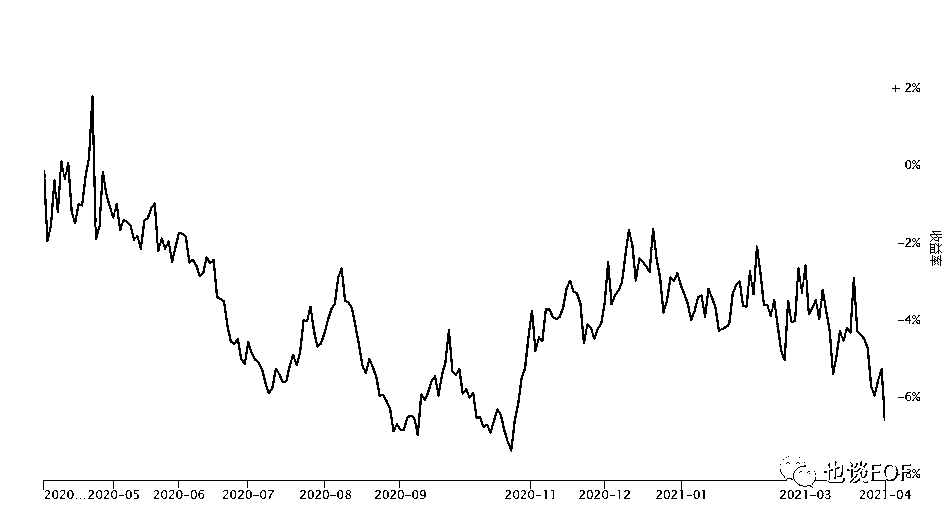

# CTA 策略的焦虑感

> 原文：[`mp.weixin.qq.com/s?__biz=MzAxNTc0Mjg0Mg==&mid=2653315348&idx=1&sn=e73e8c2b37a7a363e4e0e152c7f6a495&chksm=802da301b75a2a1742f104e60617c568cbdb7eca9235be5298bda117e3686b745b1cc8f18045&scene=27#wechat_redirect`](http://mp.weixin.qq.com/s?__biz=MzAxNTc0Mjg0Mg==&mid=2653315348&idx=1&sn=e73e8c2b37a7a363e4e0e152c7f6a495&chksm=802da301b75a2a1742f104e60617c568cbdb7eca9235be5298bda117e3686b745b1cc8f18045&scene=27#wechat_redirect)

**来自 | 也谈 FOF       作者 | 李帅波**

## ****对于近期持有 CTA 策略的焦虑感，来源于对不确定事情未来发展的恐惧！****

**愚人节这天期货市场给大家来个玩笑，市场上 CTA 策略都出现不同程度的回撤，无论是截面动量还是时间序列方面因子都受到挫败。其实春节后整个期货市场就出现分化，一方面是 CTA 策略管理人业绩出现分化，一方面投资人心态开始发生分化。**

**大家对于 CTA 策略的认知是做多波动率策略，也就是说期货市场波动越大，CTA 策略的盈利能力就会越强。其实期货市场的波动率可以从以下两个角度来理解：一方面是指的商品期货品种短期市场波动率的共性情况；第二个便是某一商品长期市场波动率的自身特性情况。往往一般年份，CTA 策略的收益主要是靠某些品种自身高波动的特性加之一些政策和事件的催化所造成的，一年有 1-2 波比较大的交易性机会，对于 CTA 策略来说，每年抓到这 1-2 波波动的机会，全年的收益基本算是完成预期的收益目标，其他时间就是在横盘或者回撤期。而 2020 年的期货行情属于期货市场品种的年度高波动共性情况，并且整个趋势行情也很明显：**一是行情的空间更大；二是行情的走势更为流畅。**所以 CTA 策略收益颇丰，给投资人造成一种非典型的“高收益低风险的”产品风险收益结构特征认知。**

**基于这个论点，由于一些后疫情时代的经济复苏预期和宏观/微观经济、政策的影响都会加大期货（包括商品和金融）市场的波动，从而大家一致看好今年的 CTA 策略表现。此外，股票市场在春节后的结构性下跌行情促使股票多头型基金收益承压，出现较大回撤。股市大小盘股票风格的切换和交易量的平稳也促使股票中性产品和 T0 策略从 2020 年下半年开始就一直不太理想。这些条件客观上都加剧了 CTA 策略的需求的增加。**

**很多投资者在 2020 年下半年和 2021 年第一季度投资这个 CTA 策略，但是目前的持有体验感和预期差距比较大，尤其最近的策略收益表现，很多投资人已经出现明显的焦虑感，这个焦虑感主要是由于自身对于 CTA 策略的本身风险收益特征不了解，另方面自己对市场高波动的预期，认为 CTA 策略就应该赚钱，而忽视了另外一个赚钱的必要条件就是趋势行情的流畅性和规律延续性，后者显然在 2021 年的 1-4 月是没有体现出来的。**

**从一些具体的 CTA 策略相关典型的因子表现可以看出 CTA 策略市场的一些变化：**

****

**短期时间序列动量，图片来源于 FOF 牛牛**

****

**长期时间序列动量，图片来源于 FOF 牛牛**

****

**短期截面动量，图片来源于 FOF 牛牛**

****

**基差动量，图片来源于 FOF 牛牛**

**从上图因子表现情况可以发现，无论基差还是时间序列方面因子在愚人节这天都出现较大回撤，春节后的这段时间收益表现其实属于一个较大分化。对我而言，市场是不可预测的，我们能够只是做好资产配置，在投资之初就应该尽量考虑到多个市场环境的可能变化，从而分散配置，以期望达到一个拉长周期都可以有的稳健性收益。** 

**无论是当天的回撤和近期的分化都会促使投资人持有的焦虑感，大部分投资人对这个策略的 2020 年表现的认知不同，并且引发出对后面市场的发展不确定性的担忧恐惧：CTA 策略表分化会继续加大、策略出现较大的震荡横盘期等等。我们应该从以下几个角度更好的来理解这个策略：**

**CTA 策略通俗来讲它是指由专业的资金管理人投资于期货市场，利用期货价格上升或下降而获利的一种投资策略。它具有以下几个特征。**

****1、杠杆性****

**期货是保证金交易，具有较大的杠杆特性，投资者可以成倍的放大收益或者亏损，这个杠杆，对于资金实力相对薄弱、风控观念淡薄的小散户玩家来说，他们在杠杆下显得尤为脆弱，容错能力很低。所以对他们来说，当顺着现成的方向交易和逆向交易这两个选择摆在他们面前时，第一个相对更为保守的选择对他们来说明显是最优解。这个理论较为完美的解释了为何散户投资者占比越多的市场或品种更容易走出趋势行情。对于 CTA 策略的基金来说，这个杠杆性可以更好的提高资金使用率和风险收益特征的灵活调整以适合不同属性的投资人需求。**

****2、低相关性****

**CTA 策略独立于股票市场和债券市场，从具体相关基金产品的表现来看其他策略相关性较低，和大多数资产可以形成互补。所以我们应该把它定位为资产配置的价值而不是稳定高回报的投资价值，在我的 CTA 策略 fof 投资人中，我们在开始就问他们有没有比较多的股票和债券持仓（标的资产或者基金），如果都没有，我就会认为他没有意识到这个策略的配置价值大于直投价值，后续可能会存在各种问题，所以会拒绝他们认购。**

****3、非线性****

**CTA 策略收益非线性，收益方式体现在低胜率、高盈亏比上，一年中的一段时间就能将全年的收益实现。也就是之前提到的，只要每年有几个品种出现 1-2 波好的趋势行情，CTA 策略全年收益就不会太差，但是这种行情出现的时间点和机会是不确定性的，对于投资人来说买定离手，以配置的心态长期持有会更好，切忌追涨杀跌，频繁申赎。当然，很多人也会问我对这个产品的预期收益，我一般都是拒绝回答这个问题的，因为没有意义，每年的市场行情差异很大，都会直观的影响到产品收益，是无法预期和预测的，对弈投资人来说，只要做好分散配置和杠杆产品结构的优化，设定一个预期收益回撤比会更靠谱一些。**

**对于投资人来说，CTA 策略是针对的交易衍生品策略的统一范畴，但是不同的交易方式和策略逻辑使得细分策略的收益回撤预期和表现差异很大，也就是说收益和风险是非严格正相关，就像期货高频策略，具有高收益，低风险特征。但是很多投资人会感觉我认购的就是高频策略，为什么回撤和波动这样大，我只能说，此高频非彼高频。 **

**每个策略都有自己的适应周期和市场环境，其实 CTA 策略表现的好坏，更多的与市场的波动率和趋势行情的节奏性相关，当市场呈现出明显的上涨或下跌的趋势时，趋势跟踪策略往往会表现较好；当市场呈现无序波动的格局时，CTA 往往无法有效捕捉趋势，一些短期反转策略或者套利也许好做；并且不同周期的策略适应性的市场也不相同，长周期的策略在大级别趋势中表现良好，但在震荡行情中往往回撤和波动也较大；短周期的策略因为交易周期的原因，较难完全的捕捉到趋势行情，但防守相对来说也会更好点，收益曲线更加平滑；我们在真正进行投资组合的筛选过程中，投资者需要充分了解每个策略基金的投资品种分布及持仓交易周期，与此同时也要兼顾到未来市场的大致预期；最后，任何策略资产还是建议以中长期的配置视角参与，尽量避免因为阶段性的表现影响自己的判断，也尽量避免出现在黎明来临前夕赎回的情况发生。**

**所以需要再次强调，CTA 不宜频繁的短期申赎择时，因为它的表现具有非线性，一方面是 CTA 策略的基金产品表现为上涨或者下跌比较迅速和难以预测性，即使是基金经理也很难把握；二是私募基金的申赎有一定的延时，一般等投资人看到 CTA 的投资机会再追入，趋势已经开始结束出现震荡了；正确的配置意识是分散选择不同策略赚钱逻辑，确定投研团队的稳定性和研究实力后，待该基金上涨一波并出现阶段性调整之后，选择参与并坚持一定周期持有。**

**量化投资与机器学习微信公众号，是业内垂直于**量化投资、对冲基金、Fintech、人工智能、大数据**等领域的主流自媒体。公众号拥有来自**公募、私募、券商、期货、银行、保险、高校**等行业**20W+**关注者，连续 2 年被腾讯云+社区评选为“年度最佳作者”。**