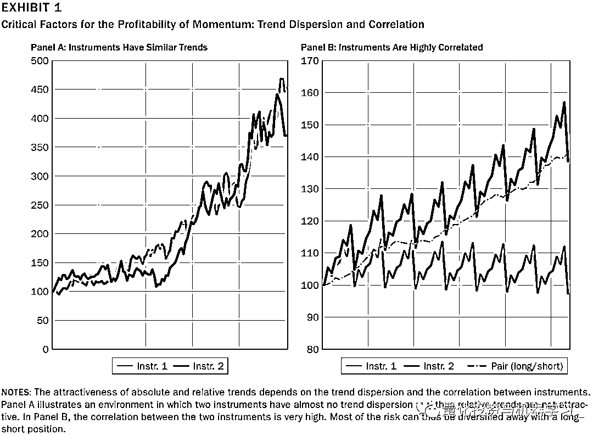
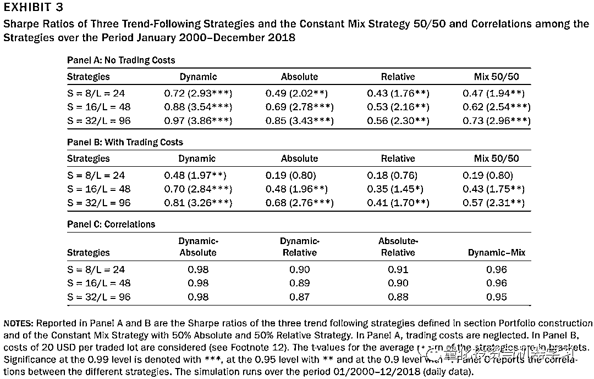
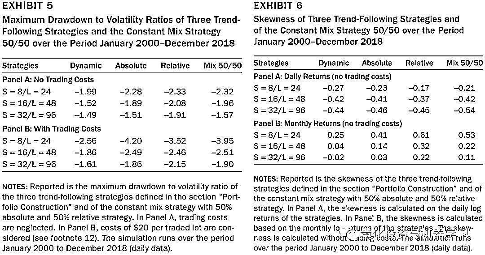
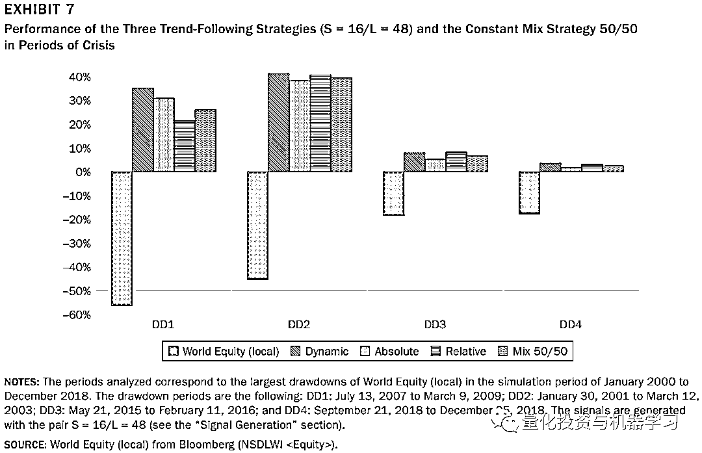
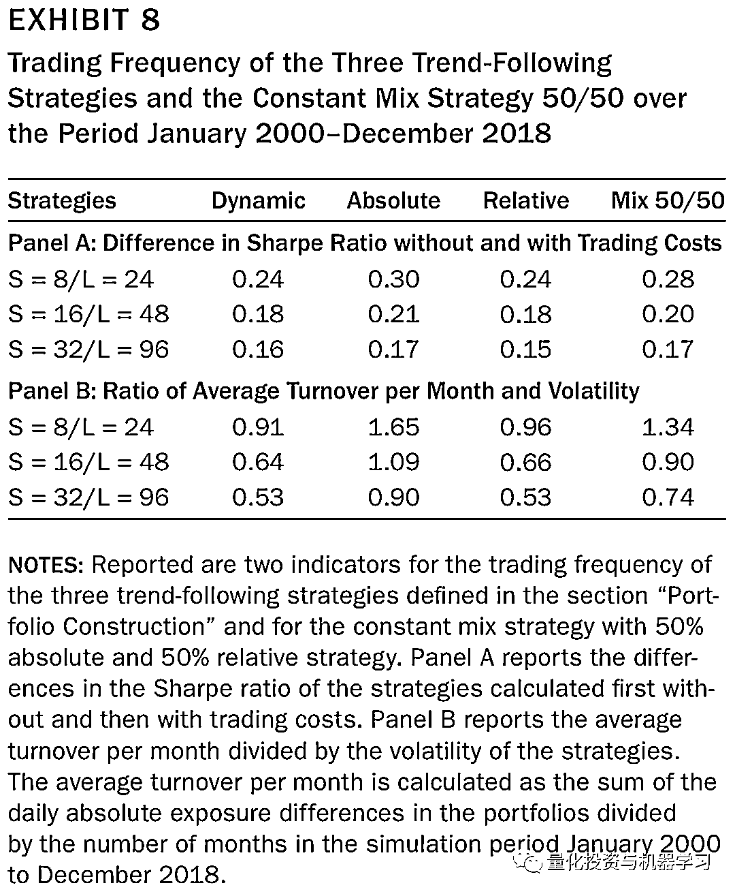
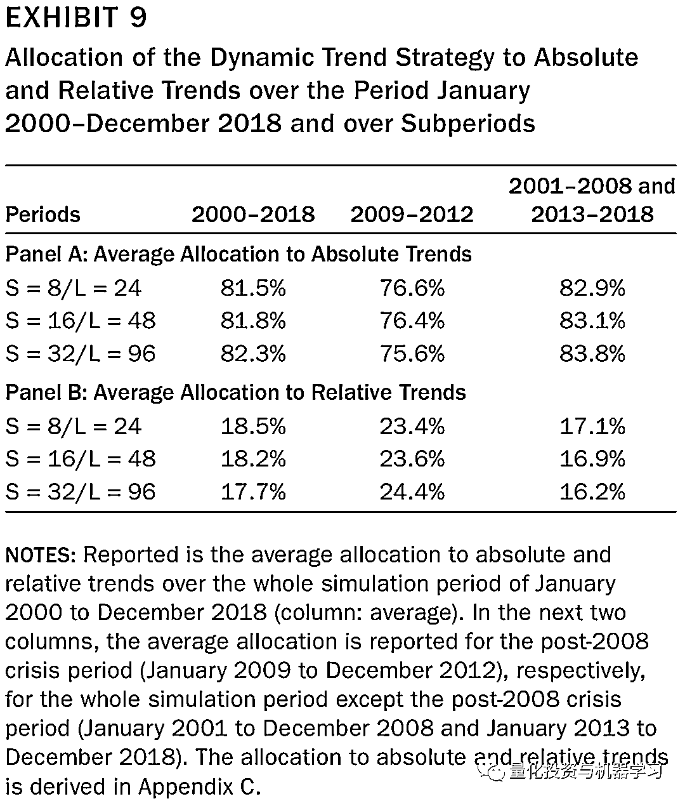
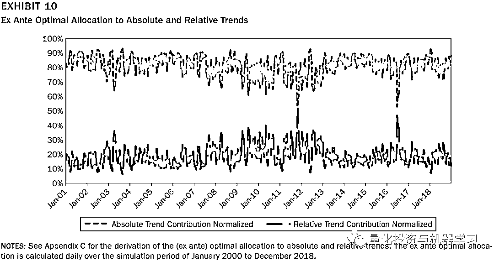
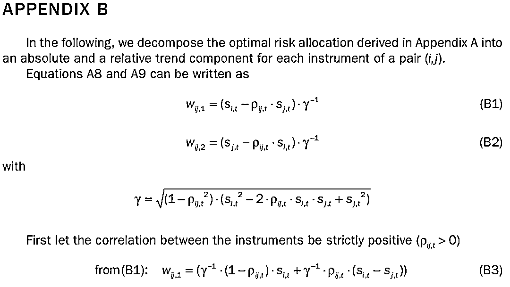
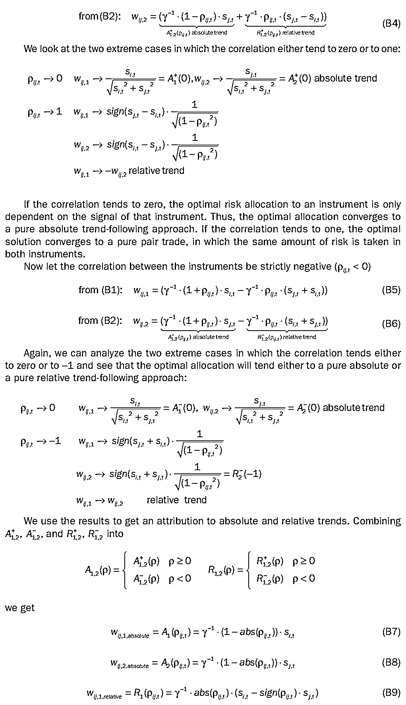
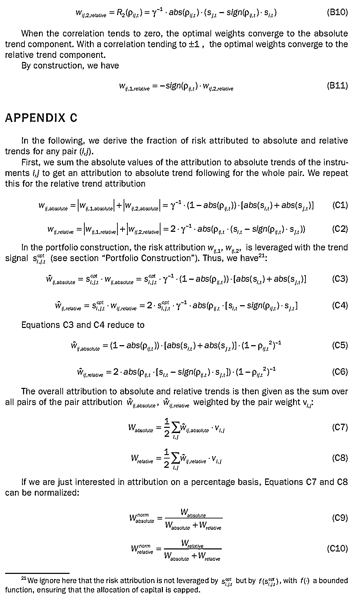

# 统一框架下的截面动量与时序动量策略

> 原文：[`mp.weixin.qq.com/s?__biz=MzAxNTc0Mjg0Mg==&mid=2653315304&idx=1&sn=8f36bc03096995655abea040e2ee3f94&chksm=802da2fdb75a2beb5d210c8235ab64fba0ba510b16683599189419f2ce0af483ea9c020707f6&scene=27#wechat_redirect`](http://mp.weixin.qq.com/s?__biz=MzAxNTc0Mjg0Mg==&mid=2653315304&idx=1&sn=8f36bc03096995655abea040e2ee3f94&chksm=802da2fdb75a2beb5d210c8235ab64fba0ba510b16683599189419f2ce0af483ea9c020707f6&scene=27#wechat_redirect)

量化投资与机器学习公众号独家解读

量化投资与机器学公众号 ***QIML Insight ***系列是公众号今年全力打造的一档**深度、前沿、高水准**栏目。今天，公众号正式推出了 ***QIML Insight——深度研读系列***。

公众号**遴选**了各大顶刊最新论文（再次强调是**最新！**），按照理解和提炼的方式为读者呈现每篇论文最精华的部分。QIML 希望大家能够读到可以成长的量化文章，愿与你共同进步！

> 本期遴选论文：
> 来源：The Journal of Portfolio Management Multi-Asset Special Issue 2021 3.29
> 作者：Olivier Schmid 、Patrick Wirth
> 标题：Optimal Allocation to Time-Series and Cross-Sectional Momentum

**核心观点**

*   **趋势（或动量）策略应该根据市场的状态，动态分配策略在时序动量与截面动量的权重。**

*   **基于时序动量与截面动量的组合策略主要依赖于各品种的趋势强度及品种间的相关性。**

*   **品种间的趋势越离散且同时相关性越高，截面动量策略的收益越好。**

*   **在过去近 20 年，动量策略组合中，时序动量策略贡献了超 80%的收益。**

**综述**

关于动量的研究，学术界一直没有停止过，Titman（1993, 2001）基于股票过去超额收益的高低构建了多空组合，获得了 CAPM 模型不能解释的超额收益。随后陆续有学者在其他资产上也验证了动量效应的存在，其中包括商品期货、外汇、债券及权益指数等绝大多数可投资的品种。AQR 的 Babu 等（2020）在最近的论文中研究了另类资产的趋势跟踪策略，也发现了动量效应的存在。无论是学界和业界，关于动量的研究主要从两个维度入手：

## **截面动量**

也称为相对动量，通过对截面上资产过去一段时间的收益率进行排序，通过做多过去收益高的资产；做空过去收益低的资产，而构建的多空组合获取超额收益。在业界常应用于股票，近些年也有很多管理人将该策略应用在商品期货。

**时序动量**

也称为绝对动量，通常称为趋势跟踪策略。通过计算某一品种过去不同时间跨度的收益，当近期表现好于过去较长时间段的表现时选择做多；相反则做空。常见的有基于长短均线交叉的策略，多用于商品期货。

如果不考虑当前业界的主流做法，当构建基于动量策略的投资组合时，面临着如何选择的问题，是选择截面动量策略，还是选择时序动量策略？**还是能够同时选择两种策略，并有更科学的方法能够动态的进行配置？**

截面动量和时序动量是同时存在的，同一因素对截面动量和时序动量策略收益的影响确不一样。Moskowitz, Ooi, Pedersen（2012）分解了时序动量与截面动量的影响因素，他们发现影响动量策略的主要因素是品种之间的相关性，而且截面动量并不能完全覆盖时序动量的收益。Bird, Gao, and Yeung（2017）在股票指数上研究了时序动量与截面动量的表现，发现时序动量的收益远好于截面动量。

作者给出了下图 1，**说明了两个影响动量策略的因素，趋势的分散性（Dispersion）和相关性（Correlation）**。如果两个品种的**趋势分散性很低**（趋势很一致），那么**截面动量策略就很难有吸引力**（如左图）；相反，当品种**本身存在趋势，且品种间相关性较高时**，此时截**面动量策略表现会很突出**（如右图）。

**统一框架下的截面动量与时序动量策略**

## 

回到上文提到的问题，既然不同市场环境对不同的动量策略有所偏好，**能否同时选择两种策略，并有更科学的方法能够动态的进行配置？**

常用的截面动量策略是固定换仓时间，主要在选择交易品种。而时序动量策略，侧重择时。要想动态的配置两种策略，需要一个统一的框架。作者基于组合管理理论提出了一个统一的动量策略框架，这个框架最主要的区别就是对于截面动量策略组合的构建方式。

假设现在有 N 个可交易品种，传统的截面动量策略，会根据动量将交易品种分为 5 组或者 10 组，然后构建一个多空组合。作者的改进是，基于这个 N 个品种的任意两个，计算他们的相对动量，构成一个相对动量的配对。把每个配对当做可交易品种，这样就有(N * (N - 1))/2 的配对。这样就和时序动量策略保持一致（时序动量也不像常用的均线交叉策略，具体看下文）。

**如何定义动量？**

最终要根据不同品种动量的大小构建投资组合，所以作者对于动量给出了明确的定义：

1、对于品种 i，分别计算长短周期的指数加权均线：

<embed style="vertical-align: -0.566ex;width: 31.503ex;height: auto;max-width: 300% !important;" src="https://mmbiz.qlogo.cn/mmbiz_svg/a18XcQ1EBBggIibBXCZoqdhPrlMGFNCKmBhtthnLJCXsY7CAyShDWqvaF1nQJ1QQiaA2cdt0VlEPMkEvppEGGLCTsnaBxgxKhH/0?wx_fmt=svg" data-type="svg+xml">

2、计算长短均线之差：

<embed style="vertical-align: -0.566ex;width: 42.93ex;height: auto;max-width: 300% !important;" src="https://mmbiz.qlogo.cn/mmbiz_svg/a18XcQ1EBBggIibBXCZoqdhPrlMGFNCKmxQlEvkqlhm4tBia9sicoExcE820Kf1G94Phq8vyezeeQVxLAxaavagOD96qU7x1tdb/0?wx_fmt=svg" data-type="svg+xml">

3、计算均线差的标准差：

4、风险调整后的时序动量等于：

5、品种配对 i, j 的相对动量就同于等于：

<embed style="vertical-align: -0.666ex;width: 26.885ex;height: auto;max-width: 300% !important;" src="https://mmbiz.qlogo.cn/mmbiz_svg/a18XcQ1EBBggIibBXCZoqdhPrlMGFNCKmbU5r19234RibwIUrFAazad4Ly6GW5GeSIvNsd9QSEGFhY1RjdhjfOCOcuZmWJg08v/0?wx_fmt=svg" data-type="svg+xml">其中是 i, j 的在组合里的权重。
**基于组合管理理论的统一框架**动量策略的基本假设是动量能够预测未来收益（绝对或相对）。假设 是品种 在时刻 t 的时序动量，可以将 作为品种 i 在下一期风险调整后预期收益 的预测值。现在假设有两个品种 和 ，他们之间的相关系数矩阵如下（之所以用相关系数矩阵，是因为文中采用的是风险调整后的收益，已经除过标准差了）：对于两个品种的权重分配以 表示，那该组合的目标函数就是求出最优的 来最大组合的风险调整的预期收益。而上文中说过，可以将 作为品种 i 在下一期风险调整后预期收益 的预测值。所以整个逻辑可以用下来目标函数及限制条件表示：<embed style="vertical-align: -4.799ex;width: 26.488ex;height: auto;max-width: 300% !important;" src="https://mmbiz.qlogo.cn/mmbiz_svg/a18XcQ1EBBggIibBXCZoqdhPrlMGFNCKmSSuAicF9Ro8Diao50KbjOoT16xVrUjGSOe7bsLxzbby4ZzaCeo7lMzvlY1k23GLpZm/0?wx_fmt=svg" data-type="svg+xml">以上求解的结果如下（等式 1，等式 2）：<embed style="vertical-align: -9.745ex;width: 51.815ex;height: auto;" src="https://mmbiz.qlogo.cn/mmbiz_svg/a18XcQ1EBBggIibBXCZoqdkVdcjrTnuARE5tErKPh0ssyzRXynGiaPyZoVIukkvKqqwtOPibusibR1DbMVJIDPpibEFHUfKNYY9Cz/0?wx_fmt=svg" data-type="svg+xml">此时目标函数（预期风险调整收益或组合时序动量）的最大值为（等式 3）：<embed style="vertical-align: -2.766ex;width: 36.87ex;height: auto;max-width: 300% !important;" src="https://mmbiz.qlogo.cn/mmbiz_svg/a18XcQ1EBBggIibBXCZoqdhPrlMGFNCKmn3ScSeZL1lnHhj0Qj8Pf4kXbM0QQ34vKrIUMUJTzb21ibl3y4CunjTnuUFyz0wmAq/0?wx_fmt=svg" data-type="svg+xml">

首先假设两个品种之间的相关性为 0，可以得到：

<embed style="vertical-align: -2.218ex;width: 23.977ex;height: auto;max-width: 300% !important;" src="https://mmbiz.qlogo.cn/mmbiz_svg/a18XcQ1EBBggIibBXCZoqdhPrlMGFNCKmdnBSAePrSricRqmt1xG2BmuKDOD0pLUx1QhdoMFEhK9GqIkkIibFDh0aZY0WksnbiaD/0?wx_fmt=svg" data-type="svg+xml">

也就是说，分配给两个品种的权重与品种的时序动量强度完全相关。而当相关性为+1 或-1 时，可以得到：

也就是说，分配给两个品种的权重与品种间的截面动量（或相对动量）完全相关。**所以当品种相关性高的时候，最优组合会更多的分配给截面动量。**

所以可以看到，在一个以时序动量最大化为目标的最优组合中，其实也有部分权重分配到了截面动量。那具体到某一个品种，分配给时序动量和截面动量的权重占比分别是多少。作者在文章的附录 B 给出了推导过程，结果如下：

<embed style="vertical-align: -2.272ex;width: 47.794ex;height: auto;max-width: 300% !important;" src="https://mmbiz.qlogo.cn/mmbiz_svg/a18XcQ1EBBggIibBXCZoqdhPrlMGFNCKmaxFb6qADPTSfsTyVPFs7d9JJxsqqnxuwnXC9DqdMqOHKuBsnSABeTZcJzkr3jAB5/0?wx_fmt=svg" data-type="svg+xml">

其中：

<embed style="vertical-align: -0.666ex;width: 40.572ex;height: auto;max-width: 300% !important;" src="https://mmbiz.qlogo.cn/mmbiz_svg/a18XcQ1EBBggIibBXCZoqdhPrlMGFNCKmTrKxWZEp9sD7II0BKho14uibGXibvfXpZOGhRibvLqyAiadyVHqzx0JYlobHPfIRBMer/0?wx_fmt=svg" data-type="svg+xml">

**实证分析**

为了测试时序动量及截面动量的表现，作者构建了三个策略：

**1、（纯）时序动量策略 Absolute trend strategy**

a. 为了确保每个品种的风险分配均匀，作者计算了每个品种的单位风险头寸：

其中 是总资本， 是一个常数，用于空值组合的整体风险。 是事先确定的分配给品种 的权重（对于大类资产按股票 30%，固收 30%，商品期货 40%分配，资产内的各品种再平均分配）。

b. 将各品种的时序动量通过逻辑回归（Logistic）函数转换到-1 到 1 区间。（注：本身逻辑回归的取值为 0 到 1，这里先转换动量的绝对值，再考虑正负号）。

c. 经过以上处理，时刻 t 分配给品种 的资金为 ，每天按下面的公式计算资金并相应调仓：<embed style="vertical-align: -2.202ex;width: 37.475ex;height: auto;max-width: 300% !important;" src="https://mmbiz.qlogo.cn/mmbiz_svg/a18XcQ1EBBggIibBXCZoqdhPrlMGFNCKma56lD64L2nGjlue4rcK9yTMq99oQt9aiaazyWZ8SHVvadVJJCkH53psbxYhCRMyVh/0?wx_fmt=svg" data-type="svg+xml">**2、（纯）截面动量策略 Relative trend strategy**a. 首先也是计算每个品种配对的单位风险头寸：<embed style="vertical-align: -2.218ex;width: 20.327ex;height: auto;max-width: 300% !important;" src="https://mmbiz.qlogo.cn/mmbiz_svg/a18XcQ1EBBggIibBXCZoqdhPrlMGFNCKmhXVicyDfhy8w9wjSK4D8Cv6HNsS6t0c73lle5hsFB5YqwKZnQz9H3Cog57vW827ms/0?wx_fmt=svg" data-type="svg+xml">注：关于每个配对权重的分配作者并没有阐述的非常明确。

b. 将各品种配对的截面动量通过逻辑回归（Logistic）函数转换到-1 到 1 区间。

c. 经过以上处理，时刻 t 分配给品种 的资金为 ，每天按下面的公式计算资金并相应调仓：<embed style="vertical-align: -5.816ex;width: 36.966ex;height: auto;max-width: 300% !important;" src="https://mmbiz.qlogo.cn/mmbiz_svg/a18XcQ1EBBggIibBXCZoqdhPrlMGFNCKm56fe8ufT3fjcWzWHyQUTKFeicdQjuZxdkEup8n4Tw499lxQt1e0Oia9bYOBaQ91Myn/0?wx_fmt=svg" data-type="svg+xml">**3、动态最优动量组合策略 Dynamic trend strategy**

a. 首先也是计算每个品种配对的单位风险头寸：

<embed style="vertical-align: -2.539ex;width: 20.327ex;height: auto;max-width: 300% !important;" src="https://mmbiz.qlogo.cn/mmbiz_svg/a18XcQ1EBBggIibBXCZoqdhPrlMGFNCKmBeIZorfDxaAdpjDjViclSaIzzxGSe1pPSVQ6q6CpegSYAlqjs6ibE7fSlj1ViaeJRJR/0?wx_fmt=svg" data-type="svg+xml">其中 为最优权重下组合 的波动率（参考等式 1 和 2）。

b. 将（等式 3）最优组合下的动量通过逻辑回归（Logistic）函数转换到-1 到 1 区间。

c. 经过以上处理，时刻 t 分配给品种 的资金为 ，每天按下面的公式计算资金并相应调仓：<embed style="vertical-align: -5.598ex;width: 36.705ex;height: auto;max-width: 300% !important;" src="https://mmbiz.qlogo.cn/mmbiz_svg/a18XcQ1EBBggIibBXCZoqdhPrlMGFNCKmoDknK8hNENUibXCTLHBeqbC0wgGLWPHZz1nB137NVSxnmH1UV4Eu0qOnF8DPkdj50/0?wx_fmt=svg" data-type="svg+xml">**4、50/50 混合策略**

固定的将资金 50/50 分配到策略 1 和策略 2。

**其他回测设置**

*   交易时间，在时刻 t 计算出调仓信号后，在时刻 t+1 执行

*   交易品种：包括股指期货、利率期货、外汇期货及商品期货在内的 59 个品种

*   数据范围：2001 年 1 月至 2018 年 12 月

*   参数选择：分别测试了三组均线参数（8/24, 16/48, 32/96）

### 

**分析结果**

#### 

**收益表现分析**

下图 3 中，A 部分没考虑交易成本，可以看出动态策略（策略 3）的夏普比率明显好于其他三个策略。B 部分考虑了交易成本，可以看出各策略的表现明显下降，但策略 3 的表现还是显著优于其他三个策略。在 C 部分中，作者给出了三个策略的相关性，可以看出四个策略的相关性都非常高，但通过动态最优组合计算权重的策略 3 比简单将策略 1 和 2 混合的策略 4 要表现的好的多。

表 5 给出了各策略的最大回撤，可以看出策略 3（Dynamic）表现无论是考虑交易成本还是不考虑成本都是表现最优的。表 6 给出了各策略日度及月度收益的偏度，策略 3 在取得夏普最高、回测最小的同时，偏度也是最低。

在图 7 中，作者根据过去股市的表现，划出了 5 段股市金融危机的时期，可以看出在各个金融危机时期内，4 个动量策略的表现都获得的正收益，但是策略之间的收益差不是很大，但策略 3 仍然表现最好。

#### 

**交易频率表现**

下表 8，A 部分是各个策略不考虑交易成本和考虑交易成本情况下的夏普差，可以看出策略 3（Dynamic）受交易成本影响最小；B 部分给出了不同策略的月度平均换手率，其中还是策略 3（Dynamic）的换手最小，而时序动量（策略 1）的换手最大。

#### 

**动态最优动量组合策略中时序动量与截面动量的贡献**

根据附录 C 的推导，可以计算出时序动量与截面动量分别在策略 3 中的分配到的权重，从下表 9 可以看出，在 2000-2018 年时序动量平均占了 80%的权重。

## 

**总结**

作者通过基于组合管理理论的统一框架，测试了时序动量及截面动量在过去近 20 年的表现，**发现最优基于动态最优配置的动量策略能够带来更优异的变现，并且这些优异的表现绝大部分是由时序动量贡献的，平均达 80%。**

**附录**

量化投资与机器学习微信公众号，是业内垂直于**量化投资、对冲基金、Fintech、人工智能、大数据**等领域的主流自媒体。公众号拥有来自**公募、私募、券商、期货、银行、保险、高校**等行业**20W+**关注者，连续 2 年被腾讯云+社区评选为“年度最佳作者”。