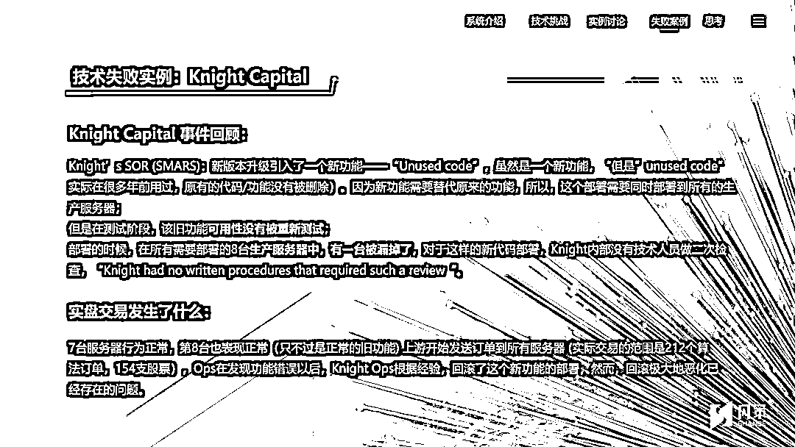
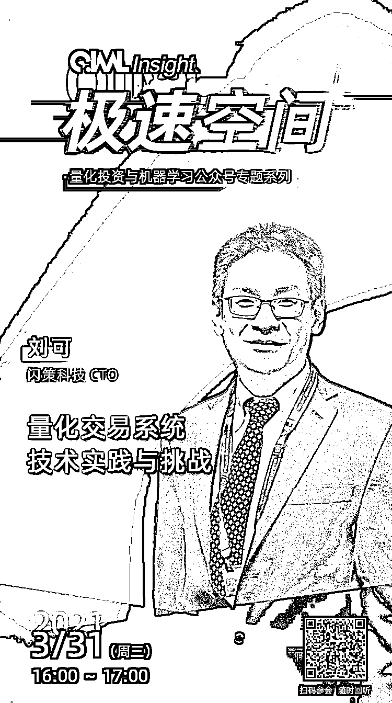

# 极速空间：量化交易系统那些事！

> 原文：[`mp.weixin.qq.com/s?__biz=MzAxNTc0Mjg0Mg==&mid=2653314883&idx=1&sn=b667ef87247556aa63f6e31744d9743f&chksm=802d9d56b75a1440205add3972aaee689900d0329eb4bef67435cdb56d1586bd337ccce09e9e&scene=27#wechat_redirect`](http://mp.weixin.qq.com/s?__biz=MzAxNTc0Mjg0Mg==&mid=2653314883&idx=1&sn=b667ef87247556aa63f6e31744d9743f&chksm=802d9d56b75a1440205add3972aaee689900d0329eb4bef67435cdb56d1586bd337ccce09e9e&scene=27#wechat_redirect)

**量化投资与机器学习公众号独家策划**

*****QIML Insight***是量化投资与机器学习公众号在 2021 年全力打造的深度专题系列。**

**我们从数据、策略到交易的各个环节，邀请各路大咖为读者分享业界的前沿技术与研究动态。**

**第一期 ***QIML Insight ***主题为：**

****

*****1*****

****嘉宾介绍****

****刘可** | **上海闪策信息科技有限公司 CTO**** 

**拥有复旦大学计算机科学系本科，纽约州立大学计算机科学专业博士学位，以及博士后研究经历。先后曾就职于比利时 KBC 集团，彭博社和英国巴克莱资本（纽约）等。在巴克莱资本任职期间，担任算法交易和智能路由技术负责人，拥有丰富的证券、期货交易系统的开发及管理经验。**

**上海闪策信息科技有限公司成立于 2014 年，是专注于为证券与期货业提供超低延迟技术解决方案的软件供应商和服务商，覆盖量化回测、行情接入、事前风控到交易执行等量化交易生命周期所需的产品和服务，交易柜台系统内部穿透纳秒级，系统性能和稳定性行业领先。闪策科技有多年顶级外资交易团队的服务经验，是海外交易公司快速进入中国交易的最佳合作伙伴选择。**

*****2*****

****内容概述****

**一、量化交易系统有哪些主要的子系统？****二、每个子系统可能会用到的技术、挑战和困难。****三、技术文档的重要性。** **四、技术失败事件回顾，如何避免技术乌龙事件？**

*   **案例一：Knight Capital 骑士资本：一次系统升级导致的 4.4 亿美金亏损**

*   **案例二：高盛 2013 期权交易故障：系统故障引发期权交易错误，损失近上亿美金。**

**部分 PPT 内容，全部内容请收看今天的直播哦！**

****

****

*****3*****

****如何收听？****

****扫码****海报二维码 ****

**/ **

****点击阅读原文****

****2021 年 3 月 31 日（周三） 16:00-17:00****

****

**量化投资与机器学习微信公众号，是业内垂直于**量化投资、对冲基金、Fintech、人工智能、大数据**等领域的主流自媒体。公众号拥有来自**公募、私募、券商、期货、银行、保险、高校**等行业**20W+**关注者，连续 2 年被腾讯云+社区评选为“年度最佳作者”。**