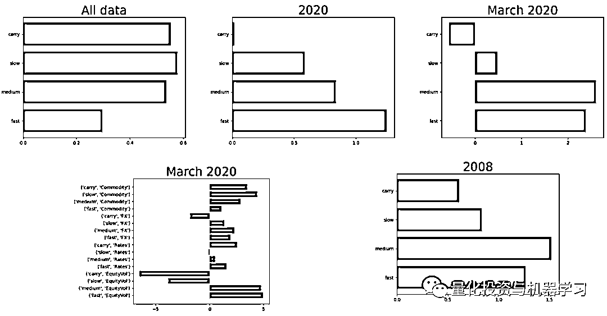
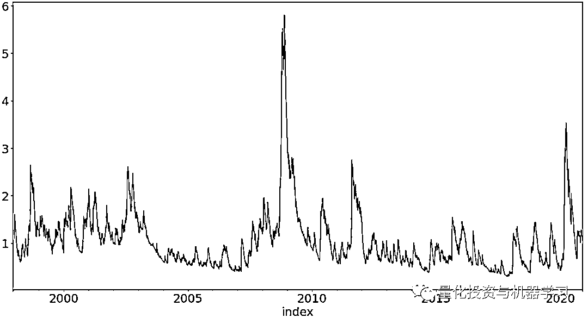
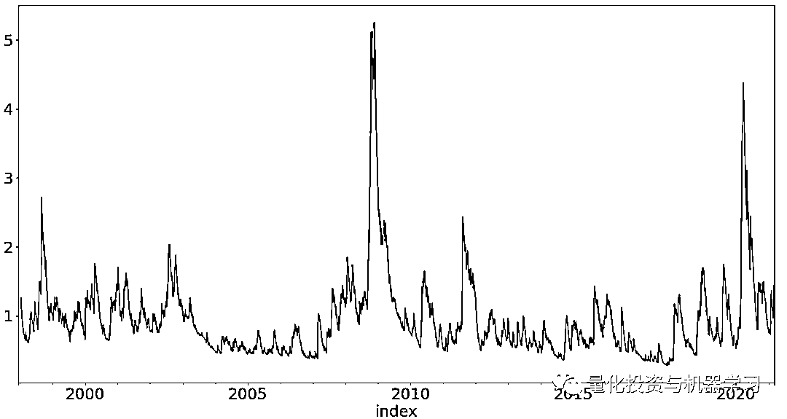
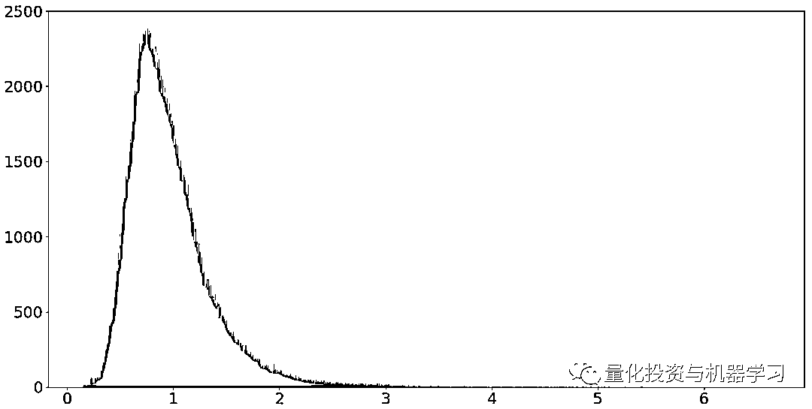
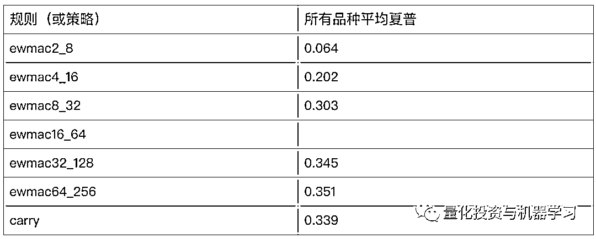
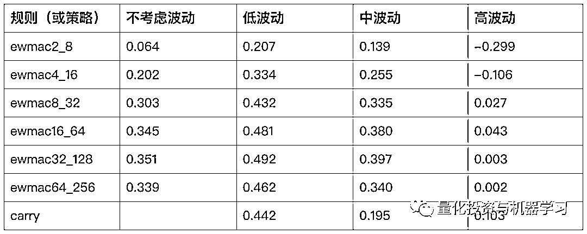
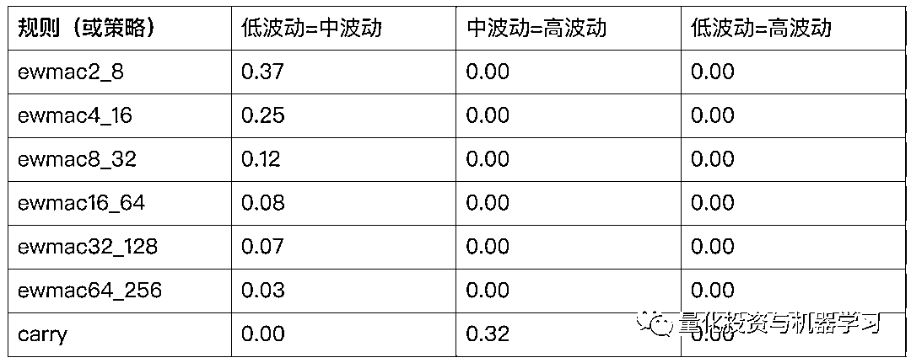
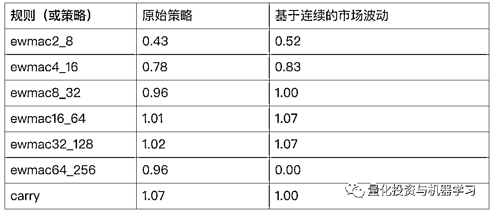

# 市场波动加剧：动量策略参数是否应该更敏感？

> 原文：[`mp.weixin.qq.com/s?__biz=MzAxNTc0Mjg0Mg==&mid=2653314750&idx=1&sn=5a9af1287aa28e0cb674d355341be1dc&chksm=802d9cabb75a15bd5efe9d15b24c5c2ad1600d31c7cfb90f920aa6817adc9fac62900399a9e6&scene=27#wechat_redirect`](http://mp.weixin.qq.com/s?__biz=MzAxNTc0Mjg0Mg==&mid=2653314750&idx=1&sn=5a9af1287aa28e0cb674d355341be1dc&chksm=802d9cabb75a15bd5efe9d15b24c5c2ad1600d31c7cfb90f920aa6817adc9fac62900399a9e6&scene=27#wechat_redirect)


**作者：Rob Carvers**

****背景介绍****

**前几日，《Systematic Trading》的作者，在其博客中探讨了这样一个问题，**当市场波动加剧时是否应该调整动量策略的参数（从长周期到短周期）？****

**1、作者结合了自己开源的测试框架，及自身的策略系统详细的回答了这个问题。在看一下分享之前，有几个背景需要大家了解。文章的代码基于作者的开源框架具体参见：*https://github.com/robcarver17/pysystemtrade/***

**2、作者在《Systematic Trading》的书中，构建了一个多策略多参数的系统，该系统的逻辑是基于某个策略对固定周期的收益的预测，从而进行交易。比如下文中会提到的 ewmac8——32 策略，就是会基于短期（8）和长期（32）均线预测（采用线性回归）未来固定时间（比如 10 天）的收益，区别于传统的金叉死叉策略。**

**3、作者会采用多种参数组合，构建一个多策略的组合，并用一套基于资金管理与风险管理系统给各策略分配权重**

**作者以下的探讨都基于这个多参数的系统，所以这个问题“当市场波动加剧时是否应该调整动量策略的参数（从长周期到短周期）”在这个系统的背景下就变成，“当市场波动加剧时是否应该调整加大短周期策略的权重？“**

****正文开始****

**这个问题在 2020 年市场危机期间尤其受到关注，因为 2020 年的大部分时间短期移动平均线的表现都超过了长期移动平均线的表现。下面这些图表显示了我所测试的不同交易规则在所有交易品种上获得的平均夏普比率。图 1 所有的历史(回到上世纪 70 年代) ，图 2 是 2020 年上半年，图 3 是 2020 年 3 月（注：其中 Carry 表示期限结构策略，slow/medium/fast 分别对应长中短均线参数的动量策略）。**

**快周期的均线策略在 2020 年的表现比过去所有的时间都表现的好，而且在波动上升较大的金融性资产上更为明显，此外，在另一个众所周知的动荡年份，我们也可以看到类似的影响：**

****

**如果我们是卖方分析师，那以上可能就是我们完成的出色的小研究论文，但是当然我们不是。一些轶事不能构成一个严肃的分析。让我们来严肃的定义这个问题：**

> **不同周期（参数）的交易规则（主要指动量策略）所分配的最优权重是否应该根据当前的市场波动而做调整？**

** 回答上面问题之前，我们首先需要解决的是应该如何定义当前的波动水平？第二个问题是，我们如何定义最优性？最后，我们如何评估这一变化对我们简单的无条件交易规则的影响？**

### 

****如何定义当前的波动水平？****

**“当前”的波动水平的计算必须基于历史数据，如果我们在去年 2 月初(2020 年)就知道波动将大幅上升，因此可能需要不同的预测权重，那将是非常有帮助的，但我们实际上并没有拥有时间机器的钥匙，所以我们不可能确切地知道将要发生什么。**

**因此，我们将使用一些历史波动性的度量方法。我在交易系统中使用的衡量波动率的方法（指数加权，相当于回溯一个月左右）是一个很好的起点，我们知道它能很好地预测未来 30 天左右的指数。可以说，较短周期的波动率反应更快，而较长周期的波动率则意味着我们的预测权重变化不大，从而降低了交易成本。**

**那么我们如何定义波动的水平呢？我使用了当前的波动率指标/该指标的 10 年滚动均值来合理的估计当前的波动水平。**

**下面是我们用计算所有品种的波动指标，下图是 SP500 的波动指标：**

```py
`import  pandas as pd
from systems.provided.futures_chapter15.basesystem import *

system =futures_system()
instrument_list = system.get_instrument_list()
all_perc_vols =[system.rawdata.get_daily_percentage_volatility(code) for code in instrument_list]`
```

****

**下面计算所有品种的“波动指标/10 年波动指标均值”，下图同样的 SP500 的“波动指标/10 年波动指标均值”：**

```py
`ten_year_averages = [vol.rolling(2500, min_periods=10).mean() for vol in all_perc_vols]
normalised_vol_level = [vol / ten_year_vol for vol, ten_year_vol in zip(all_perc_vols, ten_year_averages)]`
```

****

**图片非常相似，但重要的是我们现在可以比较和汇总不同品种的结果：**

```py
`def stack_list_of_pd_series(x):
    stacked_list = []
    for element in x:
        stacked_list = stacked_list + list(element.values)

    return stacked_list

stacked_vol_levels = stack_list_of_pd_series(normalised_vol_level)

stacked_vol_levels = [x for x in stacked_vol_levels if not np.isnan(x)]
matplotlib.pyplot.hist(stacked_vol_levels, bins=1000)`
```

**显而易见的是，这是一个非常倾斜的分布，说明大幅波动发生的概率远大于正态分布。正如你所期望的那样，分布的平均值是 0.98。但是看看右尾巴！大约 1%的观测值大于 2.5，最大值接近 6.7。你可能认为这是由于一些特别可怕的市场，但由于我们采用的标准化的数据，实际上几乎所有的品种都发生了这种巨大的波动。** 

****

**当前，我们需要考虑的是波动率的市场状态（Regimes）到底有多少种。更多的状态意味着我们可以更加紧密地调整策略以适应正在发生的变化。但这最终还是受限于有限的数据量。我决定使用三种市场波动状态：**

*   **低波动：标准化后的波动率在 25% 分位数（使用迄今为止的整个历史时期来确定分位数）（在整个时期内，标准化后的分位数是 10 年平均值的 0.16 到 0.7 倍）**

*   **中波动：标准化后的波动率在 25% 到 75% 之间（标准化后的分位数是 10 年平均值的 0.7 到 1.14 倍）**

*   **高波动：标准化后的波动率在 75% 到 100% 之间（标准化后的分位数是 10 年平均值的 1.14 到 6.6 倍）**

```py
`def historic_quantile_groups(system, instrument_code, quantiles = [.25,.5,.75]):
    daily_vol = system.rawdata.get_daily_percentage_volatility(instrument_code)
    # We shift by one day to avoid forward looking information
    ten_year_vol = daily_vol.rolling(2500, min_periods=10).mean().shift(1)
    normalised_vol = daily_vol / ten_year_vol

    quantile_points = [get_historic_quantile_for_norm_vol(normalised_vol, quantile) for quantile in quantiles]
    stacked_quantiles_and_vol = pd.concat(quantile_points+[normalised_vol], axis=1)
    quantile_groups = stacked_quantiles_and_vol.apply(calculate_group_for_row, axis=1)

    return quantile_groups

def get_historic_quantile_for_norm_vol(normalised_vol, quantile_point):
    return normalised_vol.rolling(99999, min_periods=4).quantile(quantile_point)

def calculate_group_for_row(row_data: pd.Series) -> int:
    values = list(row_data.values)
    if any(np.isnan(values)):
        return np.nan
    vol_point = values.pop(-1)
    group = 0 # lowest group
    for comparision in values[1:]:
        if vol_point<=comparision:
            return group
        group = group+1

    # highest group will be len(quantiles)-1
    return group

quantile_groups = [historic_quantile_groups(system, code) for code in instrument_list]
stacked_quantiles = stack_list_of_pd_series(quantile_groups)`
```

**所有的交易品种放在一起统计，每组的分布是：**

*   **低波动: 53%**

*   **中波动: 22% **

*   **高波动: 25%**

**这与你预期的 25%，50%，25%是不同的。这是因为波动率在这段时间内不稳定，我们使用的是向前看的分位数，而不是使用整个周期来确定分位数（这恰好给出 25、50、25）。使用这种不会用到未来数据的统计方法，我们还是看到高波动占了 25%。**

****不考虑市场波动状态的动量策略的收益表现****

**我们测试了固定参数下各个交易规则在所有交易品种的总体表现（取均值），短周期参数的取值为 2-8，长周期参数的取值为 8-256，长短周期的关系固定为 4 倍（如 2-8，4-16，8-32 等）。**

```py
`rule_list =list(system.rules.trading_rules().keys())
perf_for_rule = {}
for rule in rule_list:
    perf_by_instrument = {}
    for code in instrument_list:
        perf_for_instrument_and_rule = system.accounts.pandl_for_instrument_forecast(code, rule)
        perf_by_instrument[code] = perf_for_instrument_and_rule

    perf_for_rule[rule] = perf_by_instrument

# stack
stacked_perf_by_rule = {}
for rule in rule_list:
    acc_curves_this_rule = perf_for_rule[rule].values()
    stacked_perf_this_rule = stack_list_of_pd_series(acc_curves_this_rule)
    stacked_perf_by_rule[rule] = stacked_perf_this_rule

def sharpe(x):
    # assumes daily data
    return 16*np.nanmean(x) / np.nanstd(x)

for rule in rule_list:
    print("%s:%.3f" % (rule, sharpe(stacked_perf_by_rule[rule])))`
```

**与我们之前看到的类似，固定参数下中周期和长周期的表现好于短周期：**

****

### 

****测试动量策略在不同波动状态下的表现****

**那如果我们考虑当前市场波动的状态呢？**

```py
`historic_quantiles = {}
for code in instrument_list:
    historic_quantiles[code] = historic_quantile_groups(system, code)

conditioned_perf_for_rule_by_state = []

for condition_state in [0,1,2]:
    print("State:%d \n\n\n" % condition_state)

    conditioned_perf_for_rule = {}
    for rule in rule_list:
        conditioned_perf_by_instrument = {}
        for code in instrument_list:
            perf_for_instrument_and_rule = perf_for_rule[rule][code]
            condition_vector = historic_quantiles[code]==condition_state
            condition_vector = condition_vector.reindex(perf_for_instrument_and_rule.index).ffill()
            conditioned_perf = perf_for_instrument_and_rule[condition_vector]

            conditioned_perf_by_instrument[code] = conditioned_perf

        conditioned_perf_for_rule[rule] = conditioned_perf_by_instrument

    conditioned_perf_for_rule_by_state.append(conditioned_perf_for_rule)

    stacked_conditioned_perf_by_rule = {}
    for rule in rule_list:
        acc_curves_this_rule = conditioned_perf_for_rule[rule].values()
        stacked_perf_this_rule = stack_list_of_pd_series(acc_curves_this_rule)
        stacked_conditioned_perf_by_rule[rule] = stacked_perf_this_rule

    print("State:%d \n\n\n" % condition_state)
    for rule in rule_list:
        print("%s:%.3f" % (rule, sharpe(stacked_conditioned_perf_by_rule[rule])))`
```

****

**低波动的表现比不考虑市场波动的表现要好，但是相对而言，短周期表现仍然比较糟糕（这里所有的测试都扣除了交易成本）。但是不同参数周期的表现分布和不考虑波动的测试差不多，也足够我们判断是否要根据市场波动调整不同策略的权重分配，中波动的表现更接近与不考虑波动情况的表现。**高波动下，所有策略的表现都相对低波动和中波动要差的很多，而且总体而言，无论是什么市场状态下，快周期参数的动量策略总体表现均差于中长周期参数的动量策略。期限结构的策略也表现出类似的趋势，高波动市场状态下策略收益不如中低波动。****

**到这里，对于之前的问题，我们已经有了答案，你不应该随着市场波动的增加而改变（从长周期变为短周期）策略参数。而且，我们现在得到了一个新的结论: “当市场波动相对较高时，动量和期限结构策略表现均不佳”。我们看看上面结果的统计学显著性，我们测试了不同策略下，低波动、中波动及高波动的策略表现是不是有显著的差别（看 P-value）。**

```py
`from scipy import stats
for rule in rule_list:
perf_group_0 = stack_list_of_pd_series(conditioned_perf_for_rule_by_state[0][rule].values())
perf_group_1 = stack_list_of_pd_series(conditioned_perf_for_rule_by_state[1][rule].values())
perf_group_2 = stack_list_of_pd_series(conditioned_perf_for_rule_by_state[2][rule].values())

t_stat_0_1 = stats.ttest_ind(perf_group_0, perf_group_1)
t_stat_1_2 = stats.ttest_ind(perf_group_1, perf_group_2)
t_stat_0_2 = stats.ttest_ind(perf_group_0, perf_group_2)

print("Rule: %s , low vs medium %.2f medium vs high %.2f low vs high %.2f" % (rule, t_stat_0_1.pvalue,t_stat_1_2.pvalue,t_stat_0_2.pvalue))`
```

**下表中是假设检验的 p 值，如 ewmac2_8 在“低波动=中波动”的假设检验中，p 值是 0.37，说明并不能拒绝原假设，也就是在低波动市场状态与中波动市场状态下 ewmac2_8 的策略收益无显著差别。从表中可以看出，除了期限结构策略（Carry），其他所有策略，在低波动和中波动策略收益均无显著差别，而在中波动与高波动、低波动与高波动中均有显著差异（p 值为 0）。所以在高波动市场状态下，策略收益显著降低。**

****

****一个更成熟的系统：基于连续的市场波动变化****

### 

**与其将市场分成不同的三个离散状态，我认为用一个更连续的变量（比如当前波动在历史波动所处的分位数本身）来的更合理。具体做法是将原始预测乘以 L，其中(如果 Q 是用小数表示的百分比，例如 1 = 100%) :**

****L = 2 - 1.5Q ****

**下面是计算在每个预测值中考虑 L 的代码：**

```py
`from systems.forecast_scale_cap import *
from statsmodels.distributions.empirical_distribution import ECDF

class volAttenForecastScaleCap(ForecastScaleCap):
    @diagnostic()
    def get_vol_quantile_points(self, instrument_code):
        ## More properly this would go in raw data perhaps
        self.log.msg("Calculating vol quantile for %s" % instrument_code)
        daily_vol = self.parent.rawdata.get_daily_percentage_volatility(instrument_code)
        ten_year_vol = daily_vol.rolling(2500, min_periods=10).mean()
        normalised_vol = daily_vol / ten_year_vol
        normalised_vol_q = quantile_of_points_in_data_series(normalised_vol)
        return normalised_vol_q

    @diagnostic()
    def get_vol_attenuation(self, instrument_code):
        normalised_vol_q = self.get_vol_quantile_points(instrument_code)
        vol_attenuation = normalised_vol_q.apply(multiplier_function)

        smoothed_vol_attenuation = vol_attenuation.ewm(span=10).mean()

        return smoothed_vol_attenuation

    @input
    def get_raw_forecast_before_attenuation(self, instrument_code, rule_variation_name):
        ## original code for get_raw_forecast
        raw_forecast = self.parent.rules.get_raw_forecast(
            instrument_code, rule_variation_name
        )

        return raw_forecast

    @diagnostic()
    def get_raw_forecast(self, instrument_code, rule_variation_name):
        ## overriden methon this will be called downstream so don't change name
        raw_forecast_before_atten = self.get_raw_forecast_before_attenuation(instrument_code, rule_variation_name)

        vol_attenutation = self.get_vol_attenuation(instrument_code)

        attenuated_forecast = raw_forecast_before_atten * vol_attenutation

        return attenuated_forecast
def quantile_of_points_in_data_series(data_series):
    results = [quantile_of_points_in_data_series_row(data_series, irow) for irow in range(len(data_series))]
    results_series = pd.Series(results, index = data_series.index)

    return results_series

# this is a little slow so suggestions for speeding up are welcome
def quantile_of_points_in_data_series_row(data_series, irow):
    if irow<2:
        return np.nan
    historical_data = list(data_series[:irow].values)
    current_value = data_series[irow]
    ecdf_s = ECDF(historical_data)

    return ecdf_s(current_value)

def multiplier_function(vol_quantile):
    if np.isnan(vol_quantile):
        return 1.0
    return 2 - 1.5*vol_quantile`
```

**下面是基于连续的市场波动变化的交易系统：** 

```py
`from systems.provided.futures_chapter15.basesystem import *

def futures_system_with_vol_attenuation(data=None, config=None, trading_rules=None, log_level="on"):

    if data is None:
        data = csvFuturesSimData()

    if config is None:
        config = Config(
            "systems.provided.futures_chapter15.futuresconfig.yaml")
    rules = Rules(trading_rules)
    system = System(
        [
            Account(),
            Portfolios(),
            PositionSizing(),
            FuturesRawData(),
            ForecastCombine(),
            volAttenForecastScaleCap(),
            rules,
        ],
        data,
        config,
    )

    system.set_logging_level(log_level)
    return system`
```

**我们测试两个系统的表现：**

```py
`with:
system =futures_system()
# will equally weight instruments
del(system.config.instrument_weights)

# need to do this to deal fairly with attenuation
# do it here for consistency
system.config.use_forecast_scale_estimates = True
system.config.use_forecast_div_mult_estimates=True

# will equally weight forecasts
del(system.config.forecast_weights)

# standard stuff to account for instruments coming into the sample
system.config.use_instrument_div_mult_estimates = True

system_vol_atten = futures_system_with_vol_attenuation()
del(system_vol_atten.config.forecast_weights)
del(system_vol_atten.config.instrument_weights)
system_vol_atten.config.use_forecast_scale_estimates = True
system_vol_atten.config.use_forecast_div_mult_estimates=True
system_vol_atten.config.use_instrument_div_mult_estimates = True

rule_list =list(system.rules.trading_rules().keys())

for rule in rule_list:
    sr1= system.accounts.pandl_for_trading_rule(rule).sharpe()
    sr2 = system_vol_atten.accounts.pandl_for_trading_rule(rule).sharpe()

    print("%s before %.2f and after %.2f" % (rule, sr1, sr2))`
```

**下表给出了结果，我们可以发现基于连续的市场波动的策略表现优于原始策略，而且我们也做了统计检验，这个差异统计上是显著的。**

****

****总结****

**回到我们最初的问题：**我们是否应该根据市场的波动而使用更短周期的策略参数？我们的回答是不应该，当市场波动加剧时，短周期的参数表现反而更糟糕。****

**量化投资与机器学习微信公众号，是业内垂直于**量化投资、对冲基金、Fintech、人工智能、大数据**等领域的主流自媒体。公众号拥有来自**公募、私募、券商、期货、银行、保险、高校**等行业**20W+**关注者，连续 2 年被腾讯云+社区评选为“年度最佳作者”。**