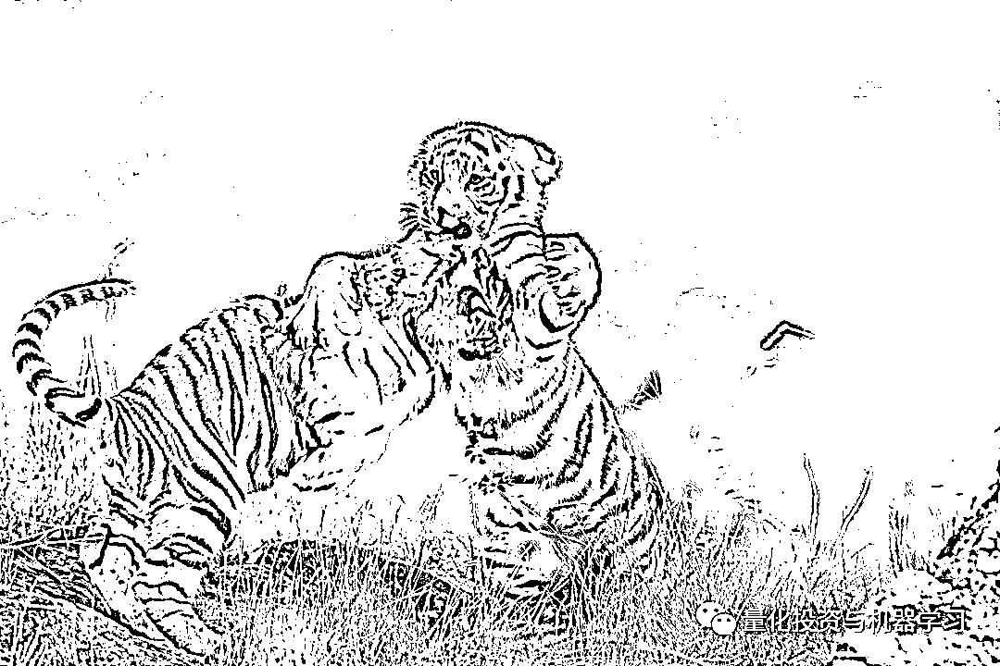
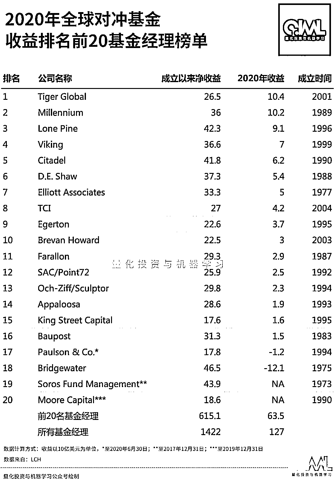
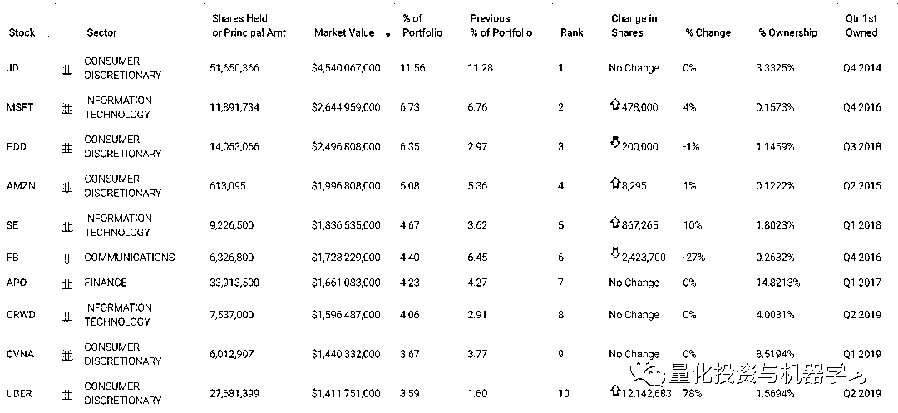

# Chase Coleman：『小虎队』的传奇！

> 原文：[`mp.weixin.qq.com/s?__biz=MzAxNTc0Mjg0Mg==&mid=2653314710&idx=1&sn=d7680810e9961818184c6c613b6794ab&chksm=802d9c83b75a15957c6717757ddc84ba28897911cb98593b67f493ac7c1d02da3a6a66dd4444&scene=27#wechat_redirect`](http://mp.weixin.qq.com/s?__biz=MzAxNTc0Mjg0Mg==&mid=2653314710&idx=1&sn=d7680810e9961818184c6c613b6794ab&chksm=802d9c83b75a15957c6717757ddc84ba28897911cb98593b67f493ac7c1d02da3a6a66dd4444&scene=27#wechat_redirect)

**作者：Stephen Taub、QIML 编辑部**

**老虎基金，QIML 相信很多读者首先想到的是其创始人 Julian Robertson 老爷子：**

****无冕之王，咆哮而来！****

****

***图片来自：网络**

**Julian Robertson 他所主导的基本面价值投资方法影响了华尔街一代的对冲基金经理。即使在今天老虎系的投资人也遍布整个华尔街，如今天我们介绍的 Tiger Global 的老大**Chase Coleman。****

****

***图片来自：网络** 

**向来从不与媒体或会议交谈的 Chase Coleman，最近向客户发送了一封长达 6 页的 20 周年纪念信。这封信回顾了 Tiger Global 过去的成就和错误，同时也展望了未来 20 年的发展机遇。Chase Coleman 的 Tiger Global Management 目前管理着大约 500 亿美元的资产，雇员超过 100 人。同时，Tiger Global Management 也由 43 岁的 Scott Shleifer 领导。**

**现年 45 岁的 Chase Coleman 不仅被认为是他那一代人中最优秀的对冲基金经理之一，更重要的是，他还是**小虎队（Tiger Cubs）**这一极少数精英团体的成员。小虎队是以前为 Julian Robertson 的 Tiger Management 工作的一群基金经理，其中有 Stephen Mandel jr、John Griffin、o.Andreas Halvorsen、Philippe Laffont 和 Lee Ainslie III。**

****

**Tiger Global Investments 是该公司的旗舰多空基金，20 年来的净利润率为 21% 。在过去 20 年里，投资于该基金初期的投资，扣除手续费后的净收益率为 43 倍，而同期投资于标准普尔 500 指数的收益率仅为 5 倍。该公司的长期基金 Tiger Global Long Opportunities 自 2013 年 10 月推出以来净利润增长了 22% 。**

**2020 年，Tiger Global 为投资者赚取了 104 亿美元，成为 2020 全球最赚钱对冲基金经理：**

****

**根据彭博亿万富翁指数榜（共 500 位）2021 年最新金融-对冲基金行业的排名中，Chase Coleman 也是在前十之列：**

****

**彭博 2020 年全球前 15 名对冲基金巨头的收入：**

****

**尽管如此，正如信里所描述的那样，2001 年 3 月并不是推出一只以科技为导向的对冲基金的绝佳时机。**

**Chase Coleman 当时只有 25 岁，在 Tiger Management 做分析师的经验只要几年而已。然而，除了个人的聪明才智及勤奋之外，不能忽略的是其投资导师 Robertson 对 Coleman 的提携。**

**2000 年，Robertson 创建的老虎基金在运转了 20 年后关闭，但 Robertson 并没有就此将有想法、有能力的年轻人拒之门外，而是努力为那些曾在他基金中工作过的年轻基金经理提供种子资本，创办新的基金公司，Coleman 就是当年众多“幼虎”中最为年轻的一个。**

**2001 年，得到资助的 Coleman 开始管理属于自己的基金，由于基金成立初期正值互联网泡沫破灭，专注于科技公司且刚刚起步的 Coleman 可谓出师不利。**

**Robertson2002 年秋天的一次采访中说道：“我不太相信科技”。不过，Robertson 在 2002 年还是接受了 Coleman 以科技为导向的策略。** 

**这封信指出，当时被称为 Tiger Technology 的 Tiger Global，是在互联网泡沫破灭后不久成立的。现在似乎不是创办一家老虎科技最合适的时机，但这是我们的机会，我们决定充分利用这个机会！**

***“如果你能够以 25 倍的市盈率购买一只股票，但你有信心这家公司在很长一段时间都能保持 20%以上的增长，这样的公司相比于只有 7 倍市盈率但未来增速可能只有 3%-5%的公司更有价值。投资者应该综合公司市盈率和增长前景来判断能否赚钱。”***

***——Robertson***

**信中也表示，Coleman 借鉴了 Robertson 的几条核心理念：*seeking to identify high-quality businesses levered to the most important secular growth trends while shorting poorly positioned companies on the wrong side of change.***

**信中也写道：“大部分利润来自对空头和大量多头股票的选择。”**

**Tiger Global 将其早期的成功部分归功于 Shleifer 在 2002 年选中的三家中国互联网公司：**新浪、搜狐、网易**。在当时这三家被称为“中国的 Yahoos”，到 2003 年中期，三家的价格都上涨了好几倍。**

**根据 iger Global Management2020 年第四季度提交的 13F 文件显示，持股最多的是京东（51650366 股）：**

****

**在 Tiger Global 也在私募股权基金这块大放异彩。成功入股 Facebook 以及向 LinkedIn 投资 3150 万美元就是他最成功的两个案例。其旗下首只私募股权基金 2003 年成立后，也开始瞄准中国市场，对优酷网的投资使其成为最早进入中国的美国风险投资基金之一。随后，当当网也成为了他的投资对象。2010 年 12 月，优酷网和当当网同时登陆纽约证券交易所，上市当日，优酷网股价大涨 161%，当当网也实现股价翻倍，Coleman 因此赚得盆满钵满。**

****如今，私募股权业务约占公司资产的一半。**近期比如与印度初创企业 Kutumb 就一笔 1500 万至 2000 万美元的融资进行谈判，估值为 1.7 亿美元等。**

**信中还表示：“我们很感激在互联网时代刚刚开始的时候就开始了我们的投资生涯。在想象一个连接互联网的新世界时，缺乏经验可能是一种优势，而我们的研究表明，市场领导者可以获得非常高的资本回报。”**

**Tiger Global 也承认过去 20 年的犯过的一些错误，比如在 2008 年金融危机期间拥抱银行和其他周期性股票。**

**目前，Tiger Global 主要关注美国、中国和印度的消费、企业和金融技术领域，表示这些领域**仍处于我们这一代经济主题的早期阶段**。**

**“在我们的职业生涯中，我们看到了一代又一代的技术进步为未来的变革奠定了基础，我们相信这种趋势正在加速。在高度确定的情况下，未来将会有更多的决策由机器智能自动化，从而提高效率，并进一步将数字系统嵌入我们的日常生活。”**

**在信中，Tiger Global 团队感谢 Robertson 对 Coleman 和他的团队持久的支持与信心的鼓励，以及他愿意在 Coleman 和他的团队身上冒险的意愿。多年来，Robertson 一直向他的小老虎们强调回馈社会的重要性，并以他的 Robertson 基金会和 Tiger 基金会为榜样。在这封信中，Tiger Global 宣布他们已经成立了 Tiger Global 慈善事业，承诺投资 2.2 亿美元用于消除不平等和贫困。**

**量化投资与机器学习微信公众号，是业内垂直于**量化投资、对冲基金、Fintech、人工智能、大数据**等领域的主流自媒体。公众号拥有来自**公募、私募、券商、期货、银行、保险、高校**等行业**20W+**关注者，连续 2 年被腾讯云+社区评选为“年度最佳作者”。**