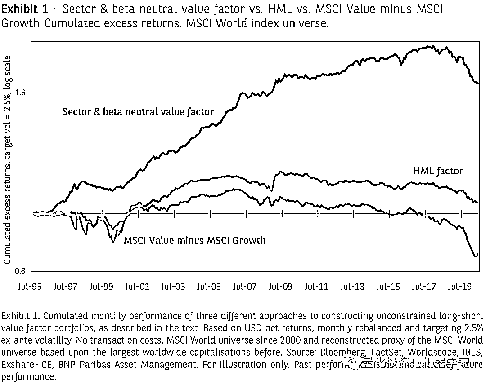
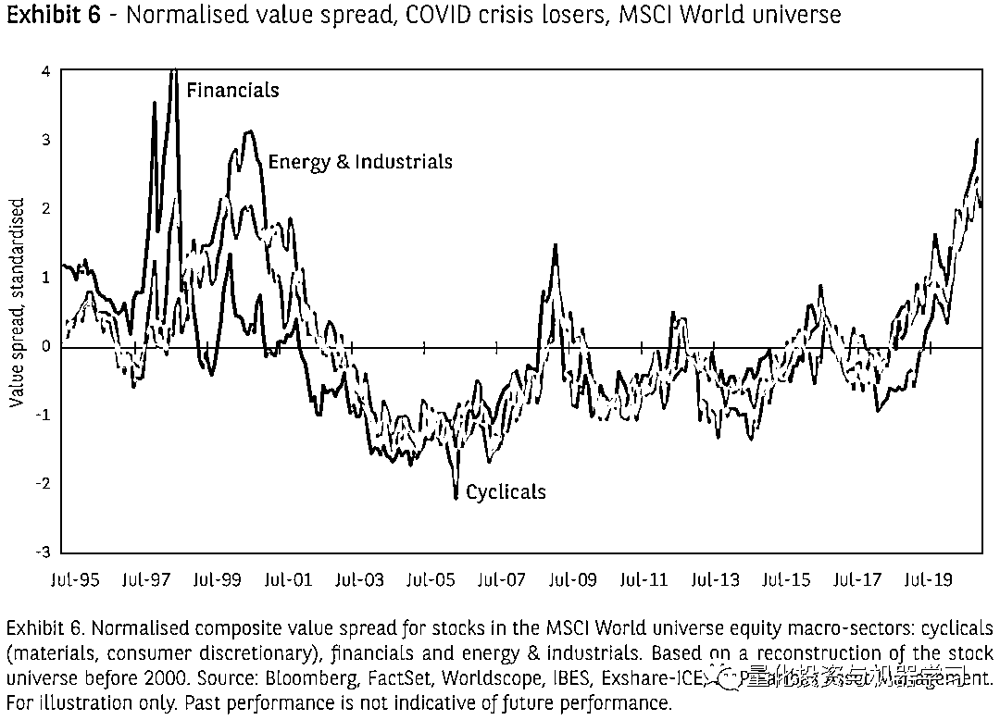

# 价值投资：投降还是机会？

> 原文：[`mp.weixin.qq.com/s?__biz=MzAxNTc0Mjg0Mg==&mid=2653314606&idx=1&sn=b8d4570c2dd4330cc7ba5713d41979d5&chksm=802d9c3bb75a152d8257c43a18d814d25fdcaf6c0fda6a74a81d953e6a69c6f07ea221d06787&scene=27#wechat_redirect`](http://mp.weixin.qq.com/s?__biz=MzAxNTc0Mjg0Mg==&mid=2653314606&idx=1&sn=b8d4570c2dd4330cc7ba5713d41979d5&chksm=802d9c3bb75a152d8257c43a18d814d25fdcaf6c0fda6a74a81d953e6a69c6f07ea221d06787&scene=27#wechat_redirect)

**来自：法国巴黎银行资管   **

**作者：Benoit Bellone、Raul Leote de Carvalho**

****核心观点****

*   **价值因子并未失效，Value Spread 在今年预期会收缩**
*   **基于 Value Spread 的因子择时策略，并不能跑赢非择时策略**
*   **基于行业及市场中性的价值投资策略的表现更优**

****价值股到底怎么了？****

**MSCI 世界价值指数能很好的代表价值股票的收益表现。这个指数主要选取了三个价值因子（预期 EP 和股息率）和五个成长因子。这个指数里的股票由**最不具有成长性**的价值股组成。相反，MSCI 成长指数则囊括了**最不具有价值性**的成长股票。这两个指数互相补充，并且都不是行业中性的。MSCI 价值指数中信息技术行业的股票权重较小（这个行业的股票估值都比较高），而金融业的股票权重比较大（这个行业的股票估值比较低）。**

**在图 1 中展示了 MSCI 价值指数与成长指数的收益之差（价值指数-成长指数）。这两个指数相对于 MSCI 世界的超额收益是明显负相关的。我们可以看到从 2007 年以来，价值指数就持续跑输成长指数。图中浅蓝色的线是 Fama 三因子模型中 HML 因子收益的曲线，整体走势和 MSCI 价值指数与成长指数收益差非常类似，自 2007 年以来价值股票也持续跑输成长股。**

****

**以这两条非行业中性的收益曲线代表近年来价值股的表现，就不奇怪为什么大家会对价值投资感到失望了，更有很多投资者开始怀疑价值投资的可靠性。**

**然而，正如 Bellone 等（2020）所阐述的，从会计的角度，我们应该以更多的维度来度量一家公司的基本面价值。我们甚至应该从权益和债权方面全面考虑一家企业的融资资源，我们应该考虑的是公司的企业价值，而不仅仅是它在资本市场的市值。**

**Leote de Carvalho 等（2017）所阐述的，**避免投资组合的行业暴露和 Beta 暴露并控制组合的整体风险是显著提高价值策略表现的有效方法**。图 1 中的绿线是我们按照这个建议构建的行业中性的价值投资策略的收益曲线。它之所以能够在 2018 年之前大幅优于图中其他两条价值投资的收益曲线，主要原因是我们进行了**行业及 Beta 暴露的中性化处理，且把组合的波动持续控制在一定范围内。****

**该稳健的价值策略自 2018 年开始表现平平，特别是 2020 年 3 月以来，由于新冠疫情的影响，策略的表现更加糟糕，这与过去 30 年的表现非常不一致。有趣的是，如图 2 所示，在回撤的速度和深度上，该策略的表现与我们在 2000 年看到的美国价值股票的下跌相似。然而，这一次，自 2020 年初冠状病毒大流行危机开始以来，在所有考虑的地区，价值股票表现不佳的情况加剧，自 2020 年 3 月股市触底以来继续下跌。**

****

 **这是否标志着价值投资的终结？我们不这么认为。正如我们将在下面的段落中看到的，近期价值型股票相对于高估值股票的表现不佳，是因为价格偏离了基本价值。无论在哪里，现在的价格与基本价值的差距，都与 2000 年科技泡沫顶峰时的水平相当。我们不认为这一趋势有太大的继续空间。我们相信，预期股价向基本价值趋同仍是一种明智的投资理念，也是未来几年可能出现的趋势。**

****Value Spread 达到了科技泡沫以来的最高水平****

**现在让我们来研究一下**股票价格相对于基本价值的表现**。为此，我们创建了一个度量 Value Spread 的合成指标，该指标由多个估值因子计算而来，包括 BP、Tangible BP、自由现金流收益率及 EBITDA/EV 和预期 PE。**

**为了计算以上每个因子的 Value Spread：**

**我们首先根据该因子对所有股票进行排名，并将它们分成五分位。然后，我们计算每个股票五分位数的因子中值（在以 1%的 winsorization 后）。该因子的 Value Spread 就为第五分位和第三分位的中位数之间的对数差，再减去第三分位和第一分位的中位数之间的对数差，再对以上的差值做 Z-Score 标准化处理。**

**具体如下公式所示，计算完各因子的 Value Spread 之后，合成的 Value Spread 指标就是各因子 Value Spread 的均值。**

###### **<embed style="vertical-align: -2.544ex;width: 46.233ex;height: auto;max-width: 300% !important;" src="https://mmbiz.qlogo.cn/mmbiz_svg/a18XcQ1EBBggIibBXCZoqdjLqRm8ZPVeX1XecWtrox0wA7GgJOYsxrX3mK9Unj5g1c17GnQJGHFwrKSIfPkBWmKbtKXAALR80/0?wx_fmt=svg" data-type="svg+xml">**

**图 3 中，我们展示了 MSCI 世界指数成分股的合成 Value Spread。在 1998-2000 年、2007-2009 年和 2018-2020 年三个时期，Value Spread 出现了扩张；在 2011-2012 年和 2015 年，Value Spread 出现了较温和的增长。自 2018 年以来，Value Spread 出现了超过三个标准差扩张冲击，仅可与我们在上世纪 90 年代末科技泡沫期间目睹的情况相媲美。我们在美国和欧洲发现了类似的情况，如图 4 所示。上述三个地区，最近在股票价格偏离基本价值的速度和水平只有在科技泡沫时期才见过。**

****

****

**接下来我们讨论的五个板块（注：分成了两部分，IT&通信和防御性板块（消费必需品、医疗保健和公用事业股））的 Value Spread。为此，我们只考虑全球发达国家的股票。2020 年底，IT 板块的股票的 Value Spread 略高于 2000 年的峰值水平，比历史均值高出三个标准差以上。对于防御性板块的股票（消费必需品、医疗保健和公用事业股），其 Value Spread 也处于极高水平，距离历史均值超过两个半标准差。**

**在图 6 中，我们展示了更有可能遭受 2018-2020 年周期性衰退影响的板块的 Value Spread。同样，周期性板块（材料、非必需消费品）、金融板块以及能源和工业板块的 Value Spread 在 2020 年秋季达到了极端水平，比历史均值高出了两个半标准差。**

****

****

**综上所述，近期价值股的糟糕表现是由于价格偏离基本价值且 Value Spread 达到了历史峰值，无论在全球那个区域或者任何一个板块，这种情况都非常普遍。**

****什么驱动了 Value Spreads？****

**通过实证分析可以看出，我们对 Value Spread 的定义接近 Hanauer 和 Blitz(2020)的定义。然而，随着我们的定义,很容易将 Value Spread 分解为两项，一项是 Q3 与 Q1 分位数股票的 Value Spread，表示价值较低股票与价值相对公允的股票的 Value Spread；另一项是 Q5 与 Q3 分位数股票的 Value Spread，表示价值较高股票与价值相对公允的股票的 Value Spread。**

****

****忽略价值因子会有什么风险？****

**从表 1 可以看出，越来越多的投资者正在试图减少他们投资组合中价值股票风险敞口，这并不奇怪。然而，考虑到我们对 Value Spread 的分析，在 2021 年初投资价值股的风险有哪些?**

**在表 1-A 中，我们展示了基于之前对价值因子构建的稳健型行业市场中性策略，对价值、质量、动量及低风险因子都做了类似的策略构建，成分股都是 MSCI 世界指数。每种风格都是一些最常用因子的简单组合。对于价值，我们使用远期市盈率、自由现金流收益率和经营现金流(财务净收入)对企业价值的比率。在质量因子方面，我们使用了资本回报率、资产的自由现金流和应计项目，偏好低应计项目。为了低风险因子，我们使用了每只股票三年的历史波动率。至于动量因子，我们使用了一种衡量股票历史中期回报率和盈利分析师修正后收益的方法。我们还基于以上四个因子，构建了一个等风险加权的多因子策略。为了更清楚的对比，我们还包括一个小规模因子。**

**我们把图 7 中灰色部分作为 Value Spread 扩张期，白色部分作为 Value Spread 收缩期。并对以上 6 个因子（价值、质量、低波动、动量、复合及小规模）在三个不同时期（扩张、收缩及全部）的收益指标（信息比率）进行计算和分析，相关结果接下表 1-A。在表 1-B 中，我们采用更传统的因子收益的计算方法（如 Fama 三因子模型），没有考虑市场及行业中性化。**

**从表 1-A 及 1-B 可以看出：**

*   **在 Value Spread 扩张时期（收缩时期），价值因子的表现逊于（优于）其历史平均，并超越了所有风格因子。**

*   **在 Value Spread 收缩（扩张）期间，动量因子的表现逊于（强于）历史均值和其他风格因子。**

*   **质量和低波动性因子以及多因子组合在 Value Spread 收缩或扩张中都表现得同样好。**

*   **通过 Value Spread 进行因子择时的收益很难超过多因子组合的收益。**

*   **在 Value Spread 收缩期，市场风险调整后的回报更高。**

*   **未进行市场及行业中性化的收益整体小于经市场行业中性化调整的收益。**

****

****总结****

**价值投资死了吗？正如本文所解释的，我们并不这么认为。**近期价值型股票表现不佳，可以用 Value Spread 的显著扩大来解释，在所有地区和所有行业，股价正在偏离基本价值。****

**充分分散化的行业中性和 beta 中性多因子策略在两种 Value Spread 变化的情况下往往表现更好。基于 Value Spread 变化来进行因子择时的策略很难超越这种基于等风险加权的多因子组合。**

**鉴于目前的 Value Spread 处于科技泡沫顶峰时期的水平，我们预计未来几年将出现一段 Value Spread 收缩期。现在向价值因子投降可能会付出高昂的代价。**多因子策略也倾向于在 Value Spread 收缩时期表现良好，无论其复杂程度如何。因此，我们不仅对价值型股票的可能表现感到乐观，而且对多因素策略的表现也感到乐观。****

****参考文献****

**1、Arnott, R.D., Li, F., Sherrerd, K.F. “Clairvoyant Value and The Value Effect” Journal of Portfolio Management, Vol. 35, N° 3, (2009)**

**2、Bellone, B., Leote de Carvalho, R., Lu, X., Moulin, P. “Equity Factor Investing: Historical Perspective of Recent Performance.” SSRN Working paper, 3712113, (2020)**

**3、Blitz, D., Hanauer, M.X. “Resurrecting the Value Premium”. SSRN Working paper, 37052218, (2020)**

**4、Easton, P., Harris, T., Ohlson, J. “Aggregate Accounting Earnings Can Explain Most of Security Returns: The Case of Long Return Intervals.” Journal of Accounting and Economics, Vol. 15, (1992)**

**5、Fama, E., French, K. R. “The Cross-Section of Expected Stock Returns.” Journal of Finance, Vol 47, Issue 2, (1992)**

**6、Leote de Carvalho, R., Lu, X., Soupe, F., Dugnolle, P. “Diversify and Purify Factor Premiums in Equity Markets.” in Factor Investing: From Traditional to Alternative Risk Premia, Elsevier ScienceDirect (2017)**

**7、MSCI, “MSCI Global Investable Market Value and Growth Index Methodology”, (2021).**

**8、Richardson, S., Sloan, R., You, H. “What Makes Stock Prices Move? Fundamentals vs. Investor Recognition.” Financial Analysts Journal, Vol. 68, (2012)**

**量化投资与机器学习微信公众号，是业内垂直于**量化投资、对冲基金、Fintech、人工智能、大数据**等领域的主流自媒体。公众号拥有来自**公募、私募、券商、期货、银行、保险、高校**等行业**20W+**关注者，连续 2 年被腾讯云+社区评选为“年度最佳作者”。**