# 因子投资看抱团

> 原文：[`mp.weixin.qq.com/s?__biz=MzAxNTc0Mjg0Mg==&mid=2653314492&idx=1&sn=d262d2791e20f2ff0694a6720d892ceb&chksm=802d9fa9b75a16bf3d17fe8b14490eee7720217e26f6cc74180209b4bc41060773c889454e79&scene=27#wechat_redirect`](http://mp.weixin.qq.com/s?__biz=MzAxNTc0Mjg0Mg==&mid=2653314492&idx=1&sn=d262d2791e20f2ff0694a6720d892ceb&chksm=802d9fa9b75a16bf3d17fe8b14490eee7720217e26f6cc74180209b4bc41060773c889454e79&scene=27#wechat_redirect)

****作者：BetaPlus 小组****

****前不久，Robeco 发表了一篇很有意思的文章[1]，讨论过去两年因子投资在美股的窘境，其中一幅图非常震撼（见图 0），核心结论如下：****

*   ****从 2018 年到 2020 年，主流因子表现均不是很好，尤其是价值因子一塌糊涂；****

*   ****买大市值且高估值股（mega & growth）[2]是唯一能够获取超额收益的方法；****

*   ****脱离了大盘成长股，盈利和动量因子一无是处；****

****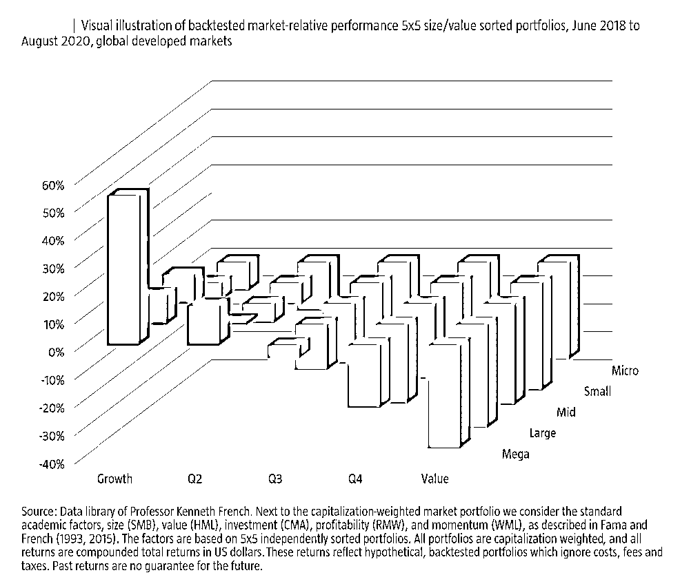****

****数据来源：Blitz (2021)，美股市场价值和市值 5×5 分组超额收益率****

****有趣的是，A 股像是一个平行宇宙，和美股的情况非常类似。图 1 展示了 BetaPlus 指数累计表现，从中可以看出，虽然各个因子长期来看均有溢价，但没有一个因子能够稳定盈利；风水轮流转，最近几年低估值、低波动、小市值和高股息比较落魄，高盈利、高动量和高增长一骑绝尘。以茅指数为代表的抱团股，可以肯定地说，在高估值、大市值、高盈利和高动量等方向，有比较高的暴露。****

****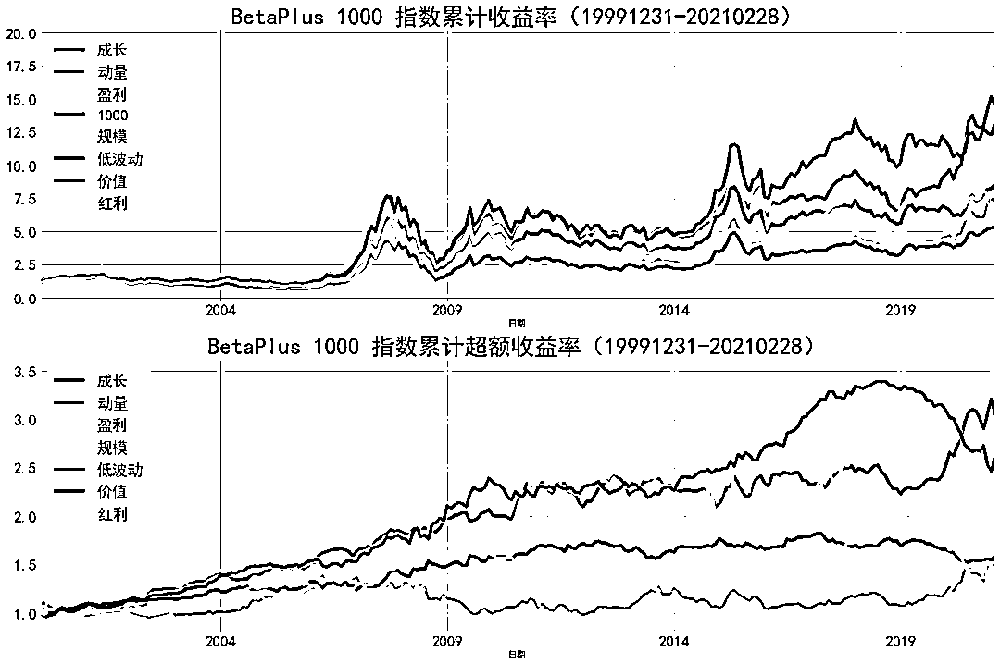****

****数据来源：BetaPlus 小组****

## ******Double Sort******

## ****接下来，进行独立的 Double Sort，看看这几年到底什么因子在赚钱。****

## ****具体过程为，每个月月末，在研究范围内[3]，分别按照总市值和 X 变量将股票分为 5 组，两者交叉共得到 5×5 个组合，每个组合按照市值进行加权。这里 X 包括盈利因子得分、价值因子得分、低波因子得分、动量因子得分和增长因子得分，每个得分所用指标和构造方法均与 BetaPlus 指数相同。****

## ****表 1 展示了分组测试的年化超额收益率[4]，其中左边表测试区间为 2000 年 1 月-2021 年 2 月，右边表的测试区间为 2018 年 7 月-2021 年 1 月[5]。从全历史来看，无论是哪个市值分组，每个因子多头组合（低估值、高质量、低波动、高动量和高增长）均能获得正的超额收益率，这和已有的认知一致；从 2018 年 7 月开始，分组收益率和常识发生了冲突，包括：****

*   ****从估值来看，只有高估值且大市值能够获得正的超额收益率；****

*   ****高质量和高动量组合，几乎只有在大市值中才有利可图；****

*   ****低波动和高增长没啥搞头，相反高波动和低增长反而占优；****

****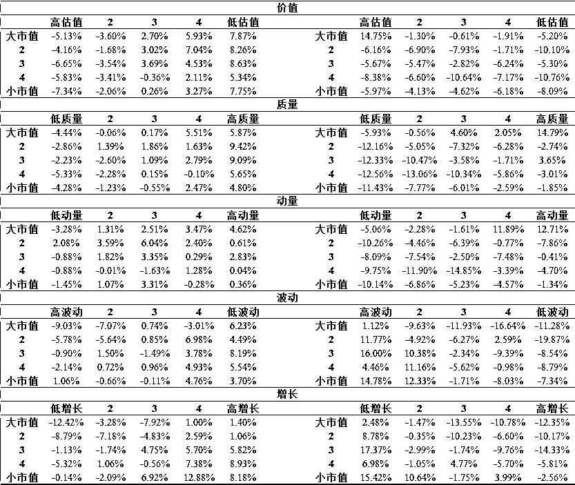****

****数据来源：BetaPlus 小组，表 1 Double Sort 分组超额收益率****

## ******Mega & Growth******

****表 1 中比较魔性的一点是，只有大市值且高估值（Mega & Growth）才能在过去两年获得超额收益，其他组合方式全部跑输大盘，如图 2 所示。****

****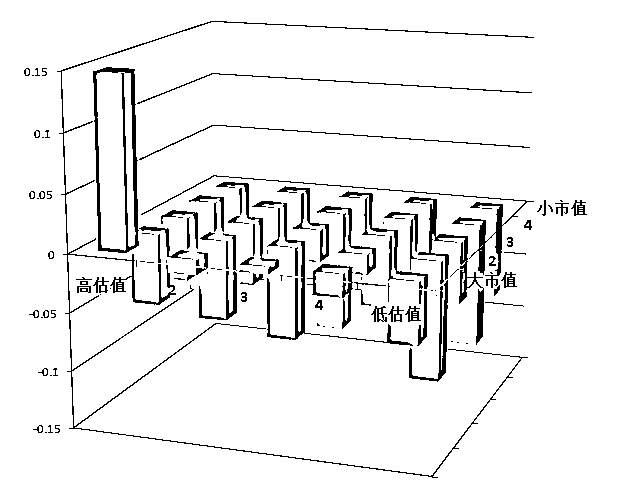****

****数据来源：BetaPlus 小组，图 2 价值和市值 5*5 分组超额收益率****

****那么，高动量&大市值，以及高盈利&大市值两个组合，是不是仅仅是大市值且高估值的影子呢？图 3 展示了近两年月度超额收益率的散点图，两对组合的相关系数分别为 0.82 和 0.71，表明它们确实极度相似。****

****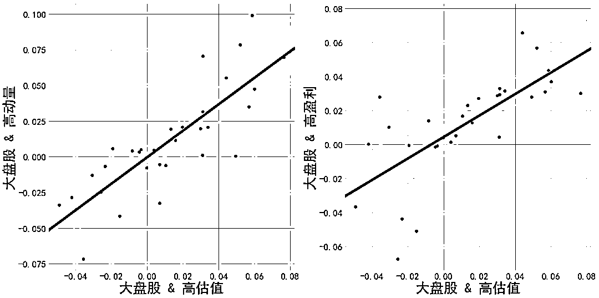****

****数据来源：BetaPlus 小组，图 3 月超额收益率散点图****

****分别以高动量&大市值和高盈利&大市值为因变量，Mega & Growth 为自变量进行回归，结果见表 2。可以看到，两个组合的阿尔法非常小，并不显著；也就是说，看起来有多个组合在这两年表现还行，实际上它们是“一个”组合。****

****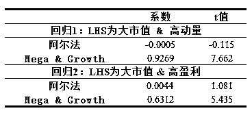****

****数据来源：BetaPlus 小组，表 2 分组收益率回归分析****

## ******抱团基金******

****过去两年，除了一些特定行业基金，如果想要明显跑赢指数，多多少少会在 Mega & Growth 上有些暴露。所谓的基金抱团，其实就是 Mega & Growth 风格。大市值流动性好，能够容纳不断进场的资金，与此同时，持仓股票估值也不断水涨船高，由此形成一个正反馈。****

****下面选择了三个公认的抱团股基金[6]，分析它们的持仓风格和业绩表现。****

****图 4 展示了三个抱团基金持仓风格暴露变化，从中可以看到几个明显的特征。首先，三个基金在大市值上均有极高的暴露，表明它们非常钟爱大票；其次，它们在价值上的暴露的接近 0 甚至为负，说明估值已经不是它们选股的主要依据；另外，在动量和盈利上，它们的暴露也为正，表明这些基金偏好基本面好和股价强势的个股。****

****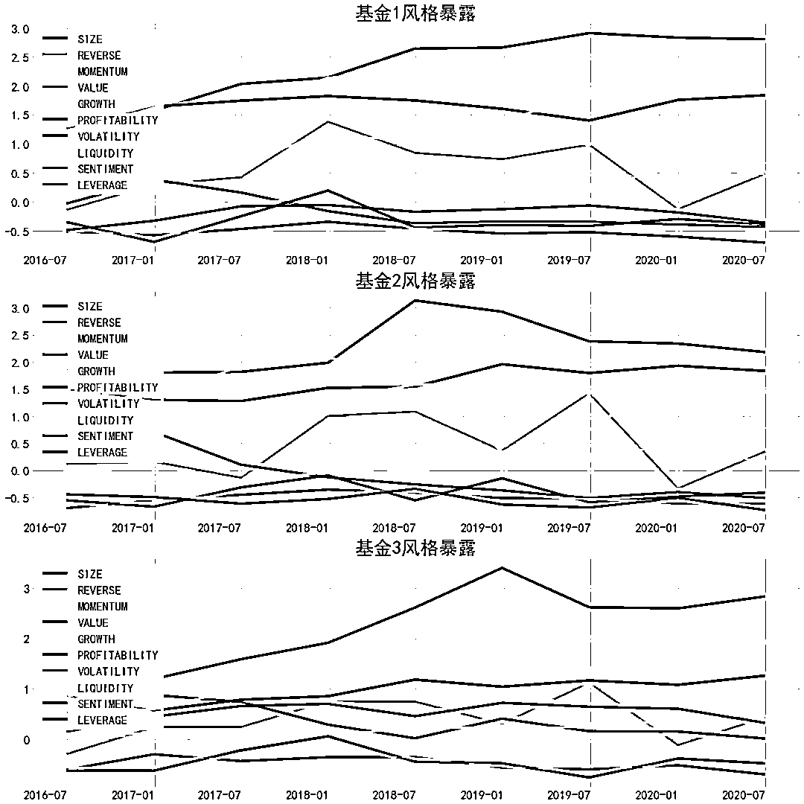****

****数据来源：BetaPlus 小组，图 4 抱团基金风格暴露****

****图 5 展示了三个基金和 Mega & Growth 组合月收益率的散点图，表 3 是回归模型结果。可以看到，三个基金月收益率和 Mega Growth 高度相关，阿尔法虽然数值较大，但并不显著。****

****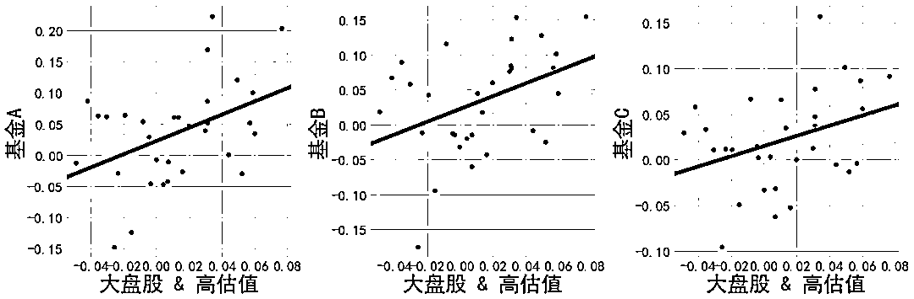****

****数据来源：BetaPlus 小组，图 5 抱团基金月超额收益率散点图****

****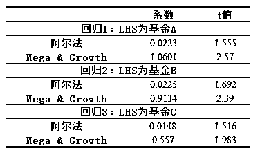****

****数据来源：BetaPlus 小组，表 3 抱团基金回归分析****

## ******北向资金******

****除了抱团公募基金，北向资金由于机构占比较高，也往往被视为“聪明钱”。以“北向持仓市值占流通市值比（一个月均值）”作为买入强度指标，值越大代表北向资金越看好。按照该指标将股票分为 5 组，第 5 组表示强烈看好，第 1 组表示一般看好，市值加权，月度换仓。图 6 展示了分组累计收益率，第 5 组表现比较亮眼，表明北向资金追逐的股票，确实在过去几年收益颇丰。****

****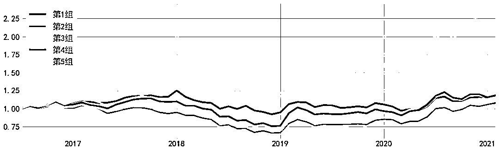****

****数据来源：BetaPlus 小组，图 6 北向资金指标分组收益****

****接下来看看第 5 组的风格暴露，见图 7。和抱团公募基金一样，北向重仓股也呈现大市值、中高估值和高盈利的特征。以第 5 组收益率为因变量，Mega & Growth 为自变量进行回归，阿尔法为 1.75%，t 值为 1.695。****

****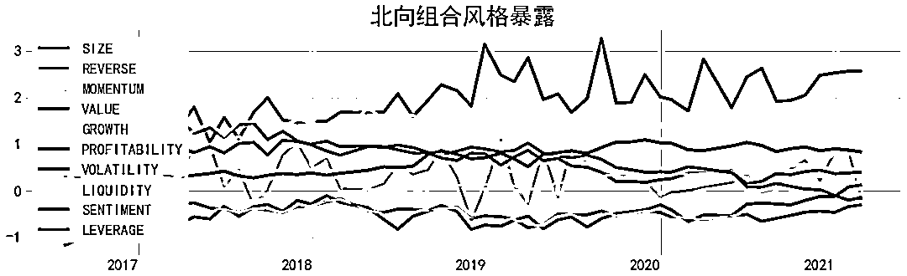****

****数据来源：BetaPlus 小组，图 7 北向抱团股风格暴露****

## ******拉长来看******

****如果 Mega & Growth 能够获得正的超额，理性的选择肯定是尽情暴露。事实上，大市值和高估值，长期并不能获得溢价。根据 Fama-French 三因子模型，长期来看，小市值能战胜大市值，低估值能战胜高估值，如图 8 所示。****

****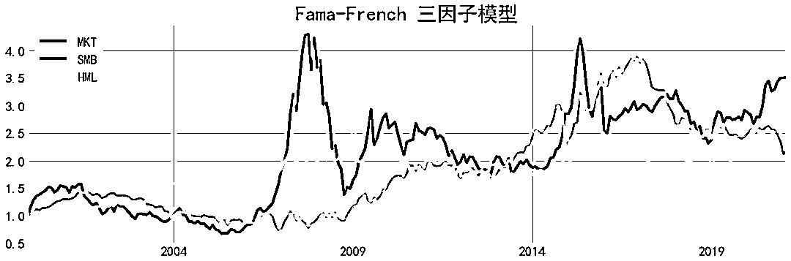数据来源：BetaPlus 小组，图 8 A 股 Fama-French 三因子模型****

****相反，Mega & Growth 长期来看会远远跑输市场基准。如图 9 所示，从 2000 到 2019 年，Mega & Growth 组合绝对收益几乎为 0，远不及市场基准的表现；分年来看，在绝大多数年份，很难跑得过市场基准，也只有在 2019 和 2020 年，像是吃了兴奋剂一样。**** 

****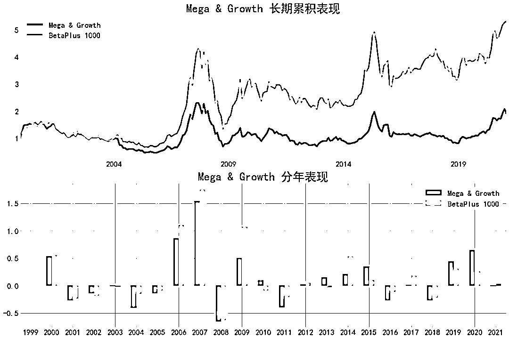****

****数据来源：BetaPlus 小组，图 9 Mega & Growth 长期表现****

## ******总结******

****大量实证表明，因子的长期风险溢价水平均在人们认知理解的范畴之内。因此，对于真实的因子，如果它在短期内的条件溢价过高，则意味着它未来一段时间的条件溢价会更低。而对于非真实的、长期来看没有概率优势的因子，如果它在短期内的条件溢价过高，那就更需提防。****

****本文从因子投资的角度，分析了过去两年的抱团现象。表现好的抱团基金和北向资金，或多或少在大市值和高估值上暴露明显。可以说，如果笃信因子投资，过去两年十分煎熬痛苦，信仰不断受到冲击；拉长了看，大市值和高估值不可能持续跑赢，因子投资需要的就是信仰。****

******参考文献******

****1、Blitz, D. (2021). The Quant Crisis of 2018-2020: Cornered by Big Growth. Journal of Portfolio Management, forthcoming.； ****

****2、这里 growth 是高估值的意思，而不是代表“基本面增长”；****

****3、所有 A 股，剔除掉 ST、次新股、待退市股和净资产为负的股票，就构成了本文的股票池；另外，在构造组合时，停牌股、涨停和跌停的股票，也剔除； ****

****4、市场基准为 BetaPlus 1000 指数； ****

****5、从 2018 年 7 月开始，价值因子开始持续走弱，因此分析从这里开始； ****

****6、这里隐去具体基金名称，好奇的小伙伴，可以私信 BetaPlus 小组； ****

****量化投资与机器学习微信公众号，是业内垂直于**量化投资、对冲基金、Fintech、人工智能、大数据**等领域的主流自媒体。公众号拥有来自**公募、私募、券商、期货、银行、保险、高校**等行业**20W+**关注者，连续 2 年被腾讯云+社区评选为“年度最佳作者”。****