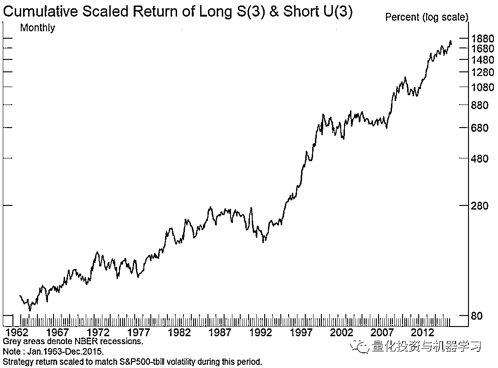
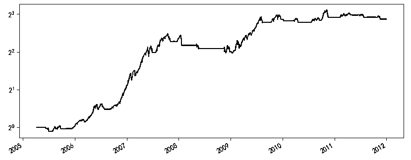
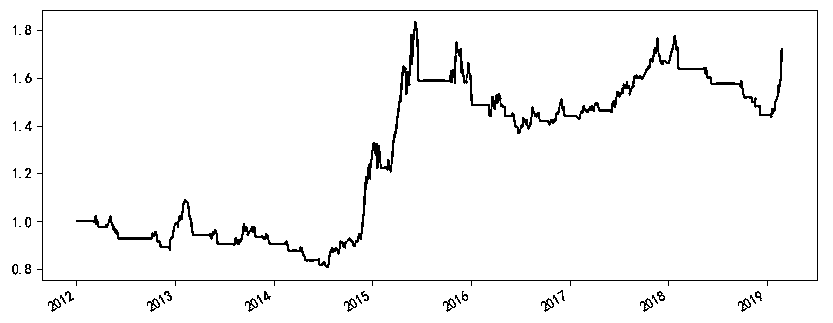

# 机器学习时代下的 7 个量化研究准则！

> 原文：[`mp.weixin.qq.com/s?__biz=MzAxNTc0Mjg0Mg==&mid=2653314236&idx=1&sn=908c0e00ce97b60359b9167107608e0e&chksm=802d9ea9b75a17bfc3bcf87169511a930867539ff3721a7421a920efccd2313f3be27c71cd73&scene=27#wechat_redirect`](http://mp.weixin.qq.com/s?__biz=MzAxNTc0Mjg0Mg==&mid=2653314236&idx=1&sn=908c0e00ce97b60359b9167107608e0e&chksm=802d9ea9b75a17bfc3bcf87169511a930867539ff3721a7421a920efccd2313f3be27c71cd73&scene=27#wechat_redirect)

**量化投资与机器学习公众号独家解读**  

Journal of Financial Data Science 的一篇题为《A Backtesting Protocol in the Era of Machine Learning》的论文可谓是大佬云集，作者是 Rob Arnott、Campbell Harvey 以及 Harry Markowitz。

Research Affiliates 创始人和董事长：Rob Arnott

The Journal of Portfolio Management （简称：JPM）2020 年度 Quant 大奖获得者：Campbell R. Harvey

Harry Markowitz：如果各位连马老爷子都不认识，那就退出金融圈吧！

在这篇文章中，三位作者从七个方面提出了新时代下进行量化研究时应该遵循的一些准则，从而最大化的降低数据挖掘和过拟合的影响。这七方面构成了一个完整且可操作的体系，能够帮助我们更好的规避样本内的虚假信号、找出能在样本外更有效的交易策略。

**1、研究动机**

*   **模型是否有可靠的经济含义解释？**

*   **在进行研究之前是否存在经济解释或假设？**

实证研究经常为理论的发展提供基础。考虑实验物理学和理论物理学的关系。实验物理的研究人员测试并检验现有理论。理论物理学家经常利用实验物理的结果来建立更好的模型。这一过程与科学方法的概念是一致的。提出了一个假设，实证检验试图寻找与假设不一致的证据，即所谓的可证伪性。

这个假说提供了一个规则，可以减少过拟合的机会。重要的是，这个假设需要有一个逻辑基础。例如，下图中的 alpha-bet 多空交易策略没有任何理论基础，更不用说先验假设了。

这个策略令人难以置信！

基于数据挖掘的股票策略：**基于股票代码中的字母形成投资组合。**

**A(1)-B(1)表示：做多所有以“A”为首字母的股票，做空所有以“B”为首字母的股票，等权。**下图的策略考虑了股票代码前三个字母的所有组合，表示为 S(3)-U(3)，效果却出奇的好

大家也可以尝试一下大 A 股，看看有没有类似的效果~

虽然这看起来很荒谬，但这在数据挖掘和机器学习中有重要的借鉴意义。

研究人员在没有事前经济假设的情况下开始实证调查，从而引发未来的问题。首先，如果没有事先的经济假设，就连考虑模型或变量都是低效的。其次，无论结果如何，如果没有一个可靠的经济含义解释，研究人员将模型应用到真实交易时，失效的可能性会很大，这是机器学习的缺点之一。

另一个微妙之处在于: 在医学等其他学科中，研究人员往往没有一个预先指定的理论，而数据探索在塑造未来的临床试验中至关重要。这些试验为研究人员提供了真正的样本外数据。在金融和经济领域，我们没有条件去创建一个大规模的样本外测试。因此，将这种探索性方法在金融和经济领域是危险的。我们可能不会危害客户的健康，但我们会危害他们的财富。这与机器学习方法尤其相关，**机器学习方法是为数据更丰富的学科开发的**。

**2、多重检验和统计方法**

*   **研究人员是否有跟踪所有尝试过的模型和变量（包括成功的和不成功的），是否意识到多重检验的问题？**

*   **如果使用了互动变量，是否对所有可能的互动变量进行了完整的统计？**

*   **研究人员是否检验了列出的所有变量，还是一旦找到一个好的模型，他们就立即停止了研究？**

给定 20 个随机选择的策略，其中一个可能由于偶然因素而超过 2Sigma 阈值（t 统计量 2.0 或以上）。因此，如果测试了多个策略，那么 2.0 的 t 统计量就不是一个有意义的基准。跟踪尝试过的策略的数量是至关重要的，同时也要衡量它们之间的相互关系。对于相对不相关的策略，则采用更大的阈值惩罚。例如，如果测试的 20 个策略相关度接近 1.0，那么这个过程相当于只尝试一个策略。

假设研究人员从 20 个变量开始，并通过一些互动变量（变量 1 x 变量 2）和（变量 1 x 变量 3）进行实验。这种单一的互动不会转化为 22 个测试（最初的 20 个，加上两个额外的互动变量），而是转化为 190 个可能的互动。

另一种考虑这个问题的方法是假设（在一个单一的环境中）研究人员编制了一个包含 20 个变量的列表来测试预测能力。第一个研究人员只做了一个测试就停止了，因为他发现了第一个变量就是有效的。可运气太好了。另一个研究人员也他有相同的 20 个变量，却以不同的顺序进行测试，只有最后一个变量有效。在这种情况下，2sigma 的发现将被丢弃，因为对于 20 种不同的测试，2sigma 的阈值太低了。

**3、数据和样本选择**

*   **筛选来的数据是否有意义？如果有其他数据，排除这些数据是否有意义？**

*   **研究人员是否采取措施确保数据的完整性？**

*   **数据转换（标准化）有意义吗？它们是提前选定的吗？最后结果是否对这些转换中的细微变化具有鲁棒性？**

*   **如果异常值被排除，排除规则是否合理？**

*   **如果数据被 winsorized（处异常值的一种方法），是否有很好的理由这样做？winsorization 规则是在研究开始前选定的吗？是否只尝试了一种 winsorization 规则（而不是很多）?**

训练样本需要事先验证。研究开始后，样本不应该改变。例如，如果样本开始于 1970 年，假设模型有效，但如果样本开始于 1960 年，这种情况下，模型就不起作用了。一个极端的例子是删掉全球金融危机、科技泡沫或 1987 年的市场崩溃的数据，因为它们损害了模型的预测能力。**研究人员不能篡改数据，使模型工作！**

**确保数据质量。**有缺陷的数据会使研究人员误入歧途。对数据的任何统计分析都只取决于输入数据的质量，垃圾进，垃圾出！特别是在某些试图捕捉非线性的机器学习应用中。考虑到现在数据集的规模，**在使用机器学习技术开发投资模型之前对数据进行清理是至关重要的！**

对输入数据进行清洗（例如标准化）需要被记录下来，最好提前决定选用哪种。此外，结果是否对这些转换中的细微变化具有鲁棒性？例如，给定 10 个不同的 volatility scaling 去选择，如果研究人员选择的是表现最好的那个，这就是一个危险信号。

**不要随意排除异常值。**异常值是模型的有影响力的观测值。包含或排除有影响力的观测结果可以决定模型的成败。理想的情况是，在估计模型之前，应该为排除提供一个可靠的经济理由。一般来说，任何有影响力的值都不应该被删除。假设观测是基于有效数据，模型应该解释所有的数据，而不仅仅是被选量的观测。

**在建立模型之前选择 Winsorization 级别**。经过筛选的数据在某个阈值被截断（例如，将截断异常值到 1%或 2%的尾部），而不是被删除。Winsorization 是一个有用的工具，因为异常值可以对任何模型产生巨大的影响。但是，在构建模型之前，应该先决定是否进行筛选，以及筛选的级别。一个错误研究的明显标志是，模型在 5%的 Winsorization 上有效，但在 1%的上失败，然后选择 5%。

**4、交叉验证**

*   **研究人员是否意识到真正的样本外测试只有在真实交易中才可能？**

*   **是否有适当的步骤来消除样本外“迭代”的风险（即样本内模型后来被修改以适应样本外数据）?**

*   **样本外分析是否代表真实交易？例如，是否考虑了交易成本和数据修正?**

对于预留出来的样本外数据，它们也是已经发生过的历史。**尽管模型将它们视作样本外，但由于我们经历了那段历史，知道在那段时间市场是如何发展的（什么时候涨、什么时候跌），会不可避免的把领先变量和这些历史经验联系起来。**正是由于这个原因，历史数据中并没有真正的样本外，只有实盘交易才是真正的样本外。

一个更好的样本外是基于新发现的历史数据，例如一些研究人员试图将美国基础数据的历史数据库回填到 20 世纪 20 年代（1920s）。可以合理地假设这些数据没有被挖掘，因为这些数据以前不是以机器可读的形式提供的。但是要小心。尽管以前没有这些数据，但资深的研究人员知道历史是如何发展的，宏观经济事件是如何与市场波动相关联的。对于那些精通市场历史的人来说，这些数据只是他们自身经验和塑造他们先验假设的样本。即使对那些知识不那么渊博的人来说，今天的传统智慧也是来自过去的事件。

在不同环境中应用该模型是个好主意，但应谨慎行事，因为各国之间都存在相关性。例如，一种数据挖掘的（可能是假的）异象在美国市场的某个特定样本上有效，在加拿大或英国的同一时间段内也可能有效，因为这些市场之间存在相关性。

假设一个模型在样本期内是成功的，但在样本期外失败了。研究人员发现，这个模型由于一个特定的原因而失败了。研究人员对初始模型进行修改，使其在样本中和样本外都能工作。这已经不再是一个样本外测试了。

石川博士之前写过一篇文章，也是针对这点做了一些自己的见解[《所有历史数据都是样本内》](https://mp.weixin.qq.com/s?__biz=MzIyMDEwNDk1Mg==&mid=2650878785&idx=1&sn=6df2c7e02b2f3cf0e1482d6319988c79&scene=21#wechat_redirect):

我们构建策略靠的不是站在回测起点往后看的先见之明，而是站在回测终点往前看的后见之明。所有历史数据都是样本内。

**1、Out of Sample is Not Really Out of Sample.**

举个例子。在因子选股中，我们通常会用 PE、ROE、EPS 等指标来选股，并按照各种逻辑 —— 比如动量或者估值 —— 进行难如登天的因子择时。在择时的时候，我们会非常小心的使用滚动窗口外推，利用 point in time 数据来避免 look-ahead bias（前视偏差）。但无论是在全部回测期内多因子选股，还是使用滚动窗口在“样本外”做因子择时，这背后无法否认的事实是我们已经知道 PE、ROE、EPS 在过去整段历史时间内是有效的！

我们并不是在 10 年前就预见到了 PE、ROE、EPS 会有效并在过去的 10 年里使用它们；而是在已经知道市场在过去 10 年是如何展开的前提下，通过 empirical data analysis 找到了 PE、ROE、EPS 这些好使的因子然后再去对着它们回测。扪心自问一下，如果一个因子在回测期内的表现是近似随机的，我们会用它来做因子择时吗？这当然不是说它们并没有业务依据，而只是想强调正是因为历史已经发生了，因此它不是真正的样本外。

**2、Iterated Out of Sample is Not Out of Sample.** 

在可交易特征方面，满足一个策略假设的样本其实很少。举个极端的例子，比如 A 股中追踪大牛市的趋势类策略。在过去 20 年中，也仅有三波牛市，而且它们表现出来的市场特征均不相同（比如以 2007 年大牛市构建的趋势追踪策略在 2015 年大牛市中的逃顶效果并不好）。在这种情况下，如果还把数据分成训练集和测试集会怎样呢？我们一定会把策略在测试集中的体现出来的新市场环境反馈到训练过程中，这已经违背了分训练集和测试集调参的本意；这等价于我们在整个历史数据中对策略的参数调优了。

来看一个简单的例子 —— 针对沪深 300 指数使用双均线择时。

假设使用 2005 年 1 月 1 日到 2011 年 12 月 31 日作为样本内数据；使用 2012 年 1 月 1 日到 2019 年 2 月 25 日为“样本外”数据。在样本内，使用 2 天窗口计算快均线、40 天窗口计算慢均线效果非常理想（下图），其年化收益率超过 30%，夏普率高达 1.3。

再来看看这组参数在“样本外”的表现。不幸的是，该策略在样本外的年化收益不到 8%、最大回撤 -25.95%、夏普率仅有 0.51。

如果对着“样本外”搜参数，则最优的快、慢均线窗口参数是 20 和 24，其夏普率也仅有 0.70，远远差于 2012 年之前的表现。考虑到这种情况，很自然的想法就是添加更复杂的逻辑来提高 2012 年之后的表现。显然，这不是样本外测试，而是过拟合。

**无论从独立性还是可交易特征而言，交易数据其实都是十分匮乏的。**从构建策略的角度来说，如果要求策略能够适应不同的市场状态，那么基于历史数据不断迭代的样本外并不是真正的样本外。

不要忽视交易成本。几乎所有在顶刊的 paper 忽略了交易成本。即使交易成本不高，许多已发表的异象在统计学上的“显著性”也基本上消失了。对历史数据的任何研究都需要在样本内和样本外分析中考虑交易成本和现实的不足。

**5、Model Dynamics**

*   **模型是否能适应结构变化，研究人员是否采取措施尽量减少 Model Dynamics 的过拟合？**

*   **分析是否考虑到在真实交易中过度拥挤的风险/可能性？**

*   **研究人员是否采取措施尽量减少对真实模型的调整？**

在实际应用中，存在结构性变化或非平稳性。这种担忧在物理和生物科学中基本上是无关紧要的。在金融领域，我们在和人打交道，和不断变化的偏好与规范打交道。且可用数据的数量是有限的，而且随着时间的推移，过拟合关系动态的风险是很高的。

在物理学中，海森堡不确定性原理指出，我们不能精确地同时知道粒子的位置和动量。我们对一种特征的了解越准确，对另一种特征的了解就越不准确。类似的原理也适用于金融领域。过去的交叉验证关系可能看起来很强大，可能不再适用，也可能消失，仅仅是因为我们现在意识到了这些关系，并且正在基于这些关系进行交易。

假设模型正在运行，但没有达到预期的效果。这种情况不应该令人惊讶，因为模型的回测可能在某种程度上过度适合。这可能会让你去调整模型，以提高其最近样本数据的适用性。虽然这些修改是对失败的本能反应，但我们应该充分意识到，它们通常会导致模型进一步过拟合，并可能导致更糟糕的实时实盘表现。

**6、复杂性**

*   **模型是否避免了维数灾难?**

*   **研究人员是否采取步骤来产生最简单可行的模型规范?**

*   **是否有人试图解释机器学习模型的预测，而不是把它当作一个黑盒子？**

多维度不利于机器学习应用的可行性，原因与数据的局限性有关。每一条新的信息都会增加维度，需要更多的数据。

考虑一个预测股票价格横截面的模型。一个可以探索的合理变量是过去的股票价格，但许多其他变量，如交易量，交易波动率，买卖价差等都可以考虑。随着每个预测变量的增加，我们需要更多的数据，但历史行情是有限的。

鉴于数据的局限性，通过对数据施加结构来进行规范化是很重要的。正则化是机器学习的关键组成部分。这可能是一个机器学习模型决定了线性回归是最好的模型。

目前的机器学习工具旨在通过广泛使用交叉验证来最小化样本内过拟合。然而，这些工具可能会增加复杂性，从而导致在样本外实际交易中令人较差的表现。复杂程度越高，对非直观关系的依赖程度越高，回测和实盘结果之间可能出现的偏差就越大。

了解机器学习的本质是很重要的。投资经理应该知道任何基于机器学习的交易系统会发生什么！

**7、研究风气**

*   **是否应该注重科研的质量，而不是仅仅寻求一个赚钱策略？**

*   **研究人员是否了解大多数测试将会失败？**

*   **研究的目标清晰吗（应该寻找有逻辑支撑的东西而不仅仅是有效的东西）？**

如果资管行业奖励那些通过回测得出不错结果的研究，那么，我们就创造了一种不良的风气，这种风气会让一些人篡改数据，从而产生一个看似不错的策略。

**Researchers should be rewarded for good science, not good results！**

希望各位 Quant 读完后能有一些思考。希望你们在量化投资这条道路上稳步前行！

量化投资与机器学习微信公众号，是业内垂直于**量化投资、对冲基金、Fintech、人工智能、大数据**等领域的主流自媒体。公众号拥有来自**公募、私募、券商、期货、银行、保险、高校**等行业**20W+**关注者，连续 2 年被腾讯云+社区评选为“年度最佳作者”。