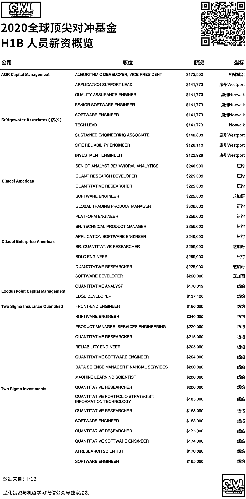
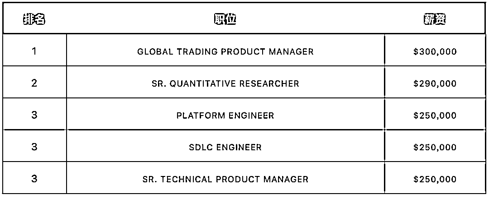
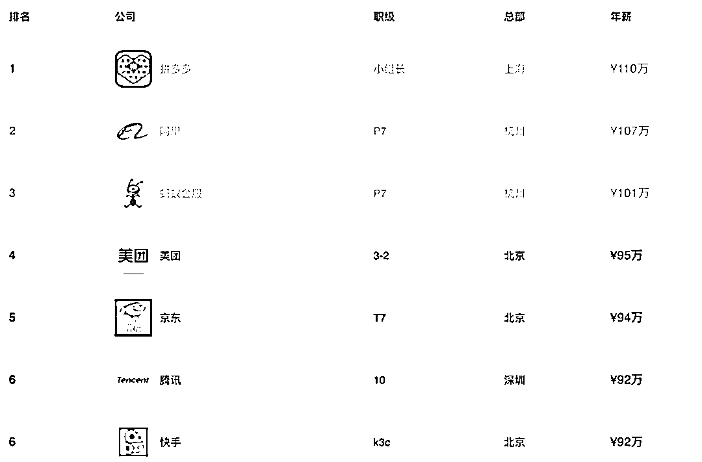
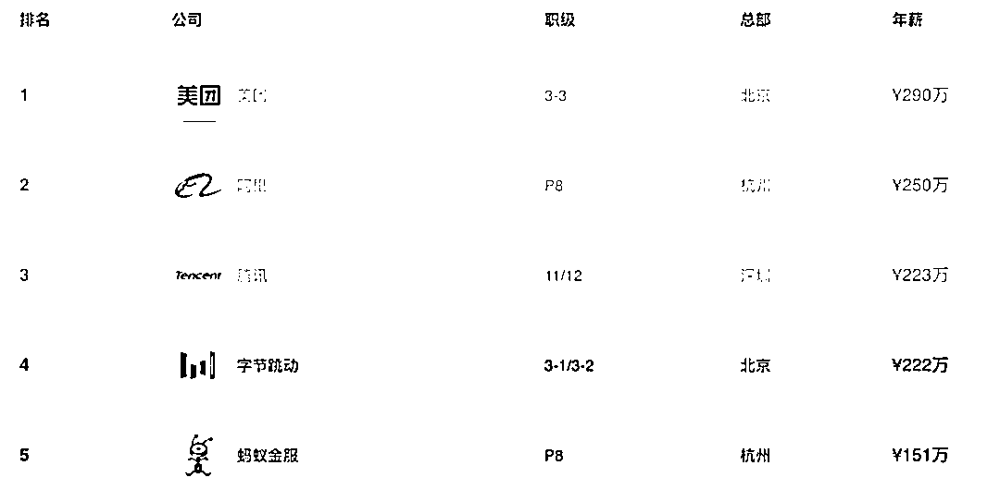

# Two Sigma CTO：一将难求，另类未来！

> 原文：[`mp.weixin.qq.com/s?__biz=MzAxNTc0Mjg0Mg==&mid=2653314193&idx=1&sn=561236b6ea9bba967821164b4887e675&chksm=802d9e84b75a1792496b0da66eb5928112fc6ca15b3b2e6f365ea0784b93741bfd3011ea149c&scene=27#wechat_redirect`](http://mp.weixin.qq.com/s?__biz=MzAxNTc0Mjg0Mg==&mid=2653314193&idx=1&sn=561236b6ea9bba967821164b4887e675&chksm=802d9e84b75a1792496b0da66eb5928112fc6ca15b3b2e6f365ea0784b93741bfd3011ea149c&scene=27#wechat_redirect)

在刚刚结束的 AI 和数据科学在交易领域的会议中，Two Sigma CTO Jeff Wecker 与彭博社记者 Hema Parmar 开展了一场精彩的对话。公众号加了**中英字幕**（部分不是很准确，大家听原音为准）：

[`mp.weixin.qq.com/mp/readtemplate?t=pages/video_player_tmpl&action=mpvideo&auto=0&vid=wxv_1782965698504294402`](https://mp.weixin.qq.com/mp/readtemplate?t=pages/video_player_tmpl&action=mpvideo&auto=0&vid=wxv_1782965698504294402)

**求贤如渴，不走寻常路！**

在讨论中，Jeff Wecke 表示尽管 Two Sigma 热衷对人才的渴求，但寻找新人并不容易。Two Sigma 不光与同行竞争，也与 FAANG 这样的科技巨头在竞争。这种情景在国内目前也是普遍存在的，大量头部量化私募都在寻找 BAT 的顶尖技术人才。

 

例如，Citadel 在 2017 年雇佣了微软研究实验室的邓力，组建了一个人工智能团队。此后，邓力雇佣了 Uber 在西雅图的机器学习实验室的前技术主管 Pusheng Zhang、Facebook 的前研究科学家 Wenyi Huang，以及谷歌在山景城的人工智能实验室的前研究员 Sihang Liang。Virtu 也有像 Facebook 应用机器学习团队的前成员 Till Varoquaux 这样的人。

大型量化资产管理公司雇佣 FAANG 这些顶级的机器学习工程师，也表明这些公司正在建立交易成本分析框架，以找出最佳的执行方法，例如，考虑 broker 费用和交易成本等。换句话说，**机器学习也被用来降低成本！**

Jeff Wecke 表示：Two Sigma 已经开始**使用非传统的方式来寻找人才了**。比如 Alpha Studio：

这是一个允许金融行业以外的研究人员提交想法并以自由职业者的身份获得报酬的平台。

**FAANG 的工程师真的想去对冲基金吗？**

根据 H1B 数据显示：

**H1B：**美国签证的一种，指特殊专业人员/临时工作签证 Specialty Occupations/ Temporary Worker Visas (H-1B)。发放给美国公司雇佣的外国籍有专业技能的员工，属于非移民签证的一种。

我们看到，薪资排名前三的都是来自 Citadel 的岗位，技术岗就占了一半！

在大多数情况下，为对冲基金工作的技术专家不仅拿基本工资，如果一个技术岗位与收益直接挂钩，那么这些奖金是相当可观的，甚至可能高于薪水。而且 H1B 签证持有者很多都担任比较高层或者核心的的角色。

从国内来说，根据网上数据显示，BAT 资深工程师（5+、8+年工作经验）的薪酬如下：

5+

8+

**有些量化私募给的更多！**例如，九坤投资发布针对最牛应届生的“凤栖梧桐，百万年薪”量化金融人才培养计划，招聘职位包括量化实现工程师、AI 算法研究员等。

**另类数据就是未来！**

随着数据成为量化对冲基金差异化的关键因素，2020 年 7 月从高盛加入 Two Sigma 的 Wecke 表示：**减少研究人员在获取数据与数据可用性之间的时间成本，已成为竞争优势的关键来源**。问题是，随着竞争对手开始使用新数据，新数据的收益也会随着时间的推移而下降。在这一点上，Wecke 表示，数据已经商品化，这种价值可以通过额外的“thoughtfulness”以及与其他数据集的结合来。

Wecke 表示，要想让 Two Sigma 的量化研究人员真正产生影响，他们需要**在进行研究时尽可能拥有最高效的时间**。因此，**Two Sigma 采购新数据集方面投入了大量的资金**。否则，就会对研究人员的时间产生乘数效应（Multiplier Effect）。我们要尽可能地减少重复的工作（例如数据整理、数据清理等)，这样研究员就可以花尽可能多的时间在模型与算法的构建上。说白了就是精力花在刀刃上！

**这点公众号十分赞同，海外对冲基金在数据采购、收集、整理和相关人员的配备具有很强的前瞻性，投入也很大！希望国内量化私募在这块能够借鉴。这会不会让许多数据厂商开心呢？不过数据测试周期蛮久的，没效果也是不会采购的！**

正如 Citadel 前量化分析师 Jeffrey Ryan 在媒体上所说：“**在量化基金在分析来自社交媒体的实时数据时，处理庞大的非结构化数据集变得越来越重要！”**

Wecke 在讨论也证实了这一点：“**新闻流和社交媒体越来越有价值**，但过滤出假信号是一个相当具有挑战性的过程！”

Wecke 也表示，不光是社交媒体数据，ESG 数据在未来也大有可为！

**相关阅读**

 JPMorgan 最新报告解读：A 股新闻情绪指数策略（附下载）

2020-11-26

 JPMorgan 最新报告解读：基于 NLP 的 A 股交易策略（附下载）

2020-07-29

 另类 Alpha：研报情绪因子（附代码）

2020-12-17

 ChinaScope | 从宏观到个股：新闻分析数据在 A 股的应用

2020-11-18

 独家解读 | 新闻分析数据哪家强？

2020-07-02

 现货与新闻情绪：基于 NLP 的量化交易策略（附代码）

2020-10-26

 机器学习与情绪交易（附代码）

2020-09-01

 NLP 量化交易：基于财务报表的情绪分析（附代码）

2020-02-27

 厉害了！新闻情绪因子

2019-10-16

 无敌了！新闻情绪因子进阶来啦！

2019-10-22

 NLP for Quant：使用 NLP 和深度学习预测股价（附代码）

2019-03-29

 最新 NLP 研究 | Twitter 上的情绪如何预测股价走势（附代码）

2019-04-26

量化投资与机器学习微信公众号，是业内垂直于**量化投资、对冲基金、Fintech、人工智能、大数据**等领域的主流自媒体。公众号拥有来自**公募、私募、券商、期货、银行、保险、高校**等行业**20W+**关注者，连续 2 年被腾讯云+社区评选为“年度最佳作者”。