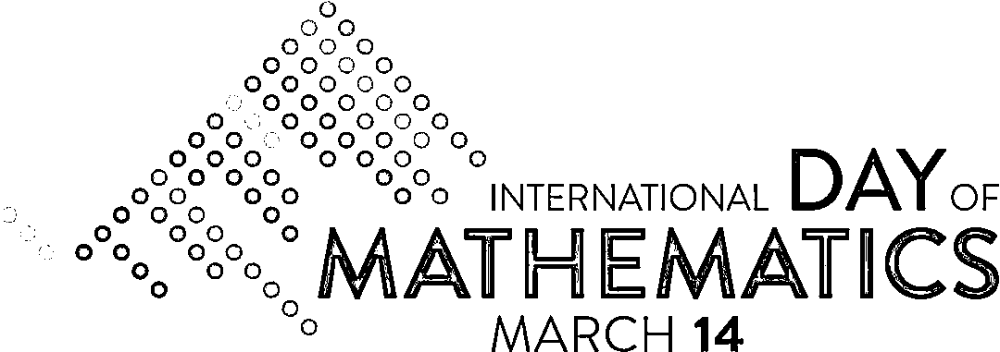

# 3.14 特别纪念 | π 的第 100000000000000···

> 原文：[`mp.weixin.qq.com/s?__biz=MzAxNTc0Mjg0Mg==&mid=2653314030&idx=1&sn=960c319900c26d6235ec588345df4d29&chksm=802d99fbb75a10edc671333e416e99e07c83cc8acc952bfd3f30f8b9c29d8667410e49469553&scene=27#wechat_redirect`](http://mp.weixin.qq.com/s?__biz=MzAxNTc0Mjg0Mg==&mid=2653314030&idx=1&sn=960c319900c26d6235ec588345df4d29&chksm=802d99fbb75a10edc671333e416e99e07c83cc8acc952bfd3f30f8b9c29d8667410e49469553&scene=27#wechat_redirect)

**量化投资与机器学习公众号独家奉献**

作者 | Martin     编辑 | Allen

***3 月 14 日***

***π***

***科学与艺术的结合***

**这几年的主题很精彩**
请耐心往后看哦！

2019 年 11 月 26 日，联合国教科文组织第四十届大会正式宣布,每年的 3 月 14 日为“国际数学日”。**2021 年 3 月 14 日是第二个国际数学日！**

大家可以登录 ***http://mypiday.com/***，查看自己的生日是否在圆周率中。**它会出现在π的小数点后第几位呢？**例如输入***19980216***：

接下来就让我们进入一年一度的π主题纪念日吧！

***2013***

今年的主题是：

**π与爱情**

**▍第一幅**

***I see a wild civility;—***

***Do more bewitch me, than when art
Is too precise in every part.***

每个数字都用不同颜色的点表示。内部的灰点似乎在闪烁——这就是实际的亮度效果。

πi 用于表示第 i 个π的数字。 对应外圆颜色编码第 i 位，内圆颜色编码第 i+1 位。相邻位置的内外圆颜色相同。

相邻数字用线条连接：

**▍第二幅**

设计灵感来自 Elena Miska 的美丽艾滋病海报。

**LOVE IN π—YOU CAN FIND IT HERE**

把π计算到**13099586**位，然后我**找到了真爱**

对 a=0，b=1，…，z=25 进行编码，love 是数字序列**1114214****。** 

该序列首先出现在位置：

13,099,586(…9163**11114214**81873…)

奇怪的是，**“恨”**（0700194）出现在**“爱”**之前，排在 514,717 位。

在前 2 亿位数中，**“恨”**出现了 23 次，是**“爱”**的 6 倍。

  

***2014***

今年的主题是：

**π与折叠路径和频率圈**

于那些真正喜欢这种极简主义的人来说， 我们创造了更多复杂但更现代的东西：π频率圈。 

但是为了让π的绘制走得更远，我们尝试将它折叠成一条路径，其方法与模拟蛋白质结构折叠的方法相同。研究蛋白质结构的折叠非常活跃——蛋白质的三维结构对其功能而言是必要的。理解它的结构是如何受到底层序列变化的影响， 对于识别细胞中的问题是如何发生的是必要的。

在二维空间折叠蛋白质是一项艰巨的挑战。它是一个 NP 完备问题，即使路径在网格上实现。我们对寻找能量最优路径进行模拟，最终目标是能够根据蛋白质的序列预测蛋白质的三维结构。图片来自维基百科。(2d 折叠，3d 形状)

**折叠一个数字**

使用复制交换蒙特卡罗算法创建折叠路径。

代码地址：http://www.cs.ubc.ca/labs/beta/Projects/REMC-HPPFP/

折叠数字：数字的位数被指定为极性（黑色）或疏水性（红色）。我们搜索能量为-42 的路径，表示该路径有 42 对相邻的 7。最大化分配给疏水（红色）状态的邻居数量。在本例中，7s 和 9s 的 64 位数能量为-42，表明表示路径有 42 对相邻的 7s。

数字（0-9）和状态（极性、疏水性）之间的映射选择是任意的。选择将素数（2，3，5，7 ）指定为疏水的。另一种方法可以使用完美正方形（1，2，4，9）。通过将每个数字分配给一个路径节点来构造路径。这样可以把 分成两个（或更多）的数字分组（31，41，59，26， ..）等等。

折叠 64 位数的：

路径的能量取决于其看上去多难以实现。每次折叠模拟运行时，你都有机会找到更好的解决方案。对于上面显示的 64 位π我们模拟了 500 次，发现了 200 多条具有相同的低能量路径。有趣的是，带有 E=-22 的路径是在不到 1 秒的时间内找到的，并且花了大部分时间来找到下一步。

下面按长宽比排序来展示了 100 条 64 位数 E=-23 的路径。 

100 个最低能量路径|这些是 100 个 64 位 E= - 23 的路径——有更多的能量路径。路径按长宽比(宽度/高度)的增加顺序来进行排列。首先是 6x14(0.429)， 最后是 8x9(0.889 )。(变焦)

模拟 64 位非常实用-它只需几分钟。在下一节中，我将展示如何运行自己的模拟。

**折叠 768 位数的π——费曼点**

让我们折叠更多的位数！768 位数怎么样——一直到.99999 。这是著名的π的费曼点。我们在这里看到了第一组连续的 6 个 9。这出人意料地发生得早——在第 762 位。在这个序列中有 298 个素数，另外 470 个是合数。

找到的最好路径是前 768 位 E=-223 (宽度=38，高度= 52，r=0.73, cm=1, cmabs=13 )的π。

选择不强调路径的起点和终点。结束更容易辨认——6 9s 很突出。另一方面，找到起点更难。

**复数字的π序列中的(d, n)点**

费曼点是重复数字的一个特定实例，我称之为(d, n)点。

**到达费因曼点的最优路径**

下面是我能找到的 20 条最佳路径的列表。它们的范围从 E=- 223 到 E=- 219。我用一些几何属性来注释每条路径，例如宽度、高度、面积等等。在一些作品中中，这些属性注释路径(能量 xxy rcm, cmabs )。

如你所见，路径的尺寸变化很大。低能路径不一定是对称的。小厘米的路径是中心对称的。r≈1 的路径被限制在正方形边界内。具有小树突的路径的起点和终点彼此靠得很近。

如果我们不设法进一步推进圆圈，那么作品就不会完整！路径网格是矩形的，但是可以使用以下变换变形为椭圆或圆。

简单地说，每一组同心圆对应一个数字序列π,如 3(314 159 265…)或 6 (314159 265358…)。给定数字在序列中出现的次数由环的厚度编码。环按其数字的数字顺序向外排列(即内部为 0，外部为 9)。 

对于某些图片，第一个数字(3)与其他组的数字相抵消。寻找的高位数 9 s 的海报显示π的费曼点(6 9s 位数 762)。对于显示更多数字的图片，我们试着在组中找到费曼点。

费曼点位于一个非常有趣的位置。如果我们将π分成 6 组的数字,然后第一个 999999 正好 128 组。但是，如果我们把数字按 3s 分组，那么 999 和 999 正好可以分成 255 和 256 组(2 的幂!)，它可以被排列成 16 * 16 组的平方。

费曼点是数字 d 连续出现 n 次的特殊情况。我将其称为(d=7,n=6)，并提供前 1,000,000 位中所有这些点的列表。n 值较大的点对它们所属的数字组的频率分布有重要影响。如果将序列划分为多个组，则其影响会更小。

***2015***

今年的主题是：

**π与树状图**

**▍第一幅**

我们从一个正方形开始，逐步划分它。在每一阶段，π的数字用于确定分区中使用了多少行。用于分割线的厚度可以被减薄到更高层次。

这种编码数据的方法称为树状图。通常，它用于编码层次信息，例如硬盘的空间使用情况，其中分区对应于目录中文件的总大小。

上色：

**▍第一幅**

上面的颜色分配是随机的。对于每种形状，选择给定颜色（透明、白色、黄色、红色、蓝色）的概率是相同的。

形状的颜色选择也会受到相邻形状的颜色的影响。要做到这一点，我们需要创建一个图来捕捉每个层次上所有形状之间的邻接关系。下面将展示π树图的前四层及其邻接图。在每个图中，节点对应一个形状，节点之间的一条边表示形状共享其边缘的一部分。只在角上接触的形状不被认为是相邻的。

***2016***

*Mais laisse-moi tomber, laisse-nous tomber
Laisse la nuit trembler en moi
Laisse-moi tomber, laisse nous tomber
Cette fois*

*But let me fall, let us fall
Let the night tremble in me
Let me fall, let us fall
This time*

今年的主题是：

**π与引力波**

2016 年 2 月，激光干涉仪引力波天文台（LIGO）首次探测到引力波。

探测器中的信号被声波探测到。通过这个过程，任何数据都可以被编码成声音，从而为我们可能错过的模式和结构提供线索——我们最终听到了两个黑洞的声音。嗡嗡声和唧唧声。

运行模拟重力位，π分配一个质量和允许相互碰撞及轨道。

推导如下：

模拟开始于取 n 个数字的π并将它们均匀地围绕圆形排列。每个数字的质量 di（例如：3）由(1+d)^k 给出，其中 k 是质量幂参数，在 0.01 到 1 之间。例如，如果 k=0.42，那么 3 的质量是(1+3)⁰.42=1.79。

下图展示了一个 n=3，k=1 的仿真过程。数字 3 和 4 碰撞形成数字 3+4=7，然后立即与 1 碰撞形成数字 7+1=8。当系统只剩下一个质量时，模拟停止。

**给每个质量加上初速度**

当质量具有初始速度时，这些图形很快就变得有趣起来。在上图中，质量以零速度运动。模拟一开始，每个质量立即开始直接向另外两个质量的质心移动。

当初速度为非零时，如下图所示：质量首先以它们的初速度运动，但重力立即施加加速度，改变了这个速度。

15000 步效果：

当以不同的初始条件重复模拟时，结果集称为集合。

下面，重复模拟 100 次，n=3，k=0.2，每次初始速度略有不同。速度的 x、y 分量均为正态分布，均值为零，方差固定。这四个系统中的每一个都有其模拟在 5,000、7,500、10,000 和 20,000 个时间步长上逐步演化的过程。

k 值对仿真结果影响较大。当 k 很小的时候，所有的数都有相同的质量。例如：当 k=0.01 时，0 的质量是 1，9 的质量是 1.02。

当 k 很大时，质量的差别就大得多。例如，对于 k=2，最轻的质量是(1+0)²=1，最重的(1+9)²=10。因为质量的加速度与吸引它的质量成正比，在一对质量中，轻质量会加速得更快。

随着数字数量的增加，折叠的模式不会发生质的变化。

做大量的模拟实验。对于不同的 n 和 k 值，重复了几次模拟来采样不同的初始速度。

下面是一个很好的例子，说明了一对质量的稳定轨道模式是如何被另一个质量的存在所破坏的。你可以看到，在左边，一旦淡红色的物质离开了橙/绿，它们就会形成一个稳定的图案。

当数字碰撞时，剩下三个质量，这就离开了系统。它们仍然在彼此的引力影响下，但在模拟期间移动得太快，无法回到画布上。

*2017*

*Well I look at it myself as the beginning, really, of an exploration.* 

*That's the reason we're exploring. You never know what you'll find on an exploration. *

*What the sky looks like. *

*What the stars look like. *

*Will they still twinkle or are they a steady light when you get outside the atmosphere. *

*As in all things, you must make your own way through life.*

*—Karminsky Experience Inc.*

今年的主题是：

**π与星座**

## **THE DIGITS OF π AS A STAR CATALOGUE**

## π的数字解析为 12 块。每块中的数字被解释为恒星的(x,y,z)坐标，最后一个数字是恒星 Mabs。

通过分析前 1200 万位数，就得到了 100 万颗星星。每颗恒星的 Mapp 由绝对星等计算，天空中的经纬度由直角坐标转换为球坐标。

**科普：**

绝对星等（Absolute magnitude,M）是假定把恒星放在距地球 10 秒差距（32.6 光年）的地方测得的恒星的亮度，用以区别于视星等（Apparent magnitude，m）。它反映天体的真实发光本领。此方法可把天体的光度在不受距离的影响下，作出客观的比较。如果绝对星等用 M 表示，视星等用 m 表示恒星的距离化成秒差距数为 r，那么 M=m+5-5lgr。

通过从数字序列中减去平均坐标（x 和 y 为 4999，z 为 499），坐标以 0 为中心。

这颗恒星的绝对星等在-5（最亮）到 5（最暗）之间。

所以对于第一颗恒星，它到原点的距离（观察行星的位置）：

恒星在宇宙中的位置(x,y,z)被投影到单位球面上，计算它们的经度-180..180 和纬度-90..90 坐标。

完成这一步后，下一步是找出如何将单位球面投影到页面上。

为了说明每个投影中恒星的排列方式，让我们从一个恒星立方体开始。

为此，我们创建了一个星形目录，它以(0,0,0)为中心填充立方体，边长为 10,000。随意将每颗恒星的绝对大小设置为-8，并在此处使用与最终图表中相同的星号编码。

靠近“银河平面”（z 坐标接近零）的恒星呈红色。观察行星被旋转，使得这个平面近似于银河系在实际图表中的外观。

在方位角投影中，展示一些相对的半球。北半球地图范围为[- 10,90]，南半球地图范围为[- 90,10]。这提供了一些边缘的连续性。靠近半球边缘的明亮的白色圆圈代表天球赤道。

看到落在立方体表面的星星在图表上的位置是很有趣的。这些代表了这个合成宇宙的最远距离。

从一开始就知道星座在星图中扮演着重要的角色。 

下面是在天空中绘制某种图案的早期尝试。这些形状并不由什么特别的东西所驱动。

用灭绝的动植物来填充天空：

代码中实现：

图的各个组件用 SVG 生成，然后导入 Illustrator。

*2017*

*And if you've got to sleep a moment on the road
I will steer for you
And if you want to work the street alone
I'll disappear for you
—Leonard Cohen (I'm Your Man)*

今年的主题是：

**π与全世界的街道**

十字路口的街道段由折线表示，折线在十字路口被中断、拼接，以达到合 5-10 米的分辨率。

图像中共有 108,366,429 条折线，总跨度大约 39,930,000 千米。

**提取城市信息**

我们从数据集中选择 44 个城市并用一个以经度和纬度为坐标的 0.6*0.6 度的方形图块作为样本。这个方块大概对应于一个 65 km × 65 km 的方形。

这些城市的中心坐标可能和权威坐标有所不同，使用谷歌地图在我们认为是有用的中心的地方确定中心坐标来对街道作为样本。下面这些坐标与导出的折线对应。

每个城市的道路坐标然后通过等距株环状投影图被转化，使得经线之间的距离与纬度之间的距离相等。这由以下过程实现：

其中ϕ是纬度，λ是经度。平均是对于所提取的整个城市的道路区块而言的。以下所有步骤将使用这些转换后的坐标。

让我们来看一个城市，以哥本哈根为例，建立一些对于数据集的印象。

在下面这个放大后的部分图片中，你可以看到这些十字路口（交点）和与交点连接的每一条折线。

进一步放大，你可以看到克里斯蒂安堡宫，丹麦的宫殿之一，并且是丹麦国会的所在地。

**创建城市条带**

城市条带由对于 0.015 度*0.015 度（转化后的经纬度）的图块取样得到。这个大小大约是 1.7 千米的方形。

对于条带中的每一个地点，仅当折线的数量在 40d≤N<40(d+1)−140d≤N<40(d+1)−1（d 是π的数字）之间时，图块以π的数字为顺序被取样。有 d=9 的图块仅需要有 360≤N 条折线。

举个例子，第一个图块被对应到 d=3，这必须有 120≤N<159 条折线，第二个图块被取样以满足密度 40≤N<79，因为它与π的下一个数字 d=1 相关联。

进行进一步对可以接受的图块的选择，使得街道与前一图块相连接。进行极小的城市调整和缝合来尽量实现无缝连接。

下面是一个城市条带集合的例子，城市包括：阿姆斯特丹，曼谷，北京，柏林，哥本哈根，爱丁堡，香港，约翰内斯堡，马拉喀什和墨尔本。

在含π的十个数字的道路上，莫斯科、孟买、内罗毕、新德里、尼斯、布拉格、罗马、斯德哥尔摩、温哥华和华沙的城市条带。

下面放大了以上尝试条带的一部分来展示缝合的结果，每个街道区块在蓝色方框中被标出。

有些区块非常有趣，比如，最下面的条带的第四个区块（是哥本哈根）没有道路横穿区块。

**创建世界图块**

时间区块是城市条带的二维版本，但是使用了二个及以上的城市。

区块基于π的数字的顺序从城市取样，在 6*6 的网格上排列。举个例子，第一行的区块对应于 314159，第二行对应于 265358。每个数字都被分配给一个城市，对应的区块被从对应的城市取样。

对于城市条带，仅当他们与前一区块排列时，区块被选择。这在二维中的实现更具技巧性因为他们必须将一个已选择的区块与其他最多两个已放好的区块匹配。

不像城市条带，在街道密度中不进行选择。

下面是一个使用以下数字对应的城市的世界图块：0：阿姆斯特丹，1：多哈，2：马拉喀什，3：孟买，4：内罗毕，5：罗马，6：旧金山，7：首尔，8：上海，9：温哥华。

在含π的十个数字的道路上，含阿姆斯特丹、多哈、马拉喀什、孟买、内罗毕、罗马、旧金山、首尔、上海和温哥华的世界区块。

下面在图片中央放大区块，然后展示区块取样的城市。

*2019*

*How many ages hence
Shall this our lofty scene be acted over
In states unborn and accents yet unknown!
—Willian Shakespeare (Julius Caesar, Act III, Scene 1)*

2019 的主题是：

**π与排版**

海报自动生成，并进行了一些优化，以避免换行、平衡页面上的不同字母、单词长度、特定的数字结尾等等。

你可以用不同的语言下载数字列表 0 到 9。

下载编号词表：http://mkweb.bcgsc.ca/pi/piday2019/numbers.in.languages.tsv

下面是每张海报的数字和单词列表。

**▍第一幅**

**▍儿童版**

**102 种语言**

*2020*

***3****  Little ***<mi>***π***</mi>

***1****  what***

***4 **** can you tell us?***

今年的主题是：

**π与诗意**

由于今年新冠肺炎的影响，今年π日庆祝活动是短暂的诗意散发，称之为 piku。

**π的诗意**

***3****  A Three and***

***1****  a***

***4 **** one and a four.***

或者：

***1 **** Dust***

***4 **** in space vacuum***

***0***

***3 **** clogs alien***

***2 **** machines.***

***0***

***2****  Bummer.***

***0***

这些都是**nku**。就像俳句，是一种结构（行数和音节数）受限于数字的诗歌。

**给大家讲一下 nku：**

俳句，是日本的一种古典短诗，由“五-七-五”，共十七字音组成；以三句十七音为一首，首句五音，次句七音，末句五音。要求严格，受“季语”的限制。

俳句是中国古代汉诗的绝句这种诗歌形式经过日本化发展而来。同时在日本以每日小诗的形式发展。

上面的第一首诗是一个 piku（π kuパイク），基于π的前三个数字。上面的第二首诗是 nku 今年的日期**14032020**。 

最简单的 nku 是一首三句诗，分别有 3、1 和 4 个音节。

***3 ****** Three one four***

***1  ******One***

***4******  Five nine two six.***

具体来说，俳句计算音标发音的数量，并不总是相同的音节。例如，any 这个词有两个发音：a-ny。

如果你对如何用日语计数声音感兴趣，可以阅读标记时间和俳句。

http://www.tempslibres.org/tl/en/theo/mode04.html

当然，可以使用较长的单词，但要注意那些只需要一个音节的句子。

***3 ****** Numbers are***

***1 ****** all***

***4  ******Equally fun.***

***3******  Land meets sky.***

***1 ****** Oh***

***4 ****** It's you again!***

你可以使用连字符来计算音节数：

***3******  Memories***

***1******  for***

***4******  get yourself then.***

**PIKU 的复数形式是 PIKU**

Piku 是 singulare tantum ：数形式与单数形式相同。这是因为它的灵感来自俳句，在日语名词中没有不同的单复数形式。

***3******  Piku is***

***1 ****** the***

***4 ****** piku plural.***

一般来说，一个 piku 可能有超过 3 行。这反映了这样一个事实，即数字的结尾不会终止。

***3******  Land meets sky.***

***1 ****** Oh,***

***4 ****** It's you again!***

***1******  Yes,***

***5 ****** Who did you expect?***

**0 的处理**

数字 0 是没有音节的一行，相当于一个必修的诗句休止符。但是因为第一个零在π的 33 处，所以有一段时间你不会看到一个句子中断。

因此，你可以自由地在 piku 中任何地方引入一个诗行分句，比如说：

***3 ****** Hot air breeze***

***1******  cools***

***4******  much hotter things.***

***3******  F 0 0***

***1 ****** red***

***4 ****** You add the light.***

来，我们自己写一个： 

***3******  piku are***

***1******  not***

***4******  hard to write but***

***1******  good***

***5 ****** ones are not easy.***

量化投资与机器学习微信公众号，是业内垂直于**量化投资、对冲基金、Fintech、人工智能、大数据**等领域的主流自媒体。公众号拥有来自**公募、私募、券商、期货、银行、保险、高校**等行业**20W+**关注者，连续 2 年被腾讯云+社区评选为“年度最佳作者”。