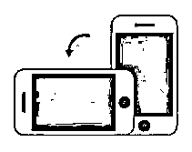
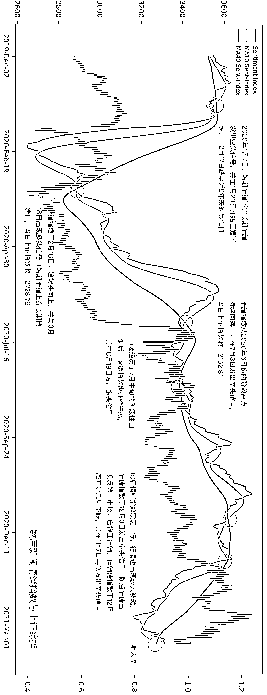

# 请把手机旋转 90°

> 原文：[`mp.weixin.qq.com/s?__biz=MzAxNTc0Mjg0Mg==&mid=2653313360&idx=1&sn=508bbeea3f5c04abe1b5575357fd1bf0&chksm=802d9b45b75a1253649728888e97f7a19eb66d589d187c7b3c7082efe9642e5395ab68c3b99f&scene=27#wechat_redirect`](http://mp.weixin.qq.com/s?__biz=MzAxNTc0Mjg0Mg==&mid=2653313360&idx=1&sn=508bbeea3f5c04abe1b5575357fd1bf0&chksm=802d9b45b75a1253649728888e97f7a19eb66d589d187c7b3c7082efe9642e5395ab68c3b99f&scene=27#wechat_redirect)

分享一张有意思的走势图，感谢 ChinaScope 提供数据支持！

**将**

**手**

**机**

**逆**

**时**

**针**

**旋**

**转**

**90°**  

量化投资与机器学习微信公众号，是业内垂直于**量化投资、对冲基金、Fintech、人工智能、大数据**等领域的主流自媒体。公众号拥有来自**公募、私募、券商、期货、银行、保险、高校**等行业**20W+**关注者，连续 2 年被腾讯云+社区评选为“年度最佳作者”。