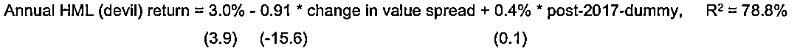

# AQR 最新：价值捍卫者 Cliff Asness 深情发声！

> 原文：[`mp.weixin.qq.com/s?__biz=MzAxNTc0Mjg0Mg==&mid=2653313320&idx=1&sn=f9356a600b5a87a1513f51881dca29f5&chksm=802d9b3db75a122b45667c842396e2be7e26f350800f1888ea984bfbfdf00161ff2bd108d2b4&scene=27#wechat_redirect`](http://mp.weixin.qq.com/s?__biz=MzAxNTc0Mjg0Mg==&mid=2653313320&idx=1&sn=f9356a600b5a87a1513f51881dca29f5&chksm=802d9b3db75a122b45667c842396e2be7e26f350800f1888ea984bfbfdf00161ff2bd108d2b4&scene=27#wechat_redirect)

 
还记得年初我们报道了 Two Sigma 公布 2020 年最糟糕因子吗？

价值因子是 2020 年表现最差的因子，已连续 4 年下跌！价值的四个构成部分都在亏损：

***Price to book、Long-Term Reversal、Earnings Yield、Dividend Yield***

数据来自：TCI

**相关阅读**

 价值已死，价值万岁！

2019-10-18

 因子投资：价值和动量是否已死？

2019-04-18

 价值因子已死？争论与启示

2020-06-15

我们都知道，**AQR 一直是“价值”的捍卫者**！

本月，AQR 创始人 Cliff Asness 又洋洋洒洒写了一篇论文来为价值辩护，提出了另一个支持“价值”的论点。

**论文下载在文末**

在这篇论文中解释了：**为什么长期价值预期收益率大大高于多数投资者可能认为的水平。**

根据美国银行本月的一份研究报告显示，在购买大票的美国主动基金中，有 70%在上个月超过了罗素 1000 指数，这是自 2007 年以来的最高水平。大型基金平均表现优于大盘 85 个点，创下 2009 年全球金融危机重创市场以来最高 Alpha 值。

美国银行分析师将价值型股票的上涨描述为有史以来最强劲的上涨之一！**2 月份，价值型股票的表现超过了成长型股票**。

同时，报告中还强调，**量化****基金也正逐步向价值股倾斜，2 月份表现也十分强劲，其中 72%的基金超过基准**。分析师还表示，上月成长型基金是选股者的“天堂”，这一点尤为明显！

回到主题。Asness 在论文中写道：

每个人都知道，自 1990 年以来，在样本外，价值策略一直令人非常失望。就连 Eugene Fam 和 Kenneth French 也知道这一点。Asness 主要是想表达 Fam 和 French 去年写的一篇论文，具体大家可以有空去读。改天我们也会说说这篇论文。

但是，尽管这听起来可能很奇怪，一个策略的实际平均收益并不一定是其真实长期预期收益的最佳估计值。

Asness 解释道：

**为什么？因为平均收益的主要因素之一是估值的变化！**

根据 Asness 的说法，**当估值的极端变化被纳入收益预期时，可能会导致投资者高估或低估未来的收益**。他指出，来自 Research Affiliates、AQR 和其他机构的早期研究表明，考虑这些估值变化可以显著提高估值的精度（不仅仅是一个不同的、偏差较小的估值）。

Asness 在论文中继续论证了这一论点，使用回归分析来说明估值变化对标普 500 指数、美国政府债券和美股相对于其他发达市场股票的实际收益率有多大影响。然后他转向了价值。

Asness 发现，**在 1990 年之后，价值的挫败很大程度上是价差变化的结果，即价值股票在这段时间内变得比成长型股票便宜得多**。如果你认为这种价差不会永久扩大，那么你对真实价值预期收益率的负面程度就不会像那些只关注时间收益率的人那么严重。

Asness 特别研究了 2018 年至 2020 年间“可怕的价值崩溃”，他发现：

**如果不是因为低估值股票对高估值股票之间令人讨厌的大幅模贬值，价值投资者本来应该能够获得 3.4%的收益，而不是实际每年 11.9%的损失。**

这些结果表明，过去三年的价值崩溃主要是价差扩大，而不是基本面被破坏。投资者只是为同样的基本面（估值低的股票 vs. 估值高的股票）支付了更多的钱，与 2017 年底相比，基本面有了根本性的改善。

总之，Asness 认为：

计算估值变化使我们更确信股票市场、债券市场和价值因子的预期收益是良性的正收益（即使我们仍然必须忍受估值变化导致的现实波动）。同样，它让我们更确信全球股票的平均收益与美国股票的平均收益并没有真正的不同。所有这些都对长期资产配置具有重要意义。

我们希望这种分析使价值从历史的垃圾箱中被拯救出来，许多人则根据 1990-2020 年样本外（或更近的）表现将其扔进历史的垃圾箱中。价值策略比许多人想象的要好得多，我们要增强对价值因子的长期信心，以及我们在艰难时期（有时是非常艰难的时期）的耐心与坚持。

最后，Asness 深情的写到：

最后，一个重要结论就是是策略本身的可持续性，它是否能像我们预期的那样持续稳定的带来预期收益，无论是持续的高收益或者是令人失望的低收益。我们所在乎的是策略逻辑的是否如我们预期的那样。但这在现实中很难实现，很多时候，你会发现你坚持了很长时间的策略，其实逻辑是错误的。然而，这就是投资的真实情况，也是我们选择这份事业所需要的面对的。

这篇论文并不能改变这些事实，坚持长期亏损的投资确实非常困难，正如避免爱上牛市的困难也是如此。确实，过去三十年估值策略的表现低于预期，且在最近三年表现非常差，这主要是由于估值的变化（你预期这不会持续），但我们也挺过来了！但是，这也并不意味着人们不会吵着要你的脑袋！我们希望这种分析可以克服这些困难，避免我们在估值低的时候放弃好的策略，或在估值高的时候超配这些策略。

**论文下载**

后台回复：**AQR202103**  

 

量化投资与机器学习微信公众号，是业内垂直于**量化投资、对冲基金、Fintech、人工智能、大数据**等领域的主流自媒体。公众号拥有来自**公募、私募、券商、期货、银行、保险、高校**等行业**20W+**关注者，连续 2 年被腾讯云+社区评选为“年度最佳作者”。