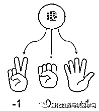
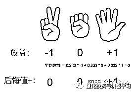
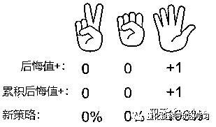
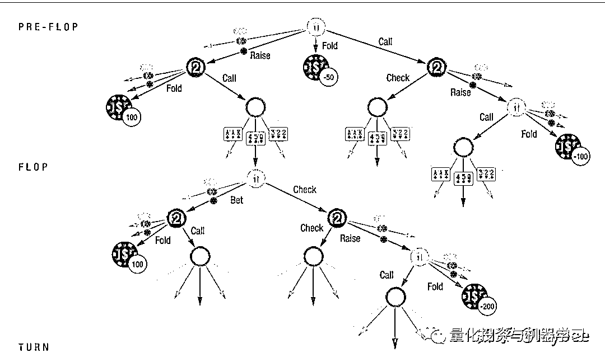
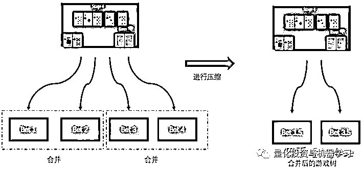
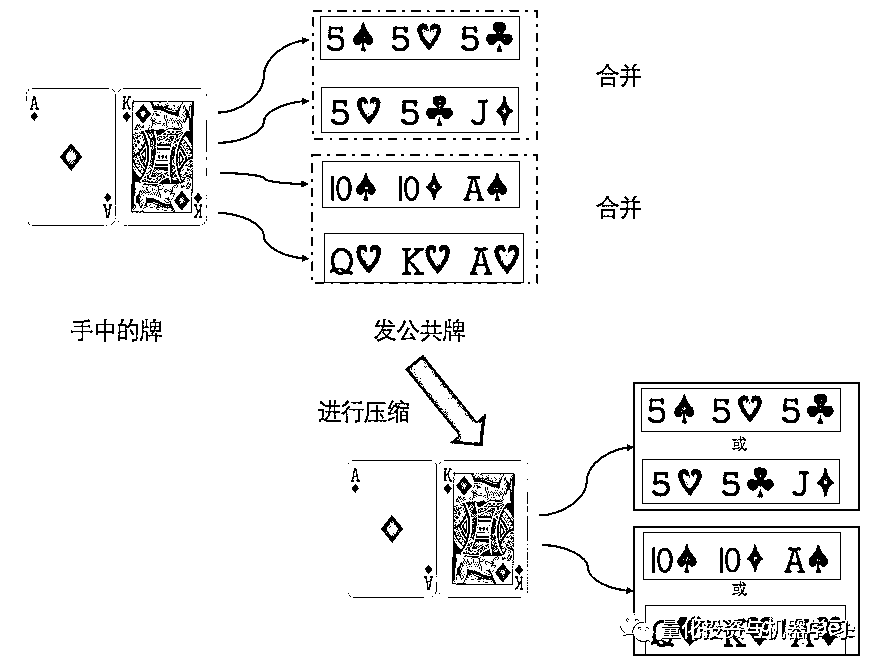
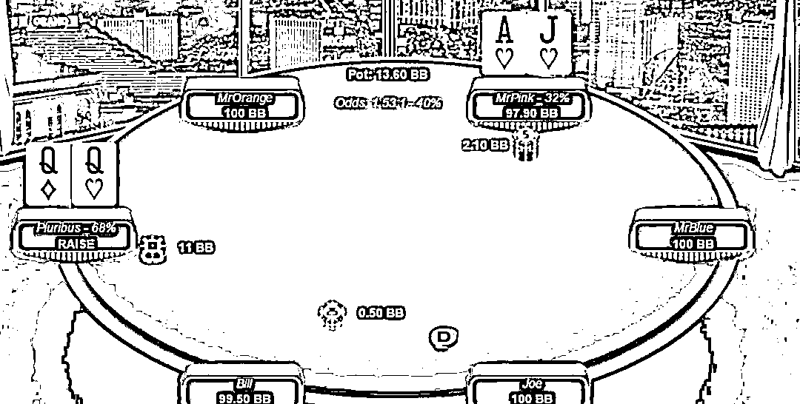
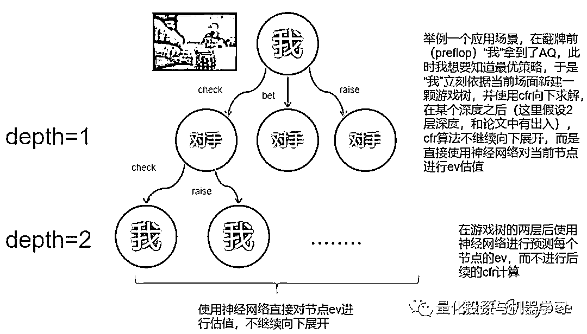
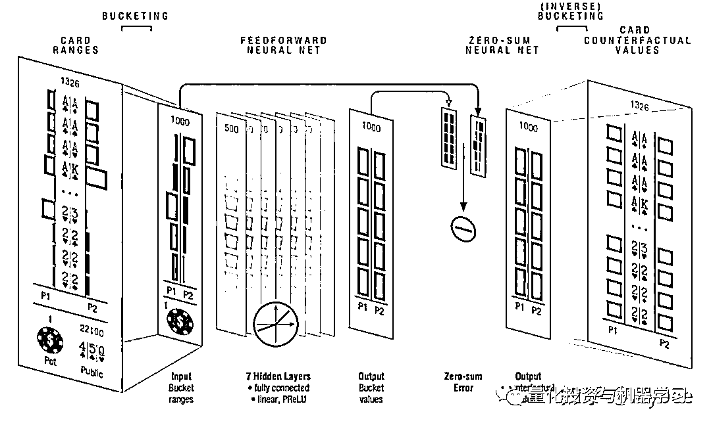
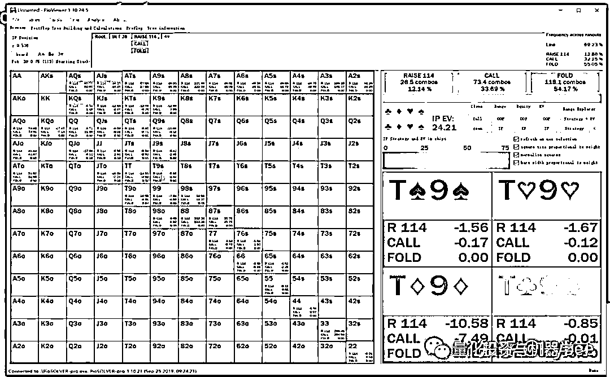

# 德扑 AI 这些年！

> 原文：[`mp.weixin.qq.com/s?__biz=MzAxNTc0Mjg0Mg==&mid=2653313287&idx=1&sn=0680d077902fd6f76f50fc6648f3e11e&chksm=802d9b12b75a12040382baa90e265521a2de74463a871474a55e1ce4c602949091ce9a353439&scene=27#wechat_redirect`](http://mp.weixin.qq.com/s?__biz=MzAxNTc0Mjg0Mg==&mid=2653313287&idx=1&sn=0680d077902fd6f76f50fc6648f3e11e&chksm=802d9b12b75a12040382baa90e265521a2de74463a871474a55e1ce4c602949091ce9a353439&scene=27#wechat_redirect)

 

作者：Icybee | 授权 QIML

**前言**

我对于德州扑克 AI 的接触始于 2019 年，那个时候我还在上研究生，当时有个挺有意思的老板通过 icyChessZero（中国象棋 alpha zero）这个项目找到我，问我有没有兴趣为他开发德州扑克的 AI，他可以给我报销机器钱，还可以有一点点的报酬，当时我正好在看很多关于德扑 AI 的论文，本来也有这个打算，于是想都没想就接了这个活，也开始了我和德州扑克 AI 真正的交集。虽然到 2020 年最后我写的德州扑克 solver 并没有被采用，并且最后老板还是选择了名声更大的一个项目进行合作，但是这中间构建德州扑克 solver 的过程是有趣的，这个 solver 我也终于在今年春节期间把代码整理清楚并且开源，算是不旺我花费在德扑 AI 上的这些时间，开源的这个项目也是目前据我所知最完善的德州扑克开源 solver，虽然它没有界面，功能也不能称得上尽善尽美，但是比起 1000 刀的 piosolver，它不要钱啊！

项目地址：

***https://github.com/bupticybee/TexasHoldemSolverJava***  

油桶视频介绍： 

***https://www.youtube.com/watch?v=tf34v0fCvi0***

好了，有趣的广告时间结束了，让我们进入无聊的正题。德州扑克的 AI 我认为是在所有当前的 AI 研究中极为特殊的一个：德州 AI 的思路有非常多，而且都可以达到至少还不错的水准（比如一直风靡扑克竞技玩家圈的 cfr (Counterfactual Regret Minimization) 算法，cfr 算法的超级魔改版本“冷扑”Libratus[1]，使用了深度神经网络的 deepstack[2]，fictitious play[9]，使用了 deeplearning+自对弈的 poker CNN[10]，还有种种其他算法）。与之相对比起来，dota，星际，象棋，围棋当前的主流 AI 方法都没有这么多，思路也没有这么开阔。对于德州扑克来说，这是一个群星璀璨，百家争鸣的时代。

德州扑克是一个已经解决的问题么？问不同的人你会得到不同的答案。如果你问这个领域的研究者，你会被告知德扑已经被解决了，双人游戏被 Libratus[1]解决，六人游戏被 Pluribus[3]攻陷。但是如果你问实际在打德州扑克的人，你会被告知还没有，不管是 Libratus[1]，Pluribus[3]还是 deepstack[2] 或引申出的方法，都或多或少有着一些问题，Libratus 运算量太大需要超算，deepstack[2] 的强度存在质疑，并且没有经过市场验证，Pluribus[3]也是没有经过市场证明的算法，同时也存在诸多其他问题。**所以现在真正玩德州扑克的大部分都还是在攒钱买 solver，反而这些“新”技术用的很少 ——看，这就是学术界和工业界的差别。**

接下来我们来谈谈这些年的这些德扑 AI，这篇文章不仅会涉及到算法本身，还会讨论这些算法在实际德州扑克社区的真实 impact，从这样一种不同的角度看待这几年的这些突破和其背后的意义。

**Sovler 的时代**

事实上，早在 2015 年甚至之前国外就已经有了德州扑克 solver 的概念，所谓 Solver，相比较于 Alpha go/Alpha zero 这样的全自动算法，其实更像是一个辅助工具。他的原理就是你告诉这个 Solver 你猜测的对方的 range（对方手上藏的是什么牌），和你自己的 range（对方可能觉得你手上藏了什么牌），还有当前的场面，德州扑克的 Solver 会自动帮你构建游戏树，并且计算一个**“纳什均衡”**策略。

所谓的“纳什均衡”策略，代表着如果你对自己 range 和对方的 range 估计都没有太大问题的话，你只需要按照 Solver 求解的纳什均衡结果来打德州，你在数学上长远来看就不可能输。也正是由于这种数学上的严谨，Solver 软件被广泛运用于德州扑克的研究和复盘分析。

Solver 软件的优点和缺点都非常明显，优点是有数学保证，可解释性强。缺点是在德州扑克的前几轮（特别是 preflop 和 flop）游戏树会非常庞大，计算起来会非常慢，没法做到实时算，只能离线算，另一个缺点是需要估计对手和自己的 range，range 要是估计不准依然白搭。

但是很快就有人开始动小心思了，为什么不可以完全用 Solver 打整局比赛呢？那不是像外挂一样么？于是乎从 2015 到 2020 年这几年里，Solver 软件的数量随着它的用户开始暴涨，国外的线上德州扑克几乎人手一个 Solver，没有 Solver 的都被称为 “fish” ，基本就是牌桌上待宰的羔羊。Solver 的价格也都水涨船高，像 piosolver 这样的老牌 Solver，pro 版本已经到了 1000 刀一个的离谱地步，国外线上玩家也开始纷纷抱怨，用 Solver 赚的钱还不够付 Solver 本身的，着实有些讽刺的味道。

那么说了这么多，Solver 的原理是什么呢？几乎所有的 Solver 类的德州扑克 AI 都会依赖 cfr (Counterfactual Regret Minimization) 或 cfr+家族的算法，这里以一个简单的石头剪刀布的博弈为例，说明 cfr+算法的大致流程：

假设你有一个很笨的对手，他在玩石头剪刀布的时候只会出石头，此时 cfr+算法如何确定你的“最优策略”呢？方法很简单：

第一步，cfr 算法同时尝试出石头，剪刀和布，然后得到奖励，很明显，由于对方只会出石头，所以“我”出石头的话就是平局，奖励是 0，出剪刀的话就是输的，奖励是-1，出布就能赢，奖励是+1：

第一步 确定奖励

第二步，计算出后悔值，后悔值是一个动作的收益比平均收益高出的部分，在 cfr+中，后悔值不小于 0：

第二步 确定后悔值+

第三步，根据累计后悔值的比例确定下一步的策略，由于这里只进行了一轮（次）的 cfr+求解，所以累计后悔值等于后悔值，而 cfr+也求解出了“我”应该以 100%的比例出布来战胜对手。在德州扑克中 cfr+的求解不会只进行一轮，因为对手的策略也是由 cfr 算法决定，所以双方会一直使用 cfr+算法直到双方的策略不再变化，这就是到达了“纳什均衡”点，一般到达纳什均衡点之前都会进行成百上千轮 cfr+求解。

第三步 确定新策略

这种 cfr 的 Solver 听起来很好实现，但是实际上实现起来有非常多可优化的地方，稍微没注意一个就会运行时间 x10，现在的很多商业 Solver 软件其实优化都做得非常好。

另外这样的德州 Solver 还有一个很重要的作用，职业牌手会非常重视，就是可以拆牌，就是复盘过去打的牌的时候，可以使用 cfr Solver 来看如果对手的 range 是这样的或那样的时候，他的纳什均衡打法是什么样的，我的打法有应该是什么样的，这样一来，可以在不断地复盘中提升自己的实力。在这个时候，cfr 仅仅是一个辅助工具而不是一个自动打牌机器人这个缺点就变成了优点。所以说，塞翁失马焉知非福。很多同学学了深度强化学习之后就老想着用 alpha-zero[4]/alpha star[5]的方法解一切, 而在这个场景下，类 alpha star [5]的算法的优点就会变成缺点（无法很好的提供拆牌方式，仅仅是一个黑盒子）。

从国外线上扑克的情况来看，大部分玩家都还是在用各种 Solver 软件来做拆牌分析和辅助，**可以说 Solver 至今远远还不能称为过时，仍然是 AI 在德州扑克中落地的最佳方式。**

**冰冷的王者 - Libratus 和 Pluribus**

2017 年，Alpha go 和 Alpha go zero 已经提出，大家纷纷认为深度学习结合强化学习才是人工智能的未来，但是 Noam Brown[6] 仍然用相当暴力的方法在德州扑克上告诉了我们，谁才是王者。Libratus 在 2017 年初横空出世，横扫了 1V1 德州扑克的最强高手。而它用的算法，没有深度神经网络，没有复杂的 selfplay，有的只是对 cfr 的深入理解和定制。

我们在这里说一下**Libratus**的大致方法和缺陷。

首先，为什么 Libratus 之前的扑克机器人都没能战胜人类呢？是由于 cfr 算法本身的限制。在上面介绍 solver 的时候已经说过，cfr 算法会在**每个需要决策的地方尝试所有可能的动作**，这就导致了，如果从德州扑克游戏开始时（严格地说，从 preflop 开始）使用 cfr，那么整颗游戏树会特别的大，遍历起来会极其慢：

从 preflop 开始建树会导致游戏树过大

其实在 Libratus 之前已经有很多工作想要解决这个（游戏树太大的）问题，比如 Libratus 之前的 ai 世界冠军 Tartanian7[7] 通过很大程度的压缩（abstraction）来减少这棵树的大小，把能合并的节点进行合并，然后一样是使用 cfr 的一个变种 mccfr[8] 直接暴力解整个德州扑克游戏（现在看起来还是非常暴力啊）。

这里多说两句压缩的方法，学术上来说压缩方法有很多，比如很常用的 Potential-aware abstraction[14] 族算法，这里举两个最简单的压缩的例子：

1、由于无限注德州扑克中，下注的可能性太多，可以通过合并一些下注的方式，比如，在某个场景下,比如我们有四种下注方式，可通过将这四种下注方式两两合并的方法来减少树的大小：

压缩 action，又叫 Action Abstraction

2、另外在德州扑克的翻牌（flop），转牌（turn）以及河牌（river）都需要发公共牌，发牌的可能性也很多，这里就又可以把发出来的公共牌进行合并，比如下图的情况,我们（例如在 preflop 结束发公共牌的时候）认为在拿到 AK 的时候，公共牌是 555 还是 55J 差不多，于是就可以把这两种公共牌看作是同一种情况：

压缩牌面，又叫 card abstraction

而 Libratus 的方法和 Tartanian7[7] 对比起来就没那么暴力了， 和 Tartanian7[7] 一样，Libratus 一开始会暴力的求解一个压缩过的德州扑克游戏（abstraction），来构造一个“总体策略”（论文中叫 Blueprint strategy）

而 Libratus 和 Tartanian7[7] 不同的是，当 Libratus 遇到一个在游戏树中没有的局面的时候，或者玩到德州扑克后几轮，游戏树已经比较小的时候，就会切换到一种叫 Safe and Nested Subgame Solving [11]的方法，重新构建一个“局部”游戏树，再用 cfr 去计算在这个局部的最优策略，这样一来全局策略+局部策略结合， Noam Brown[6] 终于用 cfr 告诉了搞深度强化学习的这帮人：你看我 cfr 老矣，但也尚能饭。

那 Libratus 的缺陷呢？其实也很明显，Libratus 作为一个能打正常比赛的 bot，是专门为 ACPC[12] 计算机扑克大赛设计的算法，只能打固定筹码的局，就是双方开始的时候筹码都是 10000，它的“总体策略”（blueprint）算法就决定了它是没法适应线上扑克那种多变的环境的。其之后的 Pluribus[3] 也有类似的缺陷。所以你如果问我双人德州扑克究竟算不算被攻克了？我会说不算，**因为 Libratus 只是攻陷了固定筹码数量的德州扑克比赛**。

而 Pluribus[3]作为 Libratus 之后提出的算法，进步则更为显著，主要解决了 Libratus 过于消耗资源的问题，要知道 Libratus 不管是在算“总体策略”（Blueprint strategy）还是在解“局部”游戏树的时候都是拿一整个超算的资源在算的。Pluribus[3] 是如何做到这一点的呢？这归 Noam Brown[6] 之前的另一种方法给 cfr 求解加上深度限制的方法 Depth-limited solving [13]， 这种方法大幅降低了 cfr 方法计算量，结果就是 Pluribus[3] 横扫了德州扑克六人比赛并且又一次登上了 Science（前一次是 Libratus）

Pluribus 在玩六人桌德州扑克

我认为 Pluribus[3] 对于德州扑克业界的实际影响会大于 Libratus，原因也很简单，首先 Pluribus 的算法已经被优化到了（声称）可以装进笔记本电脑里的地步，这意味着未来大家是有可能人手一个 Pluribus 的，其次，对于德州扑克玩家来说，1V1 的德州扑克本来就是小众项目，而六人桌才是更平常的线上形式。虽然 Pluribus[3] 和 Libratus[1] 都只是针对固定底池的算法，但是据我所知已经有脑子转的比较快的人对不同的底池分别用类似 Pluribus[3]进行求解，然后用在德州扑克线上的例子了，并且 Pluribus[3] 本身具有运行的非常快这一优势，基于这些特性，我可以大胆预测（解说嘛，就是要敢于下判断）线上人手一个类 Pluribus[3] 很可能这几年就会实现，并且 Pluribus[3] 本身就是基于 cfr 算法的，完全可以向下兼容，所以很可能是一个平滑的升级，也就是扑克社区可能会发现，出现了一些新的，更好用的 sovler，抑或是类似 piosolver 的老牌 solver 开始升级功能，变得更强，更灵活了。

## **充满争议的新方向 - deepstack**

deepstack[2]这个算法其实是有争议的，原因有几点：

1、求解中使用了深度神经网络，而深度神经网络在德州扑克中表现一向不好 [10]，这其实也和德州扑克策略的复杂程度有关，我自己也对让神经网络预测 cfr value 这种方法很不看好。

2、实验设计上和同期的 Libratus[1] 一比较，不管是参与的人类质量还是进行人类对局的场数，都差了非常多。

3、算法上 deepstack[2]的 Re-Solving 技术和 Libratus 的 Safe and Nested Subgame Solving [11] 相比，缺乏安全性（就是说不能保证是安全的纳什均衡）。

这几点其实都挺要命的，用过德州扑克 solver 的应该都会发现，你如果看随便一个 solver 的结果的 ev，就会发现似乎并没有什么直观的逻辑可言，而神经网络擅长拟合的是直观的逻辑，比如围棋就很适合，而神经网络（至少我认为）很难去预测一个德州扑克局面的 ev。而第二个争议点就更加明显，Tuomas Sandholm [15] 毫不客气地评价到：

> DeepStack 的方法确实有自己的有意思的地方，不过我赞同网友 LetterRip 对它的评价（「冷扑大师肯定可以碾压 DeepStack，两个 AI 面对的选手的质量简直天上地下。DeepStack 比赛中遇到的职业扑克选手多数都很弱，虽然也有几个非常厉害的，但没有一个是算得上顶级选手的。另外，比赛设定里只有人类选手的第一名有奖金，这其实是在鼓励不常见的玩法」）。

deepstack[2] 其实是个好算法，前提是假如我们没有 Libratus[1]，但很可惜，两个工作发布的时间间隔非常短。

聊了这么多闲话，deepstack[2] 到底是如何决定策略的呢？首先，deepstack [2] 的主体算法依然是 cfr，所以依然会遇到和 Libratus 一样的问题--使用纯 cfr 构建的游戏树太大了。然而 deepstack[2] 选择了一条和 Libratus 不一样的路，deepstack[2] 选在在每一个场面都重新求解一次当前场景最优策略，但是即使这样，求解的规模依然太大，特别是在德州扑克的前两轮，preflop 和 flop。于是 deepstack [2] 决定，对求解的深度再做一个截断，cfr 算法计算到某个深度之后，该深度节点的 ev 值就直接用深度神经网络去估计，不再向下进行计算了，这个方法在大体思路上其实和 Libratus 的 Safe and Nested Subgame Solving [11] 有相似之处。

deepstack 使用神经网络的方式

这里值得注意的是，deepstack 的神经网络的输入输出和传统 solver 的非常像，输入双方 range 和场面信息，输出双方的 EV，和传统 solver 不同的可能就在于 deepstack 的神经网络不需要输出纳什均衡策略。

论文图，deepstack 的神经网络

deepstack 能对扑克社区带来什么呢？由于 Pluribus[3] 过于成功，deepstack 的很多贡献饭而不那么亮眼，然而 deepstack 需要使用的计算资源仍然比 Libratus[1] 少非常多，理论上也比 Pluribus[3] 的计算量小，按说也是可以 fit 到个人电脑里的，而且 deepstack 即使作为一个高效 solver 其实都非常有市场（归功于它可以对 game tree 使用神经网络做截断），但是这些优点和 Pluribus[3] 比起来都相形见绌。不过深度神经网络仍然是一块很好的招牌，特别是 Alpha zero 之后，德州扑克社区对神经网络的运用其实一直很友善。所以 deepstack 类的算法后续会是什么样？也很难说，看营销手段和产品具体质量才能说出个一二。

## **类 Alpha star 算法**

其实按道理说其实 deepstack 的算法已经有些神似 Alpha zero[17] 了，把 Alpha zero[17] 的蒙特卡罗树搜索算法换成 cfr，似乎 Alpha zero[17] 和 deepstack 就非常像了。

而 Alpha star [18] 作为把星际争霸攻克的算法，也是有很强的背景的，而且星际争霸中间也有类似德州扑克的 bluff 和抓 bluff 等等操作，且光从策略上说，很难说星际争霸和德州扑克那个更难一点，所以理论上说，一个可以解决星际争霸的算法，似乎没有道理不能解决德州扑克的问题。

与类 Alpha zero[17] 的算法不同，类 Alpha star[18]的算法在决策的时候不进行任何游戏树的展开，求解等等操作，而是直接让神经网络给出一个动作，比较类似人类的条件反射行为。比如类似 poker CNN[10]等等算法采用了这一思路，但是这些算法在学术和实践中都没有取得可信的好成绩。

我还是坚持自己的观点：**直接**使用神经网络在德州扑克中进行策略/ev 的判断是不靠谱的，比如下面一个 solver 的场景：

一个典型的 solver 场景

上图中你能告诉我为什么 solver 会认为 98 要 raise 的概率比 88 大那么多么？你不能吧？那你凭什么认为神经网络可以学出来？

为什么 Alpha go 和 Alpha zero 在棋类上的运用那么成功？其实就是因为，Alpha go 和 Alpha zero 的“直觉系统”很准，也就是 policy network 在都可以达到对高手行动的 60%以上的预测精度，就是说，Alpha go 的直觉很准。而德州扑克的策略逻辑太深，我并不认为神经网络可以达到多好的精度。

那么这对于扑克社区意味着什么呢？我认为这意味着使用类 Alpha star 算法训练的德州扑克 ai 仅仅能够停留在比较弱的水平，可能可以虐菜牌桌上的“鱼”，但是你想要它和人类高手争雄，不太可能。我知道现在 solver 市场上已经开始出现很多名字里带“alpha”或者“zero”的 AI 软件，但哪些是营销，哪些是真的有实力呢？我觉得这里要画个大大的问号。

## **畅想：未来的德州扑克 AI 会是什么样的**

在文章中我已经阐述了我的观点，即使在 Libratus[1]和 Pluribus[3]之后，我仍然不认为德州扑克可以说是被 AI“攻克”，而虽然 Pluribus[3]之后，德州 ai 再没有过大新闻，但是小的进展仍然不断，比如 Noam Brown[6] 在开发 Pluribus[3] 之后也没闲着，而是在 2019-2020 年继续着他的研究，并且尝试把他的研究也和神经网络结合[19]，在 2020 年更是提出 DREAM[20]把 model-free 的扑克 ai 做到了相对比较强地步（只是相对其他 model-free 比较强，和 Libratus[1]肯定还是差得远），其他各种方法的探索自然也是没有停止，都各自有一些小的进展。

我认为，豪无疑问，真正意义上德州扑克被 AI 攻克在这几年就会发生（专业解说要敢于下判断），至于被什么样的方法，被谁，很难说，但是一定就在这几年。

但是这对扑克玩家或者是社区又意味着什么呢？首先说线下扑克玩家，他们是并不会收到什么实质影响的，你看 alpha zero 出来之后象棋或者围棋的线下高手一下子变多了么？也没有对吧，该菜的一样还是很菜。

但是对于线上玩家就完全不一样了，之后的德扑 AI 甚至是 bot 豪无疑问会变得更好，更灵活，更智能，2015 年后有多少线上德州扑克选手会用 solver 软件在打牌的时候给自己提建议？据我了解，非常多。想象一下之后真正通用的，强的，好用的德州扑克 bot 真正开始普及，到时候会有多少线上玩家会坚持自己的初心，甘于在牌桌上做一条鱼？鱼一定会渐渐消失。这里引用三体里的一段话：

> 万有引力：为什么这么小的空间里聚集了这么多的飞船，或者说墓地？
> 魔戒：海干了鱼就要聚集在水洼里，水洼也在干涸，鱼都将消失。
> 万有引力：所有的鱼都在这里吗？
> 魔戒：把海弄干的鱼都不在了。
> 万有引力：对不起，这话很费解。
> 魔戒：把海弄干的鱼在海干前上了陆地，从一片黑暗森林奔向另一片黑暗森林。

我对之后线上德州扑克的环境是悲观的，本就所剩无几的线上德州社区环境必定终将消失，到时候，线上所有的“鱼”都会流失，只剩下孤独的 bot 互相竞技。不过换个视角，这又何尝不是一件好事呢？本来就在德州中寻找乐趣的人在线下欢乐的面基，而妄想在德州扑克中赚钱的人在线上用 bot 杀个你死我活，各取所需，挺好挺好！

## **引用**

[1] Brown N, Sandholm T. Superhuman AI for heads-up no-limit poker: Libratus beats top professionals[J]. Science, 2018, 359(6374): 418-424.

[2] Moravčík M, Schmid M, Burch N, et al. Deepstack: Expert-level artificial intelligence in heads-up no-limit poker[J]. Science, 2017, 356(6337): 508-513.

[3] Brown N, Sandholm T. Superhuman AI for multiplayer poker[J]. Science, 2019, 365(6456): 885-890.

[4] Silver D, Hubert T, Schrittwieser J, et al. Mastering chess and shogi by self-play with a general reinforcement learning algorithm[J]. arXiv preprint arXiv:1712.01815, 2017.

[5] Vinyals O, Babuschkin I, Czarnecki W M, et al. Grandmaster level in StarCraft II using multi-agent reinforcement learning[J]. Nature, 2019, 575(7782): 350-354.

[6] scholar.google.com/cita

[7] Tartanian7: A Champion Two-Player No-Limit Texas Hold’em Poker-Playing Program Noam Brown, Sam Ganzfried, and Tuomas Sandholm Computer Science Department Carnegie Mellon University fnbrown, sganzfri, sandholmg@cs.cmu.edu

[8] Lanctot, Marc, et al. “Monte Carlo Sampling for Regret Minimization in Extensive Games.” Advances in Neural Information Processing Systems 22, vol. 22, 2009, pp. 1078–1086.

[9] Heinrich J, Silver D. Deep reinforcement learning from self-play in imperfect-information games[J]. arXiv preprint arXiv:1603.01121, 2016.

[10] Yakovenko N, Cao L, Raffel C, et al. Poker-CNN: A pattern learning strategy for making draws and bets in poker games using convolutional networks[C]//Proceedings of the AAAI Conference on Artificial Intelligence. 2016, 30(1).

[11] Brown N, Sandholm T. Safe and nested subgame solving for imperfect-information games[J]. arXiv preprint arXiv:1705.02955, 2017.

[12] Annual Computer Poker Competition

[13] Brown N, Sandholm T, Amos B. Depth-limited solving for imperfect-information games[J]. arXiv preprint arXiv:1805.08195, 2018.

[14] Ganzfried S, Sandholm T. Potential-aware imperfect-recall abstraction with earth mover's distance in imperfect-information games[C]//Proceedings of the AAAI Conference on Artificial Intelligence. 2014, 28(1).

[15] cs.cmu.edu/~sandholm/

[16] Heinrich J, Silver D. Deep reinforcement learning from self-play in imperfect-information games[J]. arXiv preprint arXiv:1603.01121, 2016.

[17] Silver D, Hubert T, Schrittwieser J, et al. Mastering chess and shogi by self-play with a general reinforcement learning algorithm[J]. arXiv preprint arXiv:1712.01815, 2017.

[18] Vinyals O, Babuschkin I, Czarnecki W M, et al. Grandmaster level in StarCraft II using multi-agent reinforcement learning[J]. Nature, 2019, 575(7782): 350-354.

[19] Brown N, Bakhtin A, Lerer A, et al. Combining deep reinforcement learning and search for imperfect-information games[J]. arXiv preprint arXiv:2007.13544, 2020.

[20] Steinberger E, Lerer A, Brown N. DREAM: Deep regret minimization with advantage baselines and model-free learning[J]. arXiv preprint arXiv:2006.10410, 2020.

 

量化投资与机器学习微信公众号，是业内垂直于**量化投资、对冲基金、Fintech、人工智能、大数据**等领域的主流自媒体。公众号拥有来自**公募、私募、券商、期货、银行、保险、高校**等行业**20W+**关注者，连续 2 年被腾讯云+社区评选为“年度最佳作者”。